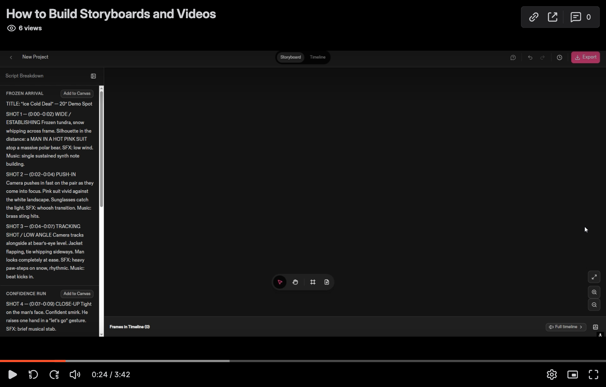
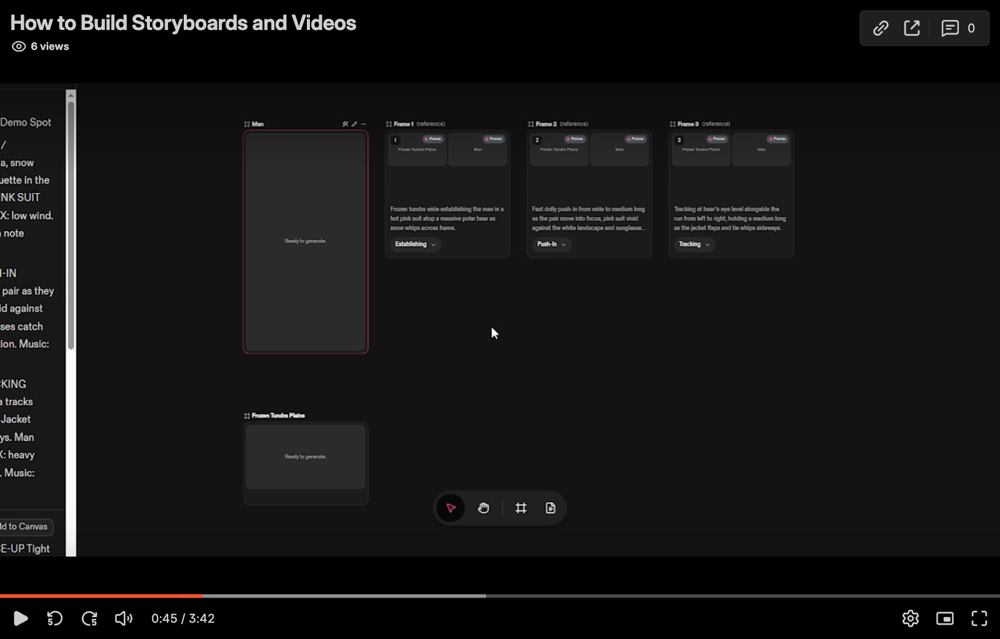
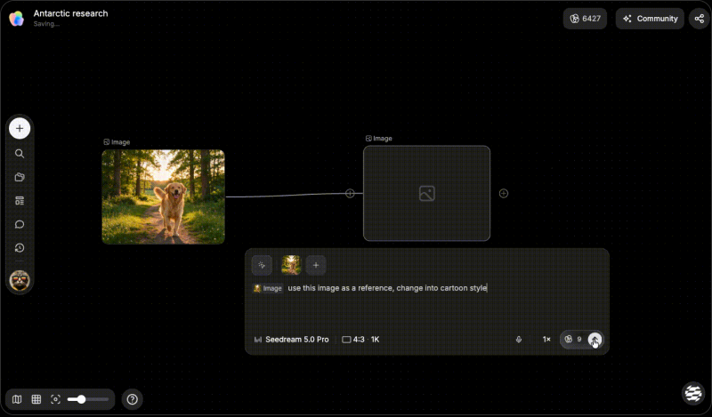
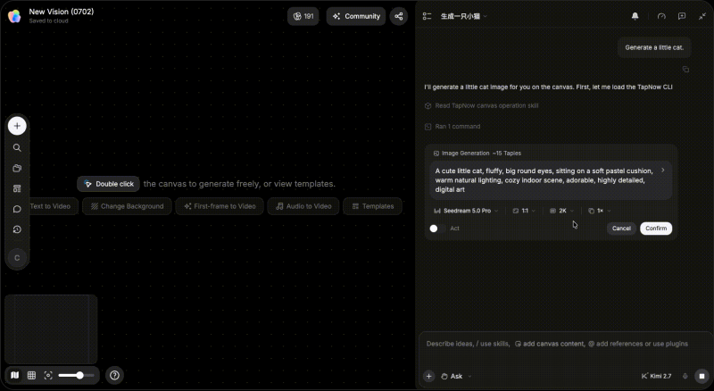
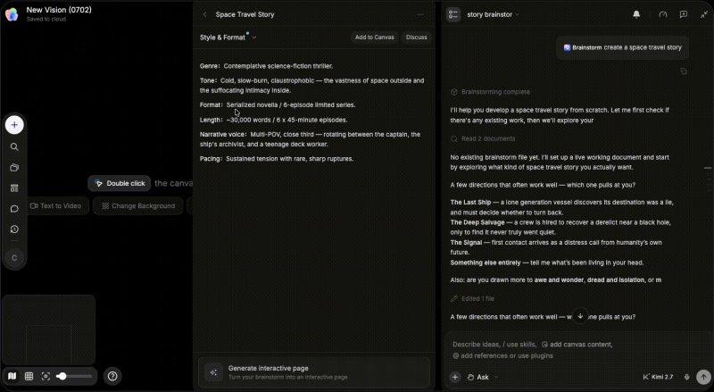
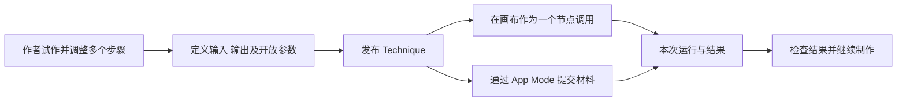
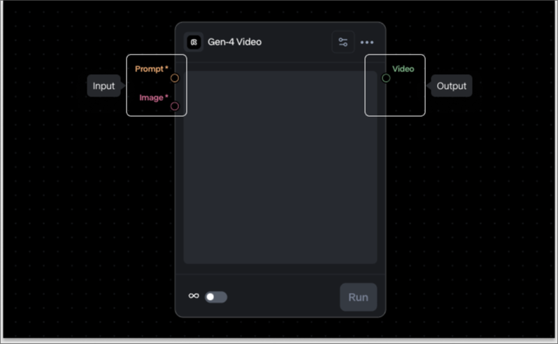

# AI 短剧工作流产品：设计内核、形成原因与我们的选择策略

> 研究与决策方法留档（2026-09-10）：本文记录 09-07 至 09-08 的产品证据和当时尚未决策的问题，市场信息不是持续更新结论。随后已选定“团队完成一场戏”与“每场双模式”，见[当前收口](implementation/14-scene-mvp-closure.md)和[画布契约](implementation/18-canvas-workspace-contract.md)；不再把全文问题当作开工前必须重选的事项。

修订：v0.3 · 2026-09-08  
原用途：产品方向讨论与决策参考；编写时尚未确定我们的产品内核。后续决定见上方当前入口。

本文按三个层次展开：先归纳已有产品怎样组织 AI 创作，再解释这些设计为什么不同，最后给出结合目标客户选择主内核与组合方式的判断框架。问题清单用于支持最后一步决策。

本次复核将相近机制收敛为四组，将推进策略与长期积累作为横向维度。文末新增分组复核、四组代表的操作与设计深挖、六张带解读的官方演示截图，以及后续可借鉴的连接规则。希望先看具体设计，可直接阅读附录 C—F；希望决定我们的方向，先读正文三部分，再结合附录 G。

研究依据是 2026-09-07 至 09-08 已核查的官方产品页、帮助文档、正式披露及公开界面资料。文中的“内核”是对机制的产品分析，不是各公司内部战略的事实陈述。公开功能说明也不等于我们已经登录完成制作、多人协作或质量验证；具体证据限制随产品说明列出。

## 第一部分：已有产品的设计内核是什么？

### 1. 怎样理解“产品内核”

AI 视频制作通常包含要求、参考、生成、挑选、修改、编排和交付。产品内核决定这些工作怎样连在一起：

- 围绕什么组织：故事、镜头、素材关系、制作步骤，还是委托给 Agent 的任务？
- 谁决定下一步：创作者、预先确定的流程，还是根据上下文规划的 Agent？
- 结果不满意时怎样继续：分支尝试、改某个镜头、局部重跑，还是提出修改意图？
- 完成之后保留什么：文件、引用关系、故事上下文、执行方法，还是专业判断经验？

“有画布”“有 Agent”“接入很多模型”不足以解释内核。同样使用画布，空间可能用于比较方案、提供生成输入、组织故事，或编辑一套可执行流程。

### 2. 代表产品的整体归纳

以下覆盖直接叙事制作产品和具有参考价值的通用视觉工作流产品。每一行提取最有辨识度的机制，不代表该产品只有这一种能力。

先按主要工作循环归为四组，再看各产品的具体侧重。分组对象是**机制与工作方式**，不是互斥的品牌名单。

| 机制组 | 核心工作循环 | 本轮深入研究的代表 |
|---|---|---|
| G1. 以作品结构组织制作 | 展开要做的内容 → 填充与调整 → 编成作品 | Katalist；LTX 的 Storyboard／Elements 补充 |
| G2. 围绕素材与引用持续试作 | 选依据 → 生成与比较 → 从结果继续 | LibTV；TapNow 手工画布提供更完整的操作证据 |
| G3. Agent 任务推进与人机接手 | 委托 → 检查行动与成果 → 接手或再委托 | TapNow Agent；Seko、Octo 补充 |
| G4. 可执行工艺与封装复用 | 定义方法 → 封装输入输出 → 换材料反复运行 | FLORA Techniques；Runway、LTX Flows 补充 |

| 产品 | 本文归纳的设计重心 | 典型工作怎样继续 | 重点积累什么 |
|---|---|---|---|
| LibTV | 围绕素材和引用关系持续制作 | 从已有脚本、参考或结果继续生成、分支、修改，再接入专用工具 | 制作材料、来源关系和不同尝试 |
| Katalist | 将故事展开为可制作的视觉结构 | 剧本形成场景与镜头，准备角色和地点，再生成画面、视频和时间线 | 故事的视觉制作骨架 |
| LTX Studio | 分别组织作品结构与重复制作流程 | 分镜统筹视觉表达，Flows 承接可重复执行的步骤 | 视觉方案、项目元素和制作流程 |
| TapNow | 人与 Agent 围绕明确上下文交替推进 | 提供材料和目标，Agent 执行，人在具体结果上检查并继续修改 | 可接手的中间成果与任务上下文 |
| Dreamina Octo | 在对话与可见成果之间持续发展创意 | 讨论方向、形成材料、根据结果调整故事并继续制作 | 创作会话、设定和关联素材 |
| Seko | 用项目积累与专业方法支撑系列创作 | Agent 使用已有故事、资产和 Skill 推进后续内容 | 项目上下文及可调用的创作经验 |
| FLORA | 将制作工艺封装为有输入输出的工具 | 组合生成与处理步骤，形成 Technique，替换输入后复用 | 可执行的制作方法 |
| Runway | 同时提供任务委托与受控流程复用 | Agent 组织制作；Workflows 可封装为简化 App | 任务成果、执行流程和工具配置 |
| 纳米漫剧流水线 | 默认生产流程推进与局部调整结合 | 系统沿制作阶段推进，人在需要时回到中间内容修改 | 流程中的阶段成果和制作依据 |

### 3. LibTV：从已有内容出发，持续生成、比较与修改

**公开机制。** 官网提供画布创作入口，并展示参考提取、导演台与片段重拍等工具。公开界面文案显示，脚本关联会影响后续生成使用的信息；复制生成节点可以保留参数及上游关系，下游关系需要另行选择。这些细节来自公开界面资料，不能视为所有账户当前可用能力的实测结论。[LibTV 官网](https://www.liblib.tv/)

**内核归纳。** 它将“已有内容还能怎样继续做”放在重要位置。素材不仅是一个待下载的结果，也可以成为下一次制作的输入；不同尝试能够沿着原有依据发展。

**设计含义。** 一次角色或镜头制作会留下参考、参数、结果和分支关系。创作者能够保持上下文，选择后续动作。画布与专用工具的价值，需要通过这种连续操作来理解。

**需要关注的代价。** 分支增多后，寻找、比较、收纳和明确当前使用结果会变得重要。公开资料尚不足以证明其正式审阅和所有版本传播规则。

### 4. Katalist：由剧本生成制作骨架，再逐步填充视觉成果

**公开机制。** Story Canvas 教程描述了从剧本拆成场景和镜头，将场景加入画布，制作角色与地点资产，再制作分镜画面、视频并加入时间线的过程。角色资产会关联到引用它的画面卡片。[Katalist 操作教程](https://help.katalist.ai/en/articles/16298583-how-to-build-your-storyboard-and-videos-in-story-canvas)

**内核归纳。** 先让创作者看清“这段故事需要制作什么”，再围绕结构完成生成和调整。

**设计含义。** 内容结构能够预先组织一部分工作，帮助定位镜头、准备共同资产和检查遗漏。画布可以由故事展开，无须一开始由人手工搭建所有对象。

**需要关注的代价。** 故事变化后，结构和已有成果需要一起处理；探索阶段也需要保留自由操作。教程的先图后视频路径不应成为所有模型的强制流程。

### 5. LTX Studio：作品的组织方式与工具的执行顺序分别处理

**公开机制。** 故事板提供项目、故事板和画面层面的视觉控制。Flows 则将提示、参考、生成和媒体处理连接为流程，支持批量执行，并复用未变化步骤的已有结果。[故事板说明](https://ltx.io/studio/platform/ai-storyboard-generator)、[Flows 教程](https://ltx.io/blog/ltx-studio-flows)

**内核归纳。** 同时管理两类不同的问题：这部作品怎样表达，以及这些素材怎样制作出来。

**设计含义。** “调整一场戏的叙事节奏”和“给一组镜头运行同样的处理步骤”可以采用不同入口，并共同服务一个项目。

**需要关注的代价。** 多工作空间之间需要清楚的切换、引用与版本关系。能够分别提供这些空间，不足以证明它们已经实现完整、无损的双向同步。

### 6. TapNow：明确给定上下文，让人与 Agent 轮流接手

**公开机制。** 官方文档将目标与创作判断交给人，将读取材料、分解任务和调用 Apps 等交给 Agent。媒体通常成为节点，脚本等文字成果先保存在侧栏 Outputs，可再送入画布或对话。用户能选定成果并说明修改范围，也可进入手工工具继续处理。[TapNow Agent](https://docs.tapnow.ai/en/docs/agent/tapnow-agent)、[产物管理](https://docs.tapnow.ai/en/docs/agent/manage-agent-outputs)

**内核归纳。** 围绕明确的材料与意图，形成“委托—检查—局部修改—再委托”的连续工作循环。

**设计含义。** Agent 参与程度可以随任务变化。中间成果必须可以查看、选择和继续操作，才方便人接手后再次交回 Agent。

**需要关注的代价。** 必须解释 Agent 实际使用了哪些材料、会修改哪里、什么时候产生费用。同处一个画布不能替代明确的引用和执行范围。

### 7. Dreamina Octo：让尚未成形的创意拥有持续上下文

**公开机制。** 海外官方介绍将创意对话、角色、场景、素材生成与视频制作放在同一工作区，强调 Agent 利用会话和工作区内容参与创作。[Dreamina Octo 介绍](https://dreamina.capcut.com/ai-video/octo)

**内核归纳。** 想法、讨论和生成结果共同推进创作；看到结果后，创作者可以继续调整方向。

**设计含义。** 工作起点可以比较模糊，产品需要保留讨论中形成的设定、已接受的方向和可引用材料，使下一轮创作延续已有上下文。

**需要关注的代价。** 需要区分暂时探索、已定方案和已经进入成片的内容；长期会话中的过时或冲突信息也需要处理。这些是设计考量，不是对产品缺陷的实测判断。

国内即梦公开首页有 Agent 和技能入口，但不能据此认定其与海外 Octo 的操作、项目结构和开放范围一致。[国内即梦首页](https://jimeng.jianying.com/ai-tool/home)

### 8. Seko：让系列内容继承项目积累与专业方法

**公开机制。** Seko 3.0 官方介绍将 Agent、画布沉淀的剧本与资产、以及封装专业经验的 Skill 连接起来，并描述 Agent 在续集制作中使用前序设定和素材。[Seko 官方介绍](https://www.sensetime.com/cn/news/seko-3-0-ai-1)

**内核归纳。** 后续创作同时继承“本项目已经确定什么”与“这类内容应该怎样制作”。

**设计含义。** 项目上下文和专业方法是两类积累：前者包括人物、前情与视觉依据；后者包括创作步骤、叙事判断与制作经验。Agent 将两者用于新任务。

**需要关注的代价。** 上下文要有适用范围，方法要有人维护。官方关于完全消除角色漂移或大幅提高效率的描述，不能作为已经验证的生产保证。

### 9. FLORA：将经过摸索的工艺变成可调用能力

**公开机制。** Technique 将多个模型与媒体处理步骤封装为有明确输入输出的流程，可以在画布中调用，也可以通过简化的 App Mode 使用。[FLORA Techniques](https://docs.flora.ai/nodes/techniques)

**内核归纳。** 熟练创作者先形成一套做法，后续使用者提供新输入即可重复执行。

**设计含义。** 工艺作者与日常使用者可以使用不同界面。复杂步骤可以保留在内部，对外开放必要输入和调整项。

**需要关注的代价。** 要确认方法是否足够稳定、哪些参数可变、输入不合适时如何处理，以及模型变化后谁维护。可重复执行不等于每次生成质量相同。

### 10. Runway：任务委托与明确工艺两种使用方式并存

**公开机制。** Agent 可以规划、生成和组接多片段项目，人能够通过对话或编辑操作继续修改。Workflows 则连接模型与处理步骤，并可发布为 App，开放指定输入、保留受控配置。[Runway Agent](https://help.runwayml.com/hc/en-us/articles/51601639579667-Creating-with-Runway-Agent)、[Workflow Apps](https://help.runwayml.com/hc/en-us/articles/47865876793747-Publishing-Workflows-as-Apps)

**内核归纳。** 灵活任务可以委托 Agent 组织，已经稳定的制作方法可以封装成工具反复使用。

**设计含义。** 不同经验水平的成员可以调用共同能力，而不必掌握同样复杂的操作方式。

**需要关注的代价。** 需要明确任务执行与固定工艺之间怎样配合，保持输出可检查、修改可接手。不能仅因同时提供两种入口，就推断整个业务过程已经自动贯通。

### 11. 纳米漫剧流水线：默认推进，同时允许返回局部修正

**公开机制。** 三六零正式披露“流水线推进＋智能画布调整”，支持对分镜、提示词、风格等内容进行非线性编辑。[公司披露文件，第 3 页](https://static.cninfo.com.cn/finalpage/2026-04-30/1225257364.PDF)

**内核归纳。** 系统承担常规制作顺序的组织，人可以回到具体问题处调整。

**设计含义。** 对阶段相对稳定的工作，用户可以减少重复安排下一步的操作，同时保留中间成果与干预入口。

**需要关注的代价。** 真实生产可能并行、跳步或回退，需要明确怎样保留已可用内容、哪些步骤重新执行。具体规则的公开证据有限，本文不据宣传效果推断实际表现。

### 12. 其他已研究产品提供的补充视角

| 产品 | 值得补充观察的机制 | 对内核分析的意义 |
|---|---|---|
| Higgsfield | Canvas 连接多模型生成，支持分支与模板；另有专用制作工具 | 通用制作空间与专业控制入口可以组合。[Canvas 帮助](https://higgsfield.ai/creator-hub/help-center/tools/how-do-i-use-canvas) |
| Morphic | 用画板、分区与就地编辑组织内容，同时提供 Workflows | 空间化内容组织与可执行流程不必是同一个功能。[画布侧栏](https://morphic.com/docs/getting-started/navigating-the-canvas/sidebars)、[Workflows](https://morphic.com/docs/workflows/create-a-workflow) |
| Figma Weave／原 Weavy | 组合专业节点，再将工艺封装为简化工具 | 可以区分流程作者与工具使用者。[Tools 文档](https://help.weavy.ai/en/articles/12267755-tools) |
| Google Flow | 项目资产与集合、Agent、视频编辑与场景编排 | 同样可以围绕持续项目工作，不宜仅按“Canvas”名称判断是否属于执行节点图。[项目与资产](https://support.google.com/flow/answer/16935308?hl=en)、[编辑与场景](https://support.google.com/flow/answer/16935718?hl=en) |

本节沿用既有公开资料研究，未补充账号实操。上述产品并非全部定位为中国短剧工作室系统；其局部机制可以作为参考。

### 13. 四组机制之外，还要看三个横向维度

原先六项有两项与其他项不在同一层。“默认生产流程”描述推进策略；“系列项目与专业经验积累”描述长期保留什么。两者都很重要，但不宜再作为与四组机制互斥的类别。

| 横向维度 | 需要观察的具体差别 | 为什么不另设一组 |
|---|---|---|
| 推进策略 | 人决定下一步、系统按阶段推进、预设工艺执行、Agent 动态安排，以及各自的回退规则 | 同一叙事或创作工作区可采用不同推进方式；有默认步骤不等于向用户开放工艺编排 |
| 长期积累 | 文件与主体、已定项目上下文、固定工艺、专业经验与 Skill | 任一机制都需要其中一部分；系列记忆与 Skill 也不是同一种对象 |
| 协作与交付深度 | 共同观看、共编、分工、正式确认、连续编排与后期交接 | 决定能承接多完整的团队工作，不能从画布或 Agent 的存在直接推导 |

四组仍然不是严格互斥的分类学，而是便于比较的四种主要工作循环。TapNow 可以同时代表 G2 与 G3，LTX 同时代表 G1 与 G4。对于我们的客户，应先判断哪种循环最值得作为日常主线，再确定辅助方式及这些横向维度。具体归并理由见附录 B。

## 第二部分：为什么会形成不同内核？

以下是从任务和机制推导的原因，不是对各公司实际决策过程的还原。

### 1. 首先服务的工作任务不同

“AI 视频制作”包含探索拍法、制作已定剧本、反复生成某类素材、完成一个模糊需求，以及持续更新系列内容等不同工作。

如果主要问题是“不知道需要制作哪些内容”，叙事结构很重要；如果是“有材料但需要继续尝试”，创作上下文与分支更重要；如果是“每次重复同样步骤”，流程复用就有明确价值。

产品选择首要任务之后，默认入口、内容组织和常用动作才容易形成一致设计。因此，完整功能范围相近的两个产品，日常工作方式仍可能不同。

### 2. 创作阶段的确定程度不同

前期创意会随着讨论和生成结果变化，用户需要比较、分支和随时调整。过早要求完整结构，可能迫使人维护尚未确定的内容。

进入制作后，要求逐渐明确，用户开始关心素材是否齐备、镜头是否完成、谁可以接手。结构与状态的作用随之增加。

当某种做法已经稳定，重复执行才适合进一步封装。一套尚在频繁变化的创作方法，通常需要保留更多人工判断。

这解释了为什么同一个团队可能同时需要自由探索、结构化制作和固定流程，但在不同阶段使用它们。

### 3. 人与 AI 的决策分工不同

一次制作至少涉及故事表达、拆镜、参考选择、工具选择、结果采用和修复策略。不同产品将这些决定交给人的程度不同。

人逐步控制时，需要清楚的参考、参数、候选和局部操作；Agent 承担更多决策时，需要明确目标、上下文、执行边界和人工接手方式；熟练成员为其他人设计方法时，需要简化的工具入口。

判断自动化深度，应看 AI 实际承担哪一项决定，而不是仅看是否有聊天窗口。同一个任务也可以在建议、准备、执行和检查之间采用不同分工。

### 4. AI 生成的不确定性，需要不同的纠错方式

生成结果通常需要检查和迭代。产品必须帮助用户保留已经做对的部分，再有针对性地继续尝试。

| 组织方式 | 典型纠错动作 | 相应负担 |
|---|---|---|
| 创作空间 | 从已有结果分支，改参考并比较候选 | 分支和候选需要整理 |
| 叙事结构 | 定位具体画面或镜头，修改并检查相邻内容 | 上下文与结构变更需要维护 |
| 固定工艺 | 修改一个步骤，重跑受影响部分 | 依赖和输入变化要能解释 |
| Agent 任务 | 指明问题、必须保留项和允许修改范围 | Agent 的理解与执行需要检查 |
| 默认流程 | 返回某一阶段修正，再继续后续生产 | 回退、跳步和部分重做要可控 |

因此，一次结果不满意后的第二步、第三步，往往比第一轮生成按钮更能体现产品内核。

### 5. 自然工作单位与模型执行单位不同

团队可能按角色、场次、镜头组或单集安排工作，模型一次生成却可能覆盖一段连续表演或多个画面。剪辑又可能只采用其中一部分，并重新组织顺序和声音。

如果产品紧贴单次调用，操作容易直接，但还需要补足业务组织；如果围绕整部故事组织，需要保留具体素材和局部编辑能力。

模型能力变化也会影响制作路径。例如直接多参考生成与先准备静帧再生成，需要不同输入和操作。设计要明确哪些是稳定的业务意图，哪些随实际模型能力调整。本文不预设所有路径都要逐镜生成首帧。

### 6. 团队技能、组织方式与控制需求不同

有经验的制作人员可能需要直接控制参考和工具；缺乏制作经验的使用者可能希望系统先组织任务。团队中也可能只有少数人能够搭建方法，其他成员负责批量使用和检查。

多人分工还会带来责任、交接、等待、并行编辑和复查需求。实时共编、任务管理和正式审阅分别解决不同问题，不能彼此替代。

团队规模本身不足以决定内核。更有解释力的是职责如何分布、工作怎样交接，以及谁承担创作和交付判断。

### 7. 最值得长期积累的内容不同

资产、项目上下文、固定工艺和专业经验具有不同的复用方式。

| 积累 | 回答的问题 | 维护重点 |
|---|---|---|
| 资产 | 下次继续用什么 | 版本、适用造型、来源与引用 |
| 项目上下文 | 下次继续做时必须知道什么 | 前情、已定方向、冲突与过时信息 |
| 固定工艺 | 如何重复执行一套做法 | 输入输出、参数、依赖和兼容性 |
| 专业经验或 Skill | 遇到某类任务应如何判断和行动 | 适用条件、步骤、检查标准、案例和失败处理 |

将提示词保存下来，可能只是某一种积累的起点。是否值得建设流程发布或 Skills，取决于团队是否已有可复用方法，以及谁能够持续维护。

### 8. 产品起点和实施取舍会影响演进路径

一般而言，从画面编辑起步，容易先组织画面和局部操作；从故事板起步，容易先组织叙事；从模型工作流起步，容易围绕输入、处理和输出；从 Agent 起步，容易围绕任务和会话。

已有用户习惯、技术基础和团队能力，会使某条演进路径更容易推进。另一方面，更多自由度会增加组织与维护成本，更多自动化会增加检查和接手要求，更多内置后期工具会增加实现与兼容投入。

这些因素可以解释不同选择为何合理，但不能凭公开界面推断某家公司内部究竟如何权衡。

## 第三部分：结合目标客户，怎样确定我们的内核与组合策略？

### 1. 当前目标与需要重新决定的事项

当前方向是服务中小 AI 写实短剧团队，领先模型优先，先承接其实际工作流；后续沉淀制作方法与 Skills，扩大 Agent 参与和自动化。长期支持广告并复用适合共用的底层能力。首期内部协作与权限保持简单，外包参与后置。

“完整承接”要求每项关键工作有可执行路径，可以在平台内完成，也可以通过明确的外部工具交接完成。原素材、修改依据和结果需要能够接续，不能依靠开发人员代操作维持流程。

目前尚需根据目标客户决定：真实起点、主工作单位、默认创作入口、人机分工、制作路径、后期深度及复用重点。已有方案中的对应选择都可以据此重新评估。

### 2. 先区分组合策略中的五个层面

| 层面 | 必须回答什么 | 可以采用的方式 |
|---|---|---|
| 业务主线 | 日常工作围绕什么组织，怎样判断完成 | 剧目与叙事结构、制作任务、阶段成果等 |
| 交互工作区 | 用户需要同时看什么，从哪里继续操作 | 分镜、创作画布、时间线、对话和待办 |
| 执行方式 | 谁决定下一步，怎样运行与接手 | 人工操作、固定工艺、默认流程、Agent 任务 |
| 共同制作记录 | 不同入口怎样识别同一成果和修改依据 | 资产、引用、候选、执行、版本、审阅与交付记录 |
| 长期积累 | 后续制作复用什么，由谁维护 | 共享资产、项目上下文、工艺、Skills 和案例 |

例如，“以分镜为业务主线”和“使用 Agent 执行制作”可以同时成立；“有创作画布”也不意味着必须开放通用流程编排。

所谓主内核，需要在具体任务层面说明：成员通常从哪里开始，围绕什么继续工作，遇到修改怎样处理。辅助方式应有明确服务任务，避免多个入口各自保存一套无法对应的内容。

### 3. 需要结合目标客户回答的十二个问题

这些问题按照从客户事实到产品选择的顺序排列。每项答案应附一个实际例子，并标记为已观察、客户陈述、团队假设或未知。

#### Q01. 第一批客户是谁，最主要的日常操作者是谁？

明确团队类型、主要职责、制作经验、方法维护者和交付判断者。人数用于理解分工，不作为硬上限。

**如何影响选择：** 自己控制细节的创作者、按既定任务生产的成员、希望委托任务的使用者，对默认入口和自动化深度有不同要求。同一工作室可以需要不同职责入口。

#### Q02. 团队自然地把什么作为一项工作，怎样判断完成？

找出真实的安排单位：角色定妆、场次、镜头组、单镜头或整集。分别记录安排、模型生成、检查和交付的单位。

**如何影响选择：** 叙事内容组织占主导时，可以重点评估结构化制作；如果主要按素材和效果任务工作，需要保留更灵活的内容归属。不能直接把一个模型任务当成一个业务镜头。

#### Q03. 工作开始时，方向已经确定多少？

描述实际已有的剧本、参考、角色、风格、声音和分镜，以及哪些需要边生成边决定。补充常见资料格式和进入方式。

**如何影响选择：** 起点明确，适合由内容结构或默认流程组织；前期探索频繁，则需要充分的方案比较、上下文和继续尝试入口。两者可能分别承担不同阶段。

#### Q04. 哪个制作循环最频繁，也最需要连续完成？

选择一项真实任务，按“要求与输入 → 操作 → 中间成果 → 检查 → 修改 → 下一步”描述。说明必须同时看见什么，在哪些地方反复切换工具或重复说明。

**如何影响选择：** 以这个循环确定主工作区。看故事顺序、比较多方案、组织输入关系、调整时间位置、提出修改意图，对应不同交互需要。画布或对话应由实际操作需要解释。

#### Q05. 首批必须承接哪些具体的写实制作路径？

分别记录一个顺利片段和一个需要修复的片段：用什么材料和模型，是否先制备画面，如何处理对白、声音、口型和后期。列出可用的外部工具接续办法。

**如何影响选择：** 路径稳定时适合封装和阶段推进；经常需要临时组合工具时，需要局部操作或受控的 Agent 组织。模型适配和声音能力应按这些路径确定范围。

#### Q06. 最常见的修改是什么，影响如何被处理完？

回顾改词、换造型、改变镜头时长或更换表演的一次事件。哪些成果保留、复查或重做，谁判断和执行，如何避免遗漏声音、字幕或其他片段？

**如何影响选择：** 决定分支、版本、直接引用提示、局部重跑和任务处理方式。只保留历史不能替代完成修改；也不能把所有内容变化都自动传播成重新生成。

#### Q07. 首次生产、跨成员接手和审阅分别怎样运转？

记录谁准备资料、谁制作、谁后期、谁检查；接手需要哪些说明；成员是并行处理不同对象还是同时编辑同一内容。说明哪些检查属于讨论，哪些决定允许继续或最终交付。

**如何影响选择：** 决定对象责任、轻任务、待办、冲突处理、审阅粒度与人工确认位置。创作入口可以灵活，但团队必须能识别工作归属及当前可用成果。

#### Q08. 后期和交付中，哪些工作需要原生支持，哪些允许正式交接？

从实际接收者出发，说明需要原片、选用区间、音轨、字幕、时间线还是工程文件，怎样回传，以及回传之后再次修改如何定位来源。

**如何影响选择：** 决定基础剪辑深度、工具适配和交付边界。能够在外部完整接续时，可以保留现有工具；接收者无法继续工作时，“支持下载”还不够。

#### Q09. 对每类任务，人愿意交给 AI 哪些决定？

分别讨论创意、拆镜、参考、工具选择、生成、候选采用、修复、剪辑与交付。可以选择建议、准备、确认后执行或明确范围内自动执行，并说明接手方式、费用和停止边界。

**如何影响选择：** 决定 Agent 是辅助入口、局部任务执行者，还是主要推进者。既有预算控制不能代替创作修改范围，用户信任也需要落实到具体任务。

#### Q10. 哪些积累真正会被复用，谁维护？

分别找资产、项目上下文、固定工艺和专业经验的实例。说明哪些已经稳定，哪些仍是愿景，普通成员需要看见多少内部步骤。

**如何影响选择：** 系列内容需要有效的前情与设定；稳定步骤适合工艺封装；含条件判断的经验才需要更完整的 Skill 表达。方法作者与使用者可以采用不同入口。

#### Q11. 同一团队是否需要不同主工作方式，它们怎样连接？

主创、制作、后期与统筹可以有不同工作区。请说明一次任务怎样在入口之间继续，哪些内容应保持同一身份，哪些操作会创建新的版本或尝试。

**如何影响选择：** 判断采用单一主入口、按职责入口，还是按阶段切换。自由摆放、叙事顺序、模型依赖和剪辑时间的含义要明确；不能因界面切换产生另一份无法同步的业务内容。

#### Q12. 第一阶段怎样才算真正承接住，哪些能力可以后置？

按实际任务，将需求分为平台内必须完成、正式外部交接、简单人工操作足够、后续打磨和待确认。每项注明完成条件。

**如何影响选择：** 先关闭制作、接手、修改与交付断点，再提高复用和自动化。不要求第一阶段证明比竞品更快，但实际质量、正确版本和团队自行操作仍必须成立。

### 4. 怎样比较候选策略

回答问题后，先提出两到三个有实际依据的候选组合。所有组合都必须覆盖同一批首期工作；不能用一个功能不足的方案与一个完整方案比较，再把差异归因于界面。

| 评估项 | 看什么 | 如何作决定 |
|---|---|---|
| 完整工作覆盖 | 关键任务是否有可执行路径，包括正式外部交接 | 阻断交付且无可用办法的组合，先补齐或缩小有依据的首期范围 |
| 高频工作契合 | 用户是否围绕自然工作单位操作，必要上下文是否可见 | 优先承接真实高频循环，避免将后台对象逐个变成操作步骤 |
| 修改与接手 | 能否保留可用内容、完成影响处理并由其他成员继续 | 用真实修改检查，不以第一轮生成成功代替 |
| 人机控制匹配 | 委托范围、检查点、费用与接手能否被理解 | 自动化范围与实际任务能力相匹配 |
| 复用适合程度 | 是否存在可复用内容与维护者 | 按成熟程度选择资产、预设、工艺或 Skill |
| 建设与维护成本 | 主入口、媒体工具、状态同步和流程维护需要多少投入 | 在满足首期工作的前提下控制同时建设的独立系统数量 |
| 演进空间 | 后续引入其他入口和执行方式时是否能复用记录 | 保留适合复用的边界，不提前建设所有通用引擎 |

分别记录“支持依据、主要代价、未确认事项”。不将四组机制打分后机械选最高分，也不把不同职责的需求平均成一个虚构用户。

### 5. 五种可讨论的组合策略

以下都是条件方案，尚未为我们选定。参考产品提供机制启发，不代表某个方案完整复制了对应产品。

这里的五种方案是**组合策略**，并非新增五类机制。尤其 D 将阶段推进作为主导策略，可以组合 G1 的作品结构、G2 的局部试作与 G4 的稳定工艺。

| 组合 | 更适合的客户情况 | 各部分怎样分工 | 主要代价及适用边界 |
|---|---|---|---|
| A. 叙事制作为主，局部创作与 Agent 辅助 | 已有较明确剧本，按集、场次或镜头分工 | 内容结构组织生产；局部空间比较和制备；Agent 执行明确任务；时间线处理声音与顺序 | 需要给前期探索和灵活拆镜留空间，避免所有操作都被表单化 |
| B. 创作上下文为主，叙事结构承接制作与交付 | 主创探索密集，参考与多方案并行，方向经常变化 | 创作空间承接日常试作；明确的内容归属和采用关系连接剧集及后期；Agent 在选定上下文中辅助 | 需要控制候选规模、查找和交接，不能让空间位置决定正式顺序或状态 |
| C. Agent 任务为主，结构化成果与专业编辑承接控制 | 用户愿意委托，任务目标和允许范围可以明确 | Agent 组织下一步；计划与产物可检查；人随时进入具体对象修改，结果回到同一项目 | 首期需限制任务范围，完善接手、局部修复和费用处理；有对话入口并不代表这些能力已成立 |
| D. 默认流程推进为主，局部调整与工艺复用辅助 | 制作阶段稳定，成员职责清晰，反复处理相似任务 | 系统依据阶段条件推进；人处理例外；稳定子步骤封装工艺；交接与检查有固定位置 | 真实流程存在跳步、并行和回退时需要支持；流程过硬会迫使用户绕行 |
| E. 工艺执行为主要制作入口，任务与内容结构组织交付 | 团队已有稳定方法，少数人维护，其他人反复使用 | 工艺作者配置流程；使用者输入材料并运行；任务、内容归属和后期交付承接完整业务 | 若创作探索占主导，方法可能不够稳定；工艺平台还需补全前期、协作和成片工作 |

一种组合可以在不同职责或阶段采用不同主入口，但同一项工作必须明确当前由谁推进，避免固定流程与 Agent 同时重复执行。

### 6. 组合时必须讲清楚的连接规则

组合策略需要落实为行为，不能只是导航里多放几个页签。至少明确以下规则：

1. **内容对应。** 分镜、画布、对话与时间线怎样引用同一个角色、镜头或素材。一个显示对象被移动，不自动改变正式叙事顺序。
2. **输入范围。** 用户或 Agent 怎样确认本次实际使用的文本、参考和版本。项目里存在某份资料，不等于每次都应使用。
3. **执行归属。** 人、流程和 Agent 发起的操作怎样保存来源、状态和结果，避免同一动作因入口不同重复付费。
4. **结果接续。** 生成完成、偏好某候选、进入剪辑和正式确认如何衔接。可以用连贯操作完成，但要保留可解释的制作事实。
5. **修改传播。** 哪些变化只影响当前尝试，哪些保存为后续默认，哪些需要提示既有工作复查。不要静默改写已确认成果。
6. **中断与接手。** Agent 或流程暂停后，人从哪里继续，怎样使用已完成结果，恢复时怎样避免重做。
7. **复用与升级。** 资产和方法的新版何时用于新任务，旧任务如何保留原依据；作者更新方法不应自动重写既有成片。

这些规则支持多种产品内核，并不要求首期实现通用工作流引擎或开放式 Skill 市场。业务操作与固定成果清楚，后续才容易逐步扩大自动化。

### 7. 用一个共同任务检查组合是否成立

选择目标客户近期真实项目中的一个代表任务，包含必要前期、一段典型制作、一次实际修改，以及一次跨成员接手或后期交接。若系列复用是关键，再包含下一集的接续工作。

候选组合使用相同资料和制作要求。可以先做交互走查，再用实际工具完成关键步骤，不需要先开发全部产品或安排竞品效率对照。

| 观察动作 | 需要确认的事实 |
|---|---|
| 从已有资料开始 | 客户能否理解入口，缺资料时能否继续准备 |
| 制备参考并制作片段 | 上下文是否够用，步骤是否符合实际制作路径 |
| 比较并使用结果 | 可用结果是否容易确定，下一环节是否接得住 |
| 修改一处要求 | 影响是否可解释，已可用部分是否保留 |
| 交给另一成员继续 | 接手者能否判断当前要求、状态和下一步 |
| 完成后期与交付 | 所需文件、声音、字幕及版本是否完整对应 |

记录完成、绕行、阻塞及原因。无需预设点击数或效率改善比例。材料不足时保留待确认项，不能把原型顺利演示当作实际生成质量和量产能力已被验证。

### 8. 最终应形成的决策记录

| 决策 | 结论 | 客户依据 | 主要代价或待确认项 |
|---|---|---|---|
| 首批客户与主要操作者 | 待填写 | Q01 | 待填写 |
| 完整任务、起点和完成条件 | 待填写 | Q02/Q03/Q12 | 待填写 |
| 业务主线与自然工作单位 | 待填写 | Q02/Q04 | 待填写 |
| 主工作区及必要辅助入口 | 待填写 | Q04/Q11 | 待填写 |
| 首期具体制作与后期路径 | 待填写 | Q05/Q08 | 待填写 |
| 人工、流程和 Agent 的分工 | 待填写 | Q09 | 待填写 |
| 修改、接手与确认规则 | 待填写 | Q06/Q07 | 待填写 |
| 复用重点和维护方式 | 待填写 | Q10 | 待填写 |
| 首期范围与外部工具交接 | 待填写 | Q08/Q12 | 待填写 |
| 后续重要迭代及触发依据 | 待填写 | Q10/Q12 | 待填写 |

形成结论时，应能用一段话说明：

> 我们首先服务【客户与主要职责】，承接从【真实起点】到【完成条件】的【完整工作】。日常主要围绕【业务对象或任务】组织，通过【主工作方式】推进；【辅助方式】解决【具体问题】。人负责【决定】，流程或 Agent 在【范围】内执行。修改与交接通过【规则】接续，长期积累【资产、上下文或方法】。第一阶段覆盖【范围】，后续在【实际条件】出现时扩展【能力】。

这份记录将作为下一轮整体方案调整的输入。长期广告能力可在共同制作记录与执行能力上扩展自身业务入口，不必在本次客户决策中提前模拟广告用户；后续 Skills 和 Agent 的扩大也应依据实际成熟方法逐步推进。

## 附录 A：回答与证据记录

### A1. 可以直接填写的十二项答案

- Q01 首批客户、主要操作者与职责：
- Q02 自然工作单位及完成条件：
- Q03 起步资料与创意确定程度：
- Q04 最重要的连续制作循环：
- Q05 必须承接的生成与修复路径：
- Q06 常见修改及影响处理：
- Q07 分工、接手与创作确认：
- Q08 后期与交付边界：
- Q09 人机分工和控制范围：
- Q10 复用内容及维护者：
- Q11 主入口、辅助入口及连接：
- Q12 首期完成标准与后续重点：

### A2. 每条关键判断的依据

| 记录项 | 填写内容 |
|---|---|
| 适用客户和职责 | 待填写 |
| 当前判断 | 待填写 |
| 实际项目、操作或修改例子 | 待填写 |
| 频率及对制作、交接或交付的影响 | 待填写 |
| 证据状态 | 已观察／客户陈述／团队假设／未知 |
| 不同职责或客户的相反情况 | 待填写 |
| 待确认内容及可观察的任务 | 待填写 |

相关研究：[市场与画布机制复核](research/2026-09-07-canvas-market-review-v2.md)、[LibTV 等国内产品](research/2026-09-07-canvas-china-research-v2.md)、[即梦与 Dreamina 的证据边界](research/2026-09-07-canvas-jimeng-research-v2.md)、[叙事制作产品](research/2026-09-07-canvas-cinematic-workbenches-v2.md)、[国际工作流产品](research/2026-09-07-canvas-international-workflows-v2.md)。

既有设计对照：[完整产品方案](ai-drama-workbench-product-design-v1.1.md)。本文件提供重新作出产品选择的分析框架，当前没有把任何候选组合确定为实施基线。

## 附录 B：分组复核、代表选择与证据规则

### B1. 这次归纳调整了什么

第一轮按产品最突出的特点提炼，容易得到“一个产品一种内核”，也容易把内容组织、自动化和长期记忆放在同一层。本轮先比较**用户怎样反复完成一项工作**，再合并具有相同循环的产品机制。以下是研究判断，不是厂商自称的分类。

| 原提炼 | 本轮处理 | 保留的差异 |
|---|---|---|
| Katalist 的故事骨架与 LTX 的叙事制作 | 合并到 G1：作品结构组织 | 结构怎样进入画布、共享设定怎样引用、如何进入时间线 |
| LibTV 的素材延展与其他产品的手工创作画布 | 合并到 G2：素材引用与持续试作 | 上下文如何选择，试作如何分支，结果如何被使用和整理 |
| TapNow 人机轮流接手、Octo 连续共创、Seko 系列 Agent | 合并到 G3：任务推进与人机接手 | 委托起点、检查点、成果位置、项目记忆与方法调用的深度 |
| FLORA Technique、Runway Workflow/App、LTX Flow | 合并到 G4：可执行工艺与封装复用 | 作者和使用者的接口、局部执行、缓存、发布与升级规则 |
| 纳米式默认生产流程 | 作为推进策略；可与 G1、G2 组合 | 阶段条件、并行、跳步、回退与局部重制，不等于开放节点编排 |
| 系列上下文与专业经验 | 作为长期积累维度，按对象继续拆分 | 项目事实、主体参考、可执行工艺、Skill 分别维护 |

**不继续合并 G2 与 G4 的原因：**相同的连线界面，可能服务“这一次继续怎么试”，也可能服务“以后反复怎么做”。前者需要保留探索自由，后者需要定义稳定接口与执行规则。TapNow 模板等功能正处在两者衔接处。也不将 G3 简化为“更自动化的画布”：谁组织下一步、怎样界定一次委托、产物怎样被人接手，都会因此变化。

这不是行业统一标准，也不穷尽所有 AI 视频产品；它是依据本次样本建立的比较框架。若目标客户的主要循环是当前四组没有充分表达的工作，应调整框架，而非硬把客户归进去。

### B2. 深挖代表为什么这样选

| 组别 | 主要代表与补充 | 选择理由及研究边界 |
|---|---|---|
| G1 | Katalist；LTX Storyboard、Elements | 新 Story Canvas 有具体操作链；LTX 补充设定与生成结果的连接。Katalist 当前页面明显包含广告定位，借鉴机制不等于认定它适合中国短剧全流程 |
| G2 | LibTV；TapNow 手工画布 | LibTV 与我们讨论的产品接近，但操作细节多为公开前端线索；用 TapNow 官方手册研究可核查的相似机制，不混同两家证据 |
| G3 | TapNow Agent；Seko、Octo | TapNow 的引用、确认、产物、会话及手工工具说明完整；另两者主要用于补充不同方向，不能编成未见过的操作手册 |
| G4 | FLORA Techniques；Runway、LTX Flows | 分别有封装复用、运行控制与依赖缓存的明确说明；补充代表解释不同设计，不拼成某一家已具备的全能产品 |

这里选择的是**机制清楚、证据可追溯、值得借鉴的代表**，不是市场份额或生成质量排名。各组不采用一款产品逐项比较所有功能，而是围绕核心循环回答：有哪些对象、怎样操作、如何处理修改、结果怎样继续、哪些规则尚不清楚。

### B3. 如何读附录的事实、截图和建议

| 标记 | 意义 | 不能由此推出什么 |
|---|---|---|
| D | 官方操作说明或明确发布记录 | 我们已实测成功；所有账户与模型均适用 |
| P | 厂商的定位、方向或效果主张 | 质量、效率、一致性效果已经得到验证 |
| F | 公开前端文案或界面线索 | 后端行为、开放范围和异常处理已经确认 |
| V | 本轮已视觉检查的官方演示或文档图片 | 本轮登录产品制作成功，或静态图证明全部动态行为 |
| I | 本文的归纳、因果分析、设计演绎或借鉴建议 | 厂商内部战略事实，或我们的实施基线已更改 |
| U | 本次未取得足够证据 | 产品一定没有该能力 |

本轮研究和截图访问日期均为 **2026-09-08**。未注册、登录、运行付费生成或开展多人生产实测。Katalist 的新旧教程需要区分版本；FLORA 文档的 Batch 说明存在冲突，处理依据见附录 F。下面的短剧情境都是研究演绎，不是伪装的客户案例。

截图放在对应机制旁；每张说明“看哪里、说明什么、不能证明什么”。原界面中的模型和价格仅是演示当时的显示，不作为当前推荐或报价。图片版权归原发布方。

## 附录 C：G1 · 以作品结构组织制作——Katalist 与 LTX

### C1. Katalist：从官方资料重建的一条制作路径

以下 1—6 以新 Story Canvas 为主，7—9 补充其他官方教程。声音、角色库及 Premiere 指南跨越不同发布时间和界面，**这些功能的同版互通尚待实操确认**。

1. **从需求进入项目。** 已有剧本可进入新画布路径；只有故事概念时，旧版 Generate Script 教程也提供按场景生成拆解的入口。因此“结构驱动”不等于只能接收定稿剧本。[D：概念拆解](https://help.katalist.ai/en/articles/13015366-how-do-i-create-a-script-breakdown-in-katalist)
2. **将文本转成可见骨架。** 新建项目选 Start from a script，上传确认后，在 Script Sidebar 查看自动拆出的场景与镜头；按场景 Add to Canvas。[D：新画布指南](https://help.katalist.ai/en/articles/16298583-how-to-build-your-storyboard-and-videos-in-story-canvas)
3. **准备反复使用的视觉依据。** 角色可从描述、可选面部参考开始，先预览、重试，再保存；旧版还记录名称、服装与声音，支持角色库及 `@` 引用。[D：角色制备](https://help.katalist.ai/en/articles/10720071-how-to-personalize-your-characters-in-katalist)
4. **填充已展开的画面。** 新画布预置角色、地点与画面生成卡。生成角色后，会分配给引用它的画面卡；之后逐卡制作画面，可分组、命名或导入已有媒体。[D：新画布指南](https://help.katalist.ai/en/articles/16298583-how-to-build-your-storyboard-and-videos-in-story-canvas)
5. **把选好的画面继续做成视频。** 对画面执行 Add to New Video，补充视频设置与提示，再生成；不满意可以重试。[D：新画布指南](https://help.katalist.ai/en/articles/16298583-how-to-build-your-storyboard-and-videos-in-story-canvas)
6. **补入外部已确定的成果。** 官方另有上传地点参考、替换角色参考及在新画面中上传自有图片的说明，使流程能够接住外部制作。[D：自有图片](https://help.katalist.ai/en/articles/13015400-how-to-add-custom-images-to-your-storyboard-in-katalistai)
7. **按需要处理对白口型。** 2026-07-09 指南从 Storyboard 的 Edit 进入 Video／Dialogue，填对白并 Apply，检查后可改对白重生成；文档建议避免同一场景多说话人，并说明限付费方案。[D：口型指南](https://help.katalist.ai/en/articles/12781817-how-to-add-a-lip-sync-in-katalist)
8. **在时间线处理连续观看与声音。** 新画布将视频拖入时间线排序；旧版声音指南支持 TTS 或音频上传、对齐。2025-11 声音文档称初次视频生成不会自动带出剧本音频，该结论不能扩大为所有当前模型的能力限制。[D：声音指南](https://help.katalist.ai/en/articles/12743528-how-can-i-add-and-customize-a-voiceover-in-katalistai)、[D：新画布指南](https://help.katalist.ai/en/articles/16298583-how-to-build-your-storyboard-and-videos-in-story-canvas)
9. **交付视频或可接续编辑的材料。** 新画布支持片段下载与时间线导出；另有 Premiere 导出教程，以 ZIP 中的 XML 和媒体恢复片段顺序，再由外部编辑完成后期。该教程没有证明双向回传、字幕和所有轨道都无损保留。[D：Premiere 交接](https://help.katalist.ai/en/articles/11785146-how-to-export-a-katalist-project-for-adobe-premiere-pro)

**图 C-1｜先出现可展开的作品结构。** V：Katalist 官方教程 00:24。左侧 Script Breakdown 已按场景和镜头展示内容，场景旁有 Add to Canvas；中间此时尚未展开。值得看的是“先有待制作内容，再按需要进入制作空间”的入口安排，不是空白画布面积。[官方指南](https://help.katalist.ai/en/articles/16298583-how-to-build-your-storyboard-and-videos-in-story-canvas) · [原演示 00:24](https://www.loom.com/share/91cb1424e2084a91a335de815b289d06?t=24)

**图 C-2｜内容展开后，制作依据与待制作画面一并出现。** V：同一官方教程 00:45。可见人物、地点卡，以及 Frame 1—3 中的参考标识、描述与镜头动作选项。它说明结构可以带出可操作的制作准备；自动分配参考的规则以 D 文档为依据，截图不证明后续生成质量。[官方指南](https://help.katalist.ai/en/articles/16298583-how-to-build-your-storyboard-and-videos-in-story-canvas) · [原演示 00:45](https://www.loom.com/share/91cb1424e2084a91a335de815b289d06?t=45)

### C2. 哪些具体设计把机制落到了操作上

下表“作用”均为 I；功能行为按 D/P 分开，不把公开名词推断为内部数据库结构。

| 功能与公开对象 | 关键交互／行为 | 对机制的作用 | 证据 |
|---|---|---|---|
| 剧本侧栏、场景、镜头、画面卡 | 按内容单位展开待制作材料 | 同时保留叙事位置与制作入口 | D：[新画布](https://help.katalist.ai/en/articles/16298583-how-to-build-your-storyboard-and-videos-in-story-canvas) |
| 角色预览与角色库 | 生成预览，接受后保存；通过命名引用复用 | 角色先成为可决定的方案，随后成为镜头依据 | D：[角色指南](https://help.katalist.ai/en/articles/10720071-how-to-personalize-your-characters-in-katalist) |
| 自有地点、角色及画面图片 | 各自有导入位置，不只作为最终附件上传 | 外部准备的结果能进入制作链的中间位置 | D：[自有图片](https://help.katalist.ai/en/articles/13015400-how-to-add-custom-images-to-your-storyboard-in-katalistai) |
| 视频局部编辑 | 上传视频后可自动按切点拆开；对单片段 Edit This Video，以 `@` 引用替换参考，再添加到时间线 | 修改范围可以缩到具体片段，形成已成片内容的再制作入口 | D：[产品替换教程](https://help.katalist.ai/en/articles/16297383-how-to-do-product-swaps-on-your-existing-videos-in-katalist)；保留其他内容的效果是 P |
| 独立的时间线音频操作 | 音频可拖放定位、删除及重新生成 | 声音能独立返工，不要求与画面一次同时做对 | D：[声音操作](https://help.katalist.ai/en/articles/10702096-how-to-add-a-voiceover-to-your-katalist-project) |
| 结构化后期交接 | XML 与媒体一起导出，外部恢复有序片段 | 交付对象可以是可继续加工的序列，而不止最终 MP4 | D：[Premiere 教程](https://help.katalist.ai/en/articles/11785146-how-to-export-a-katalist-project-for-adobe-premiere-pro) |
| 意见进入迭代 | Agentic Storyboarder 宣称共享画板后，成员评论可触发新版本 | 叙事结构也可成为 Agent 接收局部反馈的定位依据 | P：[Agentic 页面](https://www.katalist.ai/agentic-storyboarder)；该页含 Early Access，不视为默认已上线机制 |

**I｜最值得借鉴的连接是“内容位置→制作所需参考→局部结果→连续编排”。** 如果只复制自动拆镜和卡片列表，却让成员重新寻找参考、重新上传结果，仍没有得到这套机制。

### C3. LTX 补充：共享设定与局部试作如何并存

**D｜先展示计划，再花生成资源。** 2026-01 的 Storyboard 更新说明：上传剧本后能查看场景、镜头数量和各镜头文本；预先设定画幅、选择图像模型，并检查提取的 Elements，再生成视觉画面。这里可借鉴的是明确的生成前检查点，速度和一致性效果只属于 P。[官方更新](https://ltx.io/blog/ltx-storyboard-generator-update)

**D｜资产既可专门准备，也可从探索结果晋升。** Elements 可生成或上传创建，Gen Space 的结果也能 Save as Element；镜头描述中的 `@` 将其明确关联。共享项目成员使用相同 Elements。**I：这把“做出一个好结果”与“确立一个可复用依据”接了起来。** 但该说明没有给出批准、锁定、负责人及并发冲突规则。[Elements 教程](https://ltx.io/blog/getting-started-with-elements)

**D｜造型变化有独立操作。** 角色指南描述 Duplicate 后调整服装字段并另命名，例如同一人物的不同穿着。**I：业务上要明确本次引用的具体造型，不能仅靠全局覆盖角色参考。** 文中所称面部完全一致是 P，未实测。[角色变体教程](https://ltx.io/blog/how-to-create-a-consistent-character)

**D｜一个项目容纳多个职责不同的空间。** Projects 说明将 Gen Space、Storyboard、Timeline 和 Pitch Deck 归入项目；Sessions 可按概念、镜头、角色或尝试整理生成记录；Storyboard 负责画面意图与顺序，Timeline 提供批量插入、吸附和撤销等编排动作。**I：生成试验的顺序可以与作品顺序不同。** 该说明发表于 2025-08，只用于解释组织机制，不用于断言所有旧工具目前仍在。[Projects 更新](https://ltx.io/blog/introducing-projects)

### C4. 最需要谨慎理解的“修改传播”

LTX Elements 教程说更换资产图片会应用到标记它的位置；但 2026-05 的 Color Elements 操作文档明确：旧生成不会因 HEX 改动而自动更新，需要重新生成；修改 HEX 没有撤销，官方建议创建新 Element。[D：Color Elements 的修改限制](https://help.ltx.io/hc/en-us/articles/35494322496786-How-to-use-Color-Elements)

**I｜因此不能将“更新引用的设定”写成“自动修改全部既有画面、视频和成片”。** 上述细则直接覆盖颜色类型；其他 Element 的逐项传播规则仍需验证。我们借鉴时应分别定义：输入引用更新、待制作内容需要复查、已有结果需要重制、剪辑采用需要替换。它们可以在前台组成连续动作，但不能以一句“全局同步”掩盖差异。

**I｜局部修改示例，以下为设计演绎，未在产品中操作。** 双人在咖啡厅交接钥匙，导演希望只把拿钥匙的手部镜头拉近。基于这一组机制，可以从作品结构定位该画面，保留人物与地点依据，调整构图后制作新候选，再检查它与前后镜头的接续，最后放入序列。若改的是角色服装，则应先区分本场造型变化和全剧设定变化，再决定哪些镜头需要重做。**U：Katalist 是否自动列出所有受影响镜头、保留并排候选、锁住已采用结果，本次资料不能确认。**

### C5. 状态、异常和协作：公开证据的边界

- **D：** Katalist 对被限制的剧本提供编辑后重新上传及请求人工复核的路径。该文只支持输入受限后的处理，不能证明局部内容映射会无损保留。[受限剧本处理](https://help.katalist.ai/en/articles/12841944-what-is-considered-objectionable-content-in-katalistai-scripts-and-how-can-i-resolve-flagged-issues)
- **U：** 能重新生成，不等于有完整候选历史、版本回滚、采用状态和审片批准。新画布教程没有说明重复 Add to Canvas、重复拆解、上游删除及生成失败后的关系如何处理。
- **P／U：** Katalist 宣称团队同步及 Agent 解析评论，LTX 描述成员共享资产；尚不足以推断任务分配、锁定、审片粒度、角色权限和并发编辑冲突。因此这组产品可证明组织制作的操作思想，不能直接证明其覆盖短剧工作室的全部协作。
- **D／U：** LTX Color Elements 当前不能直接用于视频标签输入，需先用于图像再将图像用于视频。该限制只适用于本次核查的类型和路径，不能据此强制我们所有模型先图后视频。[能力边界](https://help.ltx.io/hc/en-us/articles/35494322496786-How-to-use-Color-Elements)

### C6. 对后续设计与分组的结论

以下均为 I，供选择而非既定方案：

1. **保留作品骨架，但让它成为操作入口。** 每个内容单位应能就地准备依据、尝试制作、选结果并交接。
2. **资产准备与镜头生产之间要有明确连接。** 可从探索结果保存基准，并明确哪些画面引用哪个具体造型。
3. **生成记录与作品编排分别管理。** 允许大量尝试，作品只纳入选择后的内容；同时保留回到制作上下文的入口。
4. **为外部成果留中途入口与后期出口。** 覆盖业务工作流可以包含外部制作，但交接应保留足够结构。
5. **把纳米的阶段推进视为可叠加的推进策略。** 它可以与本组的作品结构、G2 的局部试作共同使用，不单独构成互斥内核；局部回退如何处理依赖仍是关键待验证项。
6. **不要给产品贴永久单组标签。** Katalist 同时有空白画布、局部视频编辑和 Agentic 宣称；LTX 还提供 Flows。分类对象应是机制。同一产品可以为多个组提供代表证据。

## 附录 D：G2 · 围绕素材与引用持续试作——LibTV 与 TapNow

### D1. 为什么单独成组，为什么采用两个代表

**I｜核心循环是：拿到材料 → 明确本轮参考 → 做出候选 → 比较或局部修改 → 用选中的结果继续。** 下一步往往由看到结果的创作者决定，制作路径在探索中形成。与工艺执行组的区别是：这里首先组织一段正在发生的创作，后者首先定义一套可重复运行的方法。两者都能使用节点和连线，也能相互转换。

LibTV 是这一类的重要研究对象，但其本轮可核查细节主要来自公开前端文案。TapNow 则提供连接、图片编辑、主体、历史、模板和播放列表的逐项说明，适合作为操作级代表。采用两者是为了同时保留国内产品语境与足够清楚的行为依据，**不是以 TapNow 的说明替 LibTV 证明功能**。[LibTV](https://www.liblib.tv/)、[TapNow 连接说明](https://docs.tapnow.ai/zh/docs/canvas/understand-nodes-and-connections)

### D2. LibTV：公开线索支持哪些判断

以下全部为 **F**：公开界面文案显示，复制节点保留参数与上游连接，下游需重新选择；生成中的副本不会自动继承任务。脚本断开会改变后续生成依据。某些批量分镜路径检查角色、场景和道具参考；视频接入专用剪辑入口。**U：**这没有证明所有账户已开放、所有模型适用，或复制与修改在实际运行中完全符合提示。[官网公开前端](https://www.liblib.tv/)

核查键包括 `createCopyTip`、`createCopyGeneratingTip`、`disconnectEdgeMessage`、`batchStoryboardMissingRefsTooltip`、`openVideoCompose`。本轮官方飞书指南未能取得正文，未把入口标题当作操作证据。更多检索背景保留在[国内产品研究](research/2026-09-07-canvas-china-research-v2.md)。

**I｜这些线索中最有价值的是“试作副本继承依据，但不直接继承后续使用”。** 对导演而言，继续探索一个近景，不应在还没看见新结果时就替换已经放进粗剪的旧近景。这里值得借鉴的是继续尝试和正式使用之间的选择权，而不只是复制快捷键。

### D3. TapNow：按官方功能重建的一次手工制作

以下情境为 **I**：双人在咖啡厅交接钥匙，主创先尝试手部特写，再决定是否进入镜头序列。入口为 D，不代表本轮实际制作成功。

1. **摆出本次依据。** 上传角色、咖啡厅和钥匙参考，另建文字要求。多种材料能各自成为节点，外部成果因此可以直接进入中间制作环节。[节点说明](https://docs.tapnow.ai/zh/docs/canvas/understand-nodes-and-connections)
2. **从依据继续。** 由源节点右侧 `+` 创建下游，或多选材料后创建下游。连接提供可引用的上游范围，再在提示中明确选择 `@` 引用及其用途。[节点说明](https://docs.tapnow.ai/zh/docs/canvas/understand-nodes-and-connections)
3. **检查并执行本轮尝试。** 写构图、光线和动作要求，核对模型、尺寸与数量；对不同参考说明各自作用。得到结果后打开大图检查。[图片制作](https://docs.tapnow.ai/zh/docs/canvas/generate-and-edit-images)
4. **从具体结果修正。** 选中图片出现工具栏，可裁剪、改变角度或涂区域重绘。多数生成编辑在原图旁保留新的结果节点，以便继续比较。[图片工具](https://docs.tapnow.ai/zh/docs/canvas/generate-and-edit-images)
5. **准备下一轮所需的依据。** 反复使用的主体可聚合多份参考，再在支持的模型与模式中引用；主体不会替代原文件。具体模型清单会变化，应以当时选择器为准。[主体](https://docs.tapnow.ai/zh/docs/canvas/create-and-use-elements)
6. **将画面继续做成视频，或直接处理视频。** 官方视频工具提供生成与针对既有片段的编辑入口。不同模型路径需要不同输入，不能把本示例的图转视频变成产品唯一顺序。[视频工具](https://docs.tapnow.ai/en/docs/canvas/generate-and-edit-video)
7. **将试作收敛为作品。** 选用视频进入 Playlist，排序及裁切；之后可从片段定位源节点，重做后再加入新视频。时间线使用范围与原始媒体分开。[Playlist](https://docs.tapnow.ai/zh/docs/canvas/use-playlists)
8. **留下可继续使用的积累。** 好素材进入个人或团队库，稳定的节点组另存模板；模板应用会新增一组节点和连接，不替换已有画布。[素材与模板](https://docs.tapnow.ai/zh/docs/canvas/use-library-and-templates)

**图 D-1｜把“连接了材料”进一步落实为“本次怎样使用”。** V：TapNow 官方连接教程动图截帧。左侧原图连接到右侧生成节点，输入区域同时显示参考缩略图及 `@` 引用。界面将素材来源和具体指令放在一起；是否使用、怎样使用仍需明确，不能把空间邻近当作输入。[官方连接教程](https://docs.tapnow.ai/zh/docs/canvas/understand-nodes-and-connections)

### D4. 关键设计不在“能任意摆放”，而在这些连接

下表事实为 D，作用和我们的取舍为 I。

| 核心设计 | 已公开的具体行为 | 为什么承载核心机制／借鉴时注意什么 |
|---|---|---|
| 从结果就地继续 | 图片节点提供按当前内容出现的工具栏。[图片工具](https://docs.tapnow.ai/zh/docs/canvas/generate-and-edit-images) | 用户先判断问题，再选择动作；界面应尽量带上现有依据，减少重新组织材料 |
| 连接与实际引用分层 | 连线表示参考关系；提示中再核对本轮引用。删除线保留节点。[连接](https://docs.tapnow.ai/zh/docs/canvas/understand-nodes-and-connections) | “材料在附近”“可以使用”“本次使用”有不同含义，不能用一条线模糊代替 |
| 主体成为资料组合 | 命名、描述、多媒体参考及顺序组成主体，可置于个人或团队空间。[主体](https://docs.tapnow.ai/zh/docs/canvas/create-and-use-elements) | 让角色、产品等反复出现对象有可复用依据；尚不能推断批准造型版本与引用冻结 |
| 生成历史与空间恢复分开 | 历史可将结果和可用参数重新放回画布，不能恢复整张画布旧状态。[整理](https://docs.tapnow.ai/zh/docs/canvas/organize-your-canvas) | “找回一份成果”与“回滚整个项目”不同；不应对用户混用“版本恢复” |
| 搜索与 Pin | 按名称、提示等查节点；颜色约定可辅助定位。[整理](https://docs.tapnow.ai/zh/docs/canvas/organize-your-canvas) | 解决空间扩大后的查找，颜色约定尚不是系统强制的审批状态 |
| 保存结构与保存方法分层 | 模板复制节点组，另有整组运行与费用确认。[模板](https://docs.tapnow.ai/zh/docs/canvas/use-library-and-templates) | 是走向可复用工艺的桥梁；公开文档没有证明它已具备封装接口、发布版本及兼容管理 |
| 试作与时序编排连接 | Playlist 保留源视频，单独记录排序与所用区间。[Playlist](https://docs.tapnow.ai/zh/docs/canvas/use-playlists) | 画布上方案摆放无需承担正式剪辑顺序；采用之后仍要能回到源片返工 |

**I｜同样的节点图可以兼具探索和执行含义，归组依据应看使用目的。** 主创临时把两份参考接向新尝试，主要是在保留创作上下文；方法作者把稳定步骤保存、定义接口并交给成员反复调用，主要是在封装工艺。不要把产品中的每一种连线都断言为“仅引用”或“均会自动执行”。

### D5. 修改、协作与代价

**I｜局部修改例子。** 钥匙形状正确，但手指错误：以当前结果为起点，把修复范围、要保留的钥匙和光线说清，生成新候选；确认后再进入原镜头对应的序列。若尚未采用，新尝试可以只属于当前探索；若已经粗剪，就还要检查使用区间和前后接续。工具提供局部修改入口不等于模型一定只改局部。

**D／U｜协作支持与生产协作仍需分别核查。** TapNow 文档描述共编及视口跟随，评论支持回复但没有 resolved 状态。它足以承接共同讨论，未证明负责人、返工关闭、批准与交付锁定完整成立。[团队](https://docs.tapnow.ai/en/docs/projects/create-with-your-team)、[评论](https://docs.tapnow.ai/en/docs/projects/comment-and-send-feedback)

**I｜主要收益**是减少上下文重建、支持多方案并行、从已做好部分继续，以及讲清“为什么从这些材料得到这个结果”。**主要代价**是分支收纳、权威依据不清、成员接手困难及画布规模增长。增加更多空间不会自然解决这些问题。

**I｜需要目标客户决定**：这是否是高频主工作方式，还是定妆、镜头探索、疑难修复的局部空间。应观察成员是否经常需要同时比较数份依据与结果，而非仅询问“喜不喜欢画布”。

## 附录 E：G3 · Agent 任务推进与人机接手——TapNow、Seko 与 Octo

### E1. TapNow 的最小工作循环

**D：其官方任务说明将上下文读取、计划、执行、局部修改和交付准备连接起来。** 人确定方向及关键要求；Agent 分解任务并调用 Apps；遇到不清楚或矛盾的信息可以先澄清。用户能限定“只分析”“只写脚本”“生成前停下”等边界。[任务说明](https://docs.tapnow.ai/en/docs/agent/tapnow-agent)

**I：机制可概括为：选定依据 → 委托有限任务 → 检查可见行动 → 得到可接手成果 → 局部修订 → 再委托。** 其中有三个重要连接：材料进入本次任务，行动产生可保存成果，成果被下一轮明确采用。少一个连接，对话就容易退化成素材生成入口。

#### 依据官方功能重建九步操作

以下用“已有角色参考和一段戏，准备三个镜头”作研究示例。情节、数量与分工为 **I**，所用入口为 **D**；不是官方案例的复制，也不是实操记录。

1. **放入本次材料。** 将角色图、场景参考和戏文放入工作空间，保持各节点独立。画布保存素材关系，生成新成果后仍可查看来源。[画布入口](https://docs.tapnow.ai/en/docs/canvas/explore-the-canvas)
2. **选定上下文并委托。** 打开 Agent，通过输入框旁的添加入口选画布材料；用 `@` 指明“人物依据”和“只借鉴光线”的不同作用。输入上方可核对已附引用。[对话及引用](https://docs.tapnow.ai/en/docs/agent/chat-with-agent)
3. **把模糊方向变为制作依据。** 若戏的表达尚不清楚，可先用 Brainstorm 讨论选项、关系与关键情节；方向已清楚则直接发任务。它的作用是把探索形成的决定转成后续可用资料。[Brainstorm](https://docs.tapnow.ai/en/docs/agent/find-ideas-with-brainstorm)
4. **保存可复用的文字成果。** 脚本、brief、表格等通常在当前画布的侧栏 Outputs 保存，打开检查后可添加为画布节点，也可送回对话修改；图像、视频、音频通常直接成为节点。不能统称所有输出都自动落在画布中央。[产物管理](https://docs.tapnow.ai/en/docs/agent/manage-agent-outputs)
5. **检查这一次要执行什么。** 在 Ask 模式查看生成确认卡，核对并调整参考、模型、数量与可用参数；点击 Generate 才开始。Auto 则在参数就绪后继续执行，不逐次等待确认。[生成模式](https://docs.tapnow.ai/en/docs/agent/choose-a-generation-mode)
6. **运行时安排后续工作。** 下一条指令可进入 Queue，待当前工作结束依次执行；要求错了应先 Stop 再纠正。换创作方向可分支，换任务则新建会话并重新给定有效依据。[会话管理](https://docs.tapnow.ai/en/docs/agent/manage-conversations)
7. **在成果上接手。** 选择视频节点即可进入工具栏；例如裁切会产生新节点并保留原片。创作者因此能从 Agent 已完成的结果接着操作，不必先下载再另建一次制作。[视频工具](https://docs.tapnow.ai/en/docs/canvas/generate-and-edit-video)
8. **检查片段连接。** 多选视频建立 Playlist，排序、裁切、预览后可合并导出或把结果送回画布。它承担时间顺序，素材在画布中的位置不应被解释为正式剪辑顺序。[播放列表](https://docs.tapnow.ai/zh/docs/canvas/use-playlists)
9. **交给同伴继续。** 团队画布共享节点、连接和 Agent 输出，成员可以编辑并跟随对方视口演示。视口跟随不会代替节点操作。[团队创作](https://docs.tapnow.ai/en/docs/projects/create-with-your-team)

**图 E-1｜将 Agent 的意图变成用户能核对的行动。** V：TapNow 官方生成模式动图截帧。右侧确认卡集中展示提示、模型、比例、分辨率、数量和预计消耗，并提供确认或取消。值得借鉴的是检查点放在具体执行动作前；生成前确认不能代替生成后的质量采用。[官方生成模式说明](https://docs.tapnow.ai/en/docs/agent/choose-a-generation-mode)

**图 E-2｜文字成果获得独立于聊天滚动记录的入口。** V：TapNow 官方产物管理动图截帧。中间打开 Space Travel Story 文档，可见 Add to Canvas、Discuss；右侧仍是对话。这里是文字产物被打开的状态，未显示的列表行为以文档为证。可借鉴“成果可重新打开、编辑并再次交给 Agent”的连接。[官方产物管理说明](https://docs.tapnow.ai/en/docs/agent/manage-agent-outputs)

### E2. 哪些关键功能承载了这个机制

表中“行为”为 D，“机制作用”为 I。它们共同组成一次委托能否被理解、检查和接续的设计；不是独立功能数量的比较。

| 核心功能 | 用户可见行为 | 机制作用 | 直接证据 |
|---|---|---|---|
| 显式引用 | 添加上下文，再用 `@` 说明不同材料的用途 | 区分“项目中存在”与“本次实际使用” | [Chat](https://docs.tapnow.ai/en/docs/agent/chat-with-agent) |
| 生成确认卡 | Ask 模式可改设置再执行 | 把自然语言意图转为可检查的具体行动 | [Mode](https://docs.tapnow.ai/en/docs/agent/choose-a-generation-mode) |
| 独立产物入口 | 文档可重开、送回对话、添加为节点 | 让成果脱离聊天滚动记录而继续被使用 | [Outputs](https://docs.tapnow.ai/en/docs/agent/manage-agent-outputs) |
| 会话分支与新会话 | 分支继承此前消息；新会话重新引用有效资料 | 将讨论历史与当前制作依据分开 | [Conversations](https://docs.tapnow.ai/en/docs/agent/manage-conversations) |
| Apps | Agent 组织任务，App 执行限定能力；外部连接需授权，实际能力依账户而定 | 将意图组织与工具执行分开，多步骤之间留下可检查成果 | [Apps](https://docs.tapnow.ai/en/docs/agent/apps) |
| 直接操作节点 | 上游可以连接到下游，生成时仍应确认具体引用 | 提供人工控制路径，并使来源关系可读 | [Connections](https://docs.tapnow.ai/zh/docs/canvas/understand-nodes-and-connections) |
| 资产、主体和模板 | Library 保存材料；Element 聚合一个主体的参考；Template 保存节点与连接 | 三种复用分别服务文件、主体依据、制作结构 | [Library](https://docs.tapnow.ai/en/docs/canvas/use-library-and-templates)、[Elements](https://docs.tapnow.ai/en/docs/canvas/create-and-use-elements) |
| 画布评论 | 评论作为画布节点，支持回复；目前没有 resolved 状态 | 能讨论局部成果，但不等于已具备正式返工与审阅闭环 | [Comments](https://docs.tapnow.ai/en/docs/projects/comment-and-send-feedback) |

**D：Apps 文档要求在多工具阶段间留下可检查的节点或文件；来源及用途仍应按任务明确给定。** 授予某个连接访问权限，不表示本轮任务应该读取其所有内容。[Apps](https://docs.tapnow.ai/en/docs/agent/apps)

**I：一个特别值得借鉴的设计是“产物和控制入口共同保留”。** 人既能看到 Agent 做出了什么，也能进入素材、文本或时间线工具继续处理。若只有聊天里的“已经完成”，没有明确成果入口，就难以组织真实生产交接。

### E3. 具体看一次“改一个镜头”

研究情境 **I**：三镜头已经组接，第二镜头人物位置正确，但衣服不符定妆。以下是公开机制所允许的路径组合，不保证模型能只改衣服。

1. 从 Playlist 的片段菜单定位原视频节点，明确问题对应哪份源片。[Playlist](https://docs.tapnow.ai/zh/docs/canvas/use-playlists)
2. 选定问题节点与定妆参考，委托：“修正服装；保留人物位置、构图和时长，先做一个候选。”这是将修改项、保留项和权威参考同时交给 Agent 的用法。[局部修订说明](https://docs.tapnow.ai/en/docs/agent/tapnow-agent)
3. 若要人工精确指定目标，可使用视频 Replace：定位清楚帧、框选对象、选择参考后执行，生成带来源连接的新结果；支持范围及效果应实际核查。[Replace](https://docs.tapnow.ai/en/docs/canvas/generate-and-edit-video)
4. 新结果不能只检查衣服。还要检查人物、动作及衔接是否受到意外影响；是否采用由制作人员判断。此为 **I** 的质量检查要求。
5. 文档给出的返回路径是将新视频加入 Playlist，再调整所用片段，而非证明存在自动、保长的一键替换。源片保留，播放列表中的裁切只改变使用范围。[Playlist](https://docs.tapnow.ai/zh/docs/canvas/use-playlists)

**I：这条路径说明“会生成新结果”和“完成镜头修改”之间还有采用、时间线更新和复查。** 借鉴时应完整设计后半段，而不能把 Agent 输出新视频视为返工结束。

### E4. 状态、边界及尚未证实的部分

**D：公开操作有待确认、执行中、停止、后续指令排队、结果可查看与失败排查入口。** Queue 不是供应商生成任务的状态。文档建议失败后检查引用、余额和网络，并缩小任务。[会话管理](https://docs.tapnow.ai/en/docs/agent/manage-conversations) 视频生成中、只读状态或账户未开放时，部分工具隐藏。[视频工具](https://docs.tapnow.ai/en/docs/canvas/generate-and-edit-video)

**U：本轮没有证实以下事项：** Stop 能否取消已提交模型及如何计费；断线重试与重复提交处理；部分 Apps 成功后的精确恢复点；不可变版本、审计日志、批准权限；多人同时让 Agent 改同一对象的冲突解决；“只改衣服”在模型层面的效果保证。不能从存在聊天记录推导这些能力。

**I：还应区分用户标签和正式状态。** 官方建议把当前脚本、待确认材料标识清楚，但不足以证明系统存在不可变批准版本。共同编辑和评论提供协作基础，也不能代替生产负责人、任务完成条件和交付批准。

### E5. Seko 与 Octo：同类机制的不同侧重

**P：Seko 3.0 官方介绍称，Agent 在续集创作中调用前序剧本、角色、场景和视觉风格；Skill 封装叙事、角色与分镜等专业经验并按意图调用。** 这是项目积累与方法积累共同参与执行的公开产品方向。[Seko](https://www.sensetime.com/cn/news/seko-3-0-ai-1)

**U：未取得足够资料说明 Seko 的 Skill 作者界面、参数与输入契约、版本发布、团队私有范围、试运行和回滚设计。** 也不能把“杜绝漂移”等宣传作为经过验证的生产事实。

**P：Octo 海外介绍强调 Agent 结合会话及工作空间持续发展创意，连接故事、角色、素材与视频。** 本轮用它说明任务委托也可以从模糊创意开始；其“记住整个会话”属于产品主张，未验证实际上下文范围，更不能直接外推至国内即梦。[Octo](https://dreamina.capcut.com/ai-video/octo)

**I：这三者的区别宜作为同类中的侧重：TapNow 的显式任务边界及人工接手、Octo 的连续共创、Seko 的系列积累及方法调用。** 它们没有构成必须互斥选择的三条产品线。

### E6. 对我们后续设计的借鉴建议

以下均为 **I**，需要结合目标团队判断，尚未进入当前方案决策。

- **把一次任务的依据放到可见位置。** 角色、场景、镜头要求和版本可从业务对象自动带入，成员只核对必要项；避免让每次生成都变成重复组织材料。
- **在执行前展示实际行动。** 对关键生成呈现数量、目标对象、允许修改范围和停止点；稳定任务可以减少逐步等待，但人工接手入口保持一致。
- **让人和 Agent 操作同一批成果。** 剧本、资产、候选、镜头和剪辑应能被直接编辑，并作为下一次任务输入；不要只在对话里保存一套与业务记录脱节的成果。
- **把修改一直设计到采用与复查。** 新结果返回原工作对象附近，明确影响哪个镜头及当前剪辑，成员能决定替换范围。自动更新应有清楚适用条件。
- **区分三种长期复用。** 主体参考解决“用什么”；项目决定解决“必须遵守什么”；Skill 或工艺解决“怎样做”。先观察团队已有方法，再决定封装和自动化方式。
- **不因界面名称复制实现。** 明确上下文和可接手成果可以由分镜页、资产页和任务侧栏承载；是否需要无限画布，应由多方案并行、跨素材组合和讲解需求决定。

## 附录 F：G4 · 可执行工艺与封装复用——FLORA、Runway 与 LTX

### F1. 主代表 FLORA：从有效做法到团队可用工具

以下九步是按官方功能重建的典型操作链，不是本次实操记录，也不表示每次使用都必须经过全部步骤。

1. **搭建一次制作。** 在画布添加并连接文本、图像、视频等节点；模型决定参考图可充当哪些输入。多输入可调整次序，节点可先连线、运行时再检查就绪情况。[D：Canvas](https://docs.flora.ai/editor/canvas)
2. **比较和修正试验。** 多选兼容节点修改共同参数；批量结果中可以只重跑一个格子。对完整历史的复制、试运行错误展示也有明确发布记录。[D：5 月 1 日更新](https://flora.ai/updates/bulk-parameters-grid-reruns-node-sharing)、[D：5 月 8 日更新](https://flora.ai/updates/new-plans-and-creative-code-actions-2026-05-08)
3. **进入封装。** Builder 临时锁住画布编辑，以稳定图结构；选择已经有结果的源节点和末端节点作为输入、输出，路径中的中间节点随之保留。[D：Technique Builder](https://docs.flora.ai/nodes/technique-builder)
4. **定义使用接口。** 输入／输出可命名、写短说明，并以当前内容作为示例；生成输出可按作者选择开放模型或参数修改。发布前检查连接、循环和节点配置。[D：Technique Builder](https://docs.flora.ai/nodes/technique-builder)
5. **发布给适当范围。** 提供私有、工作区与社区可见性；社区上架需要官方审核。发布后还有 App 链接访问范围设置，不能把目录可见性直接视作链接权限。[D：Technique Builder](https://docs.flora.ai/nodes/technique-builder)
6. **成员调用。** Technique 以单节点提供明确端口；也可从 App Mode 提交材料。运行前验证输入并检查用量；可开放的参数变化会重新计算使用成本。[D：Techniques](https://docs.flora.ai/nodes/techniques)
7. **查看批量产物。** 2026-05-27 的更新明确内部批量分发已进入 Technique，集合结果显示在 Builder、App Mode 和运行输出中。[D：Batch Techniques 发布记录](https://flora.ai/updates/batch-techniques-drive-import-2026-05-27)
8. **继续制作或保存。** 输出可以接入后续节点。API 另提供将上次结果作为新一轮参考的做法；需长期保存的结果不能只依赖生成 URL。[D：Techniques](https://docs.flora.ai/nodes/techniques)、[D：Iterate on outputs](https://developer.flora.ai/recipes/iterate-on-outputs/)
9. **维护工艺。** 作者修改并重新发布会更新原 Technique，下次运行使用新版本；取消编辑可恢复原画布。资料未给出调用者固定旧发布版本或回滚发布的操作。[D／U：Technique Builder](https://docs.flora.ai/nodes/technique-builder)

这里的编辑锁定服务于封装过程，社区审核服务于公开上架，都不能推断为短剧的资产批准、镜头采用或审片通过。

**机制示意｜方法作者和日常使用者并不需要同样复杂的入口。** 下图为 I：依据 FLORA Builder／Techniques 文档绘制的研究示意，非产品原型或界面截图。

原理在于将复杂方法转成清楚的使用接口，节点数量减少只是表现。作者仍需维护方法；使用者仍需检查本次结果。FLORA 官方 Builder 教程视频本轮遇到登录验证，未取得可核验的封装界面截图，因此用这张明确标识的示意辅助说明。[Builder](https://docs.flora.ai/nodes/technique-builder) · [Techniques](https://docs.flora.ai/nodes/techniques)

### F2. 支撑机制落地的关键功能

下表“机制作用”均为 I；“具体行为”按所标 D 来源确认。功能之间应作为连续设计借鉴，不能只抄一个“保存模板”按钮。

| 核心功能 | 具体行为与证据 | 机制作用（I） |
|---|---|---|
| 类型与输入语义 | FLORA API 要求调用方按工艺实际输入 ID 和类型传值；图像、视频与文本有各自类型。[D：Technique API](https://developer.flora.ai/guides/techniques/) | 工艺使用依赖可检查的接口，帮助人和程序明确要交什么材料 |
| 共同参数编辑 | 多选时只显示所有所选节点共有的参数；不同值显示 Mixed。[D：Canvas](https://docs.flora.ai/editor/canvas) | 批量保持设置一致，同时避免把不存在的参数强加给其他模型 |
| 局部失败处理 | 格子级重跑；Builder 工作流覆盖层可展示试运行错误，Status 页展示试运行结果。[D：5 月 8 日更新](https://flora.ai/updates/new-plans-and-creative-code-actions-2026-05-08) | 让方法作者在发布前看到失败发生在哪一步 |
| 封装接口与示例 | 源／末端选择、端口名称、示例内容、作者开放的输出参数见上节。[D：Builder](https://docs.flora.ai/nodes/technique-builder) | 分开“方法设计者”和“方法使用者”的复杂度；示例也承担使用说明 |
| 单节点与 App Mode | 同一 Technique 可留在画布连到后续步骤，也可在简化界面独立运行。[D：Techniques](https://docs.flora.ai/nodes/techniques) | 重复制作不必每次打开整张执行图 |
| 批量集合 | 内部 fan-out 及集合输出已有正式发布记录。[D：5 月 27 日更新](https://flora.ai/updates/batch-techniques-drive-import-2026-05-27) | 把“一个结果”扩展成可逐项查看的结果集，仍需另行设计逐项采用 |
| 可读与可拆 | Technique 能只读查看内部图，也能拆开为节点继续编辑；普通拆开不能直接还原为封装节点。[D：Techniques](https://docs.flora.ai/nodes/techniques) | 简化使用与专业接手同时存在，避免封装成为无法理解的黑箱 |
| 执行身份与结果 | API 返回独立 run ID、进度、状态及结果；重试可带幂等键。[D：Technique API](https://developer.flora.ai/guides/techniques/) | 模板定义与一次执行分开，给后续 Agent 调用提供稳定接入点 |
| 产物资产化 | 资产有单独 ID 和就绪状态，可供工艺输入并关联项目；生成 URL 不保证永久可用。[D：Assets](https://developer.flora.ai/guides/assets/)、[D：API 入门](https://developer.flora.ai/api/) | 执行成功和成果长期归档是两项不同职责 |

**U｜历史的边界。** 复制节点带历史、旧输出能继续引用，尚不能证明每次 Technique 运行都向用户暴露了完整的图版本、输入快照和全部中间产物。不能把“保留历史”写成完整可复现保证。

### F3. 互补代表：Runway 与 LTX 分别补了什么

**Runway：明确局部重跑与对使用者开放的控制。** 节点可单独运行，也可整图运行；Lock node 保留该节点输出，使其在整图重跑时不再次生成。输入端口用颜色区分类型，必填项有标记。分享链接打开为只读，接收者可以复制；此分享方式不包含生成输出素材。[D：Introduction to Workflows](https://help.runwayml.com/hc/en-us/articles/45763528999699-Introduction-to-Workflows)

Workflow 发布为 App 时，作者设置输入输出标签及显隐，保留关键配置；可返回原流程更新 App，也可取消发布而保留原流程。文档没有说明能否让某个使用者固定旧 App 发布版。[D／U：Publishing Workflows as Apps](https://help.runwayml.com/hc/en-us/articles/47865876793747-Publishing-Workflows-as-Apps)

**I｜三种“锁”应分开。** FLORA Builder 的临时锁保护封装操作；Runway 节点锁选择重用既有输出；App 的配置限制控制调用者能改什么。它们都不是业务质量审批。

**LTX：把依赖变化转化为重新执行范围。** 官方教程说明未改变的输入可复用已有结果，修改视频参数时重新执行视频与其后放大步骤；也可强制重跑指定节点。Prompt Iterator 与 Image Iterator 可组合出批量输入，组合数量会乘算。[D：LTX Flows 教程](https://ltx.io/blog/ltx-studio-flows)

**I｜缓存与显式锁定也应分开。** 缓存判断此前计算是否仍适用；显式锁定表达创作者希望继续使用某个结果。我们的借鉴重点应是向用户解释将重做哪些、保留哪些，而不是默认所有依赖变化都必须触发付费调用。

**图 F-1｜执行图需要明确输入输出的契约。** V：Runway 官方文档图片截图。左侧 Prompt／Image 输入带必填标识，右侧为 Video 输出，节点内有运行入口。借鉴重点是输入类型、方向与执行单位；这是端口示意，不能用来证明 FLORA 的封装、App 发布或任何产品的业务审批能力。[Runway 官方节点说明](https://help.runwayml.com/hc/en-us/articles/45763528999699-Introduction-to-Workflows)

### F4. 一个短剧制作方法的复用与修改示例

**I｜示例不是产品已有模板或效果承诺。** 假设团队摸索出“角色参考＋场景参考＋镜头描述 → 提示组织 → 图像候选 → 视频”的稳定做法，准备给镜头制作成员使用。

作者先定义业务输入：“本镜头角色造型”“所在场景”“动作与机位说明”，附上合格输入示例；输出定义为“视频候选”，不能直接称作已采用镜头。常用比例等可作为预设，但日常操作者是否能改变模型，应按团队实际分工决定。

成员只换镜头资料运行，发现画面满意而运动不合适时，需要只改运动步骤、保留画面。这个交互可分别借鉴 Runway 的输出锁定和 LTX 的局部重新执行；不能据此声称 FLORA 封装节点已经提供完全相同的内部锁定行为。

当方法作者改用另一模型，下一次运行怎样升级更值得注意。FLORA 的原位更新适合快速维护，但连续剧项目可能要求在一批镜头内继续使用同一工艺版本。我们应评估“新任务默认新版、已开始任务保留旧版、明确提示迁移”的策略，而不是无条件照搬自动取新版本。

最后，Agent 可以选用这一工艺并填写输入。Runway 已描述了读取开放输入、映射聊天材料、追问缺项以及执行共享工艺；对于他人拥有的流程，Agent 不直接修改而建议复制。[D：Agent 与 Workflows](https://help.runwayml.com/hc/en-us/articles/53645211363475-Building-and-running-Workflows-with-Agent) 因此 I：先沉淀有明确定义的业务操作和输入，比第一阶段就要求团队手工画完所有流程更基础。

### F5. 借鉴清单与仍需核验的边界

**I｜优先借鉴**：明确命名的业务输入；有效示例；作者配置与使用者配置分离；单项与批量共用工艺；局部修复时说明保留范围；执行结果留在项目；方法编辑、方法发布、一次运行分别记录。这些能力可由表单、工作台抽屉或画布承载，不要求把节点画布设为所有人的首页。

**U｜发布版本**：FLORA 和 Runway 的文档均不足以确认旧发布版固定、迁移策略、审计及回滚能力。**U｜权限**：目录、链接、源输入、生成输出与图编辑权限不能合并推断。**U｜失败恢复**：格子重跑不等于支持任意内部步骤恢复，取消运行也不等于未计费。

**D／I｜文档冲突处理**：FLORA Builder 末尾仍有“Batch 不支持”的提示，同页其他章节支持 Batch；5 月 27 日正式更新明确增加该能力。本篇采用后者判断功能方向，遗留提示视为疑似未同步；数量上限和复杂嵌套可运行边界仍待实际验证。[Builder](https://docs.flora.ai/nodes/technique-builder)、[正式更新](https://flora.ai/updates/batch-techniques-drive-import-2026-05-27)

**I｜效果边界**：同一工艺并不能保证每次相同质量，内部步骤含生成模型就仍然需要结果检查。本类机制主要减少重复组织步骤，并使执行方法可共享。

## 附录 G：把研究转成后续设计借鉴

### G1. 四组比较，真正要比较什么

下表均为 I。它归纳理想的工作机制，用于评估客户适配，不能作为上文各产品均已实现全部行为的功能表。

| 维度 | G1 作品结构 | G2 素材引用与试作 | G3 Agent 任务 | G4 可执行工艺 |
|---|---|---|---|---|
| 日常从哪里继续 | 某段故事、场景或镜头 | 某份依据、结果或候选分支 | 一项有范围的委托及其成果 | 一种方法及本次输入 |
| 下一步怎样确定 | 作品结构给出待制作位置，人作创作决定 | 人看结果后决定接下来试什么 | Agent 在给定范围内组织，人检查或接手 | 作者先定义步骤，使用者运行 |
| 主要可见关系 | 内容归属、视觉依据、顺序 | 来源、参考、派生及比较 | 任务依据、行动、产物和修订 | 类型、依赖、输入输出及运行 |
| 修改时最重要的连接 | 改到作品的哪部分，是否影响接续 | 保留哪份依据，从哪次尝试分支 | 允许改什么，人怎样接手已有成果 | 保留哪些结果，重跑哪些步骤 |
| 容易被忽略的成本 | 结构变动与既有成果映射 | 方案收纳及当前有效结果的识别 | 意图歧义、部分完成及费用处理 | 接口、方法维护及版本兼容 |
| 对应客户问题 | Q02、Q03、Q06、Q08 | Q03、Q04、Q06、Q11 | Q07、Q09、Q11 | Q05、Q09、Q10 |

### G2. 值得借鉴的是成套的行为，不是孤立控件

| 设计主题 | 可借鉴的连续行为 | 后续要在我们设计中明确的规则 | 回到哪些客户问题 |
|---|---|---|---|
| 从资料进入制作 | 结构可展开，素材可中途导入，探索结果可成为资产 | 输入缺失时怎样继续；谁确定正式依据；同一人物的造型怎样区分 | Q03、Q05、Q10 |
| 本次上下文 | 从业务对象带入资料，允许显式选择、解释作用和核对 | 项目中存在、可以引用、本轮实际输入分别怎样表示 | Q04、Q06、Q09 |
| 从结果继续 | 同处可见的候选与局部工具；保留源片并产生可检查成果 | 哪些是新候选，哪些修改现有草稿，何时成为采用版本 | Q04、Q06 |
| 人机交接 | 行动可核对，成果有独立入口，人能直接操作后再委托 | 暂停点、部分成果、恢复依据及重复执行如何处理 | Q07、Q09、Q11 |
| 与成片接续 | 素材能进入序列，从片段能回到源片；支持有结构的外部交接 | 新候选何时替换、区间如何处理，声音与字幕如何复查 | Q06、Q08 |
| 从做法到复用 | 先试作，再定义业务输入与示例，开放必要参数并发布 | 方法作者、使用者、维护者；旧任务如何固定依据，新版何时采用 | Q05、Q10 |
| 团队承接 | 共同材料、评论与位置导航服务接手 | 谁负责、什么算完成、谁能确认以及下一环节何时可开始 | Q01、Q07、Q12 |

以上可以进入后续交互与行为设计的候选清单，**不是同时纳入 MVP 的承诺**。首期用哪一种工作区、做到何种深度，仍取决于真实团队的任务覆盖和接手需求。

### G3. 本轮最需要避免照搬的六个混淆

1. **画布布局、叙事顺序、执行依赖、剪辑时间是不同关系。** 同一项目可以提供多种视图，但移动一个显示对象的影响应可解释。
2. **输入依据更新不等于既有媒体已经改变。** LTX 的颜色元素说明给出了明确反例；模型仍需要重制，成片仍需要决定是否替换。
3. **新结果出现不等于修改已经完成。** 还要经过采用、进入当前序列及关联内容复查。TapNow Playlist 的路径说明了这种衔接需求。
4. **执行锁、编辑锁和参数限制不等于质量批准。** Runway 与 FLORA 的三种控制服务不同目的，不应统一叫“已确认”。
5. **聊天记录、成果历史、画布撤销与项目版本不是同一能力。** 本轮资料分别证明了其中部分，不能组合推断完整版本系统。
6. **文件、主体、项目知识、模板、Workflow 与 Skill 分别解决不同复用问题。** Agent 可以使用其中数种；不必为了未来 Agent 化先让每个用户学会画执行图。

### G4. 接下来用目标客户验证什么

保留正文 Q01—Q12 作为决策入口，用一个真实任务比较两到三个组合。重点看四件事：客户自然从哪里继续；一次返工怎样真正结束；下一位成员能否自行接手；重复制作时究竟重复的是资料、步骤还是判断。

若主要阻力来自资料和结果难以接续，应先修复对应连接；若来自大量稳定步骤的重复操作，优先评估工艺；若来自每次重新组织任务，评估有限 Agent 委托；若来自作品进度和内容关系不清，评估作品结构主线。一个团队可以出现多种情况，应按频率、关键路径和职责确定主次。

画布是否成为主入口继续保留为验证项。本轮研究已经足够帮助我们设计具体的候选交互和接手规则，但不足以替目标客户做出偏好结论；也没有要求第一阶段先证明市场差异化。

## 附录 H：研究底稿、图源与复核记录

### H1. 四组完整研究底稿

- [G1：叙事结构、Katalist 与 LTX](research/2026-09-08-narrative-mechanism-deep-dive.md)，包含文档日期、跨版本限制与来源台账。
- [G2：创作上下文、LibTV 与 TapNow](research/2026-09-08-creative-context-mechanism-deep-dive.md)，包含前端证据边界与手工制作链。
- [G3：Agent 接手、TapNow 与 Seko](research/2026-09-08-agent-mechanism-deep-dive.md)，包含任务状态、产物与来源台账。
- [G4：工艺、FLORA／Runway／LTX](research/2026-09-08-recipe-mechanism-deep-dive.md)，包含版本、运行、文档冲突及 API 依据。

底稿中的图片候选是采集前的研究记录；**本成稿及以下图源台账代表最终采用和视觉核验结果**。事实来源已在正文就近链接，不能把重复引用同页计算成多份独立证据。

### H2. 最终采用图片

六张图片均为从官方教程、官方演示或文档图片截取，未使用营销拼贴冒充工作台操作。Katalist 两张来自同一演示的不同时间点；TapNow 三张来自各自的官方动图；Runway 一张来自官方节点示意。FLORA 封装使用本文绘制的 Mermaid 机制图辅助说明。

| 图号 | 画面 | 来源类型 | 核验重点 |
|---|---|---|---|
| C-1 | Katalist 剧本侧栏，00:24 | 官方视频演示截图 | 场景、镜头及 Add to Canvas 同处可见 |
| C-2 | Katalist 制作卡片，00:45 | 同一官方视频演示截图 | 人物地点卡与帧卡参考标识 |
| D-1 | TapNow 连线与引用 | 官方操作动图截图 | 上游依据和下游本次引用同时可见 |
| E-1 | TapNow Ask 卡 | 官方操作动图截图 | 可检查的具体生成行动 |
| E-2 | TapNow 文字成果 | 官方操作动图截图 | 打开文档、送画布和再讨论入口 |
| F-1 | Runway 类型端口 | 官方文档图片截图 | 输入输出与运行契约，非封装发布界面 |

原始页面、直接图源、采集日期和文件位置见[图片来源台账](../output/playwright/2026-09-08-product-mechanisms/screenshot-provenance.md)。每张均已打开检查可读性，截图只支持可见设计，相关动态规则依官方文档标注。
