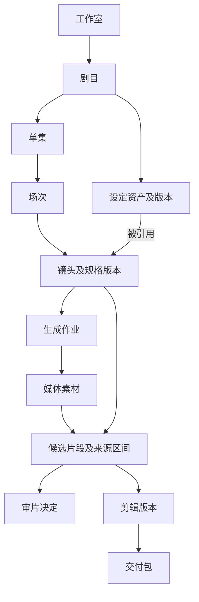
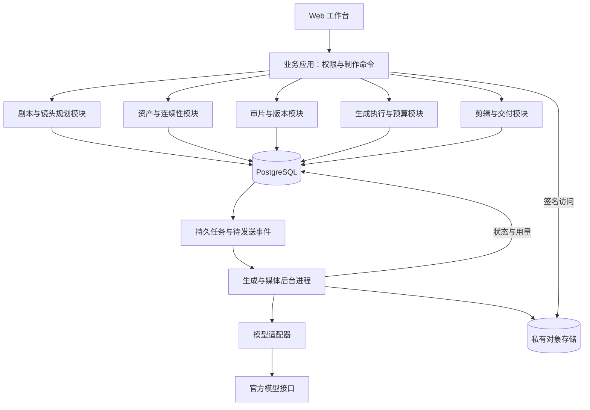

# AI 短剧制作工作台：核心设计 v0.1

> 历史讨论／背景材料（2026-09-10 标注）：10 人以内等早期假设已撤销。本文原日期与正文记录当时判断，不再决定当前范围或待办；以[当前完整方案](ai-drama-workbench-product-design-v1.1.md)、[实施包](implementation/README.md)及[设计确认记录](design/approved-baseline-2026-09-10.md)为准。

日期：2026-09-07。状态：供讨论的产品与技术设计提案，尚未进入实现。

> 历史版本：本稿的“10 人以内”和“先作为自用工具”等假设已被修订。当前方案以 [当前完整方案](ai-drama-workbench-product-design-v1.1.md) 为准；此文件保留用于审查变更原因。

## 1. 定位与结论

建议定位为：**帮助 10 人以内工作室，把剧本稳定转化为可审阅、可返工、可交付成片的协作制作工作台。**

核心工作对象是镜头，核心协作载体是剧目，核心产出是通过审阅的成片。AI 应嵌入剧本拆解、设定引用、镜头生成、候选比较和返工建议；团队每天能看清“谁在做、做到哪、用哪版、还差什么、花了多少”。

价值假设：当一个团队同时生产几十至几百个镜头时，把生产上下文和决策留在镜头旁边，可以减少寻找文件、传递提示词、重复生成和误用版本的时间。**这是待验证假设，竞品调研不能替代工作室访谈和真实试制。**

### 已知与暂定

| 类别 | 内容 |
|---|---|
| 用户明确 | AI 短剧制作工作台；面向 AI 短剧工作室；团队少于或不超过约 10 人；参考 LibTV；先调研和讨论设计 |
| 暂定路径 | 先支持一个种子工作室的真实制作，再决定是否对外 SaaS 化；数据从开始保留工作室归属 |
| 暂定产品形态 | 桌面浏览器承担制作；审阅界面可适配手机 |
| 暂定试点规模 | 选一部剧连续做两集；每集 60–120 秒、约 15–30 个镜头，只作为试验样本，不是行业均值 |
| 仍需讨论 | 写实/动漫/动态漫画；内部工具或 SaaS；现有工具；痛点排序；交付标准；研发投入和预算 |

用户给出的团队规模是制作团队规模，不能据此推定有 10 名工程师，也不能直接承诺研发工期。

## 2. 调研依据与竞争判断

**LibTV 已有较完整的生产能力。** 官方新版脚本指南说明，它覆盖剧本拆解、角色/场景/道具资产提取、可编辑分镜、提示词构造和按范围批量生成图片、视频。因此，“剧本到视频”“资产库”“批量生成”应该作为能力基础，而非直接宣称独有。[官方新版脚本说明](https://resonate.feishu.cn/wiki/Loxfw6XHziYRk0kKzdjcFfp9nhb#Gp7IdiGn5oIWygxc9xecnVzPnfb)

**画布和结构化分镜可以共存。** LibTV 使用节点和连线组织创作，同时提供脚本中的结构化镜头。对本产品的推论是：应先保证镜头、资产和版本数据统一，再决定提供列表、故事板还是自由画布。[LibTV 指南](https://resonate.feishu.cn/wiki/Loxfw6XHziYRk0kKzdjcFfp9nhb)

**协作需要精确的反馈对象。** Frame.io 的官方说明提供单帧、时间范围和画面位置评论，版本管理支持访问和比较旧版本。对本产品的推论是：审片意见必须附着于具体候选或剪辑版本，而不只是项目聊天记录。[评论说明](https://help.frame.io/en/articles/9090684-getting-started-how-do-i-leave-comments)、[版本管理](https://help.frame.io/en/articles/9101068-versioning-in-frame-io)

**接入能力要独立核验。** LibTV 已公开 CLI，但这不代表其多租户商用接入、授权、限流和计费语义已经验证。官网可用的模型也不必然等于该模型的公开 API 已对我们开放。[LibTV CLI](https://www.liblib.tv/cli)

**协作本身也不是空白市场。** LTX 已明确提供 Viewer、Editor 和 Owner 角色，生成和删除素材属于编辑权限；共享项目访问者仍需登录。因此，本产品需要证明的是短剧生产中的具体协作收益，而非仅仅支持多人账号。[LTX 项目共享](https://help.ltx.io/hc/en-us/articles/33649840422802-Sharing-your-project)

**素材持久化是已验证的技术约束。** Runway 官方说明生成输出 URL 在访问 API 后 24–48 小时内过期，要求下载到自己的存储。该时间不能套用到其他供应商，但足以说明“生成完成”和“素材可长期使用”必须分开处理。[Runway 输出文档](https://docs.dev.runwayml.com/assets/outputs/)

本轮没有验证 LibTV 的完整团队权限、镜头派工、批准流程和项目成本能力，不能将它们写成竞品缺失。补充 API 与协作研究见 [研究报告](research/2026-09-07-production-apis.md)；LibTV 观察范围见 [调研记录](research/2026-09-07-libtv-and-review.md)。

建议差异化方向：**连续剧的设定复用、镜头分工、版本决策、变更影响和单位成片成本形成一个闭环。** 其中任何单项都可能已有竞品覆盖，需要验证的是组合体验是否显著降低小团队的协调负担。

## 3. 用户职责与完整制作流程

不把职业名称固化为部门。一个人可以兼任导演、生成制作和剪辑，同一镜头可以有一个负责人及若干参与者。

| 制作职责 | 最常见决策 | 工作台提供的信息 |
|---|---|---|
| 制片/负责人 | 哪集会延期、谁需要帮助、是否继续花钱 | 阻塞镜头、审阅积压、负责人、预算与预估剩余工作 |
| 编导 | 故事和节奏是否成立、镜头是否表达正确 | 剧本依据、故事板、对白、前后镜头和审片对比 |
| 美术/生成制作 | 采用哪套设定、如何修复某个镜头 | 角色造型、场景参考、参数、候选和具体修改意见 |
| 剪辑/声音 | 哪版可以用、素材是否齐、声音如何对应 | 通过的候选片段、入出点、音轨、字幕、交付清单 |

三个必要的人工决策点：确认制作依据、选定可用镜头、确认交付版本。日常编辑和低成本探索不另设层层审批；高额批量生成遵守团队设置的预算权限。

### 一次具体返工

假设第 2 集镜头 014 是“女主走进咖啡馆”，制作员已生成 A/B/C 三个候选。导演在 B 的第 2.4 秒标记“衣服颜色不对”，并引用已确定的红外套造型。

制作员从这条意见创建新候选 D。系统保留 B 的媒体和审片记录，记录 D 的造型版本、生成输入及成本。导演通过 D，剪辑员将草稿中的 B 换成 D；已经交付的第 1 集不会变化。如果红外套设定随后更新，系统列出相关镜头供负责人选择是否跟进，不自动重做。

这个场景同时验证协作、版本、连续性和成本设计，而非只验证能否成功生成一个视频。

## 4. 核心产品设计与页面

主导航建议：**工作台 / 剧目 / 资产库 / 生成任务 / 审片 / 设置**。进入剧目后，以单集为上下文切换剧本、镜头、粗剪和交付。成本既在镜头旁显示，也可汇总到剧目。

| 页面 | 核心内容与操作 | 设计理由 |
|---|---|---|
| 今日工作台 | 我的镜头、待我审阅、阻塞事项、进行中的批次 | 成员进来先找到下一步；制片切换为团队视角 |
| 剧目总览 | 各集进度、交付日期、预算、批准设定 | 多集制作保持统一方向 |
| 剧本与拆解 | 文本、场次、对白；AI 拆解结果逐项采纳 | 重跑 AI 时保留人工修改和镜头身份 |
| 镜头工作台 | 表格/故事板切换；负责人、时长、状态、采用候选、费用 | 批量操作与叙事顺序兼容，是首版主界面 |
| 单镜头详情 | 中间看片；左侧叙事及前后镜头；右侧设定引用、生成参数、候选及审片 | 创作和返工在一个上下文内完成 |
| 资产库 | 角色、造型、场景、道具、风格、音色及版本 | 跨镜头、跨集复用，区分已采用设定和探索草稿 |
| 审片 | 对比候选、时间点/区间评论、通过或需修改 | 反馈绑定版本，可定位和闭环 |
| 粗剪与交付 | 顺序、入出点、配音/音乐、字幕、预览和交付版本 | 最小可用剪辑闭环，精修允许进入现有剪辑软件 |

首版主视图不用通用无限画布承载派工与进度。若访谈表明成员大量在连线中探索，再增加镜头或场次范围内的创作画布；画布仍引用同一套资产、作业和候选。

### AI 在哪些地方工作

- 剧本：提取角色、场次、对白和分镜建议；标出无法确定的指代与设定冲突。
- 镜头：根据已确认设定、前后镜头和所选模型，构造可编辑的生成输入。
- 批量操作：将“用新造型重做这些镜头”转成可查看的范围、参数、预计费用与输出计划。
- 返工：把导演意见整理为修改建议和受影响对象；由创作者选择执行。
- 连续性：先做确定性检查，例如遗漏角色引用、造型版本不一致、时长不足；视觉相似度等模型判断作为辅助提示。

AI 不能通过一句“都完成了”改变批准状态，不能覆盖已通过的候选。每项实际执行都落到可跟踪的制作对象和作业；系统可解释“为什么用了这张参考图”。

### 连续性需要一组机制

角色资产包含身份描述与参考图；角色造型表达服装、发型和阶段状态；场景包含空间布局、光线、时间和常用角度。镜头显式引用这些设定的具体版本，还可记录朝向、人物位置和道具状态。

生成前检查依赖是否齐全，生成后支持同角色跨镜头对照。参考素材能约束输入，无法保证每次输出完全一致；实际效果需要按内容类型和模型实测。声线、对白内容和音频版本同样参与连续性，不能只管理人物脸部。

## 5. 领域模型与关键规则

工作用语见根目录 [CONTEXT.md](../CONTEXT.md)。主要关系如下：

图中的连线表示主要关系，不表示所有关系都是一对多。尤其不能假定一次生成只对应一个镜头或一个文件。

| 对象 | 需要保留的信息 |
|---|---|
| 剧本版本 | 原始内容、人工修改、拆解结果、与既有场次/镜头的对应关系 |
| 镜头规格版本 | 叙事意图、动作、对白、声音、目标时长、画幅、场景/角色造型引用、备注 |
| 设定版本 | 文本、参考素材、确认状态、所属剧目与角色造型关系 |
| 生成作业 | 输入快照、模型及参数、目标镜头、提交与查询记录、成本归属 |
| 素材 | 来源、原文件、预览文件、时长/尺寸/帧率、校验信息、入库状态 |
| 候选片段 | 目标镜头、素材及来源区间、输入依据、创作者、父候选、审片结果 |
| 剪辑版本 | 镜头顺序、候选引用、源入出点、时间线位置、声音、字幕 |
| 交付包 | 锁定的剪辑版本、文件列表、规格、生成时间、相关审批记录 |

### 必须成立的业务规则

1. **镜头身份稳定。** 增删排序只改变顺序；拆分、合并保留与原镜头的关联。AI 重新拆解先产生差异建议，不覆盖分工和人工修订。
2. **生成作业、素材、候选是不同对象。** 一次作业可以产出多个素材；一个长视频可按区间成为多个镜头的候选。导入素材同样可以成为候选，但不伪造生成参数。
3. **生成依据冻结。** 提交时保留剧本/镜头规格/设定版本、提示词、参考文件、模型标识及可获得的随机种子。可追溯输入不代表模型能够逐像素重现。
4. **新版本不覆盖旧结果。** 更新角色设定仅标记受影响引用“待确认”；人工决定哪些镜头采用新版本，哪些保留原版及原因。
5. **批准指向具体版本。** 最新候选不自动成为通过版本。更改已经批准的候选会产生新的审阅对象，旧决定保留。
6. **剪辑和交付显式引用。** 新候选出现时，草稿提示可替换；已锁定的剪辑和交付清单不会漂移。解锁后另建版本。
7. **声音独立可替换。** 有原生音频的视频、外部配音、音效和字幕都可记录自己的来源和版本；选用画面不必自动替换配音。
8. **成本记一次，归属明确。** 一个作业覆盖多个镜头时采用记录在案的分摊方式，例如按目标时长分配，剧目汇总只计一次；外部工具费用可标记未知或人工估算。

## 6. 状态与协作

### 三种状态分开表达

镜头制作状态：`草稿 → 待制作 → 制作中 → 待审 → 已通过`；退回后进入 `需修改`，修订后重新送审。`阻塞`、`输入有更新`、`已纳入交付`是单独标记，避免把生产、依赖和交付混成一个巨大状态表。

生成作业状态：`待提交 → 提交中 → 排队/执行中 → 成功 / 失败 / 已取消`，另设 `提交结果待确认`。请求超时不能直接被视为未提交，取消请求也不等于供应商已经取消。

素材准备状态：`待入库 → 下载/上传中 → 校验与预览处理中 → 可用`，失败可停留为 `入库需重试`。供应商生成成功而入库失败时，优先重试取回素材，避免再次产生生成费用。

整集“可交付”从当前剪辑中引用的素材、审阅结果、未解决问题和导出规格推导；未被采用的实验候选不会阻挡交付。

### 权限与多人编辑

权限从简：工作室管理员、项目编辑者、审阅者/查看者，并允许项目负责人授予“批准交付”和“批准超预算”能力。职业身份和权限分开；小团队允许一人兼任。

首版采用对象版本检查和冲突提示：两人同时改同一镜头时，后提交者看见差异，可重新应用修改；评论和不同镜头编辑可以并行。不在首版引入整套多人实时富文本合并系统。

工作室归属校验覆盖业务记录、文件、异步任务和下载入口。成员退出后失去后续访问，但作者和历史决定保留。外部审片邀请是后续可选能力，限制到明确的交付版本和可撤销访问范围。

## 7. 技术架构建议

采用**模块化单体业务应用 + 独立后台任务进程 + 对象存储**。少量用户仍会产生大量媒体处理和长时间等待；规模压力首先在生成与文件处理，业务应用可保持简单。

### 深模块的职责

| 模块 | 对外 Interface（调用方需理解的操作） | 内部隐藏的 Implementation |
|---|---|---|
| 制作规划 | 提议拆解、采纳差异、修改镜头、分派负责人 | 文本解析、AI 提示、身份匹配、版本冲突 |
| 资产与连续性 | 创建设定版本、引用设定、查询影响范围 | 引用图、版本解析、参考材料与校验规则 |
| 生成执行 | 估算批次、提交批次、查询进度、请求取消 | 参数验证、配额、预算预占、供应商调用、重试、费用对账 |
| 审片与版本 | 提交审阅、评论、作出决定、选用候选 | 版本绑定、时间点、状态规则、通知 |
| 剪辑与交付 | 保存剪辑、预览、锁定版本、导出 | 媒体处理、清单、导出队列、文件关联 |

供应商适配器是明确的变化位置（Seam）：厂商任务状态、输入格式、鉴权和结果格式被封装在 Adapter 内。业务层使用“角色参考、镜头意图、视频候选”，同时允许按能力显示模型专用选项，不把所有模型压成一个只有 prompt 的接口。

### 初始技术候选与部署

- 前端候选：React + TypeScript；媒体预览与列表交互独立组织。是否使用 Next.js 取决于团队经验，不作为本轮定案。
- 后端候选：TypeScript 服务配 PostgreSQL；若研发团队主要使用 Python，可替换应用实现，领域职责不变。
- 异步执行：早期可使用 PostgreSQL 持久作业表与后台进程，具备租约、超时恢复、退避和死信处理；已有成熟队列基础设施时可以复用。数据库保存业务事实，队列仅负责调度。
- 文件：同部署区域的私有对象存储，原素材和预览文件分开；分片/断点上传、校验、限时访问；供应商临时输出必须入库。
- 媒体后台：FFmpeg 处理探测、缩略图、预览和有限粗剪导出；转码进程与 Web 请求进程隔离。
- MVP 部署：一个区域、业务进程与后台进程可独立扩容、托管数据库和对象存储。公网 SaaS 与私有部署的运维成本另行评估。

以上是候选结构，不锁定版本、云厂商或合同。首版不需要自建视频基础模型、GPU 集群、微服务网格或通用工作流引擎。

### 生成执行的可靠性

1. 在一次数据库事务中创建作业、冻结输入、预占预算并记录待发送事件，避免“已扣预算但任务丢失”。
2. 浏览器重复点击使用同一业务请求标识；后台调度允许重复投递，但同一作业不能随意再次购买生成。
3. 若供应商响应丢失，进入“提交结果待确认”。先按供应商任务标识或查询能力对账；没有安全查询手段时由人工决定，不能盲目重发有费用的请求。
4. 回调有可靠支持时使用回调，轮询作为恢复手段；去重并处理乱序，终态不能被迟到的“执行中”覆盖。
5. 供应商成功后尽快保存原始结果和元数据，再生成预览；可用素材才进入选片和审阅。
6. 每家供应商分别配置并发、速率和功能限制；部分失败保留成功镜头，允许选择剩余部分继续。
7. 预算分为预计、预占、确认发生和已结算。取消或超时不默认免费；无法核实的费用保持待确认。

需要集成前实测的能力：创建/查询任务、输入限制、真实可用的参考能力、输出寿命、取消和计费关系、幂等性、限流、内容拒绝语义、使用区域和账户可用性。SDK 中存在字段不代表当前账号和目标模型均支持。

### 媒体与数据安全的基本实现要求

服务端保存供应商密钥；私有素材仅以必要范围和有效期交给目标模型。引用记录保留来源及已知授权信息，避免团队误用无来源素材。媒体抓取限制来源和大小，拒绝内网地址，校验格式；日志不写入密钥或完整签名 URL。

数据库与媒体需要一起制定备份、恢复和归档策略。已纳入交付的素材受保留策略保护；先归档/可恢复删除，再按工作室规则清理。这里是产品与技术要求，不构成对具体发行地区或商用授权的法律结论。

## 8. 成本、容量与成功指标

费用必须按真实计费单位归一，而不是把某网站活动单价写死。

`剧目制作成本 = 生成实际费用 + 媒体处理 + 存储与传输 + 外部制作费用 + 可选人工工时成本`

每项费用保留供应商、模型、计费单位、单价版本、币种、用量和账单状态。平台内生成与外部导入分别显示已知成本、估算成本和未知成本，不以“0”代替未知。

试算示例（仅说明放大因素）：一集目标 90 秒，18 个目标镜头；每镜头平均生成 4 次，每次生成 6 秒，则共产生 432 秒视频。若实际含税等价单价是每秒 p 元，视频生成项约为 `432p`，还未包含图片、音频等成本；因此成片 90 秒不能按 `90p` 估算。实际有长镜头、复用或不同计费方式时，应按作业记录计算。

容量也从产出倒推。上述 432 秒候选若按平均 10 Mb/s 存储，大约 540 MB；只是视频候选的示例，不含参考图、代理文件、多份导出和冗余。通过真实试点测得参数后再估算月度容量及并发，不按 10 个账号简单乘以网页流量。

| 指标 | 口径与用途 |
|---|---|
| 单集交付周期 | 从确定制作依据到批准交付的时间，区分等待和实际制作 |
| 每分钟批准成片成本 | 项目可归属总费用 / 已批准成片分钟数，同时标注未知费用占比 |
| 镜头首轮通过率 | 第一次送审即通过的镜头 / 第一次送审的镜头；与生成成功率分开 |
| 候选采用率 | 被当前批准剪辑采用的候选 / 可用候选；分析过量探索 |
| 返工原因 | 叙事、人物、场景、动作、声音、技术规格；找最值得自动化的环节 |
| 交付可追溯率 | 能定位具体素材和审阅版本的交付镜头比例 |

建议试点目标（待共同确认）：交付镜头可追溯率 100%；系统重试造成的重复付费提交为 0；同等质量下，比现有流程减少约 20% 的交接与找素材时间。最后一项是目标而非效果承诺，小样本需结合访谈解释。

## 9. MVP 范围与推进计划

### 阶段 A：证实生产问题

与 2–3 位兼任不同职责的成员走查一次真实制作，整理现有文件、交接和返工路径。选择一段有对白、两个角色、跨镜头造型要求的样片作为基准，再选择第二集验证资产复用。

输出：真实流程图、优先痛点、导入样本、质量标准、模型/剪辑工具清单、可观测基线。退出条件：能说清楚工作台减少哪项具体劳动，以及成员为何愿意迁入。

### 阶段 B：生产协作最小闭环

交付剧目/单集/镜头结构、负责人、资产版本、外部素材导入、候选比较、时间点评论、批准和素材清单导出。允许沿用现有生成工具，先验证团队愿意把制作结果与决定沉淀到这里。

退出条件：一集所有采用镜头都能追踪到来源与批准，返工不依赖另建文件命名约定；录入负担可接受。如果只是额外增加一套表单，需要调整入口或缩小产品范围。

### 阶段 C：可作为首版上线的 AI 制作闭环

加入 AI 剧本拆解及差异采纳、设定引用、一个图像生成通道和一个视频生成通道、按镜头批量执行、用量/预算、基础配音或音频导入、有限粗剪和整集审阅。

首版交付输出：审片 MP4、原素材包、镜头与采用版本清单、字幕文件（存在字幕时）。精剪使用团队已有工具，完成后回传新的剪辑版本。与剪映、Premiere、Resolve 的工程格式兼容需要实测；未经验证不承诺“通用一键往返”。

退出条件：同一工作室完成连续两集，跨集复用已确认设定；一次局部返工不误动其他镜头；模拟生成部分失败仍能恢复并正确结算。

阶段 B 是验证切片，不是最终宣称完成的 AI 工作台；B + C 才构成首版目标。真实内容若以动态漫画为主，可把视频生成优先级让给配音、字幕和运动模板。

### 后续按证据加入

第二供应商、常用制作模板、视觉连续性辅助检查、局部创作画布、客户审片、成熟剪辑软件连接、多工作室订阅和商业结算。对外 SaaS 前还要完成跨工作室隔离、邀请/撤权、配额公平、计费和运营支持的完整验收。

首版范围之外：模型训练平台、开放模型市场、素材社区、完整专业剪辑器、发行与投流系统、无人审阅的全自动长剧工厂、复杂跨部门审批。

### 必须验证的故障与边界场景

| 场景 | 预期行为 |
|---|---|
| 两人同时修改镜头 | 产生可处理的冲突，不静默覆盖 |
| 更换角色造型 | 列出相关镜头，旧候选和交付可重看 |
| 重复点击或后台恢复 | 不因系统重试重复购买生成 |
| 供应商已接单但响应丢失 | 标记待确认并对账，不盲目再次提交 |
| 一批镜头部分失败 | 已成功素材保留，仅继续选定部分 |
| 成功视频链接临时失效或下载失败 | 独立恢复入库；无法恢复时明确呈现，不伪装成功 |
| 旧版本审片意见迟到 | 留在原版本，不误伤已通过的新版本 |
| 长视频拆成多个镜头候选 | 记录来源区间，费用汇总不重复 |
| 新候选生成时已有锁定交付 | 交付引用不变 |
| 用户退出或跨工作室请求素材 | 访问被拒绝，历史归属可追溯 |

本轮只形成验证方案，没有执行模型生成或软件测试。

## 10. 讨论顺序与决策影响

| 需要讨论的问题 | 为什么会改变方案 | 当前建议 |
|---|---|---|
| 自用还是直接 SaaS | 决定账号、计费、隔离、支持及上线门槛 | 先用真实工作室验证生产闭环 |
| 首批是写实短剧、动漫还是动态漫画 | 决定视频、口型、角色造型、配音、运动模板的优先级 | 选一种主形态，数据结构保留扩展性 |
| 当前最大损失发生在哪一步 | 决定从协作、连续性还是生成吞吐切入 | 用最近一次返工核实，不靠功能偏好投票 |
| 团队现在用哪些生成和剪辑工具 | 决定第一接入通道和导出范围 | 允许导入，优先减少重复录入 |
| 单集时长、周产量、质量和预算 | 决定容量、成本保护、候选数量及验收样片 | 用具体样片测算 |
| 可投入哪些研发人员与时间 | 决定阶段切片和技术实现 | 明确资源后才给工期和成本估算 |

本轮建议先讨论前两项，以及一个具体的返工案例，再收敛为可执行 PRD 和实施计划。上述提案均可调整；本轮没有把暂定架构写成已接受的架构决策。
