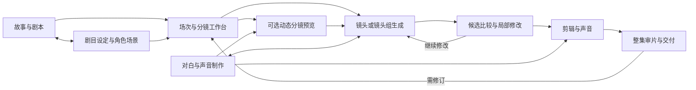
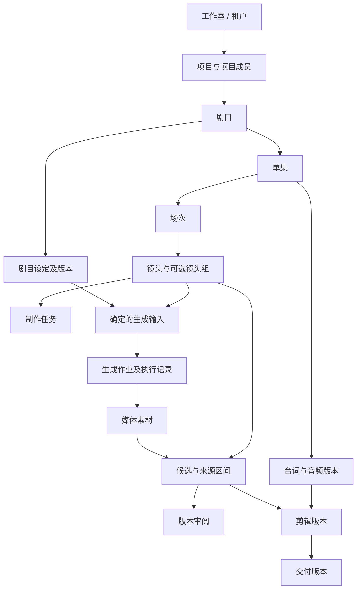

# AI 短剧内容工作台：核心设计 v0.2

> 历史讨论／背景材料（2026-09-10 标注）：保留中小工作室定位与早期范围推导。本文原日期与正文记录当时判断，不再决定当前范围或待办；以[当前完整方案](ai-drama-workbench-product-design-v1.1.md)、[实施包](implementation/README.md)及[设计确认记录](design/approved-baseline-2026-09-10.md)为准。

当前产品设计主入口为 [当前完整方案](ai-drama-workbench-product-design-v1.1.md)。本文件保留此前复核与逐轮修订依据；后续 MVP 范围、默认设计及待决策事项以整合稿为主。

日期：2026-09-07。状态：独立竞品复核后的讨论稿；替代 v0.1 的产品定位、MVP 和迭代安排。本轮不进入产品代码实现。

本轮已确认：目标用户为中小工作室团队，不设 10 人上限；首发优先偏 AI 写实的短剧；模型评估与接入优先考虑 Seedance 等第一梯队模型，以 Seedance 系列为首要候选。写实指内容的视觉与表演形态，都市、悬疑、古装等具体题材尚未确定。下文的试点样片范围、页面命名和制作路径仍是设计建议。

管理范围已确认：初版只考虑工作室内部协作，暂不建设外包参与能力；权限保持简单，长期支持升级与扩展。具体固定角色及权限映射为下文的收敛建议。

管理架构补充建议：当前一个工作室对应一个租户，工作室下有多个项目；一个短剧项目承载一部剧目，一次创建完成管理记录与内容记录。详细职责、权限、费用和演进见 [租户与项目架构](ai-drama-workbench-tenancy-v0.1.md)。

## 1. 修订结论

产品定位调整为：**面向中小工作室团队、优先服务 AI 写实短剧的内容制作工作台，支持团队在共同剧目设定下完成剧本、分镜、视听生成、局部修改、审片和成片交付。**

目标用户不设 10 人上限，也不把“先给自己的工作室使用”作为产品前提。建议以面向多个工作室的产品为目标，先邀请少量种子团队试用；试点范围是交付策略，不是领域模型的人数限制。是否采用公共 SaaS、专属部署或其他商业交付形态尚待确认。

新判断：**创作质量与可控性是采用产品的前提，团队生产能力决定能否持续使用。** 版本、预算和任务追踪应伴随创作自动形成，避免让成员先完成一套管理录入。

### 对 v0.1 的 review

| 原方案判断 | 结论 | 调整及原因 |
|---|---|---|
| 面向 10 人以内团队 | 修正 | 面向中小工作室；支持内部多项目、跨工序分工，不设固定人数上限；外部协作长期按需增加 |
| 先作为一个工作室的工具，再决定产品化 | 修正 | 从第一版具备工作室隔离和项目权限；邀请制试用可以保留，自用不是前提 |
| 镜头分工、审片和成本构成主要差异化 | 降低确定性 | 多家产品已有协作、素材和预算能力；差异化需要落在具体内容类型中的可用成片质量、可控返工和生产效率 |
| 先做协作切片，后接 AI 创作 | 调整版本定义 | 协作切片可用于内部技术验证；对外 MVP 必须能完成最小的 AI 视听制作闭环 |
| 镜头列表是首版主界面 | 调整 | 创作者默认故事板/场次视图，制片使用表格与看板，底层对象一致 |
| 画布整体后置 | 细化 | MVP 提供轻量参考板及素材关系；通用无限节点画布按复用需求后续决定 |
| 以镜头组织生产 | 保留并扩展 | 镜头保留稳定身份，但一次生成可覆盖镜头组或一段戏；不能强迫所有能力逐镜头调用 |
| 声音主要通过导入或后期补齐 | 加强 | 台词、声线、音频版本及基础声音编排进入 MVP；口型增强依赖首发内容类型 |
| 生成任务、素材与采用版本分开 | 保留 | 是局部重做、费用对账、素材恢复和历史交付不漂移的基础 |
| 模块化单体与独立后台任务 | 保留并补齐 | 团队变大不直接推出微服务；补租户隔离、公平调度、项目权限和多工序工作职责 |

研究汇总与产品逐项证据见 [独立市场复核](research/2026-09-07-workbench-market-review.md)。公开能力说明未替代真实账号与成片质量测试。

## 2. 目标团队与产品边界

按生产组织方式理解中小工作室，不按一个人数阈值切分。

| 组织方式 | 典型特征 | 产品应支持 |
|---|---|---|
| 主创主导 | 多人兼任、一个主创把关、少量并行项目 | 少量固定流程、快速生成、低管理负担 |
| 工序协作 | 编导、美术、视频、声音、剪辑分工明确 | 工序交接、项目权限、任务归属、团队资产 |
| 多项目制 | 多位制片、多个内部项目组、成员跨项目参与 | 工作室与项目分层、隔离预算、可撤销访问、并行生产 |

首发内容形态已确认为**偏 AI 写实的短剧**：优先围绕接近真人影视的角色外观、空间、动作和表演组织产品能力与质量验收。动漫、动态漫保留后续扩展可能，不作为首版并列验收方向。

写实不是剧情题材分类，也不表示采用真人实拍。当前没有据此确定都市、情感、悬疑或古装，没有锁定单集时长或投放渠道。Seedance 系列作为视频主模型的首要评估与接入候选，具体模型版本、API 服务与地域尚待核验选定。

建议首轮样片从现代场景、少量主要人物、以对白和人物关系推动的戏开始，覆盖人物反应、正反打和简单道具交互。这是控制首轮验证变量的建议，不是已确认的题材或产品硬限制；复杂打斗、大规模群演和大场面特效不作为第一轮必须覆盖的能力。

写实优先使人物跨镜头外观与声音、表演意图、动作衔接、对白准确性和口型同步成为 MVP 的质量要求。先验证一条可完成这些任务的主要制作路径，再扩展更多模式；基础领域对象仍支持其他内容形态。

不把模型数量、生成次数、Agent 数量作为用户价值。重点衡量“在团队认可的质量标准下，完成一集需要多久、花费多少、返工是否可控”。

### 模型策略：以 Seedance 为首要候选，优先验证高质量制作路径

优先考虑第一梯队模型是用户确认的取向，不是本项目已经完成模型排名或效果测评。MVP 优先把 Seedance 系列的一条正式 API 制作路径用深：多模态参考、音画联合、单镜头与连续片段生成，并核验延长和局部编辑的可用性。剧本处理和设定图生成分别选择适合的模型，不要求视频模型承担全部任务。

截至本次核查，Seed 官方已发布 Seedance 2.5，介绍多镜头叙事、音画联合及参考与编辑能力；BytePlus LAS 正式文档已列出 2.5 的异步生成 API。LAS 与国内火山方舟、BytePlus ModelArk 属不同服务入口，不共用可用性和参数承诺。具体接入应核验模型版本、账号、角色参考方式、输出规格、费用和任务语义；这些文档没有替代本项目样片实测。[Seedance 2.5 发布说明](https://seed.bytedance.com/en/blog/one-take-creation-flexible-referencing-introducing-seedance-2-5)、[BytePlus LAS 视频生成文档](https://docs.byteplus.com/en/docs/byteplus_las/video_gen_enhanced)

主路径设计优先利用模型能直接完成的工作，不把先生成每张分镜图、逐镜头生成无声视频、再统一配音设为固定前提。保留精细分镜、独立配音和局部补拍入口，用于明确的创作需要。正式制作按质量优先选择模型；预览或草稿的低成本模式单独标识，备用切换显式显示实际模型和预计影响，不静默降级。

选择依据是通过质量验收的成片总成本、总耗时和可修改性，包含未采用候选及人工返工。版本号、单次调用价格或最大输出分辨率不能单独代表更适合本工作台。核查细节见 [Seedance 优先接入研究](research/2026-09-07-seedance-priority.md)。

Seedance 优先不表示原生声音或多镜头生成是其独有能力。可灵、万相和 Veo 的已核查版本存在能力重叠，具体差异集中在角色引用方式、镜头控制、输入组合和返工路径。按「具体模型/版本 + 服务入口 + 制作模式」设计能力与输入校验，不把品牌名直接绑定一套固定工序。比较与证据见 [模型制作流程比较](research/2026-09-07-model-production-workflows.md)。

## 3. 从创作到生产的统一流程

流程允许从剧本、分镜表或已有素材进入；导入时明确将要新增和修改的对象。导入与重新拆解生成差异草稿，保留人工内容和历史版本。

### 剧本与剧目设定：制作依据与共同方向

“创作基准”拟在页面上改称“剧目设定”。剧本描述各场发生什么、人物做什么和说什么；剧目设定保存共同的故事背景、人物关系、风格参考、角色造型、场景空间、声音方向和交付规格。由剧本提取设定建议，团队确认和补充，不要求手工重复录入两套资料。

场次状态单独表达剧情此刻的服装、伤痕、人物知情情况、情绪和道具持有情况。例如角色有固定身份与声音，但回忆段落中可能尚未受伤。场次及镜头可在明确范围内采用不同设定；MVP 保存结构化引用与必要备注，自动推理完整剧情状态后续评估。

每次生成保留最终实际采用的设定。改变剧目默认值只影响未来草稿建议，已提交输入与已批准结果不会被悄悄改写。这个设计受到 Higgsfield 项目设置、镜头设置和共享创作说明的启发，实际一致性效果仍依赖模型和人工选择。[Cinema Studio 官方帮助](https://higgsfield.ai/creator-hub/help-center/tools/how-do-i-use-cinema-studio)

### 分镜工作台：把剧本变成拍法和候选

命名建议：完整模块称“分镜工作台”，剧目内导航可简写“分镜”；“故事板”保留为其中的图像化预演产物或视图。完整模块涵盖场次与镜头规划、参考素材、视频生成、候选比较和选用，名称需要覆盖实际操作范围。故事板则用于预演构图、动作、镜头顺序和衔接，不应代指整个制作模块。

同一镜头卡逐步承载镜头描述、分镜图、视频候选及选用结果，避免重复维护两套生产对象。分镜参考图不必等同于视频生成首帧。场次可以组织多个镜头组，允许选中连续片段整体生成；不因模块叫“分镜”就强制一次只做一个镜头。

可将故事板图片、计划时长、临时配音或朗读组合成动态分镜预览，帮助导演检查节奏、对白长度、人物位置和叙事缺口。它是减少正式生成返工的工具，不要求每个项目都先制作完整的精细分镜图；允许从已导入分镜或镜头组描述直接进入合适的生成路径。

镜头编辑界面直接表达景别、构图、机位/运动、表演、动作、对白和声音意图。提示词由这些内容与引用素材构造，仍可查看和编辑；专业创作者可以使用高级参数，但不必每次手工复制全部设定。

### 优先验证连续片段生成，保留逐镜头控制

- 首要验证路径：将剧本片段、角色/场景及可用声音参考、表演和镜头意图共同用于生成一个镜头或连续片段，优先评估模型原生声音。镜头组的范围按戏剧动作、上下文和实际模型限制确定，不等于一次必须生成整场或整集。
- 需要精细控制构图、起止画面或某个镜头时：生成/修订参考图，再按所选模型支持的输入模式制作视频。对具体缺陷选择重做、补拍或可用的局部编辑。

连续片段可以整体选用，也可以按实际区间映射到多个镜头并进入剪辑。输入镜头计划不保证输出切点完全一致，候选保留真实时间区间并允许人工调整；一次生成费用只记录一次。

具体可用模式由供应商、模型和账号能力决定。没有能力的模式不显示为可执行，不以网站宣传的最长时长硬编码业务规则。

同一个分镜工作台允许逐镜头控制、镜头组音画生成及基于已有素材的编辑/续写；表演驱动按后续已验证接入提供。它们是可组合的制作方法，不分别重建项目或资产库，也不要求 MVP 接入全部模型。切换模型/模式时列出不兼容的参考或控制项，不静默丢弃声音、角色绑定或首尾帧。

### 声音贯穿生成和剪辑

支持的制作关系包括先对白后画面、画面与声音同时生成、先画面后配音。按 Seedance 优先策略，首先验证带台词和表演意图的原生音画联合路径，再依据台词准确性、声线和口型结果决定独立配音是否成为主要路径的一部分。MVP 不要求三条路径同时达到完整支持；视频或外部音频导入保留为可选入口。

对白与声音记录角色、文本、表演意图、来源版本和采用区间。临时声音用于分镜节奏验证；正式制作关注声音、表演与口型；剪辑再组织对白、环境声、音效、音乐和字幕。写实对白的可用性从首版验收，声音不只是一道末端补充工序。

“声音独立版本管理”不表示供应商必然输出分离音轨。原生混合音轨保留原文件和来源，只有实际获得分轨时才标记可单独替换。更换混合音轨中的对白可能需要补环境声；改变对白长度可能需要重新对齐、修口型或重做画面。修改计划应说明这些影响，不承诺任意替换都无损。

### 审阅围绕产物发生

角色图和分镜图进行设定或分镜确认；视频审阅支持镜头候选、场次片段、整集剪辑版本。分别检查局部可用性、前后衔接和整集叙事；镜头均通过不能自动推出整集通过。

区分创作者选用、审阅意见和有权限者批准。建议 MVP 默认由创作者选用候选，内部成员按分工审看和反馈；项目负责人及 Owner/Admin 作出正式审片与交付确认，不单设审阅权限角色。关键镜头或场次按需送审，整集交付前明确确认，不强制每个层级依次走审批。审片列表提供集中待办，镜头或剪辑页面提供上下文，两者引用同一产物版本。

### AI 助手是有上下文的创作入口

可请求“把这场戏改为压抑气氛”“补一个反应镜头”“将这些镜头换成已确认造型”。助手先形成可查看的修改或生成计划，说明范围、依赖、预计费用和产物；执行经过与人工操作相同的权限、预算和版本规则。

MVP 只提供有限、稳定的动作集合：剧本拆解、设定提取、镜头建议、参数构造、选定范围生成。跨多集自主管理、任意工作流编排和自动质量决策后续再评估。

## 4. 核心页面与交互

主导航建议：**工作室首页 / 剧目 / 资产库 / 制作任务 / 用量与设置**。剧目内导航建议：**概览 / 剧本 / 剧目设定 / 资产 / 分镜 / 剪辑与声音 / 审片与交付**。进入剧目后，创作、审片和交付都保留当前单集与场次上下文。

工作室切换表示切换租户上下文，界面不额外要求选择一层同义租户。「剧目」是当前项目类型的创作入口，项目成员、预算和任务在同一剧目内管理；不要求用户先建项目再重复建一部剧。

| 页面或视图 | MVP 体验 | 后续增强 |
|---|---|---|
| 工作室首页 | 剧目列表、我的待办、待审片、进行中批次 | 多项目排期、团队负载与产能 |
| 剧目设定 | 梗概、人物关系、风格、角色/造型、场景与声音；区分场次状态 | 可视化关系、跨集连续性检查 |
| 工作室资产库 / 剧目资产 | 设定资产与制作素材分类；共享库与剧目范围；预览、版本、搜索、直接使用位置、上传及生成自动登记 | 语义检索、完整影响关系、批量整理与生命周期策略 |
| 剧本与拆解 | 文本编辑、导入、场次/镜头建议、差异采纳 | 长篇改编、节奏辅助、剧本版本对照 |
| 分镜工作台 | 场次、镜头卡、图片、对白、时长、参考板、生成与可选动态预览 | 复杂调度、轻量空间参考、分支对比 |
| 镜头详情 | 前后文、导演参数、引用、候选、重做、审阅 | 区域/时间段重拍、表演驱动 |
| 制作表格/看板 | 负责人、当前工序、状态、截止时间、预算 | 多工序任务模板、依赖和负载平衡 |
| 剪辑与声音 | 已验证对白/口型制作路径、声音生成/导入、顺序和裁切、音量、字幕、整集预览 | 更精细的对白对齐、口型修复与混音工具；工程往返 |
| 审片与交付 | 镜头/场次/整集版本、时间点评论、按需送审、交付确认、锁定与导出 | 客户审片、区域标注、多人审批和多语言交付 |

故事板、表格、参考板都是同一批镜头和素材的视图。重复使用素材只产生引用，不要求成员在不同页面重复上传或录入。

### 资产库的位置与使用

工作室资产库提供显式共享的可复用内容；剧目资产汇集本剧创建和引入的内容，跨单集使用。分镜与剪辑中的「选择资产」侧栏让创作者就地引用，默认当前剧目，可切换有权访问的共享内容。三个入口共用资产能力，不要求重复上传。

资产按用途区分角色/造型、场景、道具、声音、风格等设定，以及实际图片、视频、音频和成片等制作素材。「剧目设定」引用这些条目来表达共同创作方向，不另存重复资料。角色是包含多种造型与参考媒体的设定，不能等同于一张图。

生成结果自动登记为本剧制作素材并关联作业和候选；不会自动覆盖角色参考，也不会自动发布到工作室共享库。场次/镜头固定引用明确版本，发布和引入共享内容都是显式操作；普通下架不删除已有剧目的引入版本。角色或场景出现新版时提示影响范围，由人决定采用和重做。

完整交互、数据关系、共享权限与验收例见 [资产库设计 v0.1](ai-drama-workbench-assets-v0.1.md)。

## 5. 领域模型和不可破坏的规则

这里区分制作任务和生成作业：制作任务表达“谁要完成哪道工序”，可能持续多天和多次返工；生成作业表达一次确定输入的模型调用意图。一项任务可不调用 AI，也可产生多次生成。

MVP 的任务模板只采用几种固定工序。允许更换任务负责人和审看人员，保留交接记录；任务分工不改变项目权限。V1 再开放复杂工序拆分和批量排期。

关键规则：

1. 场次、镜头、设定具有稳定身份；排序不改身份，拆分/合并保留来源关联。
2. 重跑拆解或导入不清空已有生产成果。自动匹配不确定时呈现冲突或新增建议，而不覆盖。
3. 已提交的输入、已批准的候选、已锁定的剪辑采用不可变版本；普通草稿自动保存，不要求每次键入都产生用户可见版本。
4. 生成完成、素材入库、人工通过分别记录。一批任务中缺少任何必需产物时，整批显示部分完成。
5. 一个作业可产出多个素材，一个素材可按来源区间形成多个镜头候选；合并费用只计一次。
6. 审片意见与决定绑定精确版本和时间范围。新候选不能继承旧候选的批准状态。
7. 角色造型、场景、台词或声音修改后，标记引用它们的对象待确认；只重做创作者选定的范围。
8. 画面、对白和声线分别留存来源与版本；标明音轨为混合或实际可分离。换画面不自动换掉已批准配音，音画时序变化提示重新检查，混合音轨的对白替换不承诺无损。
9. 交付引用确定的素材和区间，不引用“最新候选”。新的尝试不改变历史交付。
10. 项目资产属于工作室的项目，不能因创作者退出而失去生产记录。跨项目复用需显式允许并固定引用版本。

术语见 [CONTEXT.md](../CONTEXT.md)。完整连续性图、跨项目资产发布流程及更细任务拆分可后续增加，但上述规则从 MVP 开始成立。

## 6. 面向中小团队的权限与预算

MVP 采用工作室、项目两层授权，当前工作室即租户，仅支持内部团队。账号可以加入多个工作室，每段成员关系分别记录状态和固定角色，切换工作室不继承其他工作室权限；初版无需选择成员类型。

工作室角色收敛为 Owner、Admin、Member。建议 Owner/Admin 均可管理和访问全部项目，普通成员仅参与被加入的项目。Owner 另外负责所有权转移、管理员任免、工作室解散及结算资料管理；Admin 不能任免管理员或升级自己。项目隔离不承诺向 Owner/Admin 隐藏内容，这取代此前 Admin 需逐项目获权的建议。

项目只保留「负责人、协作者」两种角色。生成、下载、正式审片与交付确认按固定角色映射，不提供逐人能力开关。审看与反馈属于任务分工，不另设审阅者/查看者角色；付费生成仍受连接可用性、套餐与预算约束。

| 能力 | MVP 处理 |
|---|---|
| 工作室管理 | Owner/Admin 管理内部成员、全部项目、共享库、连接与预算；所有者专属事项另有固定限制 |
| 项目管理 | Owner/Admin 创建项目并任免负责人；负责人添加或移除本项目协作者、分工和归档，不能提高预算 |
| 内容制作 | 负责人及协作者均可编辑、在预算内生成、下载本项目内容；不设个人额度或下载开关 |
| 审片与交付 | 协作者评论、反馈和提交审阅；项目负责人及 Owner/Admin 作出正式审片和最终交付确认 |
| 资产复用 | 有效内部成员读取和引入工作室共享资产；Owner/Admin 发布、修订共享内容并承担公共资产制作管理 |

MVP 不建设外包、Guest、客户审片链接、自定义角色、镜头级权限或通用审批配置。后续先按内部需求增加只读/审阅角色、工作组批量授权和资产维护职责；外部协作、复杂策略及 SSO/SCIM 长期按实际需求扩展，不作为 V1 必交承诺。

业务统一检查成员、对象范围与操作能力，首版由固定角色映射实现；角色判断不散落在页面和各模块中。长期增加角色、成员类型和范围授权时，保留现有身份、数据归属及明确权限，新增外部身份默认无权限；不提前建设通用策略引擎。

成员退出保留作品、费用和制作记录；尚未提交供应商的任务执行前重查权限并暂停待转交，已提交任务按可取消性处理并继续归档/结算到原工作室。删除成员和归档项目不直接删除媒体或丢弃在途费用。

生成费用建议由工作室统一管理：提交前显示估算、按项目预占、执行后记录实际费用；同时保留操作者用于归因。工作室共享资产制作记入明确的公共制作成本范围。工作室总额、项目预算、单批次额度属于同笔消费的不同约束，多个成员同时生成时需要原子预占，但真实费用只入账一次。

对用户区分“预计费用、在途预占、已确认消费、待核对”。系统提交结果不明时不得重复购买同一生成；取消不自动假设免费。超过预算的计划可缩小范围或由有权限的人追加预算。

商业模式建议先验证工作室订阅加生成用量的组合，MVP 不为不同制作职责设计复杂席位分类。可邀请制人工开通和结算，自动订阅、开票与复杂套餐不是首版前提。预算能力不可后置到商业计费系统上线之后。

长期统一采购可以增加覆盖多个独立工作室的结算账户，不自动合并租户、共享资产、预算池或授予作品访问权。完整管理方案见 [租户与项目架构 v0.1](ai-drama-workbench-tenancy-v0.1.md)。

## 7. 技术架构与扩展路径

保留**模块化单体业务应用 + 独立生成/媒体后台进程 + PostgreSQL + 私有对象存储**。前端可用 React/TypeScript，后端语言与团队能力匹配；本稿不锁定框架版本或云供应商。

| 模块 | 对外提供的能力 | 内部处理的复杂性 |
|---|---|---|
| 工作室与项目 | 校验访问、管理成员和项目、授予能力 | 工作室/租户归属、跨工作室身份、两层角色、撤权与审计 |
| 内容规划 | 剧目设定、场次状态、剧本差异、场次/镜头编辑 | 文本拆解、AI 结构化输出、稳定身份、并发冲突 |
| 设定与素材 | 引用版本、查询影响、导入/读取素材 | 多媒体持久化、预览、来源、权限和引用图 |
| 制作任务与执行 | 分派/交接、生成计划、提交/查询/取消 | 输入快照、供应商差异、恢复、部分成功、通知 |
| 声音、剪辑与审片 | 台词/音轨、剪辑版本、审阅、交付 | 时间映射、转码、版本决定、输出清单 |
| 用量与预算 | 估算、预占、记账、对账与项目归因 | 单价版本、原始用量、未知费用和多对象分摊 |

接口应隐藏重复工作，不向每个页面暴露供应商状态码和计费格式。模型适配器按真实已接入能力实现，能力描述至少区分：供应商/服务入口、模型版本、输入模式、参考语义和兼容组合、时长/尺寸、续写来源资格、局部编辑、取消和计费规则。原生声音输出、音频参考输入、声线绑定和实际分轨分别描述，不能合并为一个「支持声音」开关。

### 从第一版必须处理

- 所有业务请求、后台作业和素材下载都校验工作室与项目范围；数据库约束和测试共同防止跨租户关联。
- 工作室资源固定 tenant_id，项目资源固定同租户项目关系；应用授权与数据库 RLS 配合，正常 API/worker 不使用绕过策略的运行角色。连接池上下文在当前事务内建立，不沿用上次请求状态。
- 元数据与媒体分别管理；供应商临时链接入库后才作为可持续使用的素材，输入地址有效期覆盖预计任务等待时间。
- 数据库事务内创建作业、预占预算和待发送事件；后台可恢复调度，执行租约与重试记录可追踪。
- 本地请求幂等不等于供应商幂等。外部提交超时保留“结果待确认”，先查询对账，再决定后续处理。
- 按工作室和项目控制并发与在途额度，使一个大批次不会耗尽全部共享资源；供应商限流与平台公平调度分开。
- 多人编辑采用对象版本校验和差异提示，异步通知显示最新状态；首版不承诺所有编辑区域的实时光标协作。
- 输入和输出、模型原始用量与本地估算一并保存。备份和恢复覆盖数据库及媒体引用，不只备份表格。
- 平台运营身份与工作室角色分开；客户内容的支持访问明确范围与审计。单租户恢复核对媒体、在途任务和真实费用，不能恢复后自动重放收费请求。

### 随证据演进

V1 细化工序任务、资产影响和多项目观测；V2 提供有版本的制作模板、条件调度、多供应商评估与故障转移；只有队列吞吐或模块发布节奏实际受限时再拆分部署。

逻辑租户与物理部署分开：初版可共享同一部署，容量、恢复或地域需求出现后再增加按 tenant_id 路由到不同部署的目录。迁往独享库不改租户、项目或资产身份；一个企业的多个制作组可以通过组授权协作，独立经营的工作室可以保留各自租户并统一结算。技术事实及适用边界见 [租户隔离核查](research/2026-09-07-tenant-isolation.md)。

工作流模板的概念可提前留存：模板版本、参数、引用基准、步骤和保留的中间产物。MVP 以固定流程实现，V2 再考虑通用节点编辑。Runway 的官方工作流与 App 文档提供了“专家定义流程、团队通过简化输入复用”的产品参照。[Workflows](https://help.runwayml.com/hc/en-us/articles/45763528999699-Introduction-to-Workflows)、[发布为 App](https://help.runwayml.com/hc/en-us/articles/47865876793747-Publishing-Workflows-as-Apps)

## 8. MVP：团队可完成的最小 AI 视听制作闭环

MVP 是对外可使用版本，不是把后续完整产品做一半。首发优先 AI 写实短剧，围绕一套经样片验证的常用制作路径和少量生成能力完成交付，同时保留外部素材导入。

| 范围 | 必须交付 | 明确验收 |
|---|---|---|
| 团队与项目 | 内部工作室成员、固定工作室角色与负责人/协作者、项目预算和任务负责人 | 工作室隔离、普通成员按项目访问、Owner/Admin 全项目能力及撤权；超过 10 位成员的样本可正常分工 |
| 剧本与剧目设定 | 文本导入/编辑、AI 拆解、差异采纳、共同设定与场次状态 | 导入和重拆不丢人工内容、素材、任务和审片历史 |
| 资产库 | 本剧角色/造型、场景、道具、声音和风格设定；生成/上传素材自动登记；基础共享发布/引入；就地选择、版本与归档 | 引用明确；跨集可复用；设定变化可找到直接受影响镜头；共享更新不改写其他剧目；权限隔离 |
| 分镜工作台 | 镜头图生成和参考图编辑、表演/导演参数、排列、可选带时长和声音的预览 | 导演可检查反打、人物位置与反应节奏；允许直接从镜头组进入生成 |
| 视频生成 | 优先接入一个经验证的 Seedance 正式 API 通道；支持参考素材、单镜头/连续片段、批量任务；基础延长/局部编辑按可用能力纳入 | 原生音画与连续片段通过样片检查；输入冻结、候选入库、失败可恢复；不误替换采用版本 |
| 剪辑与声音 | 一条已验证对白/口型制作路径；保留原生声音或采用配音；导入音乐音效；裁切、音量、字幕 | 台词与说话人正确，口型和声音达到样片要求；标明混合/分离音轨和替换影响 |
| 审片 | 候选比较与选用、镜头/场次按需送审、时间点评论、通过/需修改、整集确认 | 分别判断表演、衔接和整集节奏；旧版本意见不串到新版本；批准可定位到具体产物 |
| 交付 | 审片 MP4、素材包、镜头/版本清单、SRT；回传外部精剪成片 | 交付可重建，能在工作室现有剪辑流程中继续工作 |
| 成本与恢复 | 估算、预占、实际/未知费用、部分完成提示 | 系统重复投递不导致重复购买；成功但下载失败可独立恢复 |

MVP 的模型数量以满足这条路径为准，不以“一家供应商完成全部功能”为约束。AI 写实与 Seedance 等第一梯队模型优先已确认，原生对白或配音/口型路径必须通过样片验证。若质量不达标，先调整制作路径、镜头方案和样片复杂度，再评估有明确收益的其他同级模型；不能把可见缺陷当作后续增强，也不能未经讨论改用动态漫替代已确认的首发方向。

### AI 写实样片的质量检查

以下是建议的人工验收维度，需用种子团队认可的参考样片校准，不设缺乏实测依据的自动评分阈值。MVP 必须能呈现依据并记录意见，自动检测与修复能力可以迭代。

| 维度 | 必须观察的内容 |
|---|---|
| 人物一致性 | 同一角色跨正面/侧面、镜头和场次保持可识别身份；造型变化与剧情设定相符 |
| 表演与动作 | 台词、视线、反应和情绪符合意图；肢体与道具交互没有妨碍理解的错误 |
| 对白与声音 | 无未经采用的错词、漏词或说话人错配；声线、表演和口型同步达到约定标准 |
| 场次衔接 | 正反打方向、人物位置、动作及道具状态可接续；切镜后的声音与环境连续 |
| 整集与返工 | 整集能讲清故事；修改一句台词或替换一个候选可检查影响，已确认的无关内容得以保留 |

首版不建设：完整专业剪辑器、开放模型市场、自由搭建任意 Agent 的平台、复杂组织审批、模型训练平台、发行投流系统。它们不影响上表的完整闭环。

### 发布条件

1. 邀请 2–3 个实际工作室，各自用真实内容完成完整流程，至少一个团队超过 10 位成员；这是建议的试点样本，不是产品人数上限。
2. 至少一部 AI 写实短剧连续完成两集，覆盖同角色跨场景、服装变化、双人对白正反打、情绪反应、简单道具交互及一次台词或表演的局部返工。单集长度和镜头数按首发业务确定，不套用统一 90 秒假设。
3. 使用同样的剧本、参考和质量标准，对比团队现有工具组合。按上表分别评审镜头、场次和整集，包含叙事、人物/场景连续性、动作、对白/音色、口型和技术规格；能盲评时隐藏工具来源。
4. 所有交付采用素材可定位到来源和版本；无因重拆、重复请求、协作冲突造成的已确认成果丢失。
5. 展示总花费、未知费用和实际交付耗时；只有达到约定质量的结果才计为有效产出。
6. 定义试点容量负载：同时活跃的项目/成员、批量作业、媒体存量和导出吞吐，明确测得容量。支持更多成员不等于宣称无限并发生成。

## 9. 重要版本迭代计划

以下以依赖和退出条件排序。研发人数、接入条件和质量基线尚未明确，暂不给缺乏依据的日历工期。

| 版本 | 产品目标 | 优先功能 | 进入下一阶段前的证据 |
|---|---|---|---|
| MVP：完成一部作品 | 团队能在统一上下文中完成 AI 写实短剧的最小视听制作闭环 | 剧目设定、分镜、生成、表演/对白/口型可用性、剪辑、审片、项目权限和预算 | 多工作室真实试用，连续两集、局部返工和交付均跑通且质量达标 |
| V1：稳定周更与多项目 | 减少交接、重复尝试和连续性返工 | 工序任务；按需工作组批量授权、内部只读/审阅角色；直接/间接变更影响；跨镜头视觉和声音检查；局部视频修改；一个主剪辑软件的工程导出 | 多项目同时生产时流程可靠，质量达标前提下等待和返工成本下降 |
| V2：复用制作方法与扩大产能 | 将熟练主创的方法变成团队可重复执行的流程 | 版本化模板；选择性批量重做；保留中间结果；第二供应商与质量/成本对照；项目配额和优先级；按需求增加场次画布或节点编辑 | 模板能被另一名成员和另一个项目成功复用，吞吐增加而有效成本可解释 |
| V3／长期：客户交付与商业扩展 | 按实际需求扩展工作室的协作和交付范围 | 多语言声线/字幕/口型；按需 Guest、受限客户审片与外包参与；多规格交付；自动订阅与多工作室统一结算；开放接口；按订单需求增加 SSO/SCIM/专属部署 | 有重复客户需求和收入证据，新增功能不会显著侵蚀核心制作可靠性 |

### 优先级可变，但基础规则不变

- 写实表演、声音和口型的基本可用性属于 MVP；如果试点证明其返工最费时，将 V1 的精细编辑或自动辅助进一步前移，质量要求不会降低。
- 如果现有剪辑软件承接了大部分制作劳动，优先把一种工程格式导出前移，减少网页剪辑器范围。
- 如果创作者已有成熟节点工作流，优先支持导入或触发其流程，不强迫全部重建；接入以公开授权、可查询任务和素材回流为前提。
- 如果短期主要需求是同一风格大量连续集数，优先模板、资产复用和批次重做；客户门户和多语言仍可后置。
- 工作室隔离、非破坏版本、输入快照、可恢复任务和成本归属从首版起保留。

## 10. 衡量价值与下一步决策

主指标建议为：**达到团队质量标准的每分钟成片，总交付成本及总交付周期。** 分解记录镜头首轮通过率、每个采用候选的尝试次数、人工修改时间、等待时间、返工原因、跨集资产复用和交付可追溯率。

不能用生成成功率代表成片质量，也不能把等待时间与人工工时混为一谈；零费用导入需显示成本未知，而非把外部消耗藏起来。内容题材与复杂度不同的项目分别比较。

首发偏 AI 写实、Seedance 等第一梯队模型优先已确认。后续需要具体化的事项是题材及参考样片、单集规格、正式 API 版本与账号可用性、团队现有生成/剪辑工具、可投入研发资源。建议先用双人对白场景验证 Seedance 的主要制作路径，再把 MVP 拆成可验收的实施包，给出依赖和工期。现代对白场景是当前的验证建议，不代表用户已选定都市题材；工作室人数也不再作为待确认的硬上限。
