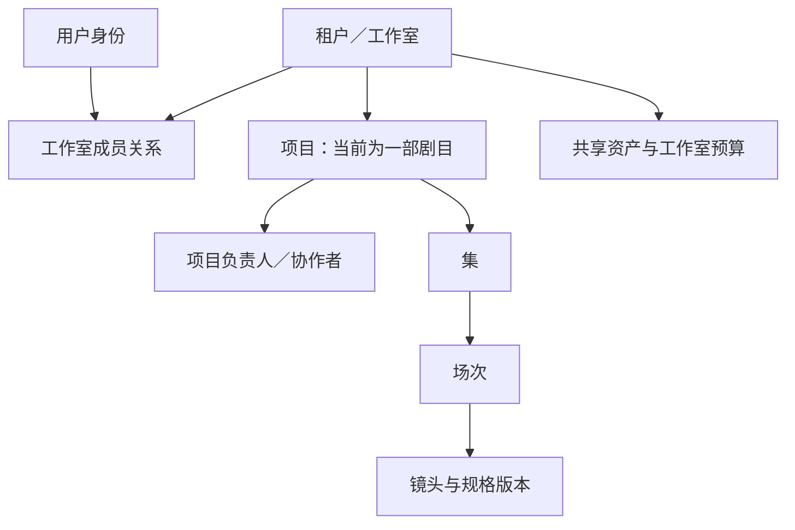

# AI 视频制作平台：短剧优先的完整设计方案 v1.3

当前状态（2026-09-10）：[核心工作区与导航已确认](design/approved-baseline-2026-09-10.md)，四项制作专项评审暂无异议、暂时收口；正式工程仍暂停。本轮文档维护仅同步已确认设计，不更改产品范围或 OpenAPI 版本。

2026-09-22 补记：核心创作区已按[核心创作区重建](design/creative-workspace-rebuild-libtv-2026-09-21.md)重写为创作台并合入 `main`（[85 分片记录](implementation/85-studio-rebuild.md)）。§6 与下表「主工作区」一行描述的场次制作页、「镜头制作／剪辑」视图切换、分镜／自由画布两模式与右侧助手侧栏是历史结构，不再描述现行界面；长期路线与领域原则不受影响。

日期：2026-09-09。状态：在原独立评审上合并后续场次主场景决策，经三种 AI 专业角色独立首评、综合裁决后的实施设计基线。本文统一产品定位、业务流程、MVP 和长期架构；详细行为、数据、事务、API 与验收由 [实施设计包 v1.3](implementation/README.md) 承接。本轮完成设计收口与 S0 工程准备；生产业务、真实模型效果和客户验收尚未通过。文件名保留 v1.1 以兼容既有链接，正文版本以此处 v1.3 为准。

## 1. 产品定位与当前选择

面向中小制作工作室，把剧本、角色与场景依据、生成结果、候选选择、声音剪辑、审阅返工和交付放在一个有共同版本记录的工作空间。团队规模不设 10 人上限；首版用简单内部权限覆盖常见分工，容量以实测为准。

核心价值假设是减少找素材、重复解释要求、确认版本和交接返工的人工，并控制生成费用与错误交付。生成能力由模型服务提供，工作台对制作事实、明确操作和可靠交接负责；不承诺输入一句话自动量产整剧。

| 已确定事项 | 本期设计 |
|---|---|
| 内容方向 | AI 写实短剧优先；首发测试收敛为现代双人对白与少量道具动作，普通话、竖屏 |
| 首批使用者 | 已有戏文与部分参考的内部团队；一位 AI 制作人员主责一场戏，其他成员按需协助，主创确认方向和结果 |
| 模型策略 | Seedance 等领先模型优先；首期贯通一条指定账号实测过的视频主路径，按样片需要补充图片／音频能力 |
| 主工作区 | 场次内切换镜头制作／剪辑，独立的版本入口进入审阅；主体已确定分镜／自由画布两模式，故事板是画面和说明的顺序视图 |
| 画布 | 已确认：分镜模式／自由画布均属于整个场次，第一版每场一张画布，组织多个镜头及共用参考；镜头／节点是当前编辑对象。两种模式自由切换，共用素材、任务、候选、剪辑和审阅。详见[场次画布交互](design/scene-canvas-interaction-v0.1.md) |
| 平台长期范围 | 同一平台支持短剧与广告两个业务工作台；画布底层通用，未来广告优先评估“画布＋助手”主创作空间，按营销人员与制作团队分别设计操作入口 |
| 当前排除 | 广告入口、外包权限、复杂 AI 重拆、专业 NLE、任意节点编排和全自动发布 |

本轮主界面选择属于用户授权下的设计裁决，不是目标用户已验证的结论。之后可改视图，不迁移或丢弃制作对象。

## 2. 首发任务与价值判据

第一条完整任务是：从已有剧本／分镜清单开始，把一个对白场次制作到可审稿，完成指定返工，再交付平台成片或可供内部后期接手的素材包。

使用三种不同证据判断成熟度：

| 层次 | 任务 | 能证明什么 |
|---|---|---|
| 工程贯通 | F0 46 秒片段，导入或构造媒体即可；随后 F1 接续 34 秒、F2 三类返工、F3 真实内部后期交接 | 对象、版本、音画、交接及异常行为可执行 |
| 模型制作 | 指定真实账号、固定输入与预算，完成对白、人物、道具与跨镜接续 | 此服务路径在该条件下的质量、费用及恢复行为 |
| 工作室试点 | 默认招募 3 家，先完成场次再到连续两集及返工／后期交接；集长按实际任务确认 | 真实人工、费用、周期、交接正确性和采用价值 |

首期判断团队能否在工作台完成实际制作与交接；人工、费用和周期先观察，不设固定改善百分比门槛。效率对照研究安排在基础闭环可用之后。关键人物、道具、台词和版本错误不能用平均分抵消。失败和未决费用必须保留，不能只筛选成功任务。完整方法见 [12](implementation/12-mvp-workflows-and-pilot.md) 与 [13](implementation/13-production-quality-and-handoff.md)。

## 3. 组织、项目和简单权限

一个工作室对应一个租户数据边界；一个用户可以属于多个工作室。租户是服务端隔离、成员和费用归属，工作室是当前面向短剧的显示名称。项目承载一部剧目的制作管理，集与场次负责内容组织，不各自成为新租户。

| 角色 | 责任与权限 |
|---|---|
| Owner | 唯一工作室所有者，交接所有权、管理工作室与预算；不能直接删除唯一 Owner |
| Admin | 管理成员、模型连接、预算与共享发布，可履行项目管理职责 |
| Member | 访问被加入的项目及可用共享资产；不凭成员身份获得所有私有项目 |
| 项目负责人 | 管理项目参与者与人工任务、确认项目资产、正式审片和最终交付 |
| 项目协作者 | 编辑创作内容、试用资产草稿、按预算执行生成、采用候选、编辑草稿、评论、导出工作材料；不得自行批片或扩权 |

负责人／协作者是项目职责，不增加第二套工作室角色。场次主责复用轻任务，不是权限角色。镜头划分、镜头语言与日常试作由制作人员决定；正式剧情、台词及共同设定变化由主创确认，草稿试作可继续，确认事实单独留存。任务被分配给谁不改变权限。资产草稿可用于明确标记的试做，正式确认与共享发布由相应负责人／管理者承担。

长期按真实组织需求增加工作组、可配置角色和项目范围授权；外部 Guest 独立授权、到期与下载限制后置。结算关系和访问权限保持分离，未来多工作室统一结算不自动共享作品。

## 4. 制作对象与资产设计

领域词汇统一见 [CONTEXT.md](../CONTEXT.md)。业务必须区分以下事实：

| 对象 | 为什么存在 |
|---|---|
| 剧本修订与选区 | 保存实际创作文本，知道镜头来自哪一版哪一句 |
| 剧目设定 | 共同故事、人物、风格、声音与交付方向，作为制作默认依据 |
| 场次与镜头规格 | 场次描述连续戏剧行动；镜头描述叙事意图、构图动作、对白、时长及入口／出口状态 |
| 设定资产版本 | 固定角色、场景、道具、音色、风格和参考，支持复用而不改变旧制作依据 |
| 生成计划与作业 | 计划固定实际模型输入和费用估计；作业记录一次明确执行及结果、异常与费用 |
| 素材与候选 | 素材是不可变文件；候选是用来实现某镜头的一段连续源区间 |
| 采用决定 | 记录该镜头当前偏好，独立于候选生成及剪辑中真正使用的内容 |
| 编辑工作稿、剪辑草稿与固定版本 | 工作稿可保存未完成编辑；剪辑草稿为已校验确认的编排；固定版本保存实际画面、声音、字幕和源区间用于审阅 |
| 审阅和交付 | 评论、正式决定、实际文件与版本一致；新稿不继承旧批准 |

资产库分“项目资产”和“工作室共享资产”两个入口，底层共用资产和媒体服务。项目内日常制作先建立项目资产；显式发布共享时固定可见版本、允许共享的媒体与说明，隐藏私有剧本、作业和项目内部来源。项目引入共享版本后，来源更新不会自动替换它。

角色身份、并存造型和造型修改历史分开。例如林夏的灰风衣与针织衫是两种造型，修改风衣颜色是该造型的新版本。声音身份默认属于角色，换衣服不自动换音色。场次与本镜另外说明情绪、知情程度、道具位置和持有关系，不能把剧情变化写成角色永久设定。

素材保存可读名称、标签、类型、原文件信息、来源说明和实际使用位置。改名不改变字节与旧清单；原片、代理、海报状态分别可见。发布共享、删除／归档和恢复均检查既有依赖，不让一人清理素材破坏已审版本。

## 5. 从剧本到候选的主流程

1. 新建项目，明确负责人、输出规格、参考样片与制作范围。粘贴／导入 UTF-8 剧本文本；已有分镜使用固定 CSV 模板，先预览再应用。
2. 人工录入和修改始终可用。AI 分镜建议与 CSV 导入提供可编辑新增提案，可直接追加到当前场次或明确新建结构，不覆盖同名对象。人工拆镜、合镜、移动保留原文区间及新旧镜头关联。
3. 准备角色、造型、场景、道具和声音参考，保存本镜入口与预期出口。例如“钥匙在桌上→林夏右手拿起”，生成成功不会自动将预期状态当作已发生事实。
4. 可用“准备本次提示”或“按意见准备修改”得到独立保存的创作建议，人工编辑后用于准备计划。选择一个镜头或模型能处理的一组镜头，打开生成计划。展示真实提示词、每份媒体的用途、固定版本、模型模式、计量项及总预占。
5. 用户确认执行后建立一个作业。重复点击或队列重投不重复购买；提交结果未知保留核对状态与费用风险，不自动重发。
6. 输出验收并归档后形成候选。一个视频可人工标注不同区间分别服务多个镜头；平台不猜切点。比较候选后明确采用。

参考解析按“剧目默认→场次→本镜→本次尝试”执行，并允许按角色与用途明确替换、追加或排除。只展开实际选中的造型，不把全部造型塞给模型；排除项重开计划时不会自动回流。计划固定最终输入，相关要求改变则重新准备，无关排序与改名不让所有计划失效。

领先模型可能支持多图、动作参考、原生声音、长片段或多镜头叙述，具体能力取决于实际服务模式与账号。工作台通过能力配置和 Adapter 映射这些差异，不把“镜头必须先生成一张首帧”写成所有模型的流程。官方核对及未确认项见 [模型证据](research/2026-09-07-implementation-model-evidence.md) 和 [接入规范](implementation/07-provider-adapter.md)。

## 6. 分镜工作台、故事板和画布

**原收口后的范围更新：** 用户已确认自由画布纳入第一版，每场一张，在镜头制作内部切换分镜模式／自由画布。节点自由摆放，镜头关联使用轻量标签与可选分组；选中后就地操作，从结果继续形成新尝试。最新以[场次画布交互设计](design/scene-canvas-interaction-v0.1.md)为准。下文 UX-01 继续验证操作收益与默认呈现，不再决定首版是否提供画布。本轮已在[18画布工程设计](implementation/18-canvas-workspace-contract.md)补齐数据、12个API、CAS、模式互通与AT-52–63；具体实现和生产验收仍待执行。

MVP 的核心场次制作页在场次标题旁提供“镜头制作／剪辑”两个编辑视图，右侧独立入口显示审阅稿版本与状态，进入完整审阅工作区。该导航关系于 2026-09-09 经用户确认：编辑面向当前制作内容，审阅面向指定固定稿，不表达必须顺序完成的工序。2026-09-10 核心体验已确认：分镜为当前镜头大预览、中央底部有界输入、底部分镜条；画布保留整场节点与探索分支。助手和持续资产浏览非模态停靠，进入制作后收起项目目录；见[核心体验 v0.3](design/scene-walkthrough-review-v0.3.md)。默认聚焦当前场次和待处理事项，历史结果折叠；不把全部项目素材铺满。

“分镜工作台”适合作为功能名称，因为它承载要求、生成、比较、采用和返工。“故事板”表示其中按顺序组织分镜画面与说明的视图，可用于预演构图与衔接，既不是最终视频，也不必是模型输入首帧。

画布本质上是一种空间组织和操作方式，可能降低多方案比较、参考关系和创意探索的认知成本，也可能增加定位、连线、缩放、误执行和交接成本。首版已经确定引入，后续根据具体任务的净收益优化默认呈现、定位和辅助工具，不重开是否提供画布的范围选择。

UX-01 后续用同一资料和制作能力对比结构化工作区与限定范围画布，观察：找到正确参考、比较角色造型、组合场次方案、定位返工上下游的时间、出错和学习负担。优先测试场次局部任务，不直接建设全项目无限图。画布坐标与节点连接不成为制作身份、权限或付费执行依据。

## 7. 声音、轻量剪辑和返工

声音与视频可以由同一模型一起生成，也可以由独立录音、配音、音乐或环境声提供。轻量剪辑负责决定最终听见和看见哪些内容、从哪里开始结束，以及怎样衔接；它不等同于发起视频生成。

首版支持一条顺序主视频轨、明确音频层和字幕轨，进行重排、裁切、增益／静音、字幕编辑和冻结预览。视频原生音轨默认保留；若它混有对白和音乐，静音会影响整条混合轨，平台不承诺只去除人声。可将视频的完整嵌入音轨作为独立音频片段，用于跨反应镜头的对白衔接，但不能冒称获得净对白。

台词条目关联固定镜头规格；实际使用的声音和字幕另外关联到片段或源媒体区间。因此只改一个台词字、时长没变，也能提示相关音轨和字幕待核对。语义准确、说话人和口型仍需要人判断。

替换指定剪辑片段时有两种明确操作：

| 操作 | 规则 |
|---|---|
| 保持片段时长 | 选足够长的新源区间，保留原时间槽；不足则要求调整，不自动补帧、变速或循环 |
| 改变片段时长并顺延主视频 | 预览新的接点和总长度；受影响声音、字幕与台词绑定逐项明确保留、移动、替换或删除，再保存 |

一个镜头可以在实际剪辑中出现多次、使用多个候选的不连续区间；当前采用偏好不覆盖这些实际使用。新候选、新采用都不自动更新任何草稿。

未完成工作先可靠保存；准备审片时将裁切归一为精确帧／采样坐标，展示变化并确认应用。工作稿和可渲染编排分别保存，具体协议见[21](implementation/21-technical-baseline-closure.md)。固定审稿、渲染、SRT 和评论定位共用这份坐标；多次只改字幕不应逐次损失画面帧。复杂合成、调色、变速、自动口型修复和 NLE 工程往返后置。

## 8. 审片粒度与返工记录

审片目标是具体候选，或某份已验收的场次／整集固定视频版本。候选主要看表演、人物、动作与局部声音；场次看连续性、对话接点、空间和因果；整集再看节奏、情节、声画、字幕与交付完整性。单镜通过不能自动推导整集通过。

意见保存观看对象、版本和局部时间码。平台剪辑可映射已知源片段；外部 MP4 的时间线来源未知时保持未知。负责人从意见建立返工任务，处理人员提交实际新候选、新片段或新外部版本，以及保留原方案的理由。

新审阅列出相关旧意见及本次处理结果；任务完成、评论解决和正式批准是三种不同事实。最终批准前完整播放实际整集；关键剧情、身份、道具、台词错误阻止通过，非关键例外由负责人说明。新一轮审阅与最终交付建立使用同一对象锁，避免并发借用过期批准。

## 9. 交付与内部后期交接

| 路径 | 前提和固定内容 | 用途 |
|---|---|---|
| 原素材工作包 | 已有明确采用即可；完整原片、采用源区间、镜头表、已知声音／字幕关系、版本清单；无需 cut 或渲染 | 交给已有后期流程继续制作 |
| 剪辑工作包 | 固定剪辑版本，附已知时间线、实际可用预览、原素材和字幕；缺预览明确列出 | 审稿、精剪接手与过程备份 |
| 最终交付 | 该整集／外部版本已正式批准，实际成片与对应字幕就绪 | 固定交付本次确认结果 |

素材包内按实际字节去重，提供安全文件名与可读标签映射。多次使用同一原片保留多行源区间说明，不复制多份文件或多算作业费用。无时间线时清楚写明“仅制作规划和采用”，不制造空时间线或假审片记录。

外部后期回传 MP4 可附 SRT，两者固定成同一外部版本组合；后补或修改字幕形成新版本。未知逐镜来源、工程重建性如实保留；首版用实际人工交接验证，不承诺一键工程往返。外部工作可由团队内部现有后期人员完成，不因此引入 Guest 权限。

## 10. 技术架构与可靠性

首版采用模块化服务、独立任务 Worker 和隔离媒体 Worker。默认 TypeScript／React／Vite、Node／Fastify、PostgreSQL、私有对象存储与 FFmpeg，具体受维护版本在 S0 锁定。通用 UI 已确认采用 Mantine，表单和多面板优先复用其 Form／Splitter；核心创作工作区自主设计，集中主题与业务模型独立于组件，视觉沿用已确认的中性浅色／深色、媒体优先主题基线，细节继续打磨。主应用已完成[本地 Mantine 视觉样板](design/mantine-visual-sample-v0.2.md)的主题和核心制作页接入，其余页面及真实业务逐步迁移；React Flow、Media Chrome、dnd-kit、Query以及按需Virtual已按[17](implementation/17-frontend-component-selection.md)完成选型和隔离验证，主应用随业务切片接入。模型服务由 Adapter 隔离，媒体处理不放在请求长事务中。架构和选型证据见 [05](implementation/05-architecture-and-operations.md)。

| 模块 | 必须守住的边界 |
|---|---|
| 身份与访问 | 租户／项目可信范围、简单角色、撤权、会话与邀请 |
| 短剧规划 | 剧本、集场镜、角色造型、剧情状态与台词来源 |
| 资产与媒体 | 固定版本、共享引入、不可变字节、检索、派生及来源依赖 |
| 生成与预算 | 固定计划、一次执行、连接账号版本、未知状态、费用预占和核账 |
| 编辑 | 实际素材使用、精确边界、草稿 CAS、固定渲染与外部稿 |
| 审阅交付 | 固定目标评论、正式决定、返工结果与交付清单 |
| 运行支持 | 成熟队列适配、事件outbox、隔离、监控、有限恢复历史与备份恢复 |

PostgreSQL 作为业务与任务事实源，通过事务、唯一约束、固定锁顺序、事务内入队和事件outbox保持内部一致。跨供应商请求不可能通过本地事务保证绝对一次；提交超时先核对原任务。旧 Worker 的迟到回执可追加证据，但不能越过业务版本／attempt及恢复代次修改作业。恢复备份后隔离旧进程和全部旧未终局任务，核清外部消费再逐连接放行。

媒体上传与生成输出均先验收固定字节，再进入服务端独占的不可变存储。代理失败不代表原片丢失；恢复代理／归档／渲染不会再次购买模型生成。冻结版本固定媒体依赖和渲染构建，升级不能覆盖已审结果。

## 11. 成本与经营边界

MVP 提供内部费用预算与核账，不把供应商成本账直接变成用户支付系统。初始试点采用工作室提供的已授权模型账号；实际账号、地区、条款和测试预算进入 G-02／G-03，设计文件不授权付费调用或采购。

项目作业同时受工作室和项目预算约束，共享资产作业只占工作室预算。同一笔消费不能把两层汇总再相加。费用分为已确认金额、剩余预占及是否最终结清；部分费用到账不代表可以释放全部预占，取消或失败也不意味着免费。

例如预占 8 元，先确认 3 元，则已确认 3、剩余 5；完整账单为 8 时只补记 5。没有最终证据且原预占耗尽时，暂停相关连接新提交并核对风险，不能把未知写成 0 放行。同账号多连接共用费用身份；恢复时暂时找不到作业的真实账单也必须记入工作室核对范围。

试点另记录准备素材、模型等待、制作与后期主动人工、外部软件、存储／转码／下载等成本。已确认现金、未决风险、一次性准备和第二集增量分别报告；详见 [13](implementation/13-production-quality-and-handoff.md)。

## 12. 实施顺序与后续迭代

| 阶段 | 可交付结果 | 进入后续的证据 |
|---|---|---|
| S0 工程准备 | 锁定工程版本、迁移与契约、模拟 Adapter、媒体夹具、账号准备、试点基线采集 | 本地运行与检查方法可复现，关键事实缺口有负责人 |
| S1 导入素材贯通 | 登录／项目、文本与 CSV、资产、导入候选、归一剪辑、固定审阅、两种工作包及批准交付 | F0 无需真实模型也能由界面完成，无工程代改数据库 |
| S2 真实生成 | 一条经账号验证的主路径，实际输入、费用、未知提交和归档恢复 | MV-01–10 的适用项有真实证据；不支持项有明确限制 |
| S3 完整制作闭环 | F0/F1 两集、F2 指定返工、F3 内部后期交接，任务与共享能力 | 跨集连续性、音画、源区间和版本交接通过 |
| S4 试点与上线 | 目标工作室实际工作流任务、恢复演练、容量、观测和运维 | 关键行为与真实制作通过，用户结果支持继续投入 |

各阶段详细任务、依赖与 AT-01–75 见 [08](implementation/08-verification-and-delivery-plan.md)。排期必须依据实际研发配置和接入条件估算，不用虚构固定人周替代拆解。

后续按证据驱动安排重要迭代：

- 制作效率：常用配方、批量操作、更复杂 AI 修订提案、连续性检查辅助，前提是明确节省哪些人工。
- 专业后期：更强声音处理、转写／口型路径、字幕及工程交接，先看首批用户实际后期成本。
- 画布 UX-01：首版已纳入场次内双模式；验证交互、默认呈现及实际收益，任意可编程节点流程继续后置。
- 广告独立里程碑：用户已认可优先评估“画布＋助手”作为主要创作空间。营销人员从目标、Brief 和商品／课程材料进入，由助手组织可观看、可修改的方案；制作团队可直接在画布组织素材、创意分支和版本。节点／连线默认展示程度分别验证。品牌审核、卖点与证据、创意变体和多尺寸交付由广告业务设计承接。
- 组织扩展：工作组、范围角色、外部 Guest、多个工作室统一结算和企业治理，在真实客户需求出现后演进。

广告可复用通用画布、媒体、版本、生成执行、费用和编辑运行能力。当前“每场一张画布”是短剧业务规则，画布底层不依赖集场镜，未来广告任务可直接使用。当前 Take／Selection 仍是短剧镜头语义，广告立项时须定义自己的制作目标和审批策略，再提炼公共关联。不能宣称现有全部接口已经通用，也不要求广告创建虚假的集场镜。已确认方向及当前实施边界见[场次画布设计第 9 节](design/scene-canvas-interaction-v0.1.md#9-已确认通用画布与广告演进方向)。

## 13. 评审、实施入口与事实缺口

本轮保留三个独立首评及逐项裁决记录，共 29 条：技术 10、产品 10、短剧制作 9。评审包含 8 项 P0、20 项 P1、1 项 P2。采用建议同时收敛范围，关键补充是实际输入、声音与台词绑定、长度替换、无剪辑素材交接、费用完整性和精确渲染边界。

二次复核继续发现并修订了 CSV 无剧本起步、无时间线声音关系、外部返工成果身份、费用跨连接去重、交付媒体依赖及帧边界重复取整等接口间问题。完整追踪见 [评审与裁决](reviews/2026-09-07/README.md)。

下一阶段可以直接开始 S0/S1。真实模型账号与预算、运行基础设施、真实素材使用依据、实际容量及工作室样本仍需在相应阶段落实；它们已有负责人角色、验证动作和门槛，不阻止可逆工程准备，也不被伪造为已通过。正式字段、验收、模板和复现检查入口统一在 [实施设计包](implementation/README.md)。

## 14. 本轮剩余设计完成记录

已统一画布首版范围，完成通用画布与短剧绑定、整文档CAS、输入快照／执行偏序、结果身份与恢复、12个API及新增验收；专业组件经独立研究与隔离样例完成裁决。范围与实施状态见[19](implementation/19-design-closure-and-implementation-entry.md)。实际账号、预算、部署与试点仍按[20](implementation/20-external-validation-and-launch-plan.md)执行；不将设计完成等同真实业务、客户或上线验收。
