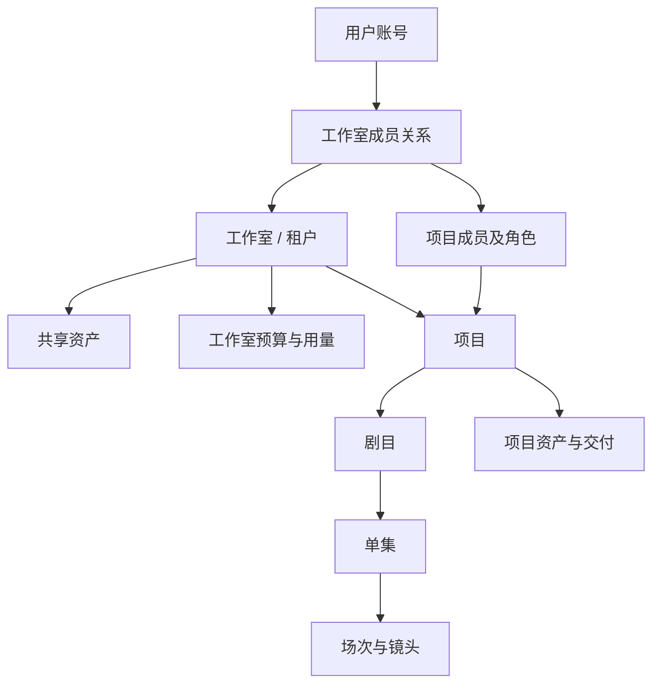

# AI 短剧工作台：租户、工作室与项目架构 v0.1

> 历史讨论／背景材料（2026-09-10 标注）：保留组织治理与长期扩展的推导，当前授权和数据规则见实施包 01／03／06。本文原日期与正文记录当时判断，不再决定当前范围或待办；以[当前完整方案](ai-drama-workbench-product-design-v1.1.md)、[实施包](implementation/README.md)及[设计确认记录](design/approved-baseline-2026-09-10.md)为准。

本文是 [产品当前完整方案](ai-drama-workbench-product-design-v1.1.md) 的管理架构细化；整体范围、优先级与待决策事项以整合稿为主。

日期：2026-09-07。状态：管理架构讨论稿，补充核心设计 v0.2。目标仍是中小工作室，不限定 10 人；优先 AI 写实与 Seedance 等第一梯队模型。以下组织、权限和部署安排是设计建议，未实现或测试，也不表示已确定 SaaS 合同或部署形态。

最新已确认范围：初版只考虑工作室内部协作，暂不建设外包参与能力；权限管理保持简单，长期支持升级与扩展。下文的具体角色映射是据此收敛后的建议，替代此前 MVP 的 Guest、独立审阅/查看角色及逐人能力开关。

## 1. 推荐结论

现阶段采用 **一个工作室对应一个租户，工作室下有多个项目**。租户是独立的数据归属与治理范围，工作室是当前产品里的业务名称。前台不要求用户分别创建租户和工作室，后台也不建立两个始终一一对应、生命周期重复的主实体。

项目管理成员、制作预算、状态和交付；剧目承载故事内容。当前一个短剧项目承载一部剧目，一次「新建剧目」同时建立管理记录与内容记录，用户只看到一张项目/剧目卡片。

长期复用方向已明确：整体将支持广告与短剧，当前优先短剧。租户与项目管理可以复用，剧目及其层级仅属于短剧业务；未来广告项目不需要创建剧目或第一集。当前不增加广告组织层、外部身份或空置业务表单，详见 [短剧优先与公共模块方案](ai-video-platform-mvp-plan-v0.2.md)。

| 概念 | 职责 | 当前实现取向 |
|---|---|---|
| 用户账号 | 识别使用者，可加入多个工作室 | 身份独立于工作室；角色存在于每段成员关系中 |
| 租户 / 工作室 | 数据归属、成员治理、共享资产、用量与工作室预算 | 一个主实体，用户界面称工作室 |
| 项目 | 明确制作目标、成员、预算、进度及交付 | 工作室内的管理范围；默认按项目授权 |
| 剧目 | 剧本、设定、单集、场次和镜头 | 当前与短剧项目一一对应的内容主体 |
| 项目组 | 实际参与某项目的人 | 从项目成员及职责形成，MVP 不额外要求创建一层组织 |
| 工作组 | 如美术组、声音组，方便批量分工和授权 | 后续按跨项目协作需求增加，不拥有项目 |
| 结算账户 | 由谁付款、费用如何汇总结算 | 当前按工作室结算；长期可显式汇总多个租户 |

项目不等于单集或一次生成；工作组不等于租户；一个自然人也不等于一个租户。客户名称、公司邮件域名或收款主体相同，不自动合并数据。

## 2. 当前关系与用户体验

一个账号可以有多段工作室成员关系。例如一个主创可以同时是工作室 A 和 B 的内部成员，在两个工作室分别获得项目授权；A 的角色、额度和模型连接不会带到 B。当前邀请用于加入内部团队，不提供只加入某项目的外部身份或外包入口。

产品左上提供工作室切换；进入工作室后展示有权访问的剧目及资产。管理入口包括工作室成员、模型连接、预算用量和设置；项目入口包括项目成员、负责人、项目预算、制作任务及归档。普通创作者主要停留在剧目创作页，无需理解租户术语。

用户在前台切换工作室，不改变已经提交的后台任务归属。任务通知、下载和费用仍关联提交时的工作室与项目。

## 3. 数据、资产和责任归属

| 内容 | 归属与管理范围 |
|---|---|
| 账号与登录身份 | 账号自身；删除一段工作室成员关系不删除其他工作室身份 |
| 成员、工作室设置与共享资产 | 租户；共享资产按发布和使用授权复用 |
| 剧本、镜头、制作素材、审片、交付 | 租户下的具体项目；创建者作为记录信息，不是退出后带走数据的所有权依据 |
| 模型连接与凭据 | 按平台或租户连接登记并限定使用范围；项目使用已获授权的连接，不保存成员个人明文密钥 |
| 生成与处理任务 | 固定租户、项目或工作室共享范围、操作者、输入及计费归属 |
| 预算与费用 | 工作室总账下按项目或公共制作成本归因，保留每次真实消费 |

「资产属于工作室」在本方案中描述平台内的数据保管和管理归属，不替代客户合同中的知识产权约定。

工作室共享资产、剧目资产和创作侧栏仍沿用 [资产库设计](ai-drama-workbench-assets-v0.1.md)。同租户并不等于所有项目互通：共享发布只包含选定内容，不能附带原项目的剧本、其他候选或访问权限。

工作室级资产制作可以没有项目，但必须明确标记为工作室共享范围及公共制作成本；不能把空 project_id 当作所有人可见或费用无人承担。项目级资源必须归属该租户内的项目。

## 4. 初版权限：内部成员、固定角色、按项目参与

### 工作室层

| 角色 | 默认职责 |
|---|---|
| 所有者 Owner | 拥有管理员全部能力；唯一所有者，另外负责所有权转移、任免管理员、工作室解散及结算资料管理 |
| 管理员 Admin | 管理普通成员、全部项目、工作室共享库、模型连接及工作室/项目预算；不能任免管理员、升级自己或操作所有者专属事项 |
| 成员 Member | 读取和引入工作室共享内容，参与被加入的项目；不能管理工作室或自行扩大消费额度 |

为减少初版授权配置，Owner/Admin 明确拥有全部项目的负责人能力，无需逐项加入；普通成员按项目参与。项目隔离面向未加入项目的普通成员，不承诺向 Owner/Admin 隐藏内容。这一规则取代此前“Admin 管成员但需单独授权才能读项目”的建议，需在任命管理员时明确显示其范围。

初版不提供 Guest、外部邀请、客户审片链接或外包门户。工作室成员页只处理内部成员的邀请、角色、停用与移除，不要求选择成员类型。

### 项目层

| 角色 | 制作职责 |
|---|---|
| 项目负责人 | 管理本项目参与者、分工、内容和归档；可以制作、生成、下载，作出正式审片决定及交付确认；不能追加预算或授予工作室管理权 |
| 协作者 | 编辑本项目的剧本、设定、分镜、素材和剪辑；在预算内生成、下载、评论和提交审阅；不能管理项目成员或确认最终交付 |

Owner/Admin 创建项目并指定负责人；负责人从现有工作室成员中添加协作者。负责人角色由 Owner/Admin 任免，移除或停用负责人时同时完成交接。负责人可以兼任主创与审片，正式决定始终绑定具体产物版本；其他成员可以承担审看任务、留下反馈，但不因此获得批准权限。

MVP 不开放自定义角色、独立审阅者/查看者、逐人生成/下载开关、镜头级权限或审批流程配置。生成、下载与交付确认按固定角色映射；控制生成支出使用工作室/项目预算和单批次上限，不额外建设个人额度体系。内部审片仍是制作流程的一部分。

服务端仍先检查有效成员关系、项目范围和角色对应的操作能力；付费操作再检查可用连接、套餐能力、预算及并发额度。项目协作者角色默认包含本项目生成能力，但不允许在其他项目或工作室公共范围消费。任务负责人用于分工，不额外授予权限，也不限制成员只能看分配给自己的镜头。

共享库对有效内部成员开放读取和引入，Owner/Admin 负责共享发布、修订和公共资产制作。项目成员可以维护本项目资产；初版不另设资产管理员角色。共享发布仍只包含明确选择的条目，不公开整个来源项目。

工作室邀请接受后才建立有效访问；Owner 可以邀请管理员或普通成员，Admin 只能邀请普通成员，所有者身份仅通过明确交接转移。加入工作室不会自动成为所有项目协作者；不能凭同名公司或邮箱域自动加入。

### 长期扩展的连接点

业务模块使用统一的“某成员能否对某对象执行某动作”检查入口，首版由固定角色映射实现。不让页面、生成 worker 或资产模块各自复制角色判断，也不预建通用策略引擎。

后续先按内部需求增加只读/审阅角色、工作组批量授权或独立资产维护职责。工作组是人员集合，不拥有项目；组权限与直接授权分别保留来源，停用工作室成员仍阻止该工作室下全部访问。若需要只管成员、不读内容的管理职责，新增受限管理角色并显式分配，不静默改变现有 Admin 的权限。

长期有实际外部协作需求时，再增加 Guest 成员类型、授权范围、有效期和客户/外包入口。迁移时现有成员明确归为内部成员，新 Guest 默认无权限，不继承内部共享库或项目角色默认值；先增加范围授权，再开放外部入口。成员类型和范围授权的表结构届时迁移，不要求 MVP 提前实现空置的 Guest 子系统。

## 5. 费用、预算和模型连接

当前按工作室承担消费责任，项目分配制作额度，生成记录保留操作者。共享资产制作进入工作室公共制作成本。以后可以做成本分摊报表，但不重新记一次供应商消费。

| 概念 | 含义 |
|---|---|
| 套餐权益 | 工作室可以使用哪些功能、席位或容量；人数套餐不改变租户模型 |
| 预算上限 | 工作室、项目或单次批量操作允许承担多少消费 |
| 预占额度 | 已同意执行、尚未完成费用核对的在途占用 |
| 实际费用 | 依据供应商用量或账单确认的消费；未知项单独展示 |
| 结算 | 平台如何收取工作室费用，与项目授权分开 |

同一次消费可以同时受工作室和项目预算约束，但只入账一次。提交任务与预算预占一致完成；并发生成不能各自看到同一份可用余额而突破总额。费用未知或外部提交结果不明时保留待核对，不通过重放请求猜测结果。

平台代付与工作室自带模型连接可以是不同商业接入方式。首版先跑通选定方式，不承诺同时支持所有采购模式；每个任务固定实际供应商账户/连接、版本、计费主体及用量依据。替换默认模型或连接不改变旧任务的查询和费用归属。

密钥由服务端凭据模块保存，普通成员不需要读取密钥才能生成；管理连接的授权与使用连接的授权分开。未来允许项目专属连接时，仍保存所属租户、允许项目和消费责任，不以某成员是否仍在职决定能否找回历史作业。

长期一个结算账户可以承担多个工作室费用。统一账单不会自动合并预算池、授予资产访问或允许工作室相互消费额度；这些若需要，应分别形成明确能力。

## 6. 现阶段技术实现

保留模块化单体业务应用、独立生成/媒体 worker、共享 PostgreSQL 和私有对象存储。一个租户是逻辑隔离范围，现阶段不要求一个工作室一套数据库或服务器。

### 最小数据关系

| 对象 | 关键关系或约束 |
|---|---|
| tenants | 工作室主实体；稳定 tenant_id、名称、状态与所有者治理信息；不再复制一套同义 workspace 主实体 |
| users / tenant_memberships | 账号与租户多对多；初版只记录内部角色与邀请/有效/停用状态，成员类型可后续迁移加入 |
| projects / project_memberships | 项目属于单一租户；直接项目成员关联同租户有效成员关系及固定项目角色；Owner/Admin 的全项目能力统一计算，不批量复制隐式成员记录 |
| drama_productions | 当前每个短剧项目一个内容主体，单集及场次沿其关联；一次创建完成项目与剧目记录 |
| assets / media / references | 租户归属必需；区分工作室共享与项目范围，复用有明确版本和授权 |
| jobs / usage / reservations | 固定租户、项目或公共范围、操作者、实际连接、输入及费用关系 |

这些是逻辑记录划分，不是要求拆成独立服务。项目管理模块处理身份和范围，内容模块处理剧目结构；不要为一种已知内容类型构建任意项目模板引擎。

### 隔离必须覆盖完整链路

- 请求由服务端确认用户与租户关系，不能把客户端传入的 tenant_id 当成授权结果；读取具体对象时继续检查项目和操作权限。
- 租户资源记录明确 tenant_id；关键父子关系用包含 tenant_id 的复合约束或等效数据库约束防止跨租户关联。项目级对象还验证项目链路，共享资产引用走专门的已授权关系。
- 应用授权与数据库 RLS 配合；正常 API/worker 使用受策略约束的数据库角色，迁移和运维角色分开。租户过滤不能替代项目权限。
- 租户上下文在本次事务与绑定连接内建立，无可信上下文默认拒绝；不能依赖连接池上一次请求遗留的会话变量。后台任务从可信作业记录恢复范围。
- 私有媒体、缩略图、导出、缓存、搜索索引和日志查询都带访问范围。存储路径中有租户名不等于鉴权，签发读取地址前仍需校验授权。
- 队列按租户/项目公平调度，同时遵守实际供应商账户的总限制；个人数较多或一个大批次不会自动获得全部并发资源。
- 供应商回调映射到平台已保存的作业和连接，在可鉴别来源后处理；若回调缺乏可靠鉴别，只作为触发信号，由已记录的连接查询确认状态和费用。不能凭回调中的工作室字段选择数据范围，重复回调或结果查询只更新既有记录。

PostgreSQL 官方说明表所有者、超级用户等存在 RLS 绕过路径；事务与会话设置也有不同生命周期。因此实现后必须在真实运行角色和连接池模式下验证。技术事实与本项目推论详见 [租户隔离核查](research/2026-09-07-tenant-isolation.md)，不是已经完成的安全保证。

### 平台运营与租户管理分开

平台后台用于开通、容量、账单和运行问题处理，不给普通运营账号默认读取所有客户剧本的入口。需要客户内容的支持访问应有明确授权、范围和审计；平台运维身份不能直接作为工作室 Owner 混入日常成员体系。

## 7. 成员退出、项目归档与恢复

| 事件 | 推荐行为 |
|---|---|
| 成员退出/停用 | 阻止新的访问和付费操作，保留其制作贡献、审阅及费用归因；未完成制作任务可转交 |
| 退出者的排队作业 | 尚未提交供应商的任务在执行前重查权限，暂停待转交或释放未消费预占 |
| 已提交供应商的作业 | 按实际可取消性处理，继续查询、入库和结算到原租户；退出者不因此获得结果访问权 |
| 交接所有者 | 先确认有效接任者，不能留下没有所有者的工作室；管理员不能自行接管所有权 |
| 项目归档 | 用户只读，阻止新制作提交；既有任务允许系统完成归档和费用核对，历史交付保留 |
| 工作室停用/订阅变化 | 明确限制新的收费执行，按约定保留读取/导出和数据；合同状态不直接等同物理删除 |

撤权时不再签发新的下载能力；已签发的短时链接存在有效期窗口，不能宣称所有已导出的文件可以远程收回。需要更强即时撤权时增加受控下载路径。

MVP 应做恢复演练，并明确共享库中单租户恢复的方式和时间。恢复内容时核对素材引用、作业状态和供应商已发生费用，不倒退真实财务记录或自动重放生成请求。

## 8. 现阶段到长期的演进

| 阶段 | 业务触发 | 增加的能力 | 继续保持的关系 |
|---|---|---|---|
| MVP | 多个种子工作室完成真实短剧制作 | 工作室=租户；多项目；仅内部成员；固定工作室/项目角色；共享与项目资产；预算预占；基础审计、恢复和公平队列 | 稳定租户归属；用户可跨租户；项目与制作内容分开管理 |
| V1：内部团队分工 | 同一工作室多项目并行、批量管理和内部审阅需求增加 | 按需工作组批量授权、只读/审阅角色、资产维护职责、项目模板、负载与成本报表、权限来源与交接 | 工作组不变成租户，负责人变化不转移作品归属 |
| V2：规模与容量 | 特定租户的存储、生成负载、导出量或恢复要求明显不同 | 按需多个部署单元、队列分区或独享数据库/存储；扩充授权策略与审计查询 | 逻辑租户 ID 不随部署变化，项目角色和资产引用仍有效 |
| 长期外部协作 | 出现持续的客户审片、自由职业者或外包参与需求 | Guest 类型、受限范围与有效期、客户审片入口及外包交付能力；按实际范围逐步交付 | 默认不授予内部共享库访问；现有内部成员与项目授权保持明确 |
| 长期企业能力 | 多个独立工作室统一采购，或确有企业治理需求 | 多租户统一结算、明确授权的汇总报表、SSO/SCIM、企业策略；按订单需要专属部署 | 同一付款主体不自动获得所有数据访问权；跨租户共享仍须明确授权 |

阶段按真实需求触发，不按 10 人、50 人等固定人数切割。部分企业能力可因付费客户需求提前，但不将整个管理后台作为写实制作 MVP 的前置工程。

### 企业下面有多个工作室时

先区分组织分工与独立经营。如果只是同一个客户空间里的美术组、制作组或项目团队，用工作组及项目授权即可；不需要增加租户或独立数据库。

如果几个工作室有独立成员治理、资产范围、预算和退出/迁移需求，各自保留租户，增加显式的企业关联、结算及报表授权。一个管理者可以被授予多个租户角色，但不能因其是共同付款人而默认读取所有作品。

若后续客户明确需要“统一租户治理与共享资产，下设多个独立工作区”，再引入租户内的工作区/制作单元。届时新增子范围并将原项目和共享库归入默认工作区，tenant_id 仍代表原客户空间；不提前让全部 SME 用户承担这层导航、预算与资产继承规则。

### 部署演进及迁移

租户身份与部署位置分开。MVP 所有租户可使用同一默认部署，不先建设动态调度控制平台；开始分片或独享部署时，增加从 tenant_id 到数据库、存储和 worker 部署的映射。按真实吞吐、恢复、地域和合同需求迁移，不用数据库名称替代租户身份。

迁移某租户先暂停新增付费提交，核对并处理在途/结果不明任务，准备媒体复制和元数据迁移，验证权限、引用和费用总数后切换路由。旧环境保留回滚所需资料并处理迟到回调；切换必须防止双环境重复执行。具体停写窗口和回滚方案需实测，不承诺默认无停机。

把现有数据放入另一家公司属于业务归属转移，不能用普通搬库或修改 tenant_id 代替。合并/拆分租户涉及成员、引用、共享、费用和历史授权，后续需要专门的导出/导入或转移流程。

## 9. 本轮对旧方案的修订

1. 明确工作室与租户当前为同一主实体，不让用户操作一套重复层级。
2. 明确项目管理与剧目内容一一对应；当前仍保留「剧目」创作入口，不要求重复创建。
3. 按最新范围取消 MVP 外包参与、Guest 入口、独立审阅/查看角色及逐人能力开关；内部成员按少量固定角色协作，预算独立约束生成消费。
4. 为简化管理，建议 Owner/Admin 都具备全部项目的负责人能力，普通成员按项目参与；后续需要受限管理者时新增角色，不改变现有角色含义。
5. 补齐共享资产制作的公共费用范围、成员退出后的作业归属和权限重查。
6. 企业统一采购优先增加结算关系；物理隔离按运行需要演进，二者不改变现有数据归属。

## 10. 实施前的验收情境

- 同一账号在 A 为管理员、在 B 为普通内部成员，切换空间后不能继承 A 的预算和权限。
- 同工作室普通成员没有项目授权时不能读取该项目；Owner/Admin 的全项目能力分别验证。
- 项目协作者可以在预算内生成和下载、提交审阅，但不能管理成员、提高预算或作出正式审片及交付确认；审看任务的指派不提升权限。
- Admin 不能提升自己、任免其他管理员或操作所有者专属事项；移除项目负责人需交接，停用成员后显式与隐式权限均失效。
- 两人同时提交生成不会穿透项目/工作室预算，同一笔消费只入账一次。
- 角色、媒体、作业和交付不能错误关联另一租户；共享素材仅按明确引入关系可见。
- 成员离开、项目归档、链接过期和已在途生成按照上述规则一致运行。
- 实际 API/worker 数据库角色、连接复用、后台导出与供应商回调均验证范围隔离。
- 单租户恢复或迁移不改其他租户数据、不重放付费任务，历史交付素材仍能定位。

本文是可实施的设计依据与待验证行为，尚无产品代码或运行测试。形成实施计划时再根据团队技术栈与部署条件细化数据库策略、迁移步骤和容量指标。
