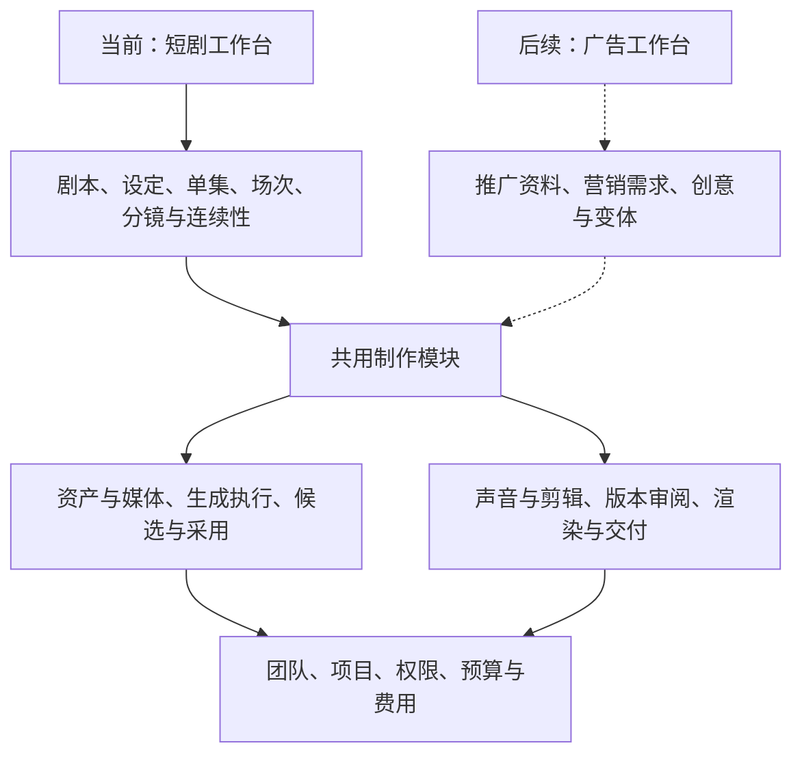

# 整体产品与短剧优先 MVP 方案 v0.2

> 历史讨论／背景材料（2026-09-10 标注）：短剧优先与共享底层方向仍有效，具体 MVP 范围和画布决定已有后续修订。本文原日期与正文记录当时判断，不再决定当前范围或待办；以[当前完整方案](ai-drama-workbench-product-design-v1.1.md)、[实施包](implementation/README.md)及[设计确认记录](design/approved-baseline-2026-09-10.md)为准。

日期：2026-09-07。状态：用户已确认长期支持短剧与广告，希望尽可能复用底层核心能力，当前优先短剧场景设计。该方向替代 v0.1 将两种场景均交付作为首个整体 MVP 完成条件的建议。下文模块划分与验收方式是据此形成的设计建议，尚未实现、试作或冻结研发排期。

完整方案复核结果见 [2026-09-07 review](ai-video-platform-review-2026-09-07.md)。当前优先补齐短剧主操作路径、首版深度、交付标准及候选／剪辑／审片同步；已同步到 [短剧主稿](ai-drama-workbench-product-design-v1.1.md)，实际模型和样片验收仍待完成。

## 1. 已确认的设计基线

整体产品长期面向短剧与广告视频制作；当前围绕 AI 写实短剧工作室设计、实现和验证第一条完整生产流程。广告保留为后续业务扩展，其业务界面、试点完成与上线不构成短剧 MVP 的前置条件。

短剧继续面向中小工作室内部团队，不设 10 人上限；优先评估 Seedance 等领先模型；初期保持简单权限，外部协作后续按实际需求扩展。

广告方向已有客户假设继续保留：商家／教育机构营销人员为预期主用户，广告内容工厂为后续专业用户候选。当前只用代表性广告任务检查公共模块是否被短剧概念限制，不要求同时制作完整广告原型、接入商品目录或实现广告流程。

## 2. 产品结构与模块关系

短剧与广告业务模块分别表达自己的内容与规则，通过公共模块接口完成制作。公共模块不依赖某一业务模块来查询剧本、理解场次或判断商品卖点。

接口不仅规定输入输出，也包含权限范围、输入版本、失败处理和费用规则。先采用模块化单体及必要的生成／媒体后台进程；模块分开不要求立即拆部署或微服务。

## 3. 当前实现与未来复用

| 模块 | 当前为短剧实现 | 广告可复用 | 业务模块仍负责 |
|---|---|---|---|
| 团队与项目 | 成员、固定角色、项目范围、预算 | 同一套客户空间、参与及消费规则 | 短剧内容主体与广告内容主体各自组织 |
| 资产与媒体 | 上传、预览、版本、检索、授权引用、生成结果登记 | 图片／视频／声音的管理与引用机制 | 角色身份和剧情状态；商品／课程事实与品牌要求 |
| 生成执行 | 校验实际输入、预估与预占、提交、查询、入库、恢复、费用核对 | 同一套正式模型调用与作业机制 | 从剧本分镜或营销创意构造制作要求，选择并确认结果 |
| 候选与采用 | 保留尝试、比较结果、采用完整片段或区间、记录来源 | 相同候选历史与采用关系 | 候选用于哪个镜头或广告片段、是否符合创作要求 |
| 声音与剪辑 | 素材排列、裁切、声音、字幕、整集预览和版本 | 相同音画处理与合成机制 | 剧情节奏与对白要求；广告表达、品牌文字与交付要求 |
| 审阅与交付 | 具体版本的评论、决定、渲染、文件与交付记录 | 同一套版本绑定与导出机制 | 叙事／表演／连续性标准；业务信息／品牌／推广标准 |

当前按短剧需要实现这些模块的最小完整能力。未来广告可能需要扩展接口与处理能力，复用不代表已证明广告效果或承诺全部功能无需修改。

## 4. 应在当前设计中守住的约束

### 项目与剧目分开

项目负责参与者、预算和交付等管理范围；剧目属于短剧业务模块。当前创建一次短剧项目即可同时建立剧目，用户不重复操作。

公共项目、媒体、作业和交付不以剧集或场次作为必备父对象。未来广告可以有项目而没有剧目。当前不因此新增空置的广告表单、商品库或项目模板引擎。

### 素材和业务含义分开

角色图片、商品图片、讲师视频均可使用媒体与引用机制；角色设定、商品卖点和课程信息各自保留语义。媒体文件不等于角色身份，也不等于商品事实。

资产版本与使用范围明确；复用一份资产不会自动开放其来源项目。租户和项目约束覆盖输入、结果、导出和后台任务；公共模块从可信身份和资源记录检查权限，不把调用方传入的标识当成已授权结论。

### 生成作业和镜头分开

一次生成可以产生供多个镜头使用的片段，一个镜头也可以有多次尝试。生成执行接收明确的文字／媒体引用、用途与参数，记录实际供应商、版本、范围、预算和结果，不要求每次执行都属于一个剧集镜头。

短剧模块把角色、场次和分镜要求整理成输入；未来广告模块把确认过的推广资料、创意和素材整理成输入。公共执行模块处理输入兼容、异步状态、结果和费用；不在首版建设所有模型通用的自动选择引擎。

模型能力差异在接口上明确表达。声音参考、原生声音输出、独立音轨和局部编辑分别按实际可用路径验证；不为接口统一而静默丢弃输入条件。

### 剪辑、审阅与交付关联明确版本

剪辑记录描述素材及区间、顺序、声音、字幕和输出要求，可服务场次预览、整集以及未来广告成片。与具体单集或广告创意的关系由业务模块维护；不将「剪辑版本」限定为「单集文件」。

审阅记录具体版本上的评论与决定，业务模块组织审阅标准；批准结果不能自动沿素材引用传播。修改形成新版本，已交付历史不被静默更新。

候选产生与更改当前选用不自动覆盖剪辑；更新剪辑草稿时确认范围，送审和交付使用固定版本。外部精剪回传可以作为独立成片版本审阅和交付，平台只追溯已登记来源，不从扁平成片推断完整外部工程。

复用基础剪辑和渲染能力不要求两个场景使用同一个编辑页面。未来广告可以在简化的片段与文案界面下调用相同制作模块。

### 关联关系保持明确

避免为了通用而把所有内容放进无约束的节点或任意字段。短剧仍有明确的剧本、单集、场次、镜头关系；公共内容记录与业务对象的关联要能检查归属、引用和生命周期。

当前不实现通用流程编辑器、任意审批、开放插件系统或多个空置业务适配器。只有出现实际变化时才增加新的实现；先用明确模块接口限制依赖方向。

## 5. 用广告任务检查设计，控制额外投入

在原型与数据设计评审中走一遍纸面样例：现有商品图与文字资料 → 制作片段 → 旁白／字幕／品牌文字 → 修改一个片段 → 输出广告。

只检查公共模块：

1. 没有剧集和场次时，项目、素材、生成及导出能否有合理归属？
2. 直接上传的视频能否与生成片段一起采用和编排？
3. 字幕或独立文字层变化能否形成新剪辑版本，而不是强制重生成全部画面？
4. 同一素材能否被多个作品引用，并保留准确版本、费用与访问范围？

这些是架构设计检查，尚不代表广告质量、自助体验或市场需求已被验证。检查发现短剧专属依赖时先整理模块职责，不将广告业务功能提前加入短剧首版。

## 6. 当前推进与验收

画布目标用户验证登记为后续 UX-01，不阻塞当前详细设计。先完成一个场次的制作与返工行为规格、MVP 深度、对象与版本规则，再用低保真稿检查流程并准备模型技术验证；各主界面方案仍为候选。当前具体规格与待办见 [工作区决策与验证框架第九、十节](ai-drama-workspace-decision-and-validation-v0.1.md#9-后续-todo-与当前推进边界)。

| 阶段 | 主要工作 | 交付物与完成依据 |
|---|---|---|
| 短剧详细设计 | 将既有方案落实到页面、输入、操作、状态、修改与交付；明确公共和短剧模块 | 短剧 MVP 需求清单、关键页面原型、模块与对象关系说明 |
| 关键路径验证 | 从一个写实对白场次验证模型、角色、声音和局部返工 | 真实样片与费用／人工处理记录；具体服务、账号和试作范围另行落实 |
| 完整实现 | 从场次完整链路扩到整集、跨集复用和内部交接；公共能力随实际制作形成 | 可运行的短剧工作台及必要的公共制作模块 |
| 短剧 MVP 验收 | 按既有建议用连续两集和一次真实返工验证，检查版本、费用、权限与失败恢复 | 达到与工作室约定的质量与交付标准；广告不作为这一里程碑的验收条件 |
| 广告扩展 | 用真实推广任务补齐营销资料、创意、简化修改与交付体验 | 广告独立试点与验收，复用已验证公共模块，按实际需求增加能力 |

连续两集是已有设计中的验收建议，不是用户已确认的集长或生产规模。具体样本、质量、精剪分工、接入地域、研发资源和日程仍需落实；这些不阻止当前按已有默认方案完成短剧原型。

## 7. 当前变更与资料入口

当前取消 v0.1 的「必须两个场景都完成才能交付首个 MVP」建议，以及将完整广告原型和广告试点作为当前前置任务的安排。

后续默认按照「长期双场景、底层制作能力复用、当前短剧优先」评审新需求。业务范围、商业品牌与研发组织是否进一步拆分，随真实业务演进决定。

- [短剧产品设计主稿](ai-drama-workbench-product-design-v1.1.md)：当前页面、流程与验收细节。
- [资产库设计](ai-drama-workbench-assets-v0.1.md)：共享与项目范围、引用及版本。
- [租户与简单权限](ai-drama-workbench-tenancy-v0.1.md)：内部协作与长期扩展。
- [广告目标用户与两类业务方向](ai-video-product-lines-v0.2.md)：未来广告的用户与业务差异。
- [营销人员广告 MVP 条件方案](ai-marketing-video-mvp-v0.1.md)：保留为后续设计参考。
- [历史双场景 MVP 推进提案](ai-video-platform-mvp-plan-v0.1.md)：已被本稿的优先级与验收范围替代。
