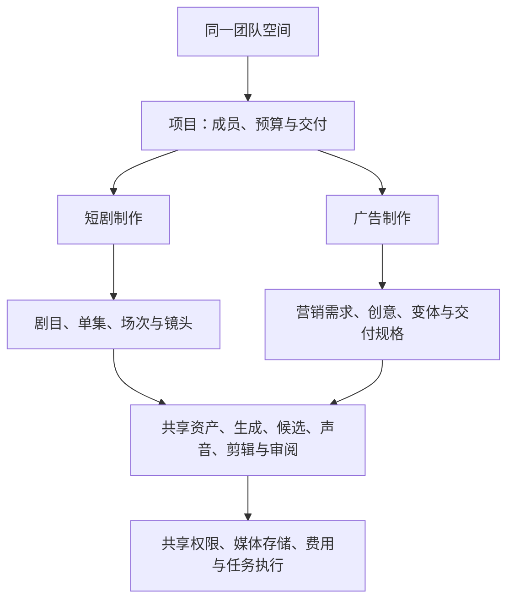

# 短剧与广告短视频：产品线与共享能力建议 v0.1

> 历史方案／评审记录：保留当时判断，后续短剧优先、每场双模式及已确认布局见[当前文档入口](README.md)。本文建议不自动进入当前 MVP 或待办。

本稿已由 [目标用户补充后的 v0.2](ai-video-product-lines-v0.2.md) 更新。用户已明确广告首批预期面向商家／教育机构营销人员，内容工厂仍是候选；本稿保留此前条件分析，第 9 节买方问题已获补充。

日期：2026-09-07。状态：扩展方向讨论稿。用户提出将电商、教育等行业的广告短视频列入计划，本稿评估组织方式，不视为已确认同时进入首发 MVP。此前 AI 写实、Seedance 优先、内部协作及简单权限约束继续成立；广告的首批买方与范围仍待明确。

## 1. 当前建议

**当前优先采用一个产品平台、两套场景工作流，共用制作基础能力，分别设计内容结构、入口与验收。** 短剧沿用已讨论的主线；广告先选择一个明确的用户群和制作任务验证，不同时铺开多个行业的完整营销工具。

这包含三个独立决定：

| 层次 | 当前建议 | 不应由此推导的承诺 |
|---|---|---|
| 商业与产品品牌 | 一个产品，按短剧制作和广告制作组织介绍与入口 | 不表示两类用户完全相同、必须使用同一套餐或购买全部功能 |
| 用户工作流 | 创建项目时选择主要制作目标，显示对应页面、术语和默认步骤 | 不把广告强制塞进剧目/集数，也不让短剧创作者填写卖点和 CTA |
| 技术与基础服务 | 共享身份、媒体、模型执行、版本、剪辑基础、费用与权限 | 不要求全部业务对象共用一张大表，不意味着必须先建设通用平台引擎 |

若后续证明买方、使用习惯、交付责任和销售方式长期分化，可以拆为独立产品入口或业务线，基础服务仍可共享。品牌、团队组织、界面、业务模块和部署是不同层面的边界，不必同步拆分。

## 2. 先按制作目的区分，再按行业适配

电商、教育是行业；广告、剧情内容、教学是制作任务。当前按用户表述，将教育场景理解为课程推广、招生或品牌宣传广告。课程讲解、教学视频、测验及学习管理属于另一类产品需求，不自动纳入此次广告范围。

广告也有不同距离：剧情型品牌广告与短剧共享更多脚本、人物、分镜和表演操作；商品卖点展示、口播和大量投放素材更强调素材复用、事实准确、模板、变体与渠道交付。广告短视频不能一概等于低成本或简单制作。

## 3. 两类场景的差异

以下是针对目标场景的产品判断，需由真实团队验证，不是所有短剧或广告项目的强制规则。

| 维度 | 叙事短剧 | 电商/教育营销短视频 |
|---|---|---|
| 创作起点 | 剧本、人物关系、世界设定 | 品牌、商品或课程资料、受众、卖点及传播目标 |
| 内容组织 | 剧目、单集、场次、镜头、连续性 | 营销项目、创意方向、创意变体、渠道交付规格 |
| 重要资产 | 角色身份与造型、场景、声音、剧情状态 | 商品/课程事实、品牌元素、Logo、讲述者、证明材料与行动引导 |
| 常见修改 | 表演、对白、反应、镜头衔接和跨集状态 | 开头吸引点、卖点、对象、报价/活动信息、文案、语言和时长 |
| 质量检查 | 叙事清楚、表演和连续性成立 | 信息准确、商品/品牌呈现正确、卖点表达与目标一致；剧情型广告也审叙事和表演 |
| 批量生产 | 多集、多场、多镜头推进 | 同一创意的多个卖点/开头/语言/渠道变体 |
| 制作指标 | 达标成片的总成本、周期、返工与连续交付 | 达标可用创意成本、交付周期、变体修改效率 |
| 商业结果 | 受众观看与后续业务结果，需外部数据 | 点击、成交或线索等按目标衡量，需实际投放数据与口径，不能从视频生成推定 |

一个创意的横竖版可能只是不同交付规格；不同开头或卖点可能是并行创意变体；某变体的字幕修正是修订版本。三者应区分，避免将全部产物混成一个“版本列表”。

## 4. 应共用与应分别设计的部分

### 共用制作基础

- 用户、租户/团队空间、项目成员及简单权限。
- 图片、视频、音频的上传、存储、预览、来源与授权范围。
- 模型连接、兼容输入、生成作业、候选、失败恢复和费用记录。
- 资产与制作输入的版本、明确引用和使用位置。
- 基础镜头制作、视觉局部编辑、声音、字幕、剪辑与输出能力。
- 评论、审阅决定、交付清单和审计记录。

这些能力在当前短剧方案中已有明确需求，先按实际模块实现；没有复用事实时不预建任意任务、任意表单和任意工作流引擎。

### 按场景分别设计

| 场景 | 需要独立表达的对象与规则 |
|---|---|
| 短剧 | 剧目设定、单集、场次状态、人物关系、跨集连续性 |
| 广告 | 营销需求、商品/课程与品牌资料、卖点与受众、创意方向、变体维度、行动引导、渠道交付要求 |

同样是声音、镜头和审片，默认参数与检查清单可以不同。广告需要核对品牌文字、价格或活动日期等事实，不能只套用人物一致性标准；短剧也不应被广告模板限制为固定的开头—卖点—行动引导结构。

品牌或客户首先是资料与业务引用范围，不自动等于新的租户。工作室为多个品牌制作时，内容默认留在各项目，只有明确可复用的内容才进入工作室共享库；不因共用平台而让品牌素材自动跨项目流转，也不因此提前引入外包访问能力。

## 5. 产品与数据结构建议

现有方案已经区分 Project 管理单元与 Production 剧目内容。若确定加入广告，可在 Project 下增加广告内容模块；短剧项目仍保持一部剧目，不把所有项目都变成剧目。初版用明确的两种项目类型和业务模块即可。

在同时开放两种类型时，顶层「剧目」导航建议改为「项目」，项目内显示短剧或广告对应导航。单一项目通常采用一个主要工作流；类型切换并非简单标签修改，应检查内容关系。当前不设计任意动态类型切换。

镜头和剪辑等可共用制作组件，但广告用户不必手工创建场次和镜头列表。简单素材剪辑、口播或模板任务可直接使用业务输入，专业镜头控制按需展开。

一部短剧需要推广广告时，可以建立关联营销项目并引用授权片段；剧情型广告也可调用分镜和角色能力。跨场景关系通过明确引用表达，不复制整部剧或强制将所有内容放在一个无限画布里。

画布继续是交互选项：视觉探索、参考与候选比较可共用组件；短剧主创与广告运营可以采用不同默认界面。两者都能输出视频或使用同一模型、同一画布，不足以证明用户工作流应完全合并。

## 6. 三种路线的取舍

| 路线 | 优点 | 主要成本 | 当前评价 |
|---|---|---|---|
| 两个完全独立产品 | 定位、术语、销售和排期可各自优化 | 重复建设基础能力、运营、支持和交付验证；团队资源分散 | 当两类业务均已被验证且用户明显分化时再考虑 |
| 一个完全通用工作台 | 基础界面集中，工具组合灵活 | 用户承担配置与理解成本，场景规则容易退化成泛化参数，定位模糊 | 不作为默认方案 |
| 一个平台、两种场景工作流 | 共享基础能力，保留场景效率，后续可分别包装 | 仍需承担两套业务设计、模板和验收；公共能力变更需兼顾两边 | 当前建议 |

不能用未经实现和测量的代码复用百分比判断节省多少研发时间。合并平台减少部分重复工程，并不会消除第二个场景的客户研究、内容样片和服务成本。

## 7. 阶段计划

### 当前：验证邻近场景，维持明确主线

短剧沿用已有 MVP。广告选择一个窄场景形成需求和样片验证，优先考察原有工作室是否确实同时承接这类任务。可以验证商品卖点展示或课程推广口播，但不要同时承诺全部电商和教育营销形态。

若希望广告也进入同批首发，需为它明确一个用户群、一种主要视频类型、一个交付标准和独立验收，并核实研发及生成预算。没有资源与客户依据时，不将两个完整 MVP 同时开工。

如广告已有明确付费客户、材料与重复需求，而短剧尚无试点，可讨论先交付广告的顺序；这属于产品优先级调整，需要明确决策，不由共用技术或此研究自动决定。

### 广告最小闭环建议

品牌及商品/课程资料 → 确认受众与卖点 → 脚本或模板草稿 → 制作一个主创意 → 生成少量有明确差异的变体 → 核对信息与品牌呈现 → 导出所需规格。

可复用客户现有图片、视频和录音，生成能力用于缺失或需修改的部分；Seedance 优先不要求每个广告镜头全部重新生成。高精度品牌文字、数字和 Logo 可采用已确认素材与确定性排版/合成，不把正确性完全交给视频模型。

早期交付范围建议是制作和导出；自动投放、广告账户接入、归因与优化属于追加业务。没有投放数据时，只衡量制作效率和内容可用性，不承诺转化提升。未来效果数据应关联到确定的交付版本、渠道及投放上下文。

### 长期：根据业务分化程度决定是否拆线

考虑独立产品入口、套餐和业务负责人的信号：

- 广告主要购买者是商家/机构营销人员，短剧主要是专业制作团队，访谈及使用数据表明混合界面妨碍各自使用。
- 广告需求集中在商品目录、批量投放和效果反馈；短剧需求集中在叙事、表演和跨集生产，路线图持续互相牵制。
- 获客、培训、服务与计价方式出现稳定差异，各自有持续付费与留存证据。
- 两类场景都具备明确负责人和足够资源承担独立交付。

拆开业务入口不必复制账号、存储和模型执行系统，也不要求迁移已有租户身份。需求相似度和商业验证比使用人数更适合作为判断依据。

## 8. 市场参照及边界

Higgsfield 在同一平台导航中同时呈现 Cinema Studio 和 Marketing Studio；后者围绕商品内容、UGC、广告及模板组织入口。这是「共用平台、场景化入口」的公开产品参照，不能据此推定其内部代码结构或经营效果。[Marketing Studio](https://higgsfield.ai/marketing-studio)

Katalist 当前首页面向效果营销团队，强调商品替换、多个 SKU 与创意变体，同时保留剧本、故事板与视频制作描述。这说明相似制作能力可以围绕不同买方重新组织，但不能据官网文案证明其定位转向已经成功。[Katalist](https://www.katalist.ai/)

LTX 面向广告机构的页面将视觉概念、Canvas、Storyboard 与 Video Editor 串联，说明广告中的叙事和概念制作也可能需要专业镜头工具；它不代表所有电商运营都需要同样深度。[LTX 广告机构页面](https://ltx.io/studio/solution/advertising-agencies)

广告专项产品的起点、变体及渠道能力详见 [广告工作流证据](research/2026-09-07-advertising-product-workflows.md)。以上均为官方公开资料核查，未做本项目的付费、效率或销售验证。

## 9. 最关键的待讨论问题

广告的首批用户是：承接电商/教育广告的制作工作室或代理团队，还是商家/教育机构自己的营销人员？

若仍以工作室为买方，统一平台和场景工作流是更直接的起点；若面向营销人员，优先设计独立而简化的广告入口，验证是否需要独立业务包装。此问题已在本轮提出，未得到答案前不将任何一类标为已确认客户。

下一步再确定首个广告类型、现有素材与工具、交付规格，以及要做到制作导出还是延伸至投放管理。教育按广告任务理解；若实际需要教学内容，应另行评估。
