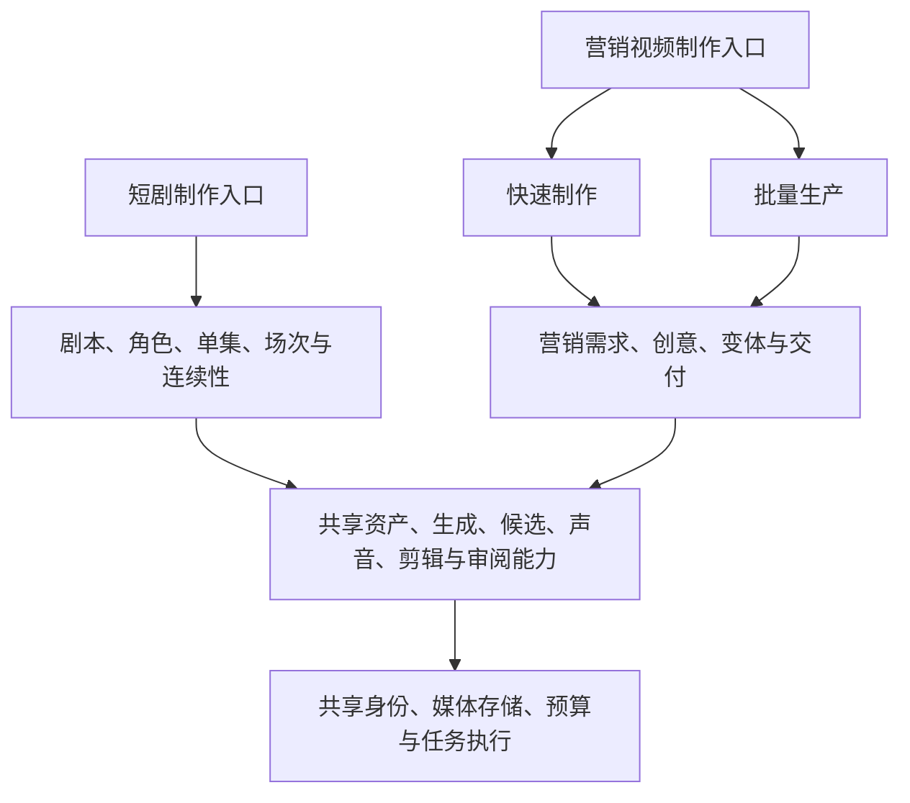

# 短剧与营销视频：产品方向与目标用户 v0.2

> 后续广告探索：本文保留客户假设与条件方案，不是当前短剧 MVP 的交付清单或已验证结论。当前阶段以[完整方案](ai-drama-workbench-product-design-v1.1.md)和[外部验证准备](implementation/20-external-validation-and-launch-plan.md)为准。

日期：2026-09-07。状态：根据广告首批用户补充修订的讨论稿，替代 v0.1 的默认入口建议。用户已明确长期支持短剧与广告、当前优先短剧设计并复用底层核心能力。广告后续预期面向商家／教育机构营销人员，内容工厂制作团队也是候选；具体工厂类型和首个广告任务尚未确定。

短剧的 AI 写实、Seedance 等领先模型优先，以及初期内部协作和简单权限原则继续成立。新增客户方向不表示已批准两个完整 MVP 同时开发，也不表示已确定商业品牌或独立研发组织。

当前整体推进基线见 [短剧优先 MVP 与公共模块复用方案](ai-video-platform-mvp-plan-v0.2.md)。广告业务作为后续扩展，当前只检查其代表性任务能否使用公共制作模块；完整广告原型、开发与试点不构成短剧 MVP 的前置条件。

## 1. 修订建议

**将「短剧制作」和「营销视频制作」作为两条独立规划的产品方向，分别设计定位、入口、核心流程和验收；共用媒体、模型执行、版本、费用和身份等基础能力。营销视频方向同时容纳快速制作与批量生产，内容工厂暂不另拆第三条产品线。**

此处独立产品方向指面向客户的价值表达与使用体验可以分别成立。初期仍可使用同一品牌、账号、研发团队、代码库和部署；有真实需求的工作室也可以使用两种制作能力，不强制建立重复账号或搬运资产。

v0.1 的默认建议基于首批客户仍是制作工作室，侧重同一项目列表里的类型切换。现在广告买方已扩展到营销人员，因此应提前独立广告的入口、引导、术语与功能优先级。是否进一步拆为独立品牌、商业团队或技术系统，仍由实际付费、使用与交付证据决定。

## 2. 不把用户职责和组织方式混为一种分类

「营销人员」描述职责，「内容工厂」描述生产组织方式。商家内部可以有内容工厂；服务多个客户的制作机构也可能同时有营销策划与剪辑制作人员。同一个人既可能快速做一条，也可能批量生产。

因此需要分别理解：

| 维度 | 示例 | 对设计的作用 |
|---|---|---|
| 购买组织 | 商家、教育机构、制作服务商 | 明确付款、成员治理和资料归属 |
| 使用职责 | 营销策划、制作执行、内容把关、团队管理 | 明确谁提出要求、谁操作、谁确认结果 |
| 制作任务 | 一条新品推广、多个课程的招生素材、持续变体生产 | 决定引导、批量能力、模板与交付要求 |
| 内容目的 | 广告／品牌传播、剧情短剧、教学课程 | 决定内容结构和验收依据 |

职责不自动变成系统权限角色。初版继续使用固定管理员、负责人、协作者等规则，制作能力按当前任务逐步展开，不因用户自称营销或工厂而永久锁定另一种操作方式。

## 3. 营销人员与广告内容工厂的共同流程

共同的业务链路建议为：

**商品／课程与品牌资料 → 营销需求 → 创意及脚本 → 制作与修改 → 创意变体 → 核对与交付。**

核心对象包括推广对象、目标受众、卖点、行动引导、已确认事实、素材、创意、变体、修订版本及交付规格。批次用于组织执行，不成为每条内容都必须经过的业务层级。

| 项目 | 营销人员的首发任务假设 | 广告内容工厂的任务假设 |
|---|---|---|
| 输入 | 商品／课程信息、现有素材、目标与少量偏好 | 多个制作需求、品牌资料、参考和已有可复用方法 |
| 主要操作 | 确认信息、比较创意、修改文案/画面并导出 | 模板配置、批量运行、筛选、异常返工、分工及打包交付 |
| 需要的控制 | 容易理解的内容和品牌约束，必要时展开细节 | 控制参考、可变参数、输出范围、并发和费用 |
| 常用界面 | 引导式步骤、有限创意候选、局部修改 | 任务表、变体对比、批次进度与制作工具 |
| 制作验收 | 能独立做出信息正确、达到目标要求的视频 | 达标产量、单位可用创意成本、返工和交接效率 |
| 业务结果 | 按目标关注传播、成交或线索等结果 | 对内或对外交付效率，也可能承担效果目标 |

上述差异是需要验证的设计假设，不推定营销人员不会制作、工厂都懂节点，或两者都追求同样的产量。没有发布与投放数据时，产品只评价制作过程和交付结果，不承诺转化提升。

## 4. 两种操作深度，共用广告对象

### 快速制作作为广告首发入口

围绕一个明确任务组织，例如「为这门课程制作招生视频」：提供资料与现有素材，确认事实、目标人群与卖点，选择创意方向，制作候选并修改，核对后导出。

默认使用业务语言，例如「推广对象、开头、主要卖点、画面风格、行动引导、成片规格」。用户不需要先理解剧目、场次、节点连线或不同模型的参数；需要精细控制时进入当前版本的详细制作界面。

### 批量生产按真实任务展开

对相同营销需求和创意增加多个商品／课程、开头、卖点、语言或交付规格；允许模板引用、批量操作、状态筛选、单项重做和交付清单。

并行创意变体、同一变体的修订和横竖版交付分别记录。已有候选、实际输入、采用版本和费用在快速与详细操作之间保持同一份记录，不要求导出再上传到另一模式。

画布只是可选的视觉探索或制作方式；两类用户是否需要它按任务验证。内部工厂可以用表格批量运行模板，营销人员也可以展开视觉编辑。

## 5. 与短剧方向的边界

短剧的故事状态、人物发展和跨集连续性独立维护；广告的品牌／商品事实、营销需求与创意变体独立维护。项目继续管理参与者、预算和交付，具体内容由对应模块组织。

入口可在同一品牌下分开呈现，新用户直接进入适合的场景；已使用两类能力的团队可切换场景或筛选项目。普通广告用户无需先看到完整的短剧功能导航。

营销侧可用「团队空间」表达客户组织，短剧侧保留「工作室」称呼；两者不因此成为重复的租户层级。不同产品入口也不自动共享所有租户数据，资产跨项目使用仍需要明确引用与授权。

## 6. 内容工厂不意味着首版要建设跨组织协作

首版可以让一个内容工厂作为独立客户空间，自己的员工完成内部生产。客户或品牌先作为业务资料，由内部人员放入对应项目；不因团队为外部客户制作，就给外部客户建立 Guest 或审片入口。

如果是商家内部内容工厂，通常属于该商家的团队空间，按项目参与即可。如果是独立经营的制作公司，可以拥有自己的租户。组织名称或「工厂」标签不直接决定新增租户。

品牌资料默认保持项目或明确的品牌使用范围，不能将所有客户资料自动放进全员共享库。甲乙方共同编辑、跨组织派单、客户在线确认和交付门户仍是长期能力，不因这次目标客户讨论前移。

如果一个内容工厂生产的是剧情短剧，它使用短剧方向；如果同时生产两类内容，可以使用两个入口。无需为「工厂」单独创造第三套内容模型。

## 7. 首发与验证建议

针对「如果广告 MVP 以营销人员为主用户」的进一步讨论，见 [营销人员广告 MVP 条件方案](ai-marketing-video-mvp-v0.1.md)。该稿细化首个闭环、局部修改、首版边界与验收，不代表两条方向已获准同时开发。

广告首批主用户已明确预期为营销人员，因此广告方向的初始设计以其能独立完成一个真实任务为验收。内容工厂保留为候选试点和后续批量能力的验证来源，不在缺乏样本时与营销人员共同定义所有首版要求。

建议先从电商或教育广告中选择一个有真实用户、资料和重复需求的任务，不同时承诺覆盖全部行业。用少量对照试点检验另一行业是否仅需要资料与模板适配，还是需要不同的制作能力。

可邀请一个小型广告制作团队验证相同业务链路是否能被复用；它可以帮助发现重复操作和返工问题，但其内部手工补救不能当作营销人员已能自助完成的证据。

| 阶段 | 优先验证的结果 |
|---|---|
| 广告首发验证 | 营销人员无需制作专家代操作，完成资料确认、创意选择、修改和正确交付 |
| 广告批量扩展 | 对相同对象增加模板与批次后，减少重复配置和返工，费用与采用关系保持明确 |
| 广告专业化 | 内容工厂有稳定需求时，增加多品牌生产管理、队列、负载与更精细工具 |
| 产品线进一步拆分 | 两条方向各自有持续业务、独立交付资源及明确需求分化时，再评估品牌、套餐或业务团队 |

当前已按用户指示优先短剧场景设计；本节的广告首发与验证步骤留待广告扩展阶段安排。具体上线日期仍需结合研发资源、模型效果及预算确定。

Seedance 等领先模型继续作为优先候选，但广告可直接复用已有商品图、讲师素材、录音或成片，使用必要的生成与剪辑能力完成目标，不要求所有内容从零生成。

## 8. 已确认与待验证事项

已确认的补充：广告首批预期是商家／教育机构的营销人员；内容工厂制作团队也可能是目标用户。

本稿建议：短剧与营销视频分别规划产品定位及入口，共用基础服务；广告以快速制作为首发体验，批量生产作为同一方向的扩展；内容工厂不单独拆第三条线。

待验证：首个行业和视频类型、营销人员当前制作能力与资料完整度、能否自助完成、工厂是内部生产团队还是服务商、重复生产的频率与差异维度，以及实际付费与服务成本。当前不需要再重复确认广告买方的大类。

本文基于用户补充与已有研究进行设计推论，没有新增市场规模、价格、转化或效率保证。市场事实及出处见 [广告流程研究](research/2026-09-07-advertising-product-workflows.md)。
