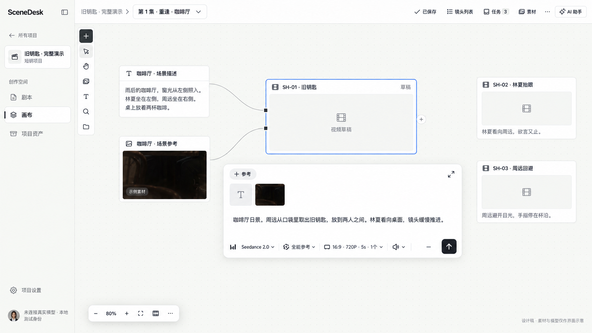
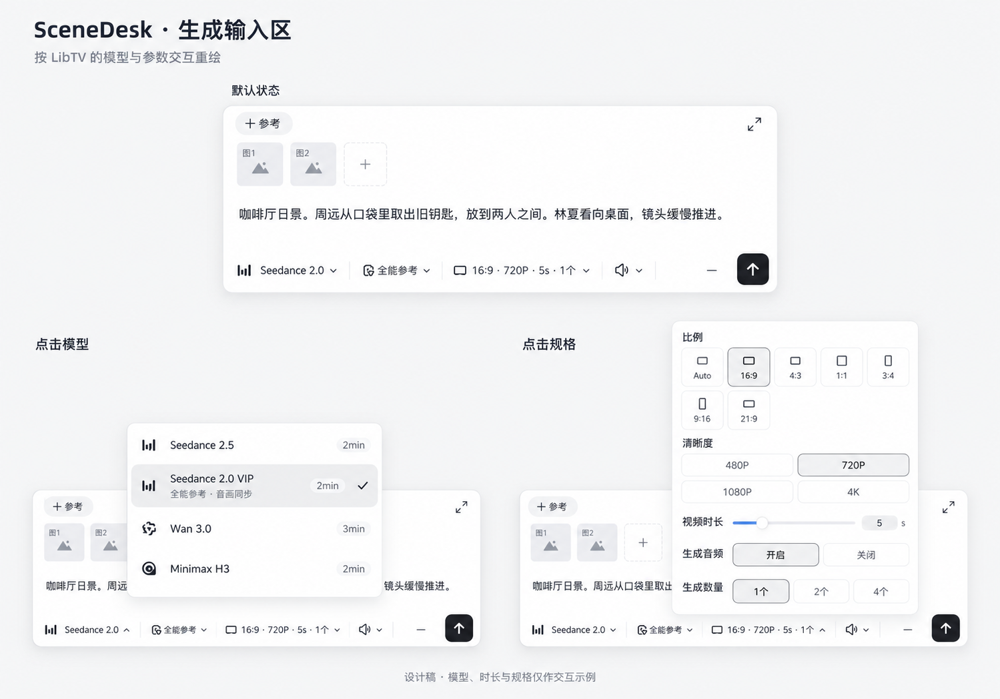

# 画布卡片与生成输入区修改计划

> 本文引用的部分源文件与 e2e 规格属于旧创作界面，已在 2026-09-21 阶段 3 删除（见 [85-studio-rebuild.md §1i](../implementation/85-studio-rebuild.md)）；这些引用改为纯文本，内容按当时原样保留。

日期：2026-09-21。状态：**历史**。五个切片曾于同日在分支 `feat/canvas-cards-redesign` 实施并验收，随后用户决定不合入，改为按 [核心创作区重建](creative-workspace-rebuild-libtv-2026-09-21.md) 从零新写界面；本文的复刻清单已并入该决定。下文保留计划原貌。

## 1. 目标与依据

让画布上的内容容易辨认，编辑时卡片位置与尺寸稳定，模型、参数和参考操作集中在一个按需出现的输入区。

- 保留现有项目侧栏、顶部工作区选择、画布工具、任务、素材和助手入口，延续[创作工作区方向](creative-workspace-approved-2026-09-16.md)。
- 生成输入区以本轮实机查看的 **LibTV** 为主要参照：参考在上、提示词居中、底部一行模型／模式／规格／提交；模型与规格分别用浮层展开。即梦的研究用作交互对照，不另混入一套控件规则。
- 删除生成面板里的「参考材料」「节点属性」折叠栏；原有能力迁到贴近对象的入口。
- 生产实现依据[SceneDesk 当前审计](../research/2026-09-21-scenedesk-canvas-card-audit.md)，竞品依据[实机研究](../research/2026-09-21-libtv-jimeng-canvas-design-review.md)。

两图由内置 imagegen 生成，分别用当前 SceneDesk 截图及 LibTV 实机截图作参考；是设计提案，不是已运行产品。图中的素材、模型、时长、数量、费用占位和控件状态不构成业务能力证明。实施按下面的状态和能力规则修正细节，不硬编码图中的内容。

## 2. 全页面与卡片

### 2.1 页面布局

- 保留当前「剧本／画布／项目资产」导航和项目／场次画布。卡片改造同时覆盖两类画布。
- 同时只编辑一个对象。助手开合、顶栏和工具轨共同决定编辑器可用区域。
- 输入区出现不推动相邻节点、不重排画布、不写入额外的节点位置和尺寸。
- 空白画布与少量／大量节点使用同一套结构。现有窄屏内容列表继续可用。
- 使用现有主题 token、Mantine、Phosphor、React Flow 与播放器；检查浅色和深色，不另建组件系统。

### 2.2 卡片结构

| 类型 | 收起态 | 编辑／查看 |
|---|---|---|
| 图片、视频生成草稿 | 标题、媒体区域、必要状态；无结果时为占位与简短提示摘要，有有效结果时显示预览 | 独立生成输入区；本体尺寸不随编辑开合改变 |
| 声音生成草稿 | 标题、音频占位／真实时长和播放入口、必要状态 | 同一输入区结构，展示声音适用参数；不虚构波形 |
| 已有图片／视频／声音 | 标题和实际媒体预览 | 沿用预览／播放；选中后提供继续创作等动作 |
| 普通文字 | 标题、正文，长文有明确阅读边界 | 保留文字编辑，不强行套用媒体占位和生成工具条 |
| 固定剧本摘录 | 原文及固定来源身份 | 原文只读，查看来源；不转成可随意改写的文字 |
| 上传占位 | 当前上传阶段、失败原因与恢复入口 | 保留既有上传恢复，不伪装成已完成素材 |

- 标题、类型图标、边距和状态位置统一；图片／视频标题位于内容上方，取消重复的文件名和类型提示。
- 空草稿的初始媒体框采用当前有效画幅；建立后仅在用户明确调整规格或尺寸时改变。新结果比例不同时先完整适配既有框，不裁掉构图、不自动拉伸卡片。
- 修改模型／参数后，已有结果仍明确属于上次尝试，不把新输入误标成已经生成过。
- 草稿、生成中、未决、失败、成功分别呈现；成功态不常驻大量标签。实际任务阶段没有进度百分比时不编造进度。
- 选中使用细边框；可访问焦点继续独立可见，不给媒体染色表示选中。

### 2.3 选择与输入规则

| 动作 | 预期行为 |
|---|---|
| 单击卡片 | 选中，出现简短相关操作；不自动展开完整输入区 |
| 点击编辑／双击草稿正文 | 进入编辑，输入区定位到卡片附近 |
| 新建生成草稿 | 直接进入该草稿编辑，焦点到提示词；尚未提交生成 |
| 双击已有媒体 | 沿用媒体预览；不与草稿编辑混淆 |
| 编辑标题 | 标题上的明确重命名动作；与双击正文区分 |
| 点击画布空白／关闭编辑 | 先保留输入再收起；保留失败时不丢失输入或强行切换 |
| Escape | 优先关闭最上层菜单，其次退出编辑；中文输入法合成期间不误触 |
| 切换编辑对象 | 先完成当前本机保留，失败停留原对象；不重复创建编辑会话 |

## 3. 独立输入区与视口

- 卡片继续在画布坐标中缩放；输入区用屏幕尺度绘制，50% 全览时仍能阅读与输入。
- 通常置于卡片下方，桌面宽度以约 640–720 屏幕像素为设计起点，按可用区域收窄；具体值使用语义 token，并通过生产页面调整。
- 靠近边缘时在可用区域内移位；空间不足时沿用现有专注编辑。输入期间保持方向稳定，避免打字导致浮层来回翻转。
- 助手展开后重新计算安全区域，不遮住当前输入、提交按钮或主要卡片操作。
- 长提示词在受限高度内滚动；多参考缩略图可展开更多项，模型／参数菜单可内部滚动。输入区整体不无限增高。
- 画布缩放、平移与面板文本滚动分开处理；拖动不触发文字编辑，输入不拖动节点。
- 平移使编辑对象完全离屏时保留同一会话并显示定位入口；不持续遮住无关内容，不自动把画布拉回原位。
- 模型／规格／参考详情浮层同一时刻只开一层；关闭后焦点返回触发控件。
- 专注编辑继续复用同一份草稿和编辑会话；返回时保留画布视图、输入选区和参考状态。

主要实现位置：CanvasContextualEditor、定位计算、CanvasBoard。

## 4. 生成输入区：对齐 LibTV 的具体内容

### 4.1 默认层

从上到下只有参考缩略图与一个添加入口、无内框的提示词区域、紧凑底行。移除「创作描述」重复标题、大块模型下拉框、全宽生成按钮、属性折叠栏。占位文案不替代可访问标签。

底行按实际能力展示：**模型 → 适用模式 → 合并规格 → 实际费用信息 → 生成**。固定参数不伪装成可切换控件；没有准确费用数据时不显示虚构积分或把未知金额写成 0。

### 4.2 模型选择

- 小型文字按钮显示能力图标、官方英文模型名与版本、下拉箭头；长名截断但可查看全名。
- 浮层列表显示模型名、中文能力／可用状态与当前选中项。只有真实可用的预计耗时才显示耗时。
- 保留不同连接和能力身份，同名模型不能在内部合并成一个执行目标；测试能力继续明确标记。
- 切换模型保留提示与参考。兼容参数保留，不兼容参数要求重新选择，旧输入可恢复；不静默删除参考、套用虚构支持或自动提交。
- 固定计划、未决请求和恢复中的模型／输入按现有锁定规则处理，不能用换皮后的控件绕开。

### 4.3 参数选择

- 收起时一行摘要，例如「16:9 · 720P · 5s」；展开采用 LibTV 的小浮层、比例图形选项、分辨率选项、时长滑杆与数值输入。
- 图片展示其尺寸／比例等适用参数；视频增加时长、支持时的音频开关；声音展示声音适用参数。已有 seed 等较低频配置保留在规格的次级区域。
- 可选值来自当前能力，时间与尺寸遵循现有整数和范围规则。不把「Auto」「4K」「生成音频」无条件展示为可用。
- 选择变化即时更新摘要并保留草稿；在提交前仍执行现有前置校验、固定输入和幂等流程。

### 4.4 数量与模式的能力缺口

当前 [Capability 和 OutputOptions](../implementation/build_contract.py#L110) 提供模式标识、比例、分辨率、时长、音频与 seed；**OutputOptions 没有单次生成数量字段**。现有多节点批量计划也不等同于单节点「2个／4个」。

| 项目 | 本轮可直接落实 | 若要求功能与竞品相同 |
|---|---|---|
| 模型、规格浮层 | 用已有能力重做显示和交互 | 不需要仅为外观扩展契约 |
| 全能参考／首尾帧等模式 | 只有已注册、已核验的能力模式才出现相应入口；单模式不放假选择器 | 缺少的模式需完善真实能力、输入语义及验证，不用前端标签冒充支持 |
| 生成数量 | 未支持时省略数量选择；不显示可点的 2／4 | 单独设计一次供应商多结果与多个独立作业的差别、费用、取消、部分失败、幂等和结果归属，再扩展契约与执行 |
| 费用／耗时 | 只展示已有可靠数据，未知时省略或清楚标为待估算 | 真实估算来源、限额与执行核对另立能力工作项 |

涉及公开契约、schema 或新依赖的能力工作项，在形成具体方案后按仓库约定确认再实施；不妨碍前端交互结构的修改。这里列出缺口，不将图中样例认定为已有能力。

主要实现位置：MediaGenerationWorkspace、CanvasMediaGeneration、[图片校验](../../apps/web/src/business/image-generation.ts)、[视频校验](../../apps/web/src/business/video-generation.ts)、[声音校验](../../apps/web/src/business/audio-generation.ts)。复用控制器和提交函数，不另建一条生成链路。

## 5. 参考材料、节点属性与继续创作

### 5.1 参考改为缩略图操作

- 通过「＋ 参考」搜索并选择当前画布已有文字／媒体；保持现有素材导入入口和固定引用验证。
- 图片／视频用缩略图，文字／声音用可辨认的图标和名称；连线与输入区表示同一组引用。
- 点缩略图查看来源、用途、启用／停用和移除。身份、场景、构图、声音、首尾帧等用途只能按现有领域和当前能力配置选择。
- 禁用、素材未就绪、读取失败、权限失效分别可辨认；不静默移除或当作有效输入提交。
- 保留已有引用顺序和固定版本，移除引用不删除素材。多个参考收起时仍能发现总数与异常。
- 本轮不额外扩展提示词 @ 解析、拖动排序协议或供应商素材管理；这些与简单缩略图呈现不是同一功能。

### 5.2 节点属性迁移

| 原字段／操作 | 新入口 | 兼容要求 |
|---|---|---|
| 名称 | 标题重命名，更多菜单同时可达 | 空输入、取消、中文合成、本机保留及撤销继续有效 |
| 横／纵位置 | 拖动画布节点 | 保留精确数值编辑，移到更多菜单的「位置与尺寸」小浮层 |
| 宽度 | 选中后显示调整手柄；媒体框按既定比例适配 | 复用 width 字段与范围；不新增高度持久字段。精确数值与键盘入口保留 |
| 分组、取消分组、定位整组 | 选择工具条／更多菜单 | 原分组成员与联动移动不丢失；不改变镜头顺序 |

**替代入口全部可用后再删除旧折叠栏**，避免“删界面”导致功能消失。没有实际新增操作的菜单项不放空按钮。

### 5.3 继续创作与端口

- 对可作为来源的文字／已有媒体，在选中或键盘聚焦后显示右侧「＋」；与原「继续创作」共用同一动作，不长期并排放两个入口。
- 点击后选择新图片／视频／声音草稿，沿用来源快照、重复点击保护与引用校验；创建后选中新卡并进入输入，不执行生成。
- 放置尽量避开已有节点；只有新对象不可见时做最小必要定位，不为了新建重排整张画布。
- 现有来源端口和引用边保留；加号点击与拖线有明确手势边界。多选共同参考继续从选择工具条进入。
- **空生成草稿不显示可派生的右侧＋**。完整效果图中的该细节需修正。当前领域仅允许文字／媒体到草稿，不能让两张草稿直接相连。
- 从成功草稿结果继续创作，先沿用明确放置为媒体再派生的完整路径。直接把未放置结果作为来源的快捷操作需另做原子性／幂等设计，本轮不通过隐藏中间写入伪造草稿互连。

主要实现位置：引用编辑与属性、继续创作、[来源创建](../../apps/web/src/business/canvas-creation.ts)、[引用约束](../../packages/domain/src/canvas.ts)。

## 6. 结果、历史和失败恢复

- 有有效成功结果的草稿，收起后仍能看到最近成功预览；正在重新生成或新尝试失败时保留上次可用画面，并明确当前任务状态。
- 卡片附近只放一个简短「结果／记录」入口。有真实多结果时先按尝试组织，再在该次尝试内浏览；不把多次尝试混成同一批结果。
- 历史、原始输入和 A/B 比较按需展开，复用现有逻辑。查看旧结果不覆盖当前输入，也不自动改变参考或镜头选用。
- 生成完成不抢焦点、不自动平移或缩放。用户正在看旧结果时提示有新结果，不强行切走。
- 预览可见不等于已经创建独立媒体节点；明确放置、关联镜头、选用、固定批准和交付仍是独立业务动作。

| 状态 | 页面反馈和动作 |
|---|---|
| 准备／提交中 | 当前阶段、避免重复提交；不先报告成功 |
| 排队／生成中 | 小型状态提示，支持时提供取消；可浏览其他卡片 |
| 提交结果未知 | 核对原任务；不能把普通重试变成一次新的付费生成 |
| 已完成但归档失败 | 明确「恢复归档」，不重调模型 |
| 素材播放／读取失败 | 重试读取或播放，不把它标成生成失败 |
| 生成明确失败 | 原输入保留，原因和可执行恢复动作就近显示 |
| 保存失败／冲突／撤权 | 使用现有恢复和授权规则；不错误显示已保存 |

当前预览 hook只读取编辑中的一个节点。扩大到收起态卡片时，需要按可视／选中范围调度、合并重复读取、限制并发并取消过期请求；缓存不作为权限证明。切换项目／租户／会话或撤权时不展示旧预览。

## 7. 实施切片与顺序

依赖顺序：**切片 1 → 切片 2 → 切片 3 → 切片 4 → 切片 5**。以下是工作拆分，不创建任务、不提交或推送代码。

| 切片 | 实施内容 | 完成条件 |
|---|---|---|
| 1：稳定卡片与独立编辑器 | 卡片类型与状态外观；解除编辑时扩宽／撑高；屏幕尺度输入区、避让、焦点和专注切换 | 项目／场次画布均可编辑；50%／100% 下可读；关闭或切换不丢草稿、不改布局 |
| 2：模型与规格 | 无内框提示区；紧凑底行；模型列表和规格浮层；图片／视频／声音适配；真实能力与提交锁定 | 选值与摘要一致；换模型不丢提示／参考；不兼容输入明确处理；原生成／恢复测试通过 |
| 3：参考与卡片操作 | 缩略图引用管理；标题重命名；尺寸手柄及精确位置入口；分组入口迁移；＋继续创作 | 替代入口覆盖旧功能后移除两折叠栏；新草稿与引用可保存、撤销、刷新恢复 |
| 4：结果常显与状态收敛 | 收起态成功预览；记录／比较入口；生成、未知、归档、播放失败；预览读取调度 | 结果可辨认且不自动采用；无未授权旧预览；未知请求与归档恢复不重复生成 |
| 5：整页验收与收尾 | 浅深色、窗口／缩放、助手、键盘、触屏、较大画布性能；清理已失去用途的样式／分支；更新证据 | 一次完整生产构建走查与相关回归通过，未验能力和环境阻塞准确记录 |

每个功能切片都包含与其修改有关的保存、失败恢复和行为验证，不能把这些全部推迟到切片 5。前端复用现有 API 的切片不为凑层次增加数据库改动。若预览读取或新数量能力确需契约变更，拆成完整服务／数据／页面／恢复切片，按先契约后生成顺序推进。

## 8. 验收矩阵与证据

### 8.1 必须完成的用户路径

1. 新建图片／视频／声音草稿 → 输入 → 选择模型与有效规格 → 添加参考 → 关闭再打开 → 刷新，输入与引用保留。
2. 在 50% 和 100% 画布缩放下编辑；缩放不降低输入字号，卡片开合不改持久几何尺寸。
3. 在四个视口边缘打开输入和菜单；打开／关闭助手；长提示、多参考、长模型名均不遮住关键操作。
4. 从文字／媒体继续创作，核对新草稿和引用；重复点击、来源已变、更改被拒绝及撤销恢复均有明确结果。
5. 重命名、拖动、调宽、精确位置、分组操作后刷新，确认无丢失；只读用户不能通过新入口修改。
6. 使用明确标识的受控夹具完成生成、失败、未知提交核对、归档恢复与历史比较。图像／声音结果不冒充视频结果。
7. 新结果在收起态可见；重新生成失败保留上次可用预览；播放失败不会触发模型；结果不自动选用。
8. 切换画布、项目、会话及模拟撤权，不出现旧引用／旧预览；冲突和断网期间草稿可恢复。
9. 键盘访问模型、规格、参考、重命名和尺寸；菜单 Escape 与中文输入法不冲突；聚焦／返回顺序明确。

### 8.2 视觉与性能

- 窗口至少覆盖 1440×900、1920×1080、760px 断点两侧和现有窄屏列表；画布缩放覆盖 25%、50%、100%、200%。分别记录窗口与画布缩放，不混为一个尺度。
- 浅色／深色，默认／选中／编辑／长文本／生成中／成功／失败／只读均看生产构建的实际绘制。
- 检查拖拽、平移与缩放连续性，避免给节点位置添加延迟动画；浮层开合仅作短暂过渡并尊重减少动态效果设置。
- 用同一环境的常规画布和约 100 节点混合画布对比修改前后输入延迟、请求数量与预览加载。没有更改布局状态时不重复写画布；关闭编辑不触发全图重新请求。
- 卡片开合、生成完成、助手开合不得导致非主动的持久位置或尺寸变化；视口避让不改业务布局。

### 8.3 检查执行

- 复用并按行为修改现有单测，如编辑定位、编辑交接、创建引用、结果放置与生成请求。仅为新增公共行为补测试，不测试 CSS 类名或复述内部实现。
- 相关 E2E 包括连续创作、项目画布、导航、分组、批量生成、剧本引用和结果恢复；使用回环的一次性 `drama_e2e*` 数据库及 `PROVIDER_MODE=mock`，不指向开发库。
- 功能实施执行仓库根目录 `npm run check`；相关浏览器流程通过后在最终整合执行 `npm run test:e2e`。数据库、媒体或 Worker 有实质变化时追加对应层检查，推送前完整运行仓库 preflight。
- 文档／契约门禁按现有 `check_design.py` 执行；公共契约如有变化，先改契约模块、运行生成器和检查，再生成 TypeScript 契约。
- 合并前独立审查真实 diff；推送须收到明确要求，届时按仓库约定执行门禁、一次推送并核对实际 GitHub CI。
- 保留实际命令、代码版本、截图、成功与失败记录。受控夹具只证明站内流程，真实模型执行需真实能力与花费授权单独验收；不以效果图或静态通过代替。

## 9. 本轮之外

小地图、自动排列、吸附、可视组框、富文本全面升级、复制并继承全部引用、自动图执行、时间线、3D、多人实时共编和新供应商接入均不夹入本次卡片修改。已有对应能力继续保留。

本计划先完成界面与现有能力的一致呈现；第 4.4 节列出的数量／模式等缺口，按单独能力工作项处理，不能在收尾时默认为已经对齐。
