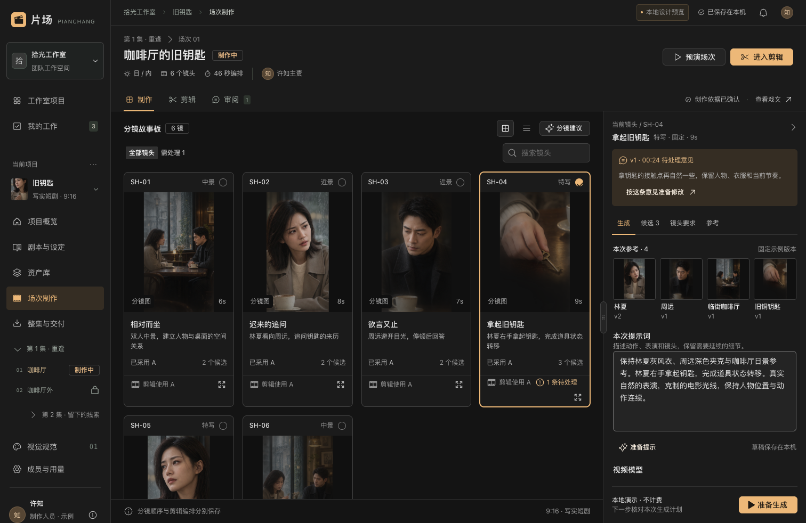
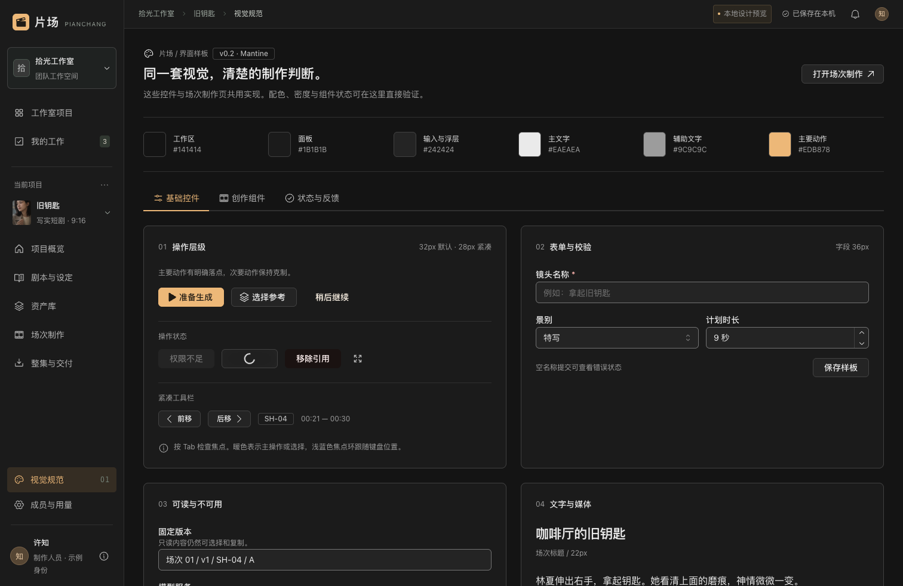

# Mantine 本地视觉样板 v0.2

> 历史视觉探索／原型记录（2026-09-10 标注）：本文中的“当前”“下一步”“待评审”指原编写阶段，旧配色、布局、截图和原型路由不再作为现行 UI 规范。当前请看[核心体验 v0.3](scene-walkthrough-review-v0.3.md)、[专项 v0.4](production-detail-design-v0.4.md)及[UI 执行规范](mantine-ui-agent-spec-v0.1.md)；共同语言已确认，无须重新选择 A／B／C。历史测试只证明当时的范围。

日期：2026-09-09。状态：**历史可运行样板；当时待用户视觉评审**。用户授权持续完成主题、组件样板和场次制作页。本次落实技术选型和可评估的视觉实现，不代表品牌、配色与密度已最终批准，也不代表真实生成与协作业务已经完成。

## 1. 查看入口

- [导航与核心流程 · 推荐方案](http://127.0.0.1:4311/#/journey/)：2026-09-10 新增，沿用共同语言串起项目、场次双模式、剪辑、固定审阅和返工；见[导航与页面职责](navigation-and-core-flow-v0.1.md)。独立设计原型，不替换当前业务页面。

- [共同语言 · 同布局明暗对照](http://127.0.0.1:4311/#/directions/?study=shared&tone=light&state=edit)：五项原则已确认；相同页面比较浅／深色和三种操作状态，见[确认稿](shared-visual-language-v0.1.md)。仅为设计预览。

- [三套整体视觉方向](http://127.0.0.1:4311/#/directions/)：2026-09-10 新增的六张静态提案，比较石墨沉浸、瓷白编辑、明暗双域；见[方向与取舍](visual-directions-review-v0.1.md)。保留当时的方向比较，现已收敛为共同视觉语言。
- [场次制作](http://127.0.0.1:4311/#/scene/production)：早期核心创作样板，保留历史。
- [组件与状态样板](http://127.0.0.1:4311/#/design/)：基础控件、创作组件、状态与反馈三个页签。
- [场次双模式效果图](http://127.0.0.1:4311/#/layouts/)：同一场戏的分镜模式与自由画布效果图，后者补充六镜头全场总览／局部制作的视野切换，支持全屏查看。共享顶部“镜头制作／剪辑＋独立审阅稿入口”，仅改变制作区的信息组织。从视觉规范页右上方进入。见[本轮说明](scene-dual-mode-visuals-v0.4.md)；[旧三方案比较](layout-concepts-v0.3.md)保留为历史。效果图用于布局讨论，实际场次原型尚未迁移双模式。
- 启动命令：仓库根目录执行 `npm run dev:web`。沿用 4311 端口与原有路由。

## 2. 本次实现

| 范围 | 实际实现 |
|---|---|
| 基础 UI | `@mantine/core` / hooks / form 精确锁定 9.6.0，沿用 React 19.2.8、Vite 和 Phosphor；未增加其他通用 UI 库或 Tailwind |
| 主题 | 集中色阶和语义变量；中性深灰、暖杏色强调、独立浅蓝键盘焦点、正文14px/辅助12px；控件32px、紧凑28px、表单36px |
| 基础组件 | Button、ActionIcon、Badge、Modal、输入/选择/多行输入等由 Mantine 提供；旧页面通过少量兼容适配复用，新增工作区组件直接使用 Mantine |
| 场次制作 | 分镜网格/列表、筛选搜索、放大完整画幅；右侧生成/候选/要求/参考；提示词随镜头保存在本机；固定版本意见映射回对应镜头 |
| 版本使用 | 分别展示当前采用和剪辑使用；候选可查看、采用，再明确用于草稿；旧固定审阅版本不变 |
| 面板 | Splitter 指针/键盘调整、折叠、刷新恢复；双击分隔恢复默认380px镜头面板；窄屏通过 Drawer 打开镜头面板，保留生成操作入口 |
| 组件样板 | 实际复用 ShotCard、CandidateCard（在场次页）、AssetCard、PromptComposer、ModelSelector、GenerationCard、MediaViewport 和状态展示组件，不复制另一套演示皮肤 |
| 工程约束 | 前端 AGENTS 入口、`npm run ui:check`，纳入 `npm run check`；检查已迁移代码中的禁用库、原始色值、字号/圆角以及原生通用控件；检查指定不透明颜色组合的对比度 |
| 构建 | 样板页按路由加载；React 与 Mantine 拆分独立公共 chunk，未提高警告阈值；最终构建无大于500KB的 JS chunk 告警 |

控件密度并非只设置一个 `size="sm"`：Button、ActionIcon、Input 按公开变量映射实际高度。原生媒体元素和布局 CSS 仍可使用；按钮、输入等通用交互统一使用主库。

## 3. 建议评审路径

1. 进入场次制作，查看 SH-04 的意见、参考和提示；在1366及1512宽度下判断画幅与文字是否清楚。
2. 切换“镜头要求”和“生成”，编辑提示，再切到其他镜头并返回，检查上下文是否保留。
3. 到“候选”查看B，采用B，观察剪辑仍使用A；再明确“用于剪辑”，检查旧审阅稿仍保持原样。
4. 拖动或键盘调整分隔、收起并展开镜头面板；双击分隔恢复默认布局。
5. 进入样板页查看三类内容，尝试空表单提交、弹窗内选择、Esc返回、Tab焦点与状态演示。

评审聚焦：内容辨认面积、必要文字可读性、当前对象/采用/使用/审阅的区别、主要操作是否易找。当前仍只做一套默认暗色密度，不一次扩展完整双主题。

## 4. 代码与约束入口

- [主题与控件默认值](../../apps/web/src/theme/theme.ts)、[精确变量值](../../apps/web/src/theme/tokens.ts)、[公共样式](../../apps/web/src/theme/theme.module.css)。
- [场次制作组合](../../apps/web/src/pages/SceneProduction.tsx)、[工作区布局](../../apps/web/src/components/workspace/WorkspaceShell.tsx)、[创作卡片与状态](../../apps/web/src/components/workspace/cards.tsx)、[提示词编辑](../../apps/web/src/components/workspace/PromptComposer.tsx)。
- [运行样板页](../../apps/web/src/pages/DesignPage.tsx)、[前端 Agent 入口](../../apps/web/AGENTS.md)、[UI 规则检查](../../scripts/check-ui.ts)。
- [执行规范](mantine-ui-agent-spec-v0.1.md)规定职责与用法，主题代码维护当前精确数值；旧 `style.css` 隔离于 `legacy` cascade layer，新增业务样式使用 CSS Modules。

## 5. 验证与限制

最终验证记录见 [浏览器与工程记录](../../output/playwright/2026-09-09-mantine/verification.md)。覆盖9项业务交互断言、15项布局/样板断言、7项生产构建冒烟断言；类型、构建、既有9项回归测试、UI规则和指定颜色对比检查通过，npm audit 为0。数值对比检查不代表整个产品已经通过WCAG认证。

这是逐步迁移：场次制作和组件样板完成本轮规范；剪辑/审阅保留原业务并复用基础控件，其他页面的专用布局和部分原生控件仍保留旧原型实现。后续应围绕确认后的样板逐页迁移，不能宣称整个产品都已完成规范化。

业务数据仍是本地示例；真实身份、权限、费用、服务端持久化、模型和合成渲染未接入。场次及候选继续用静帧示意，多个候选共用同一幅图，并明确标注。图片颜色不随候选或选择变化。

样板里的4秒视频来自既有隔离集成样例的技术测试片，仅验证原生视频可播放，与剧目画面无关。专业组件已按[17](../implementation/17-frontend-component-selection.md)与后续隔离样例完成选型；本页主应用当时的实现记录不因选型而变成已接入；最新用户决定将场次自由画布纳入首版，React Flow 与 NodeShell 尚未接入本样板，按[场次画布交互](scene-canvas-interaction-v0.1.md)继续准备工程实现。

本轮未连接生产模型、未产生模型费用、未部署发布或修改冻结历史评审。
