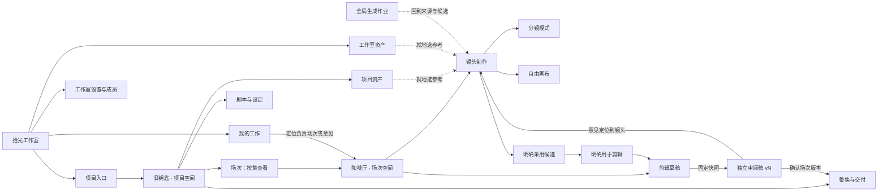

# 全局导航与核心页面流程 v0.1

历史原型记录（2026-09-10 整理）。导航推导保留，但本文截图、常驻网格和悬浮助手等早期布局不再作为执行规范。导航关系已随[当前核心体验 v0.3](scene-walkthrough-review-v0.3.md)获确认；当前采用大预览、中央输入、底部分镜条与非模态停靠。专项状态见[确认记录](approved-baseline-2026-09-10.md)。

[早期原型](http://127.0.0.1:4311/#/journey/)仍保留用于追溯；当前请打开[已确认核心体验](http://127.0.0.1:4311/#/journey/?variant=recommendation&screen=production&mode=storyboard&tone=light&assistant=off)。两者均为内存演示，正式业务工程仍暂停。

## 1. 推荐结构

工作室导航常驻窄栏。进入项目后展开项目目录，默认打开“场次”；进入场次时收起项目目录，通过面包屑返回，或从场次名称打开跨集场次切换器。生成作业在右上角始终可达。

场次顶层只有“镜头制作／剪辑”。“分镜模式／自由画布”属于镜头制作；审阅稿用单独的版本与状态入口打开。审阅时突出版本身份和返回当前剪辑的入口，避免把固定稿当作正在编辑的草稿。

## 2. 为什么这样安排

| 决定 | 本轮判断与取舍 |
|---|---|
| 工作室的默认入口是项目 | 用户首先需要定位制作对象。我的工作提供个人跨项目的快捷入口，不要求先建立复杂任务体系 |
| 项目默认进入按集组织的场次 | 首期主任务是团队完成一场戏，默认目录应直接承接这个动作；暂不增加一个只汇总数字的必经概览页 |
| 场次创作时收起项目目录 | 六镜头、参考和当前候选需要画面空间。顶部保留项目、集、场次上下文与返回入口，减少迷路成本 |
| 制作方式在场次内部切换 | 两种方式操作同一组镜头、提示词、参考、候选和采用。用户切换表达方式，不复制一套场次数据 |
| 审阅入口携带版本与状态 | 团队审的是一份固定内容。把它与可修改的制作／剪辑区分，意见才有稳定时间点和对象 |
| 参考、作业、助手按需打开 | 高频工作保留在创作区；选参考与定位生成结果不要求先离开当前镜头 |

这是一套建议，不是“行业标准布局”的事实主张。仍需由实际用户验证导航可发现性、分镜密度、画布与局部编辑的空间分配。

## 3. 各类入口的归属

| 入口 | 管什么 | 本轮如何体现 |
|---|---|---|
| 我的工作 | 我负责的场次、协作事项与需要处理的审阅意见 | 咖啡厅负责事项、v1 的 SH-04 意见，分别直接定位制作或固定稿 |
| 工作室资产 | 可跨项目复用的资源与指定版本 | 共用风格、情绪参考；制作中可切换范围选取 |
| 项目资产 | 本项目角色、场景、道具及其版本 | 旧钥匙的确认资产，镜头就地引用 |
| 生成作业 | 提交、执行、结果与来源 | 全局抽屉；本轮模拟完成后可定位对应场次／镜头／候选 |
| 项目场次 | 集下面的制作单元 | 两集、三场不同示例，展示负责人、镜头数和最新审阅状态 |
| 整集与交付 | 场次版本进入整集，以及后续整集工作 | 明确引用某个已确认版本；后续场次变化不自动替换该引用 |
| 工作室设置 | 工作室切换、成员、权限、用量 | 左下低频入口，本轮只说明归属 |

“我的工作”不能被包装成生成队列；“资产库”也不代表每张候选都要先升为正式资产。这里只用固定样例说明归属，实际资源管理仍遵循已有资产设计。

## 4. 核心页面的信息组织

### 项目入口与项目场次

项目入口用封面、名称、内容类型和基本规模帮助辨认项目。项目内默认按集展示场次，一行只包含场次身份、镜头数、负责人、最新审阅和进入动作。剧本、项目资产、整集与交付在项目目录中。

### 镜头制作：分镜模式

主体展示全场有序镜头，当前镜头用细边框标明。局部制作区集中候选、参考、提示词及生成计划；细节和连续性要求按需展开。必要的“正在看／采用／剪辑用”分开显示，不用颜色或选中边框暗示采用。

本轮分镜使用三列网格，较窄窗口降为两列。这里讨论的是信息组织，未定最终镜头卡尺寸；竖屏画幅完整显示，不为了填卡裁掉人物。

### 镜头制作：自由画布

场次中的多个镜头和当前参考同时出现在空间内；当前镜头放大，局部输入与分镜模式共用。可以摆放节点、平移、缩放及“适应全场”，键盘聚焦节点后使用 Alt＋方向键移动。节点位置与视野在切换制作模式后保留。连线只示意参考关联，位置不表达播放顺序。

本轮使用轻量原型验证导航和空间组织，不是 React Flow 的最终接入。新结果在候选栏中选择，画布当前镜头同步显示所选候选；画布只展示当前前两项参考，其余仍在局部参考区。候选独立分支节点、无限扩展、批量框选、连接编辑、撤销等仍由既有画布契约覆盖，未在本原型全部实现。

### 剪辑与固定稿审阅

剪辑以预览、分镜条和当前镜头操作组成。明确替换实际用片、调整顺序和使用时长后，再固定审阅稿。审阅页保留版本选择、固定分镜条、时间点意见和确认动作；点击意见回到来源镜头，带入本版意见继续制作。

每份固定稿保留自己的镜头、候选和时长。改变草稿不会覆盖旧稿；确认只适用于这个场次版本，整集需要独立判断。

## 5. 建议连续体验

1. 从“项目”进入《旧钥匙》，查看第 1 集，进入咖啡厅。
2. 打开“审阅稿 v1 · 需修改”，找到 00:24 的 SH-04 意见，点“按此意见继续制作”。
3. 在 SH-04 添加旧铜钥匙参考，调整提示词，在分镜／自由画布间切换，检查上下文是否连贯。
4. 点“查看计划 → 模拟生成新候选”，得到 C。观察：正在看 C、采用 A、剪辑用 A。
5. 点“采用 C”，此时剪辑仍用 A；再点“将 C 用于剪辑”。
6. 到“剪辑”，查看实际用片 C，可调整时长／顺序，点“生成审阅稿”，固定 v2。
7. 切回 v1，验证 SH-04 仍是 A，意见仍是旧时间点；再次返工可以生成新候选和新版本。
8. 对 v2 点“确认可用于整集”，回到项目“整集与交付”，明确将咖啡厅 v2 加入第 1 集草稿。
9. 打开“我的工作”“生成作业”“工作室资产”，检查它们的范围和回到创作的路径是否清楚。

可从同一项目切到第 2 集、另一个场次再返回，检查场次草稿隔离。模式、当前镜头、当前版本、集和页面写入 URL，支持浏览器前后退；制作事实仅在本轮内存中保留。明暗切换只改变视觉，不改变内容。

## 6. 已做与尚未做

已做：一套独立可点击导航原型、按需抽屉、基本画布摆放／视野、场次双模式共享输入、生成候选模拟、明确采用与剪辑替换、基本组接、固定审阅与返工、场次版本进入整集草稿。

限制：重复使用已有静帧，其他场次媒体也为占位；无真实生成、视频播放、声音合成、字幕编辑、费用或权限执行、多人同步、生产存储和真实导出。剧本本轮只读，工作室管理与整集详细制作只展示入口，不能用本原型替代对应专项完整设计。自由画布候选分支不完整。

沿用 Mantine、Phosphor 和已确认的视觉原则，不新增组件依赖、不修改第三方源码。预览浅色是起始样例，可以切换深色；不代表明暗选型已确认。

## 7. 评审重点与下一步

- 是否能清楚回答：我在哪个项目／集／场次，眼前在编辑什么，怎样回到上层？
- 分镜与画布能否被理解为同一场次的两种制作方式？
- 局部制作区是否足够集中且可读，参考、提示词、候选和主要动作是否易找？
- 从审阅意见回到镜头继续做，到再次送审，是否顺手？

本轮确认后，再细化选定布局的空状态、失败／等待／冲突，以及剧本、声音、整集、资产详情等专项页面。保持设计阶段，不因原型能点击就宣告工程就绪或业务验收完成。

依据：[共同视觉语言](shared-visual-language-v0.1.md)、[场次 MVP 决策收口](../implementation/14-scene-mvp-closure.md)、[双模式契约](../implementation/18-canvas-workspace-contract.md)、[当前设计收口](../implementation/19-design-closure-and-implementation-entry.md)。

## 8. 本轮效果与检查

下图为本地页面实际截图，不是额外的另一套布局方向。

| 页面 | 截图 |
|---|---|
| 项目内的场次列表 | [查看](../../output/playwright/2026-09-10-navigation-journey/02-project-scenes.png) |
| 分镜模式 · 浅色 | [查看](../../output/playwright/2026-09-10-navigation-journey/03-storyboard.png) |
| 自由画布 · 浅色 | [查看](../../output/playwright/2026-09-10-navigation-journey/05-canvas.png) |
| 剪辑草稿 | [查看](../../output/playwright/2026-09-10-navigation-journey/07-cut.png) |
| 固定稿审阅 | [查看](../../output/playwright/2026-09-10-navigation-journey/08-review-v2.png) |
| 导航总览 | [查看](../../output/playwright/2026-09-10-navigation-journey/09-navigation-map.png) |
| 1366 宽窗口 · 深色画布 | [查看](../../output/playwright/2026-09-10-navigation-journey/10-canvas-dark-1366.png) |
| 1366 宽窗口 · 深色分镜 | [查看](../../output/playwright/2026-09-10-navigation-journey/11-storyboard-dark-1366.png) |

类型与构建、既有 UI 规则检查通过，并实际走通返工、采用、替换、固定版本和跨场切换；详细范围与修正见[检查记录](../../output/playwright/2026-09-10-navigation-journey/verification.md)。这不是生产业务验收。
