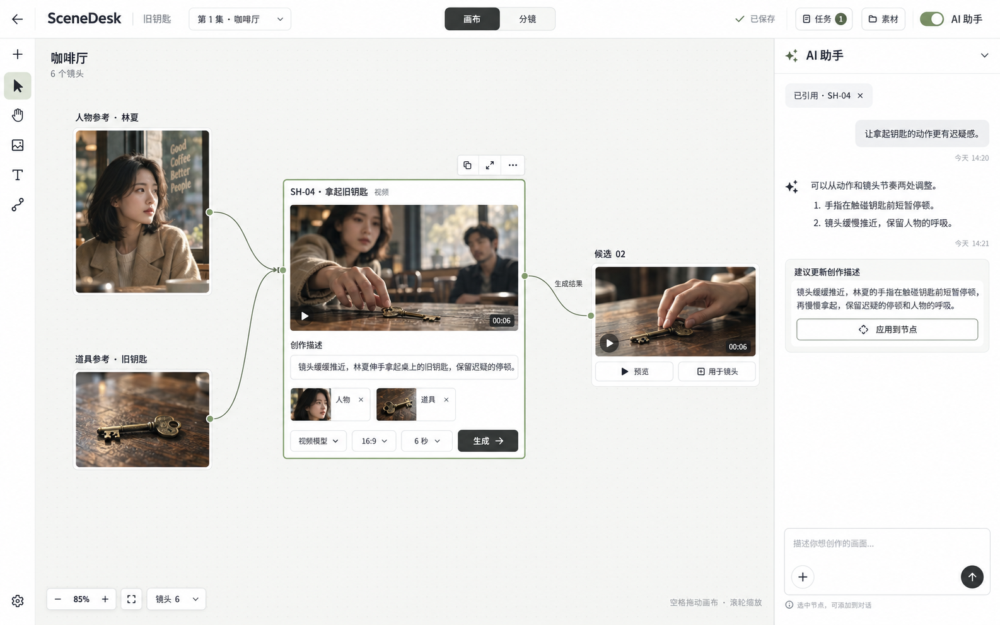

# 主创作工作区 · 已确认结构

2026-09-14，用户先要求列出修改点对齐，再明确默认画布、保留完整分镜、画布 UI 与交互参考 LibTV、顶部居中切换模式、左侧优雅切换集／场次。查看下列完整效果图后回复「ok」，授权按图落地。

图由内置 imagegen 生成，是用户确认的 SceneDesk 设计稿，不是 LibTV 截图或已运行的产品。本次用图替代 v0.5 的相关结构约定；已有保存、固定输入、权限、生成与未知恢复规则继续适用。它也不授权真实付费模型调用。

## 已确认要求

1. 进入场次默认自由画布；完整保留分镜模式。模式控件顺序为「画布 / 分镜」，在桌面顶部相对于整页居中，打开助手后不偏移。
2. 一层顶部导航，左上角集／场次一体选择器，展开后按集分组与搜索。收起全局工作室侧栏，返回入口保留。
3. 左侧窄创作工具栏；底部缩放、适应内容与镜头导航。不会持续展示全宽上传失败面板或分镜条。
4. 中央采用可自由移动、缩放与连接的内容节点。草稿的输入、引用和必要生成选项随节点展开，专注编辑继续使用同一会话。
5. 参考连线表达实际启用输入。真实生成结果可在原处查看并明确放到画布；结果放置、镜头关联、候选采用仍是不同动作。
6. 右侧为贴边、满高的 AI 对话侧栏；消息、上下文、建议和明确应用保留真实持久协议。打开侧栏不改变世界坐标或选择。
7. 两模式和场次切换保留草稿、选择、视图位置。保留失败时停留原页，明确说明原因。
8. 沿用 SceneDesk 英文品牌、现有中性主题、Mantine 与 Phosphor。媒体比例、中文可读性、焦点与错误恢复均纳入真实浏览器验收。

## 图中信息的实现边界

- 图中的人物、媒体和对话用于解释布局；正式页面必须读取当前项目真实内容，不硬编码图中媒体或虚构模型结果。
- 未明确放置的结果是只读结果预览，不能伪报持久节点。正式生成仍先准备固定计划，再明确执行；无供应商授权不进行付费调用。
- 浅色是本图展示状态，保留已有深色主题。集／场次选择器展开、任务失败、空场景和窄屏由同一结构延伸，不新开视觉方向。
- 竞争产品一手证据与未知项见 [LibTV 复核](research/2026-09-14-libtv-primary-workspace-review.md)；不以旧指南中的 Codex 右侧浏览器说明推断 LibTV 内部布局。

## 验收

生产构建实看整体结构、居中偏差、两种模式、节点编辑与连线、助手开合、集／场次导航、真实导入失败恢复、实际结果预览和明确放置。覆盖桌面与窄屏；核对未发送草稿、模型参数和 viewport 在切换／刷新后保留。实际完成证据另记实现说明，本设计确认不替代验收。
