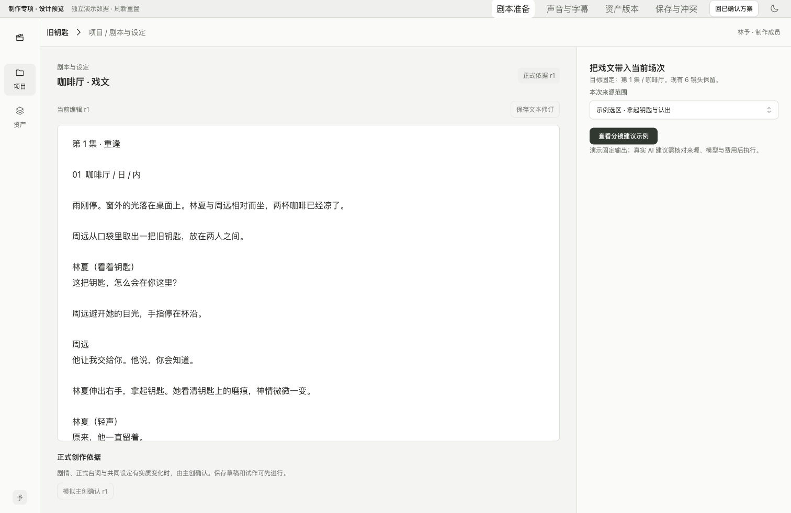
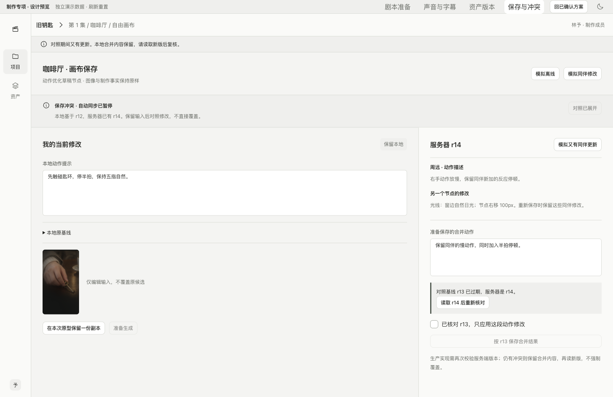

# 制作专项交互设计 v0.4

日期：2026-09-10。状态：基于已确认核心工作区补齐的设计推荐；用户反馈“暂时没有问题了”，本轮评审暂无异议、暂时收口，保留后续调整空间。本轮仍为设计与本地原型，不启动正式业务工程。

[核心工作区确认记录](approved-baseline-2026-09-10.md) → [已确认连续体验 v0.3](scene-walkthrough-review-v0.3.md) → 本文。业务范围保持不变；技术协议已同步实施包1.3与OpenAPI 1.3.0，新增编辑工作稿恢复见[21](../implementation/21-technical-baseline-closure.md)，不新增通用 Agent、完整 NLE、外包协作或实时共同编辑。

## 1. 本轮交付与阅读方式

四项样例复用现有 `#/journey/` 路由，以 `variant=finishing` 隔离。核心原型顶部新增“专项设计”；专项顶部切换四个主题。专项之间保留本次演示状态，刷新重置；它与核心连续原型使用独立数据，返回核心原型会重新载入其示例。

- [剧本准备](http://127.0.0.1:4311/#/journey/?variant=finishing&topic=script&tone=light)
- [声音与字幕](http://127.0.0.1:4311/#/journey/?variant=finishing&topic=sound&tone=light)
- [资产版本](http://127.0.0.1:4311/#/journey/?variant=finishing&topic=asset&tone=light)
- [保存与冲突](http://127.0.0.1:4311/#/journey/?variant=finishing&topic=recovery&tone=light)

专项页顶部细条属于评审工具，不进入正式产品。正式入口分别属于项目的剧本与设定、场次剪辑、资产详情，以及当前编辑对象的保存状态。仍采用 Mantine、现有图标与语义主题，无新增组件依赖。

## 2. 剧本进入制作

### 2.1 设计判断

剧本页承担“保存并明确创作依据、把指定内容变成可检查的制作结构”。现有戏文应能直接使用，不把自动创作整部剧设为必经流程。

默认页面左侧为戏文及修订，右侧按需展开分镜提案。首次进入只显示来源、目标和准备入口；有提案后再显示逐项编辑与采纳，不把长篇剧本、结构树、所有资产和聊天同时铺满。

### 2.2 页面和操作

| 区域 | 信息与主要操作 | 保存或执行的边界 |
|---|---|---|
| 戏文 | 文本、当前修订、未保存提示、保存修订 | 保存只建立新文本修订；不更改正式依据，不触发 AI |
| 正式依据 | 当前正式 rN、与编辑稿的差异 | 主创明确确认，保留旧依据；确认文本不等于影片通过 |
| 来源范围 | 选中原文及其固定修订；明确附带设定 | 不默认发送全项目，不能把旧选区标成新修订的来源 |
| 目标 | “追加到第 X 集／某场次”或“新建结构” | 当前场次入口默认追加；名称相同不意味着覆盖 |
| 提案 | 固定原文、叙事意图、对白、建议镜头、勾选项 | AI 输出先作为 Proposal；修改提案不改现有镜头 |
| 采纳 | 明示新增数量、依赖与目标 | 原子新增选中项；已采纳结果可追溯，重复提交不重复创建 |

制作成员可以调整景别、运镜、提示措辞和试作方法。改动剧情、正式台词或共同设定时提示与正式依据的差异，按 14 的确认范围处理；不把所有生成都变成一轮人工审批。

已有 CSV 走预览、列映射、行错误、目标映射和采纳，沿用相同新增提案语义，导入本身不调用模型。完整 CSV 编辑器本轮未制作。

### 2.3 状态与恢复

- 未保存文本：先保存来源修订再准备提案。长文本保存失败保留输入，不清空选区。
- 来源选区已改变或移除：标记原提案来源，不能静默重新截取最新文本。重新准备需用户看到新范围。
- 剧本／场次结构基线变化：当前勾选、人工编辑和原始输出保留，重新查看差异后才能采纳；工程采用既有版本检查。
- 采纳部分条目：说明本次新增项，未选项保留在提案历史；同一已采纳提案不接受另一组选择重新执行。
- 草稿依据允许试作，但成片正式确认前需列出实际所用依据的缺失或不一致。

### 2.4 样例边界与验收

原型提供戏文修订、正式依据的模拟主创确认、固定选区／整场来源、两条固定建议的编辑和勾选，以及采纳结果摘要。它只演示一份提案，不调用文本模型，不解析任意文本，不向核心原型或服务器新增镜头。

进入工程时至少验收：来源与目标准确；原镜头不变；新的镜头没有伪造生成或采用；脚本保存不自动换正式依据；提案过期、重复采纳及对象基线变化均能恢复。字段及事务见 [14](../implementation/14-scene-mvp-closure.md#4-提案直接进入当前场次)。

## 3. 声音、字幕与轻量剪辑

### 3.1 设计判断

声音与字幕属于场次剪辑的实际内容。镜头生成可以带原生声音，也可以只有画面；工作台需要明确保留什么、替换什么，以及时间如何对应，而不是要求先把所有声音统一拆轨。

主区继续用大预览和分镜条。右侧局部操作分为声音、字幕和按需时长影响；常态不铺完整多轨时间线。工程中应可切换具体声源／字幕条目；本轮只展开 SH-05 的对白和 SH-04 的时长影响示例。

### 3.2 声源与混合规则

1. 原生混合音轨默认保留，界面显示它可能包含对白、环境和配乐。
2. 导入或生成替代对白后，明确选择原视频片段是否静音。混合轨整体静音不能被描述为只移除对白。
3. 对已知包含同句对白的原轨与替代对白，提示重复来源并要求解决；未知原轨内容要求实际回放核对，不能一律假设有对白或强制静音。
4. 独立对白、环境、音效和配乐各有媒体来源、源区间、场次位置与音量。轻量工具覆盖选用、裁切、位置与基础音量；高级降噪、对白分离、总线和完整混音交由后期专项。
5. 台词绑定说明“这条声音用于表达哪句台词”，不自动证明词句正确、表演合适或口型同步。

音色生成仍受具体模型与账号能力约束；本轮不引入新供应商，也不承诺 Seedance 的所有服务配置都返回可编辑分轨。

### 3.3 字幕规则

- 区分导入 SRT、实际音频转写、从计划台词整理的字幕草稿。页面常驻来源和核对状态。
- 每条记录文字、开始／结束、说话人或台词关联及来源；正文可改，时间可调。展示用秒或时间码，工作稿保存用户时间输入；应用到可渲染稿及渲染沿用既有整数帧／采样和统一归一规则。
- 入点应早于出点，不能超出目标成片；跨镜头字幕不默认删除。重叠的处理按字幕轨规则提示，不根据文字长度猜时间。
- 编辑文字或位置后，相关人工核对状态失效；仍可固定为待审稿，但不能自动标为经过回放验证。
- 固定稿携带当时的字幕与音频配置。草稿修改不回写旧稿。
- 预览里的字幕属于影片内容，不随工作台明暗主题反色；示例复用固定的白字与深色字幕底。工作台主题只改变周边控件。
- 按实际有的数据导出 SRT，烧录和外挂字幕显示方式分开。没有字幕时不导出空文件冒充完整交付。

### 3.4 改变镜头时长

保持时长是默认替换方式：选择足够长的合法源区间，后续位置保持；不足时不自动变速、循环或补帧。

主动改变时长时，先显示影响预览：本镜头源区间和总时长、后续主视频位置，以及受影响的声音、字幕与已知台词绑定。对每条受影响内容提供保持原场次位置、随明确关联调整或手动修订／移除的选择。跨切点、超界和失效关联必须逐项处理，未解决时不能提交完整剪辑更新。

示例：SH-04 由 9s 改为 6s，SH-05／06 前移 3s；字幕 31–35s 可明确移到 28–32s，或保留后回放检查；原 0–46s 环境声不能静默越过新的 43s 片尾，须明确裁切或移除。未完成选择先保存编辑工作稿；选择完成并归一确认后，按Cut和工作稿双版本检查一次应用到可渲染稿。

更新期间别人改变剪辑：保留本次候选、区间和影响处理，读取新版重新计算；已成功的采用可以保留，剪辑更新不应被假装已经完成。

### 3.5 样例与验收

原型可编辑示例音轨开关、替代对白、音量、字幕文本和区间；可选择时长影响并固定 v2，再回 v1 核对不变。它没有实际媒体、音量处理、转写、播放器、字幕文件和渲染。“模拟已核对”仅用于状态展示。

工程验收需用真实音视频覆盖：音画及字幕来源、原轨选择、非法区间、短素材替换、跨切点处理、绑定失效、CAS 冲突、回放与旧稿固定。依据 [02](../implementation/02-interaction-spec.md#6-剪辑提交审阅与返工) 和 [13](../implementation/13-production-quality-and-handoff.md)。

## 4. 资产详情、版本与使用范围

### 4.1 设计判断

资产详情首先帮助制作成员辨认内容、选择确切版本，并知道这次引用影响哪里。把版本和用途放在媒体旁边，历史与使用位置按需展开；不做一个占满字段的资产管理表单。

| 页面区域 | 内容 |
|---|---|
| 资产身份 | 名称、类别、角色／造型／用途、所属项目或工作室共享范围、负责人 |
| 主媒体 | 当前版本的可辨认图片／视频／音频，必要的多角度参考；不只依赖缩略图 |
| 版本 | vN、草稿／已确认状态、变更说明、创建者与时间 |
| 本次引用目标 | 当前场次、镜头／画布草稿、用途、仅本次／保存到镜头要求 |
| 使用位置 | 当前草稿、其他镜头、已提交计划、固定审阅稿分别列出 |
| 低频操作 | 新建修订、确认设定、共享、归档，按项目角色授权 |

### 4.2 版本语义

- 浏览 v2 不自动升级任何引用；明确“本次尝试引用 v2”只改目标生成草稿。
- “保存为镜头默认参考”另有明确动作；同一人物和用途按既有优先级解析，替换、追加、仅本次排除不能混为“上传成功就引用”。
- 草稿资产可以试作，展示与正式依据的差异；不能因此标为已确认，也不要求每次试作先确认资产。
- 其他镜头仍用 v1，已提交计划及固定稿的资产版本不可变；项目默认版本升级也是独立决定。
- 项目素材发布为工作室共享是独立授权动作。浏览共享区不扩大项目权限；候选片段也不必先升为设定资产才能被找到。
- 同一物体在戏里的持有者、位置和状态属于场次／镜头要求，不反复创建新的全局资产身份。

### 4.3 异常与恢复

引用版本有更新时只提示可比较；归档／撤权／媒体未就绪分别表达，旧引用的合法保留和新输入使用遵守 18。新版本媒体处理失败保留草稿，不能改变旧版本字节。目标切换后已打开的引用操作仍显示原固定目标，重新选择须显式改变目标。

原型用同一钥匙图展示 v1/v2 的设定文字差异及单一草稿引用变化；共享范围为已授权示例。没有真实上传、版本创建、共享写入、归档或完整权限执行。工程参考 [资产专项](../ai-drama-workbench-assets-v0.1.md)、[02](../implementation/02-interaction-spec.md)、[18](../implementation/18-canvas-workspace-contract.md)。

## 5. 保存、离线与多人冲突

### 5.1 常态与入口

保存状态属于正在修改的具体对象：剧本文本、镜头要求、编辑工作稿、可渲染Cut、画布文档分别有版本。页面不能把“本机保留”“服务器保存成功”“生成提交成功”合成一个勾。

常态使用简短状态；离线、失败或冲突时在工作区显示持续条带和可执行入口，保留实际编辑。对照处理占布局空间，原修改仍可见；不把长时间恢复流程塞进会遮住输入的全高抽屉。

| 状态 | 信息与允许动作 | 阻止条件 |
|---|---|---|
| 已保存 | 明确对象与服务器基线 | 不暗示模型已执行 |
| 保存中 | 同对象串行请求，新输入排队 | 旧响应不能覆盖新输入 |
| 本机待同步 | 内容保留在本机；网络与授权恢复后核对 | 不使用未同步草稿创建假固定计划 |
| 保存失败 | 原内容保留；按明确原因重试同一保存 | 保存重试不能调用模型 |
| 保存冲突 | 本地基线、服务端新版本、受影响对象 | 停止自动覆盖；不提供默认“强制覆盖全部” |
| 权限失效 | 明确失去访问，停止请求与清理敏感缓存 | 不能以本机副本绕过撤权继续浏览／导出 |

### 5.2 冲突处理顺序

1. 保留本地基线、当前修改和在途请求；停止自动写入。
2. 读取有权访问的最新版，展示共同基线、本地修改与服务端变化。首版不宣称自动语义合并。
3. 用户选择要重放的节点／边／组或手动合并文本。对已删除或共同修改的对象逐项处理；未选择的同伴变化保留。
4. 以刚查看的新版本再保存；保存前仍由服务端检查版本。对照期间再次变化，保留手动合并文本，再读取与复核。
5. 保存成功是新的修订；恢复历史按21有限保留，固定业务证据独立保护。恢复画布不执行旧生成任务，也不撤销采用、用片或批准。

专项模拟 r12 本地动作修改、r13 同伴描述与节点位置变更，再保存为 r14。可继续模拟对照期间出现 r14，旧比较基线的提交会被拒绝，合并文字仍保留。

### 5.3 超时、离线与撤权

网络超时不立刻当失败重写：先读当前版本和内容，分别识别已保存、仍可重送同一保存或已冲突。画布规范化内容相同才确认成功，不能只看标题或旧 UI 状态。

真实画布本机恢复沿用 18 的 IndexedDB 分区、期限、容量和撤权清理。恢复先校验身份与访问，再决定是否展示和重新同步。本轮原型仅有页面内存副本，刷新会丢失，不宣称已经实现离线存储。

生成计划必须来自明确保存的实际输入。离线或冲突期间可以继续本地创作，但不能拿旧服务器内容默默代替当前画面提交生成。已经提交的生成作业独立继续，回来查原作业状态。

## 6. 实施前的操作验收表

这些是下一阶段业务实现的要求。原型走查只覆盖其中的交互表达，真实 AT 状态不因本表存在而变成通过。

| 编号 | 验收要点 | 既有契约归属 |
|---|---|---|
| DS-01 | 文本修订与正式依据独立，提案固定选区和目标 | 14：创作依据／提案 |
| DS-02 | 提案只新增选中内容；过期和重放不覆盖／重复 | 14：采纳事务 |
| DS-03 | 原生混合音轨与替代对白选择明确，未知内容需核对 | 02：声音与剪辑 |
| DS-04 | 字幕来源、文字、区间与核对状态可辨认，固定稿保持旧数据 | 02／03／11 |
| DS-05 | 时长改变可先保存未完成工作；全部声音字幕影响处理后，归一确认并双版本应用 | 02／06／11 |
| DS-06 | 浏览资产版本与改变目标引用分开，历史依赖不变 | 03／06／18 |
| DS-07 | 离线、保存失败、冲突与生成未知提交分别呈现 | 02／04／18 |
| DS-08 | 第二次冲突保留手动合并，不能默认覆盖同伴 | 18：保存与冲突 |
| DS-09 | 本机恢复先授权；撤权后不能绕过限制恢复或导出 | 05／06／18 |
| DS-10 | 两种模式及跨页面保持当前修改，真正提交使用正确对象版本 | 已确认 v0.3／18 |

原专项原型轮次没有变更业务契约；随后技术收尾已新增CutWorkDraft并同步OpenAPI1.3.0，详见21。现有界面示例未因此获得真实保存能力；不新增“画布生成订单”等平行执行模型。需按真实实现补齐的能力包括 CSV 完整录入、媒体回放与帧边界、真实渲染和导出、服务端 CAS、IndexedDB 和权限清理。

## 7. 设计推进状态

- 已确认：核心工作区、导航关系、场次连续流程，以及共同视觉语言。
- 本轮补齐、评审暂无异议：剧本准备、声音字幕、资产详情和保存恢复的具体页面与操作。
- 仍需真实证据：目标工作室的实际操作、音画质量、真实服务能力、协作与恢复、整集后期接手。
- 当前仍不启动正式工程。本轮设计暂时收口；后续按明确的开工授权推进已有实施工作包，真实验证发现的问题继续修订设计。

[本轮页面和检查记录](../../output/playwright/2026-09-10-production-details/verification.md)。旧实施 manifest 是 2026-09-09 的交付快照；本轮 UI 与文档的文件记录见 [设计交付清单](design-handoff-2026-09-10.json)，它是当次交付快照，不替代机器 API 契约版本，也不随以后文档维护回写；后续修订见[文档审计记录](../documentation-audit-2026-09-10.md)。

## 附录：页面实际效果

以下来自本地 Web 生产构建的浏览器截图；控件与状态可在文首入口操作。本轮专项评审暂无异议，后续调整以最新明确反馈为准。

### A. 剧本准备与可采纳提案

[查看提案与部分采纳结果](../../output/playwright/2026-09-10-production-details/02-script-proposal.png)。

### B. 声音字幕与时长处理

[字幕条目](../../output/playwright/2026-09-10-production-details/04-subtitle.png)／[时长影响处理](../../output/playwright/2026-09-10-production-details/05-time-impact.png)／[深色对照](../../output/playwright/2026-09-10-production-details/13-dark-sound.png)。

### C. 资产版本与引用目标

### D. 二次冲突与人工修改保留

构建、UI 规则检查、37 项交互走查与最终 2 项字幕样式复核通过；证据和原型限制见[检查记录](../../output/playwright/2026-09-10-production-details/verification.md)。
