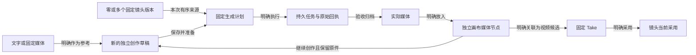

# SceneDesk 画布定位与交互结构审计

> 本文引用的部分源文件与 e2e 规格属于旧创作界面，已在 2026-09-21 阶段 3 删除（见 [85-studio-rebuild.md §1i](../../implementation/85-studio-rebuild.md)）；这些引用改为纯文本，内容按当时原样保留。

日期：2026-09-14。范围：为竞品调研后的新方案提供本项目事实、约束与待验证问题；不修改产品，不运行服务、模型或测试数据。代码基线为 `f4f005c981ea195dbca56c1c5d570de66470f994`，读取时 `HEAD`、`main`、`origin/main` 一致，即 PR #34 合入后。代码行号均指这一基线。

## 1. 结论与证据口径

SceneDesk 的画布应帮助创作者在同一场戏中组织想法、比较材料、形成新尝试，再将明确选中的成果交给镜头制作。独立探索和按镜头生产都成立；不需要先建立镜头才能创作，也不应把画布变成按连线自动执行的流程编排器。

当前业务模型已能区分这些事实，主要结构问题在呈现层：一次创作的对象操作、输入编辑、参考选择、固定任务和镜头关系分散在不同区域；同一画面允许存在几个不同的目标，却主要依靠标题和说明文字区分。上一轮把按钮收起、增加就近操作后，入口更紧凑，但没有完全解决“此刻正在看谁、改谁、执行哪份输入、成果用于谁”的关系。

本审计区分三种证据：

- **当前实现事实**：由最新代码及有效协议直接确认，可以复核具体对象、条件与布局机制。
- **已观察画面**：重新查看上一轮实际生产构建截图；它们来自隔离 API、PostgreSQL、MinIO 和技术媒体，不是设计效果图。单帧只能证明该状态的呈现，不能证明所有情况下都会拥挤或误操作。
- **设计推断**：上述结构可能增加目标辨认、找回结果或比较媒体的负担，仍需目标创作者实际任务验证；没有将自动化通过换算成人类操作效率。

下文代码文件位于 `apps/web/src/business/`。主要读取：CanvasBoard、场次工作区、画布生成接入、生成工作区、画布样式、镜头候选工作区、[画布控制器](../../../apps/web/src/business/canvas-controller.ts)。

[上一轮 E2E 说明](../../../output/playwright/2026-09-13-creative-experience/README.md)记录了真实编辑保存、刷新读回、指针拖动、继续创作、412 恢复、上传和播放。最终产品构建为 `093d8c5`；部分截图绘制于同片较早的 `652ab9a`，构建身份及修正顺序保留在原证据中。本轮未重新绘制当前页面，根任务另行实看。无真实模型执行和质量结论，未完成目标创作者可用性实验。

## 2. 原定位中需要保留什么

[已批准基线](../approved-baseline-2026-09-10.md#L9)、[连续体验 v0.3](../scene-walkthrough-review-v0.3.md#L48)、[18 画布协议](../../implementation/18-canvas-workspace-contract.md#L9)给出的定位是：面向中小型 AI 写实短剧制作工作室，以场次为工作空间，镜头或画布节点是其中的局部焦点。场次覆盖不等于首次进入必须把全场缩成小图，也不等于每个镜头都必须有一个固定大容器。

| 视图 | 主要问题 | 排序／结构依据 | 应共享的事实 |
|---|---|---|---|
| 分镜 | 这一个镜头要什么，现有候选是否合适，明确采用哪个区间？ | 镜头顺序、固定要求、候选及当前采用 | 镜头、修订、媒体、Take、采用记录 |
| 自由画布 | 这些文字、参考和成果有什么关系，如何组织并继续尝试？ | 自由空间、可选分组、当前输入引用 | 同一场次入口、媒体、固定计划／结果、明确镜头关联 |
| 助手 | 基于哪些固定材料，准备哪一种可审查建议？ | 明确来源、建议目标、建议修订 | 剧本／镜头／意见版本及明确应用记录 |

v0.3 的“短工具靠近对象、长输入中央有界、辅助栏按需打开”解决的是避免全屏表单和同时堆满面板；不是所有后续状态必须压入同一个底部面板的理由。[v0.4 专项](../production-detail-design-v0.4.md#L129)要求常态简洁、异常可操作，并明确本机保留、服务器保存、生成提交是不同事实。最新用户已要求重新设计，因此布局位置和层级可以重新验证；不能把历史阶段的“暂时收口”解释为禁止方案调整。

[38 首发范围](../../implementation/38-first-release-scope-review.md#L12)保留完整画布和原定 AI 链路，包括图片、视频、声音、固定输入、异步执行、归档及恢复。后期剪辑、渲染、商业计费、完整团队和运营仍后置。新方案不应为画面简洁而删去生成，也不应从竞品复制整图执行、工作流市场或完整 NLE。

## 3. 对象、状态与动作地图

### 3.1 业务对象不是同一种“卡片”

| 对象 | 真实含义 | 不能由什么动作隐式改变 | 依据 |
|---|---|---|---|
| Shot／ShotRevision | 镜头根与不可变的某版要求；根指向当前要求 | 浏览画布、移动节点、切换候选不能改要求版本 | 18:87–93；`CandidateWorkspace.tsx:285–289` |
| CanvasNode | 文字、创作草稿，或对固定媒体的空间呈现 | 草稿不能原地变成结果；固定媒体节点不能换文件而沿用身份 | 18:49–57 |
| CanvasEdge | 文字／已有媒体提供给某个草稿的当前输入，包含用途、启用和顺序 | 连线不代表播放顺序、任务依赖执行或已执行的历史来源 | 18:51；`CanvasBoard.tsx:334–347` |
| NodeShotBinding | 节点与本场镜头的明确关系：待选参考或视频候选 | 待选参考不改镜头默认参考；候选不自动采用；移除呈现不删除 Take | 18:89–93；`CanvasShotConnections.tsx:480–538` |
| shotSources | 某次生成明确选定的零个或多个镜头历史版本，可来自同项目其他场次 | 不等同镜头绑定，不按节点距离、当前镜头或最新修订推断 | [59:7–15](../../implementation/59-canvas-fixed-shot-sources.md#L7) |
| GenerationPlan／Job | 已固定输入与明确执行后的持久任务 | 后续提示、节点位置和浏览焦点不能改写任务；未知不能自动再提交 | 18:97–105；`MediaGenerationWorkspace.tsx:189–216` |
| Media／结果节点 | 已归档的实际文件，以及把它放回画布的独立呈现 | ready 不表示已成为候选、已采用或评审通过 | 18:101–105 |
| Take／Selection | Take 固定视频、区间及镜头要求版本；Selection 是明确采用事实 | 点缩略图只浏览；清除画布节点不清除采用 | `CandidateWorkspace.tsx:277–289,438–448,598–613` |
| Assistance artifact／proposal | 可编辑、可再次打开的建议及固定来源 | 阅读建议不应用，更不直接生成／采用；评论修改不静默升级固定意见 | 38:24,38；v0.3:84–91 |

这里的“候选”要保持当前实现的准确范围：镜头 Take 是合法区间的视频候选；图片和声音成果可作为媒体／参考使用，不能在方案中未经产品决定就一律画成可采用的 Take。

图中每个箭头代表不同操作，不能合成“一键生成并替换镜头”。从外部导入实际媒体也可以进入媒体节点或候选，不必先走 AI。

### 3.2 当前界面的状态分区

现在不是单一 `selection` 驱动全部工作：

- **场次视图**保存模式、视口和节点选择；`SceneProductionWorkspace.tsx:88–117,323–347`更新个人偏好与 URL。通用画布文档不保存这些个人状态。
- **画布内容**由 `CanvasController`／`EditingDocumentController`保存，拥有撤销、本机副本、待确认请求、当前权限、整文档 CAS 与恢复。见 `canvas-controller.ts:33–112`、`editing-document-controller.ts:89–108,151–157`。
- **当前编辑目标**来自恰好一个选中节点；`CanvasBoard.tsx:287–294,1020–1034`将该节点送入底部输入。
- **生成编辑目标**按画布／节点／媒体种类分区。画布提示、模型及 output 取节点内容；固定镜头来源等取生成草稿。见 `MediaGenerationWorkspace.tsx:116–157,409–424`、`use-generation-session.ts:29–46`。这两部分同属“一次创作”，但不是同一份保存记录。
- **固定任务浏览目标**是独立 `historyId`；`CanvasMediaGeneration.tsx:29–53`优先用它确定任务的原 nodeId，切换当前节点不会自动升级历史目标。用户可点“返回当前草稿”。
- **辅助工作目标**包括独立的镜头关联 `bindingTarget` 和助手 proposal；`SceneProductionWorkspace.tsx:279–302,330–342,526–557`让素材、画布历史、镜头和助手共用一个辅助栏位置。

这些分区保护了持久化与固定身份。新设计应该给出清楚的可见关系，而不是用一个全局“当前对象”把它们合并：切换浏览焦点不应改变已经打开的确认、任务、引用接收目标。

## 4. 当前结构问题及根因

### 4.1 选择节点同时改变工具、编辑目标与空间分配

`CanvasBoard.tsx:1020–1034`把当前节点编辑和整个生成工作区接在同一个 `localPanel`；`canvas.module.css:79–99,161–169,532–537`规定它是纵向 flex 中不收缩的一块，最高 `min(370px,42dvh)`、宽度上限 900px，并在内部滚动。它不是盖在 React Flow 上的透明浮层，而是实际挤占画布高度。

在[文字选中画面](../../../output/playwright/2026-09-13-creative-experience/803157f9-e122-4afa-9f9e-d8c6ef0140af/after/canvas-1440-selection.png)中，同一段文字同时显示在空间节点和底部编辑器；底部还显示与这次文字编辑无直接动作关系的“生成记录／选中草稿开始创作”。在[草稿参考展开画面](../../../output/playwright/2026-09-13-creative-experience/803157f9-e122-4afa-9f9e-d8c6ef0140af/after/canvas-1440-references.png)中，面板内需要滚动，视频节点延伸到可见画布下边界之外。

**根因与影响推断：**“选择以便操作”和“打开持续编辑”没有独立阶段；选择可能带来显著的空间变化。对象定位浮条、对象正文和实际编辑区不在同一处，使用者需要在它们之间往返确认。不能仅把面板再压矮：那会增加内滚动而不减少工作内容。需要验证短编辑就地、长编辑显式进入，以及稳定分配编辑区域哪种更合适。

### 4.2 通用节点动作没有充分反映对象类型

`CanvasBoard.tsx:664–718`对任意非空选择显示“继续创作／共同作为参考”。`CanvasContinueCreation.tsx:104–110`只因只读或空选择禁用按钮；但 `canvas-creation.ts:24–28`明确拒绝草稿作为参考。因此，当前选中“尚未生成”草稿时仍有可点的继续创作入口，点击之后才解释不能作为参考。上面的草稿参考截图可见这一入口；本轮依据代码确认条件，没有重新执行点击。

这是可直接改进的动作匹配问题。已有文字／媒体的下一步是“作为参考新建”；草稿的下一步是“编辑输入／准备生成”；已固定任务的下一步是“查看原输入／查询状态／取回结果”。不能为了按钮统一而允许未完成草稿充当未来结果，或让所有状态只提供相同的“继续”。

### 4.3 当前草稿与历史执行在同一区域，空间节点缺少任务可见性

`CanvasMediaGeneration.tsx:29–53,98–124`使用文字下拉选择历史，再打开固定任务；历史可来自已删除的草稿。选中 B 时，上半编辑器可以是 B，而下半仍浏览 A 的历史。这是明确固定目标的合法行为，不是证据表明提交错对象；但用一个长面板承载两个目标，必须读“查看固定任务／返回当前草稿”才能理解状态。

另外，`CanvasBoard.tsx:124–131`对所有 draft 恒显示“尚未生成”，节点展示数据 `84–93`没有任务状态；真实任务和归档状态在生成工作区。已有历史任务不应该使修改后的草稿自动变成“已完成”，但也不能把“该节点仍是草稿”表述成“从未发起过生成”。

**结构方向：**将“当前可编辑输入”和“某次固定尝试”作为可辨认的两层。任务入口可显示只读阶段、结果缩略和来源定位；未决恢复在切换选择后仍有稳定入口。不能往 `CanvasDocument` 塞入 job 状态，也不应给每个离屏节点启动独立轮询。节点已删除时继续读原任务与媒体；取回、复制和再次生成是三种动作。

### 4.4 多种“来源／关联”在流程上相邻，含义却不同

当前有画布引用边、固定镜头来源、镜头待选参考／候选绑定、助手来源四类入口。画布参考在底部，固定镜头来源在生成区域，镜头关联在右侧，助手在同一个 dock 中。`SceneProductionWorkspace.tsx:560–578,625–705`和 `MediaGenerationWorkspace.tsx:409–424`体现这个分布。

[59](../../implementation/59-canvas-fixed-shot-sources.md#L7)尤其明确：为生成选定镜头来源不写入画布文档，也不建立镜头绑定。用户却可能把“来自 SH04”“放在 SH04 旁边”“关联 SH04”“SH04 当前采用”理解成同一件事。

**结构方向：**持续区分“用什么生成”与“把成果用于哪里”。前者应可检查确切版本、用途和顺序；后者显示明确镜头及关系。场次镜头索引可以帮助从分镜定位已有节点和未归属探索，不能按空间距离自动选镜头，也不能强制所有自由节点入镜。音频还需呈现真实 typed dialogue／voice 来源，不能把固定声音版本简化成一张通用参考图片。

### 4.5 画布浏览与质量检查需要不同的空间，而不是不断叠加面板

画布把高媒体节点、文字、草稿放在同一自由坐标空间，本来就允许部分内容在视口之外；“适应内容”用于定位，不保证可以判断表情、动作或声音。不能把任意一张截断节点截图直接判成渲染错误。

但是既有布局没有为“持续修改时仍需看清作品”建立稳定优先级。底部编辑区改变画布高度，右侧 dock 固定占 360px（`canvas.module.css:203–215`）。[1366 深色分镜截图](../../../output/playwright/2026-09-13-creative-experience/803157f9-e122-4afa-9f9e-d8c6ef0140af/after/storyboard-1366-dark-assistant.png)同时打开创作输入、视频参数与助手时，竖屏主媒体也明显缩小；相应分镜输入的固定 flex 占用见 `candidates.module.css:112–129`。这说明简单把画布全部持续编辑搬到分镜式底部，也不能自动解决质量检查。

应验证一种随时可达的“看清当前素材”方式，以及返回后的选择、视口、编辑与播放状态。媒体保持 contain 与真实画幅；选中只作用于外框／工具，不能染色、调亮或裁切原片来突出选择。

### 4.6 离屏选择与窄屏说明了“空间操作”和“对象工作”不能完全等同

`CanvasSelectionTools`把浮条约束在视口内（`CanvasBoard.tsx:1466–1520`）。[实际离屏选择截图](../../../output/playwright/2026-09-13-creative-experience/803157f9-e122-4afa-9f9e-d8c6ef0140af/after/canvas-offscreen-selection-1440.png)中没有可见节点，左侧仍有带对象名称的浮条，底部仍可编辑原文字。上一轮已修复未明确对象名称带来的误认风险；不能继续声称当前工具条会操作邻近的错误节点。但这种状态也提示：所谓“就近”工具在对象离屏时已经是一个独立对象入口，应该明确提供定位和关闭编辑的选择。

`CanvasBoard.tsx:275–277,743–745`及 `canvas.module.css:313–342`在 760px 以下隐藏空间画布，改为列表。[390px 截图](../../../output/playwright/2026-09-13-creative-experience/803157f9-e122-4afa-9f9e-d8c6ef0140af/after/canvas-390-list.png)中空间缩放工具仍占据明显高度，列表和编辑内容排在其后。移动端当前承诺是查阅和有限操作，不是完整桌面制作；新方案应按这个任务重排入口，而不是把所有桌面浮层堆成纵向页面。

## 5. 可以重新设计与必须保护的边界

| 可以重新设计 | 必须保留的可观察行为 |
|---|---|
| 输入区在节点附近、稳定侧区或显式聚焦工作区；何时从选择进入编辑 | 草稿、确认和原请求绑定确切对象；选择／导航不替换它们，不因卸载丢输入 |
| 按节点种类和执行阶段组织动作；精简／重命名菜单 | 新建独立草稿不改源节点；复制不复制 job／采用／镜头绑定；结果不覆盖原草稿 |
| 将任务入口改成可识别列表、节点状态、场次待处理摘要 | 原 plan/job 身份、固定输入及回执仍可查询；unknown 只核对证据，不自动新提交 |
| 合理聚合引用检查与镜头交接入口 | 零／多固定镜头来源合法；顺序、用途、历史版本和 typed audio 不丢失；绑定与生成来源仍是不同事实 |
| 重新设计全览、聚焦、面板切换与媒体检查 | 位置不决定镜头顺序；移动不改变固定生成内容；无选择不猜最后镜头；不会因开栏自动缩放全场 |
| 简化保存、任务、恢复的视觉 | “本机保留／服务器保存／任务受理／结果归档”分别成立；异常持续可见，412 明确处理，撤权不能看本机敏感副本 |
| 调整分镜／画布之间的定位入口与空间关联标记 | 保留两种场次视图；每场同一张画布；未关联内容合法；多镜头关联不能按首个或最近对象暗选 |
| 改善只读、小屏和键盘路径 | 输入法、文本编辑、原生播放器和文件选择事件优先；重要动作不依赖精确拖线；小屏不虚称完整空间创作 |

[39](../../implementation/39-scene-canvas.md#L25)记录了现有控制器、原始缓冲、冲突重放、继续创作和上传恢复等基础；部分段落是早期状态，不能忽略后续 [59](../../implementation/59-canvas-fixed-shot-sources.md)、[60](../../implementation/60-canvas-complete-fit.md)和[63](../../implementation/63-creative-experience-refinement.md)已交付的变化。重设计应复用这些业务边界，不为改布局另造恢复状态机。

## 6. 三种结构选项

以下是待验证的结构，不是要求用户再次选择历史视觉风格。都使用同一中性语义主题、Mantine 和真实媒体。

| 选项 | 核心组织 | 优点 | 代价／必须验证 |
|---|---|---|---|
| A：画布直接编辑，长任务按需展开 | 单击选择和对象动作；文字／短提示就地编辑；明确“展开创作”才进入有界编辑区。任务和结果有独立稳定入口，辅助 dock 仍一次一份 | 最接近空间直接操作，简单文字不必打开全套生成面板；保留画布连续性，改动可分阶段实施 | 长中文、多参考、音频参数可能使就地编辑膨胀；缩放、离屏、浮层遮挡和键盘焦点必须验证。不能把全部任务表单挂在节点上 |
| B：稳定画布加一个对象工作栏 | 中央画布高度稳定；选中对象的检查／编辑在一个稳定侧栏中分阶段呈现；素材／助手以明确返回关系暂时替换或调用辅助视图，禁止再叠一个完整栏 | 目标标题、来源、参数、状态更连续；选择不反复改变可用高度，恢复入口固定 | 1366 下损失宽度；竖屏媒体、跨节点比较与长输入各自需要多少空间尚未验证。必须区分正在编辑对象与只读旧任务，不能让新选择覆盖原确认 |
| C：空间总览加可返回的聚焦创作视图 | 画布主要组织想法、参考和结果；显式打开一次创作后，在同场次内展开大预览、输入与固定尝试；返回精确恢复视口和选择 | 长输入、多来源、结果比较与异常恢复能完整展开；生成状态有稳定工作目标 | 增加一次进入／返回，可能与分镜聚焦重复、打断快速探索。不能成为新的第三种顶层业务模式，也不能强迫每次改一句话进入完整工作页 |

建议先比较 A 与 B 的同一任务原型，把 C 作为“长任务需要聚焦”的局部补充，而不是一开始再增加导航层级。理由是当前主要问题已定位在目标、空间分配和阶段披露，尚无证据证明需要重建数据模型或新增工作流系统。竞品调查应判断其做法解决了哪些相同任务，不以页面看起来更自由作为采用理由。

三个选项都应先完成同一动作矩阵：文字／已有媒体可作为参考新建；草稿可编辑与准备；固定任务可读原输入、查询和处理取消；ready 成果可查看、明确取回或交给具体镜头。只有跨这些状态仍明确的方案才值得继续高保真设计。

## 7. 真正需要验证的设计问题

采用同一组技术媒体和任务对比，首轮 3–5 位目标创作者足以发现结构问题，但不能据此宣称总体效率提升。观察首次错误动作、需要解释的位置、找回路径、媒体可辨程度和中断后能否继续；不预设“更快 30%”等结果。

| 设计问题 | 最短任务 | 判定关注点 |
|---|---|---|
| 选择是否应立即展开编辑？ | 浏览三份参考，只改其中一段文字，再继续浏览 | 是否误入生成、空间突然变化是否影响定位；编辑目标与文本选择是否明确 |
| 草稿与来源动作能否一眼区分？ | 选择文字＋图片建立新视频草稿，再单独选中草稿 | 能否预判下一步是编辑而非把未完成草稿当输入；原来源不变 |
| 不同参考关系是否可理解？ | 用本场一张图和另一场旧版镜头准备输入，暂不关联目标镜头 | 能否说清用了什么、哪版、什么顺序，以及尚未用于哪个镜头；音频替换为固定 voice／dialogue 再检查一次 |
| 当前编辑与旧任务能否并存而不误认？ | 打开 A 的固定任务，浏览／编辑 B，随后回到 A | 每个动作能否说出真实目标；不会把 B 输入当成 A 已执行输入，也不会为恢复 A 新建任务 |
| 任务结果能否离开原节点后找回？ | 模拟一次已受理任务，离开，再从已删草稿的历史找到 ready 结果并明确取回 | 找到原身份、正确理解 unknown／取消竞态；取回不执行模型、不自动候选或采用 |
| 画布与分镜能否自然交接？ | 将结果关联指定镜头为候选，切分镜比较，再明确采用；回画布定位 | 视频范围与固定要求可检查；浏览 B 时能知道 A 仍采用；自由节点不被强制归镜头 |
| 空间是否支持实际判断质量？ | 1440／1366 下查看竖屏视频并修改提示，开助手；小屏只查阅和找回 | 全图／放大入口是否清楚，输入与关键参考是否可同时理解；390 不把无效缩放工具放在主任务前面 |
| 中断后是否知道什么被保存？ | 本机编辑、服务器 412、已提交任务分别中断后返回 | 能分辨三种不同状态；编辑内容、原请求与当前权限持续有效；恢复不等于回滚采用 |

本轮只提出上述验证设计，不执行新的故障注入或模型请求。模拟阶段必须明确为受控状态，不把假任务结果混进真实项目；进入实施后再复用现有隔离真实 API／浏览器夹具验证协议边界。真实模型接入与质量验证仍是单独未完成的条件，不能由新画布效果图或本次文档代替。
