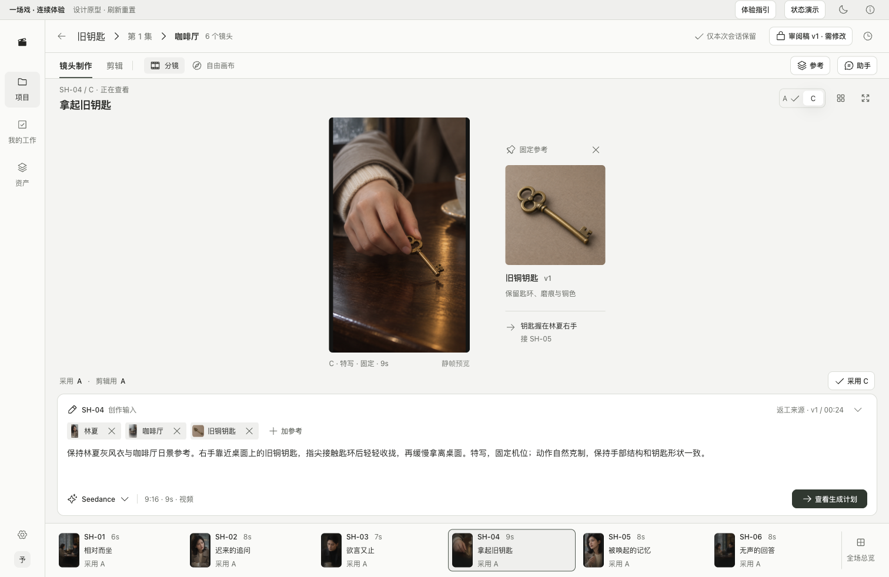
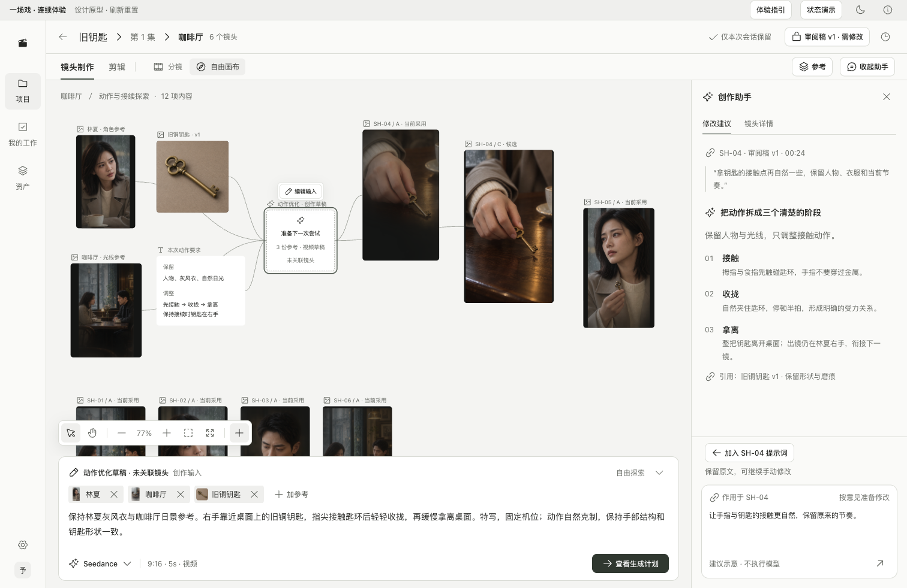

# 一场戏的连续体验与设计评审 v0.3

确认状态（2026-09-10）：核心工作区、导航与连续流程已确认；四项专项随后暂时收口，见[确认范围](approved-baseline-2026-09-10.md)。本稿仍如实记录原型边界，正式业务工程保持暂停。

日期：2026-09-10。状态：已确认的本地设计原型与独立走查记录。没有进入生产工程，也没有完成目标工作室真人测试。

## 1. 这轮回答的问题

一个制作成员能否在同一场次内，从现有意见与参考开始，完成输入、生成结果检查、候选比较、采用、组接、固定审阅与继续返工？工作过程中是否始终知道自己正在看什么、改什么、采用了什么，以及审的是哪一版？

每场次提供分镜／自由画布已经确定。本轮评审的是二者的空间分配、操作连续性和上下文保持，不再让用户选择是否保留画布。

[打开连续体验](http://127.0.0.1:4311/#/journey/?variant=recommendation&screen=production&mode=storyboard&tone=light&assistant=off)。沿用原有新方案地址；顶部新增“体验指引”“状态演示”。助手默认收起，按意见返工时展开。启动命令仍为仓库根目录 `npm run dev:web`。

## 2. 独立判断与本轮修改

推荐继续保留“中央画面＋有界输入＋底部分镜条／全场自由画布＋按需辅助栏”。这一结构已经具备清晰的主次；当前最明显的问题集中在跨步骤断点和状态表达，而不是需要再换一套总体布局。

| 原型中的问题 | 为什么影响创作 | 本轮处理 |
|---|---|---|
| 新版进入剪辑、审阅和项目时跳到另一套原型 | 刚修改的输入、采用与用片无法接着核对 | 在同一个原型会话中承接这些页面，共享明确的制作事实 |
| 比较区写死 A 标签，查看 A 时可能出现 A/A | 看不清实际比较对象，采用后的标签可能错误 | 比较当前候选与另一个不同候选；各标签由候选和采用事实派生 |
| 分镜条部分“采用 A”写死 | 画面已改变，摘要却不变，破坏可信度 | 缩略图、候选、采用和用片分别读各自状态 |
| 独立画布草稿切回分镜，预览与输入可能指向不同对象 | 有把探索输入误认为当前镜头提示词的风险 | 分镜始终恢复镜头；回到画布保留原独立草稿，不替它创建镜头归属 |
| 只有生成计划，没有可继续检查的结果流程 | 无法验证等待、失败、结果回收与后续采用 | 增加内存模拟作业和结果定位；提交保存输入快照，继续编辑不改动本次作业 |
| 未选对象时引用默认落到 SH-04 | 用户没有做目标选择却产生引用 | 没有目标时可浏览但不能引用；已打开的选择器保留明确目标 |
| 已引参考不能移除，快选可能被输入容器裁切 | 参考组合不完整，局部操作难以完成 | 加入明确移除；短选择器使用小浮层，长素材浏览仍非模态停靠 |
| 画布只含少量局部镜头、定位新结果不明显 | “全场次画布”难以承接其余镜头和新分支 | 补齐示例镜头节点、新结果节点、适应内容与定位当前内容；位置不代表剪辑顺序 |
| 底部反馈提示压住分镜条 | 高密度连续点击时遮挡下一步目标 | 简短反馈移到原型顶部状态区，持续任务留在对象和作业面板 |

这些是基于代码、页面行为和浏览器检查的修正。不能据此断言真人效率已经提高，也不能把设计原型的状态处理直接当作生产实现。

## 3. 推荐的实际体验顺序

全程约 8—12 分钟是主持测试的时间预算，不是已经测得的任务耗时。

1. 打开“体验指引”，从 v1 审阅开始。确认咖啡厅 / v1 / SH-04 / 00:24 的意见。
2. 点“按此意见继续制作”。查看大画面、固定钥匙参考和中央输入。返工入口只定位与带入出处，不改写原文。
3. 先切到 SH-05，再把建议加入 SH-04，观察当前输入是否仍属于 SH-05；回 SH-04 核对追加内容。
4. 添加、移除与固定查看参考；在分镜和画布间切换，查看同一镜头的输入是否一致。
5. 从“查看生成计划”模拟提交成功。等待时切换其他镜头；回来源查看新增 D。当前采用与剪辑使用仍是 A。
6. 并排比较 A/D，明确采用 D，再明确将 D 用于剪辑。两步分开表达两个事实，不让新结果自动改变用片。
7. 进入剪辑，核对 D、顺序和使用时长，生成 v2。切回 v1，SH-04 仍使用 A。
8. 在 v2 写意见，切到 v1 再返回，检查草稿隔离；添加意见，按它继续返工，或确认 v2。
9. 从项目的“整集与交付”明确引用已确认的 v2。再从“我的工作”返回咖啡厅，检查原输入与采用保留。
10. 在画布编辑一个未关联镜头的草稿，切回分镜再返回；空白取消选择时，不出现暗中沿用上个镜头的输入。

## 4. 全局导航与各页职责

工作室层为“项目／我的工作／资产”，设置放低频入口。项目层为“场次／剧本与设定／项目资产／整集与交付”。场次层为“镜头制作／剪辑”，分镜和自由画布属于镜头制作；固定审阅稿从带版本和状态的独立入口进入。

进入制作后收起项目目录，顶部保留项目、集、场次及返回。离开制作浏览目录不重置场次草稿。原型目前只展开一个项目、一个场次的数据；跨真实场次的保存、权限和多人同步继续由既有工程契约负责。

| 页面或工具 | 首要内容 | 主要动作 | 不承载的职责 |
|---|---|---|---|
| 项目入口 | 封面、项目名称、类型 | 进入项目 | 不成为必经数据大屏 |
| 项目场次 | 按集列出场次、负责人、镜头数和最新审阅 | 进入制作 | 不混入每次生成作业 |
| 分镜制作 | 当前镜头大预览、候选、实际输入、全场顺序 | 检查、编辑、比较、采用 | 采用不自动替换剪辑 |
| 自由画布 | 全场镜头、参考、草稿和结果的空间关系 | 探索、定位、组织、局部编辑 | 节点位置不表示播放顺序 |
| 创作助手 | 固定来源意见、建议、明确作用对象 | 把建议加入对应输入 | 不代替直接输入，不自动生成 |
| 参考浏览 | 确定范围的资产版本、搜索、明确引用目标 | 查看、固定、引用 | 浏览不改变创作对象 |
| 生成作业 | 来源、输入快照、阶段、结果或恢复动作 | 回来源、定位结果、核对异常 | 不用生成成功表达作品通过 |
| 剪辑草稿 | 实际用片、顺序和时长 | 明确替换、基础组接、固定审阅稿 | 本轮不模拟完整多轨剪辑器 |
| 固定审阅稿 | 版本、固定内容、时间点意见和结论 | 审阅、定位返工、确认本版 | 不跟随最新制作结果变化 |
| 我的工作 | 我负责的场次、需处理意见 | 直接定位来源 | 不等于生成任务队列 |
| 资产库 | 工作室共享／项目内资产及版本 | 辨认范围、进入制作引用 | 不把所有候选都强制升为资产 |
| 整集与交付 | 明确引用的场次固定版本 | 把已确认版本加入草稿 | 本轮不承诺完成整集合成与导出 |

新版原型中的导航往返共享本次内存数据。`screen`、制作模式、明暗和辅助面板可由地址复现；它不是完整路由持久化实现，浏览器后退栈、跨会话恢复、真实项目／集切换仍需生产阶段按契约实现。

## 5. 核心交互规格

### 5.1 空间与显隐

- 保留两行产品头部：身份与工作内容。最上方细条是设计评审工具，不进入正式产品。
- 中央媒体拥有优先空间；提示词稳定在中央底部且限高。比较时可以收起输入，回编辑时显式展开。
- 助手与完整参考浏览占布局空间，不遮住工作区。宽度小于 1454px 时不同时展开两个完整辅助栏；1512px 可按需并用。精确阈值仍是待真人试用的样板值。
- 大量镜头只让分镜条横向滚动，全场总览入口保持可见。全场总览属于按需查看，不强占默认制作主区。
- 画布保留自由平移与缩放；适应内容检查全场，定位当前内容恢复局部辨认。新结果保留独立身份。
- 快速参考选择允许短浮层；持续浏览和助手禁止靠全高模态浮层完成。

### 5.2 对象与动作

- 浏览镜头、查看候选、采用、剪辑使用和审阅结论是独立状态。
- 生成提交固定目标、提示词、参考和时长。待结果期间编辑原提示词，不回写已提交任务。
- 新结果追加候选；查看和采用必须分别可辨认。失败、取消或未知提交不得替换旧候选。
- 返回返工时携带版本、镜头和意见来源，只定位不改写。应用建议是显式动作，保留原文。
- 审阅内容固定；审阅意见输入按版本保留，审阅焦点与制作焦点分开。
- 独立草稿切回分镜时回到镜头输入，画布草稿仍保留；没有选中对象就没有隐式输入目标。
- 已打开的参考选择器保留接收目标。没有接收目标时只可浏览，不自动降级到上个镜头。
- 用片改变后才进入新剪辑快照，旧审阅稿继续保留旧片。确认 v2 不等于整集通过。

### 5.3 状态设计与原型覆盖

| 状态 | 设计要求 | 本轮演示 |
|---|---|---|
| 空场次 | 提示从戏文与参考开始，不堆满不可用控件 | “状态演示 → 载入空场次”，可载入六镜头例子 |
| 没有选中画布对象 | 保留全场空间和导航，不残留错误输入目标 | 空白点击取消选择 |
| 排队／生成中 | 明确阶段，无虚假百分比，能继续编辑 | 1.6s 排队后进入生成，2.4s 后进入选定结果状态；时间仅为演示 |
| 结果可用 | 能定位结果，采用与用片不变 | 追加 D/E 等候选及画布节点 |
| 生成失败 | 持续显示原因、保留输入；重新提交是明确动作 | 计划里选“失败”，修改后再次打开计划 |
| 提交待核对 | 明示结果未知，先核对，不直接重复提交 | 计划里选“待核对”；作业面板手动模拟核对为失败 |
| 多镜头／多节点 | 局部滚动、全场总览、适应和定位并存 | 24 镜头压力示例，媒体重复仅检查布局 |
| 素材搜索为空 | 明确当前范围和空结果，能清空查询 | 搜索原型四项素材 |
| 固定稿无意见 | 明确“本版暂无意见”，可添加或确认 | v2 创建后 |
| 保存／协作冲突 | 输入不丢失、显示来源、显式解决 | 未模拟真实冲突；由已有保存与协作契约继续细化 |
| 媒体加载失败／声音字幕编辑 | 有对应对象和恢复入口，不能伪装已成功 | 留在播放器／剪辑专项，当前为静帧 |

全场适应会缩小画布节点，特别是 24 镜头示例。它用于找位置，不能据此判断图像质量；精修应定位当前内容，或回分镜大预览。真实用户测试还需验证这种往返是否顺手。

## 6. 给下一轮评审与真人验证的任务卡

建议邀请 3—5 位目标工作室中的制作成员与主创，分别覆盖高频生成和审片职责。不要求他们先学习我们的领域模型，用同一段戏文和参考完成任务。

| 任务 | 主持人只描述目标 | 观察项与通过信号 |
|---|---|---|
| 找到并修正拿钥匙镜头 | “v1 里手指接触不自然，请准备一次修改。” | 能定位意见来源和镜头；没有误改其他镜头 |
| 引用与生成 | “保留角色与钥匙形状，准备新尝试。” | 能分清真实输入与助手建议，找到参考和计划入口 |
| 选择新结果 | “选更合适的候选，放进这场戏。” | 能说清采用与剪辑目前各用哪一版；完成明确替换 |
| 固定审阅 | “请主创看修改后的这版，再找回旧版。” | 找到 v2 和 v1；理解为什么旧稿不变 |
| 自由探索 | “先试一个还没确定镜头归属的想法，再回去继续制作。” | 不被迫建镜头，切换不丢草稿，知道回到什么对象 |
| 异常恢复 | “这次提交结果未知，下一步怎么处理？” | 找到核对入口，未把未知理解为可直接再次购买 |

记录任务成功、首次错误点击、主持提示次数、往返次数、对象误认、遮挡或过度缩小画面的时刻。时间只用于找停顿原因，不预设百分比效率收益。任务后让参与者复述“现在采用什么、剪辑用什么、审的是哪一版”。

出现对象误改、草稿丢失、重复未知提交或固定稿被改变，应先修正交互，再继续视觉定稿。若两种模式本身可以理解，仅入口寻找反复，优先改命名与布局，不增加第三套模式。

## 7. 本轮交付和边界

- 可运行的连续原型、导航衔接、状态入口及效果截图。
- 页面职责、显隐与目标规则、关键状态矩阵和真人验证任务卡。
- 浏览器与构建记录见[验证记录](../../output/playwright/2026-09-10-scene-walkthrough/verification.md)。截图来自页面实际渲染。

当前是静帧设计演示。没有真实生成、视频播放、完整声音字幕制作、费用、权限执行、跨场次服务端数据、多人同步、存储或文件导出。独立探索结果仍未实现关联镜头、完整节点编辑与撤销，不能当作完整 React Flow 画布验收。场次参考浏览合并项目与工作室的四项示例，尚未实现完整范围切换。参考、作品和镜头字段也不是最终完整资产编辑界面。

当前用户已确认共同视觉语言、核心布局与导航；后续[制作专项 v0.4](production-detail-design-v0.4.md)也已暂时收口。真实用户验证、实际媒体与业务实现仍待执行；不自动启动正式工程。

依据：[三方综合推荐](core-workspace-recommendation-v0.2.md)、[上一版效果图](workspace-recommendation-visuals-v0.2.md)、[共同语言](shared-visual-language-v0.1.md)、[场次双模式契约](../implementation/18-canvas-workspace-contract.md)。

## 附录：本轮页面实际截图

分镜默认保留画面、直接输入与全场顺序；助手按需展开。

自由画布展示同一场次的局部探索，可平移至其余镜头，或使用适应内容／定位当前内容。

| 页面／状态 | 截图 |
|---|---|
| 候选 A/D 比较 | [查看](../../output/playwright/2026-09-10-scene-walkthrough/01-compare.png) |
| 剪辑草稿采用实际用片 D | [查看](../../output/playwright/2026-09-10-scene-walkthrough/02-cut.png) |
| 固定稿 v2 与意见 | [查看](../../output/playwright/2026-09-10-scene-walkthrough/03-review-v2.png) |
| 1366×768 分镜与助手 | [查看](../../output/playwright/2026-09-10-scene-walkthrough/04-compact-storyboard.png) |
| 生成失败 | [查看](../../output/playwright/2026-09-10-scene-walkthrough/05-failure.png) |
| 提交待核对 | [查看](../../output/playwright/2026-09-10-scene-walkthrough/06-unknown.png) |
| 空场次 | [查看](../../output/playwright/2026-09-10-scene-walkthrough/07-empty.png) |
| 24 镜头的全场画布适应 | [查看](../../output/playwright/2026-09-10-scene-walkthrough/08-canvas-many.png) |
| 24 镜头分镜总览 | [查看](../../output/playwright/2026-09-10-scene-walkthrough/09-storyboard-many.png) |
| 项目按集查看场次 | [查看](../../output/playwright/2026-09-10-scene-walkthrough/12-project-scenes.png) |
