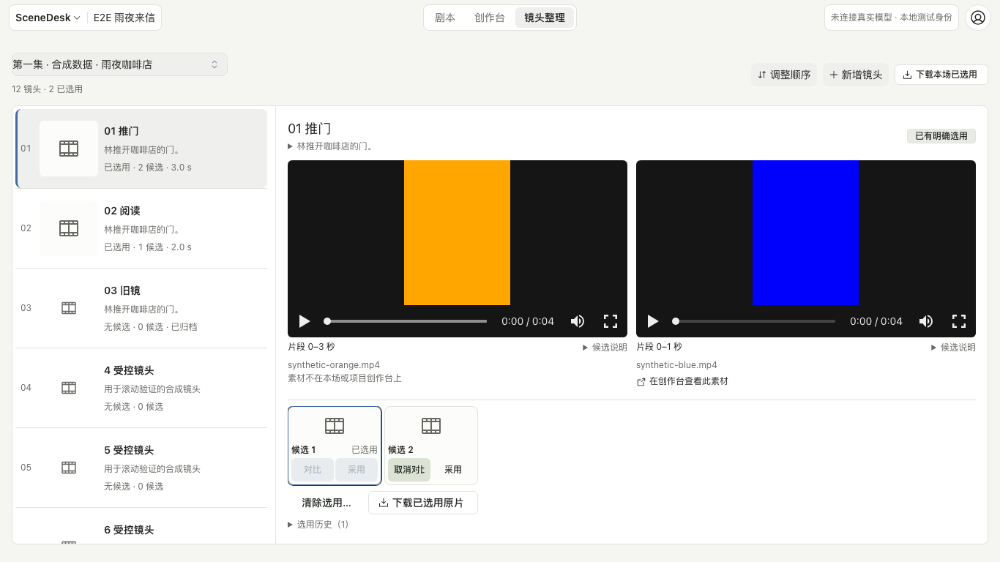

# 镜头整理：连续浏览、候选预览与来源定位

2026-09-24。替代 `85-studio-rebuild.md` §1g 的表格与抽屉呈现；新增镜头继续使用 §1n 的短表单。

镜头整理用于按场次检查镜头顺序、查看与比较实际视频候选、明确选用并交接原片。主要浏览过程在同一页完成，创作和生成继续在创作台进行。

## 页面与交互

- 桌面左侧是独立滚动的镜头顺序列表，右侧直接显示当前镜头。整行可点击，不再逐行放「打开」。每行提供缩略图、名称、说明和真实候选／选用概况；有候选但尚未选用时展示候选缩略图并明确标注「待选用」。来源文件名放在预览旁，避免与镜头名称重复占列。
- 进入场次后默认显示首镜，并按镜头 ID 保持焦点；调整顺序不会偷偷换成另一镜。切场前记住当前镜头，浏览器后退恢复刚才查看的镜头，前进回到目标场次；新建回执等待内容树刷新时继续显示对应对象的读取状态。
- 预览占用工具栏下的剩余空间，竖屏和横屏画面完整适配。候选条、明确采用、选用历史和已选用原片下载保留原有业务语义。切换预览或加入比较不会改变明确选用。
- 窄屏先看列表，点击镜头进入同一详情，提供「返回镜头列表」；返回时保留列表位置并卸载播放器。比较按实际预览区宽度布局：宽处并排，窄处上下排列并局部滚动，播放与全屏控件不得裁掉。镜头页的窄屏顶栏分行呈现，测试身份／模型环境标识继续可见。

## 在创作台查看

「在创作台查看此素材」属于当前预览的候选。同时检查本场与项目创作台，优先定位本场节点；找到后进入对应画布并定位素材卡。

画布不存在或素材已经不在画布上时，就地说明「素材不在本场或项目创作台上」，不自动建画布，也不显示全页操作失败。真实网络或授权失败提供重试并停止定位。点击时重新核对来源；等待期间切镜、返回列表、切场、打开新建或排序，不得被旧请求带离当前操作。

## 恢复与验证边界

场次、候选、选用和固定原片事实沿用现有接口。新增、排序、候选登记及采用继续使用现有草稿保留和并发核对流程。局部显示状态不是第二套业务状态。

验证使用生产构建、受限角色隔离数据库和显式合成视频，覆盖列表滚动、延迟加载、1366／820／390px 预览与比较、选用与精确原片下载、排序、切场及浏览历史、来源缺失／移除／网络恢复、迟到定位和已有新建恢复回归。合成结果与本地演示不构成真实模型验收。

## 生产页面证据

来自生产浏览器完整运行 `20260924-shot-organizer-release`（38/38，零重试）。蓝色和橙色为用于几何及原片字节断言的合成视频。

其他视口：[820px 预览](assets/2026-09-24-shot-organizer/shot-review-820.png)、[820px 比较](assets/2026-09-24-shot-organizer/shot-review-comparison-820.png)、[390px 预览](assets/2026-09-24-shot-organizer/shot-review-390.png)、[390px 比较](assets/2026-09-24-shot-organizer/shot-review-comparison-390.png)。手机比较可在详情区向下滚动；两个播放器的播放、全屏按钮已通过横向边界检查。
