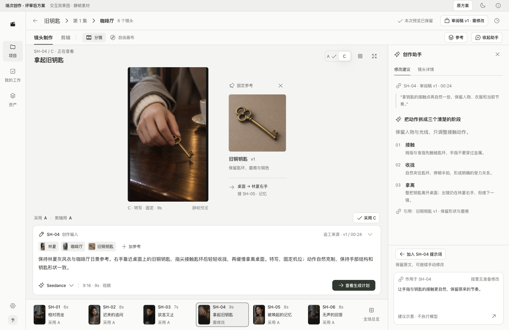
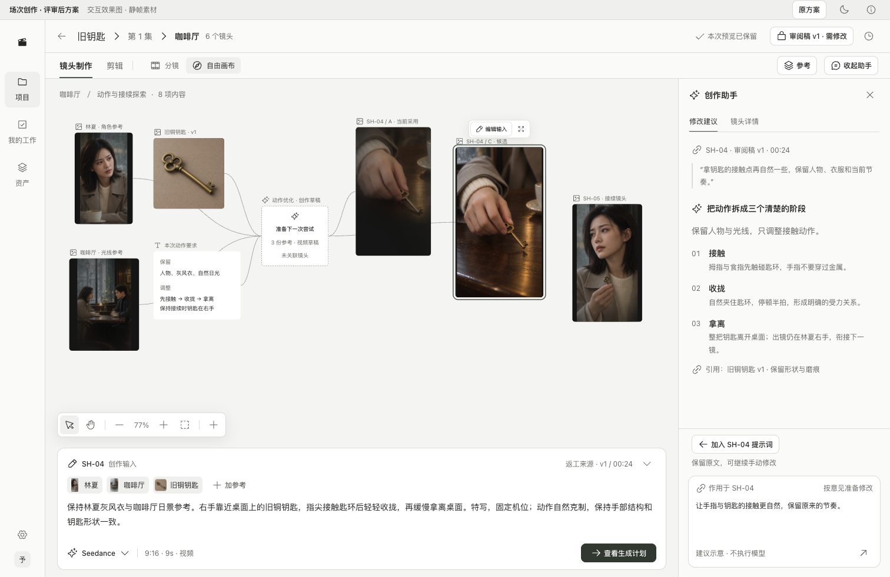

# 新工作区方案：可交互效果图 v0.2

前轮效果图与验证记录（2026-09-10 整理）。其核心布局已经落实到[当前核心体验 v0.3](scene-walkthrough-review-v0.3.md)并获确认；本文保留当轮截图和验证范围，不再是等待用户二选一的方案。当前状态以[确认记录](approved-baseline-2026-09-10.md)为准，正式业务工程仍暂停。

## 打开方式

- [分镜模式＋助手](http://127.0.0.1:4311/#/journey/?variant=recommendation&mode=storyboard&tone=light&assistant=on)
- [自由画布＋助手](http://127.0.0.1:4311/#/journey/?variant=recommendation&mode=canvas&tone=light&assistant=on)
- [宽屏参考与助手同时展开](http://127.0.0.1:4311/#/journey/?variant=recommendation&mode=storyboard&tone=light&assistant=on&assets=on)

现有导航原型顶部也有“新方案效果图”入口。效果页可切换明暗、两种制作模式、助手、参考、全场总览和候选比较。顶栏“原方案”回到上一版导航原型。启动仍为根目录 npm run dev:web，使用 4311 端口。

## 两个核心画面

分镜：当前候选进入主预览，钥匙参考固定并看，真实输入在中央，镜头顺序留在底部；助手占独立布局空间。

画布：参考、要求、独立草稿与多个候选共处一个场次空间；短工具随选中出现，长输入稳定在中央底部。新旧候选保留独立媒体身份。

## 其他状态

| 状态 | 效果图 |
|---|---|
| 助手收起、专注当前镜头 | [1512 浅色](../../output/playwright/2026-09-10-workspace-v2/02-storyboard-focus-1512.png) |
| 自由画布深色 | [1512 深色](../../output/playwright/2026-09-10-workspace-v2/04-canvas-dark-1512.png) |
| 笔记本分镜与助手 | [1366×900](../../output/playwright/2026-09-10-workspace-v2/05-storyboard-dark-1366.png) |
| 笔记本完整素材浏览，助手暂收起 | [1366×900](../../output/playwright/2026-09-10-workspace-v2/06-assets-dark-1366.png) |
| 低高度画布压力状态 | [1366×768](../../output/playwright/2026-09-10-workspace-v2/07-canvas-compact-1366.png) |
| 宽屏素材与助手同时停靠 | [1512×982](../../output/playwright/2026-09-10-workspace-v2/08-wide-assets-assistant-1512.png) |
| A/C 静帧并排比较，输入暂收成摘要 | [1512 浅色](../../output/playwright/2026-09-10-workspace-v2/09-compare-light-1512.png) |

截图来自本地页面的构建产物，不是单独绘制后无法对应页面的图片。明暗只是同布局对照，不代表默认主题已确认。

## 可实际尝试的交互

- 切换镜头、候选与制作模式；编辑提示词；在同一页面会话里保留各目标草稿。
- 助手按需停靠、切换建议／镜头详情；把固定示例建议追加到 SH-04，即使正在浏览 SH-05，也不写到 SH-05。
- 搜索、浏览与固定参考；快速加参考明确接收目标。1366 宽度不同时挤入两个完整辅助栏。
- 查看 A/C、明确采用，再明确用于剪辑的内存示意；查看生成计划信息，不执行模型。
- 画布选择、取消选择、平移、缩放、适应内容与拖动已有节点；连线随节点移动，独立草稿不自动归镜头。
- 节点就近“编辑输入”可定位中央文本；放大进入静帧预览。

这轮没有接入实际 React Flow、服务器画布保存、多人编辑、视频播放、模型或计费。仅有固定八项画布内容，尚未实现任意新增节点、连接编辑、框选、完整撤销及生成回收。跨到旧导航原型或刷新会重置本轮内存示例。既有业务页面、数据与正式组件选型未被替换。

## 素材与验证

复用原有《旧钥匙》六格分镜，同时通过内置图像生成补充了 SH-04 的 C 示意静帧和独立钥匙参考。二者已存入项目 demo/workspace-v2。它们供布局与候选辨认使用，不是正式道具版本，也不是 Seedance 的视频结果；其他镜头的部分候选仍共用静帧。

完成 UI 规则检查、类型检查和构建；在构建预览中检查非模态空间、目标隔离、草稿保留、选择空态、低高度溢出、节点拖动与连线、采用标签及编辑焦点。详见[验证记录](../../output/playwright/2026-09-10-workspace-v2/verification.md)。这些不代替目标工作室可用性测试或完整无障碍验收。

设计依据：[综合推荐](core-workspace-recommendation-v0.2.md)、[三方独立评审](../reviews/2026-09-10-workspace/README.md)。
