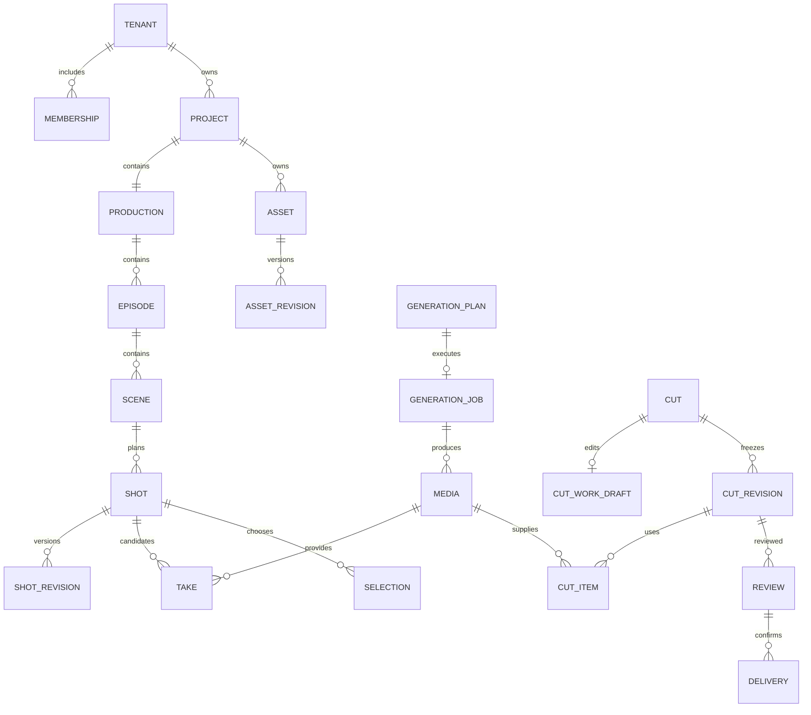

# 03 领域对象、数据关系与一致性

这是技术收尾后的 v1.3 逻辑数据设计，实施阶段据此编写数据库迁移，不代表迁移已运行；关键事务见 11。术语见根目录 CONTEXT.md，公开字段契约见 openapi.json；数据库可用内部列支持检索，但不得改变下列关系和不变量。

## 1. 核心关系

图展示主关系；共享资产可无 project_id，但必须明确 scope=shared，且由管理者维护。镜头候选审阅使用 take 外键，外部成片属于独立 cut_revision。公共生成计划不依赖 production／scene／shot 才能存在。

## 2. 通用列、时间、金额与版本

- 稳定主键使用 UUID，API 字符串传递；租户资源具有 tenant_id。项目范围记录同时具有 project_id，父子关联包含租户和项目范围约束。
- 可变根对象使用 revision 整数，从 1 递增；写入使用 If-Match。各不可变修订引用父身份及版本号，生成、采用、审阅使用明确修订 ID。
- created_at／updated_at 使用带时区 UTC 时间；业务展示转换到用户时区。稳定记录另存 created_by，不能把创建人当成数据归属。
- 媒体时间以整数微秒记录，区间统一为 [inUs,outUs)，可渲染编排要求 0 <= inUs < outUs <= 已验收时长；工作稿可暂存零长度或越界问题，反向区间仍拒绝，不能直接渲染。API 的时间数值限制在 JavaScript 安全整数内。帧率保留分子／分母，不能仅存四舍五入小数。
- 金额存带 currency 的整数微货币单位（1 单位 = 10^-6 货币单位），API amountMicros 使用十进制字符串，避免浮点误差。一个工作室预算周期只用一种结算货币；不直接相加不同货币。实际跨币种采购必须另有汇率来源、时点与舍入记录。
- JSONB 只用于有版本的结构快照、时间线和供应商受控参数；结构由 JSON Schema 校验。授权、主要父子关联、媒体依赖和费用唯一性有显式列／关系，不能依赖任意 JSON 搜索实现。

## 3. 身份、组织与权限记录

| 表 | 必需业务列（另含适用通用列） | 约束与索引 |
|---|---|---|
| users | auth_issuer、auth_subject、verified_email、display_name、status | unique(auth_issuer,auth_subject)；邮箱不自动产生租户身份 |
| sessions | user_id、token_hash、csrf_secret_ref、expires_at、revoked_at | 全局身份记录，不把当前工作室当作唯一登录身份；令牌哈希查验 |
| oidc_handshakes | state_hash、nonce_hash、pkce_secret_ref、return_path、expires_at、consumed_at | 一次性、有限期；可信同站回跳，PKCE秘密加密 |
| tenants | name、owner_user_id、status、currency | owner 必须是有效 owner 成员；所有权转移在单事务完成 |
| memberships | tenant_id、user_id、role、status | unique(tenant_id,user_id)；role=owner/admin/member；每租户仅一名 owner |
| invitations | tenant_id、email、role、token_hash、expires_at、accepted_by、status | 查验只用邀请令牌哈希；幂等重放所需链接密文限时保存，日志不记原令牌；pending/accepted/revoked/expired；接受检查已验证邮箱 |
| projects | tenant_id、name、kind、status、lead_membership_id、spec | kind 首版仅 drama；status active/archived；规格为可校验 Spec；负责人来自同租户有效成员 |
| project_memberships | tenant_id、project_id、membership_id、role | unique(project_id,membership_id)；lead/collaborator；隐式 Admin 权限不复制为每项目成员行 |
| production_tasks | tenant_id、project_id、title、assignee_membership_id、stage、status、due_at、kind、scene_id、shot_id、note、origin_review_id、origin_comment_id、result_rework_item | kind=general/scene_owner/assist/rework；scene_owner 必须有同项目 scene_id 和有效项目成员承接，禁止 shot_id；每场唯一主责任务，改派留审计；shot_id 可空但非空须同项目且与 scene_id 一致；status open/in_progress/blocked/done；手工任务不承载作业状态 |
| provider_connections | tenant_id、name、provider、region、current_version_id、status、currency、capability_revision | 密钥正文不在业务表或 API 返回；首版按工作室授权连接；status draft/enabled/disabled |

| 表 | 必需业务列 | 约束与索引 |
|---|---|---|
| provider_connection_versions | tenant_id、connection_id、provider_service、region、provider_account_identity、currency、verification_evidence、status | 身份版本不可变；跨账号新连接并重验能力；同账号后继密钥需验证 |
| credential_bindings | tenant_id、connection_version_id、secret_ref、secret_version、verified_successor_id、status | 明确秘密版本；旧任务可用同账号经验证的后继凭据，不依据当前连接猜账号 |

平台运营身份使用独立管理通道，不能伪装成普通工作室 Admin 跨租户访问。Owner／Admin 可读全部项目，Member 通过 project_memberships；共享读取不授予来源项目权限。

## 4. 剧本、结构与设定

| 表 | 必需业务列 | 约束与索引 |
|---|---|---|
| productions | tenant_id、project_id、title、brief、default_asset_revision_ids | unique(project_id)；默认引用另存关系用于授权及使用位置 |
| script_revisions | tenant_id、project_id、number、text、parent_revision_id、source_format | unique(project_id,number)；内容不可变；当前指针由 project 内容版本控制 |
| episodes | tenant_id、project_id、title、position、status | 项目内 position 排序；归档不删除剪辑及素材 |
| scenes | tenant_id、project_id、episode_id、title、position、time_label、location_label、summary、state | state 是场次默认入口：characters/props/spatialNotes；本镜入口和出口意图在 ShotSpec 覆盖；场景资产通过 reference 关联 |
| shots | tenant_id、project_id、scene_id、label、position、current_revision_id、status | 镜头身份与编号分开，重排不改身份；status active/archived |
| shot_revisions | tenant_id、project_id、shot_id、number、spec、source_script_revision_id | spec 包含 intent/action/dialogue/duration/camera/references、entryState/exitState、sourceExcerpts、sourceShotIds；不可变；unique(shot_id,number) |
| analysis_proposals | tenant_id、project_id、source_kind、source_script_revision_id、source_range、source_hash、source_csv_text、base_content_revision、generation_job_id、target、status、operations | target=new_structure/append_to_scene；后者固定 scene/episode/revision 且仅新增 shot；首版 operation 有稳定 op_id 且 action=create；复杂 AI update/archive 后置；source_kind=ai_analysis/csv_import；proposed/applied/rejected；AI要求原剧本/选区；CSV的剧本/作业ID为空且保存受限原文及摘要；保存原提案与人工选择 |
| project_content_versions | tenant_id、project_id、revision、current_script_revision_id | unique(project_id)；结构变更和提案采纳共用此 CAS 版本，防止重拆覆盖并发修改 |

首版提案只新增受支持的 episode／scene／shot 草案及项目内资产建议，不接受 AI 输出 SQL、权限变更或任意对象删除。提案原始输出和人工编辑修订分别留存；apply 只按服务端保存的 proposalRevision 和操作 ID 选择；基线变化返回 409，重新生成或人工调整提案。归档镜头只隐藏在当前计划，历史修订、采用和剪辑引用保留。

| 表 | 必需业务列 | 约束与索引 |
|---|---|---|
| dialogue_lines | tenant_id、project_id、shot_revision_id、dialogue_id、speaker_asset_id、text、performance、voice_asset_revision_id、source_excerpt、source_dialogue_id | 从固定 ShotSpec 事务生成；unique(shot_revision_id,dialogue_id)，为实际声音绑定提供 FK；同一行修改保留 ID 但引用新的 shot revision |

剧本文本的来源范围以固定版本内 Unicode 码点偏移表示，区间 [startOffset,endOffset)，校验 quote 与原文一致。拆／合／移镜由人工操作保留 sourceShotIds 和原文对应，不自动复用旧批准；初次 AI 拆解不承担已制作内容的自动改写。角色默认声音存 AssetDefinition.defaultVoiceAssetRevisionId，场次／单句可显式覆盖；服装造型修改不自动改变声音。

## 5. 资产、媒体与引用

| 表 | 必需业务列 | 约束与索引 |
|---|---|---|
| assets | tenant_id、project_id、scope、kind、name、description、tags、status、current_revision_id | scope=project 时 project 必填，scope=shared 时为空；kind character/location/prop/voice/style；status active/archived |
| asset_revisions | tenant_id、asset_id、number、definition、status、parent_revision_id | definition 结构包含说明、造型和参考媒体用途；draft/confirmed；内容不可变，确认状态独立更新 |
| asset_revision_media | tenant_id、asset_revision_id、media_id、role、position | unique(revision,media,role)；角色身份／服装／空间／声音等用途；正式发布逐个检查媒体范围 |
| asset_revision_dependencies | tenant_id、asset_revision_id、referenced_asset_revision_id、purpose | 显式记录造型的声音等依赖；同范围或已授权共享；禁止循环依赖，发布时检查并复制／映射完整依赖闭包 |
| shared_imports | tenant_id、project_id、shared_asset_revision_id、imported_by | unique(project_id,shared_asset_revision_id)；固定版本，升级显式新增引入关系 |
| creative_references | tenant_id、project_id、production_id、scene_id、shot_revision_id、asset_revision_id、media_id、purpose | 三种使用者恰有一个非空；asset_revision_id/media_id 至少一个非空，两者同时存在须验证媒体属于该版本；用 CHECK＋复合 FK 避免任意 target_type/id；引用项目内版本或已引入共享版本 |
| upload_intents | tenant_id、project_id、scope、staging_key、expected_bytes、expected_sha256、safe_file_name、mime_hint、expires_at、status | pending/uploaded/verifying/accepted/rejected/expired；随机 staging key 仅供一次意图使用 |
| media | tenant_id、project_id、scope、kind、display_name、safe_original_file_name、tags、provenance、status、immutable_key、storage_version_id、sha256、bytes、mime、duration_us、width、height、fps_num、fps_den、audio_metadata、time_base、start_pts、frame_rate_mode、source_job_id、source_upload_id、source_render_task_id、source_shared_media_id | kind image/video/audio/document；status processing/ready/rejected/archived；源 upload/job/render/shared-copy 恰一个；共享来源内部可追溯但不得泄露私有项目字段；ready 必须指向不可变内容和校验值 |
| media_derivatives | tenant_id、media_id、kind、profile_revision、immutable_key、sha256、status | poster/proxy；waveform 后置；unique(media_id,kind,profile_revision)；派生失败不等同原媒体丢失 |
| production_copies | tenant_id、media_id、source_sha256、profile_id、profile_revision、renderer_version、normalization_version、immutable_key、sha256、frame_count、audio_sample_count、source_map_id、status | 内部制作副本，按目标 profile 生成；unique(tenant_id,source_sha256,profile_id,profile_revision,renderer_version,normalization_version)；不冒充模型原片或免费生成 |
| media_source_maps | tenant_id、media_id、production_copy_id、immutable_map_key、sha256、time_base、start_pts | 每帧原始 PTS 和制作副本帧对应；音轨保留采样映射，供归一与来源追溯 |
| provider_media_refs | tenant_id、connection_id、media_id、purpose、provider_ref、expires_at、status | 按连接和用途缓存；不能把 provider_ref 当成本平台资产 ID |

共享发布创建一个共享资产与固定修订，引用经验证的共享媒体记录；若媒体原属私有项目，则复制或建立独立共享媒体记录指向可控不可变内容，授权通过共享记录计算，不能给外部引用原项目媒体 ID 来绕过权限。源项目和共享记录可做内部血缘，普通共享读者不获得源项目详情。

角色造型是并存的创作选项，版本是同一选项的修改历史。首版 character 资产的固定 definition 内嵌 looks：每个造型有稳定 UUID、label、revision 和明确参考。新增“晚礼服”不能覆盖“日常服”；改晚礼服颜色产生新的父资产修订，只递增被改造型的 revision，未改造型保持 ID 和 revision。场次或本镜 characters 条目同时记录 characterAssetId、lookId、lookAssetRevisionId；后两者成对出现，所选固定资产修订必须属于该角色并包含该 lookId。生成计划展平为确切媒体与用途，旧计划不读取最新造型。造型中媒体和声音版本同样进入显式依赖关系，不仅留在 JSON 中。

对项目素材的归档是停止新引用；已有剪辑、审阅和作业输入继续可读。物理清理检查所有范围的显式依赖，首版不开放任意强制删除。staging 到期清理、失败临时文件清理与被引用原素材保留分开。

媒体显示名称、标签和可共享来源说明属于可变检索元数据；修改不改变媒体字节身份、SHA-256 或已有交付清单。来源记录只表明已记录依据，不自动认证商用许可；共享时复制被允许公开的说明，私有 job/upload/source project 信息继续隐藏。

## 6. 生成、执行与费用

| 表 | 必需业务列 | 约束与索引 |
|---|---|---|
| generation_plans | tenant_id、project_id、scope、purpose、connection_id、connection_version_id、capability_revision、requested_input、resolved_input、input_hash、cost_estimate、expires_at、status | ready/blocked/consumed/expired；模型输入与估计同一快照；purpose video/image/audio/script_analysis |
| plan_source_dependencies | tenant_id、plan_id、kind、object_id、revision、tracking、content_hash、snapshot | 仅保存实际参与输入解析的源；fixed 引用不跟随最新根，current 按相关内容 hash 判断过期；另有具体 FK 关系检查，不将多态 ID 当授权依据 |
| plan_shot_sources | tenant_id、project_id、plan_id、shot_id、shot_revision_id | unique(plan_id,shot_id)；视频计划可无镜头，但涉及短剧时全部来源明确 |
| plan_media_inputs | tenant_id、plan_id、media_id、asset_revision_id、purpose、position | 显式可查授权及来源；输入版本提交前重新检查 |
| generation_jobs | tenant_id、project_id、scope、plan_id、status、connection_id、connection_version_id、credential_binding_id、recovery_epoch、provider_job_id、last_provider_state、cancel_requested_at、next_poll_at、deadline_at、error_code、step_revision、next_action_at | unique(plan_id)；unique(connection_id,provider_job_id) 非空时；状态见 04，不把归档失败认定为无消费 |
| submission_attempts | tenant_id、job_id、number、request_hash、started_at、finished_at、outcome、correlation_id、connection_version_id、credential_binding_id、provider_receipt | 首版每 job 只允许一次自动提交尝试；outcome prepared/accepted/rejected/unknown；凭证与完整请求不写日志 |
| submission_evidence | tenant_id、attempt_id、connection_version_id、request_hash、receipt_hash、provider_job_id、received_at、evidence_ref | 追加且 receipt_hash 去重；旧租约可交可信回执但不能改 job 状态；冲突证据待核对 |
| job_outputs | tenant_id、job_id、index、media_id、provider_locator_encrypted、expires_at、archive_status | unique(job_id,index)；归档恢复只更新输出，不创建新 provider task |
| budget_accounts | tenant_id、project_id、period_start、period_end、currency、limit_micros、reserved_micros、spent_micros | 工作室和项目各有明确账户；同一工作室／项目层级周期不可重叠，可用时间范围排他约束；一个作业锁定提交时预算周期，周期切换不移动旧消费 |
| reservations | tenant_id、job_id、workspace_budget_id、project_budget_id、scope、initial_amount_micros、remaining_micros、control_hold_micros、confirmed_micros、cost_status、finality_evidence_ref、currency、status | unique(job_id)；held/settled/released；project 双层，shared 的 project_budget_id 必为空且只约束工作室；内部 remaining_micros=max(initial-confirmed,0)，control_hold_micros 单列；API reservationRemaining 为两者之和，final 完整性证据才释放全部余量 |
| cost_entries | tenant_id、job_id、connection_id、provider_account_identity、provider_charge_key、statement_id、statement_revision、evidence_granularity、amount_micros、currency、kind、supersedes_entry_id、evidence_ref | 明细／累计证据按固定口径归一；append-only；unique(tenant_id,provider_account_identity,provider_charge_key) 由实际可用账单标识形成；同一账号多连接共用规范费用身份；无标识时平台 reconciliation key 唯一；修正用调整行 |

文本分析使用同一执行与计费外壳，成功产物是服务端校验通过的 analysis_proposal，proposal.generation_job_id 唯一。只有媒体任务才创建 job_outputs。模型返回了文本但不能通过类型、父子映射或范围校验时作业 failed，保留脱敏错误与受限原响应以供排查，不能自动应用；已有供应商消费仍须记账。

| 表 | 必需业务列 | 约束与索引 |
|---|---|---|
| unallocated_provider_costs | tenant_id、connection_version_id、recovery_epoch、provider_charge_key、statement_id、statement_revision、evidence_granularity、amount_micros、evidence_ref、allocation_status | 灾难恢复中数据库无 job 的外部费用；工作室敞口受控保留，未分配不伪造 job 或免费；后续分配不得重复记账 |

预算账户的 spent 是账本投影，不是第二份独立消费。对工作室和项目汇总不得再相加当成总费用。预占和费用状态不依赖作业 UI 终态；取消、失败也可能有费用。

## 7. 候选、采用、剪辑与审阅

| 表 | 必需业务列 | 约束与索引 |
|---|---|---|
| takes | tenant_id、project_id、shot_id、shot_revision_id、media_id、in_us、out_us、source_take_id、note | unique(shot_revision_id,media_id,in_us,out_us)，避免重复归档生成重复候选；媒体区间合法且已 ready；shot revision 与 shot 相符；候选内容不可变，另建候选表达变动 |
| selections | tenant_id、project_id、shot_id、take_id、selected_by、reason、supersedes_selection_id | 追加历史；shot 当前采用指针事务更新并 CAS；一镜头当前最多一个，清除采用也记录事件 |
| cuts | tenant_id、project_id、episode_id、scene_id、name、draft_revision、editing_mode、draft_timeline、normalization_id、normalization_saved_revision、length_frames、duration_us、status | 场次／单集范围至多一个；公共 cut 可以无两者；active/archived；editing_mode=timeline/external_file；外部根不伪造空时间线，timeline 根可先建空稿，保存非空稿使用已确认 normalization |
| cut_normalizations | tenant_id、project_id、cut_id、base_cut_revision、request_hash、requested_timeline、effective_timeline、normalized_items、drama_bindings、length_frames、duration_us、changes、profile、renderer_version、normalization_version、status | processing/ready/failed；绑定Cut基线及work_draft_revision／work_draft_hash，确切请求独立保存；ready 内容固定，不直接写草稿；保存明确确认变化 |
| cut_draft_items | tenant_id、cut_id、item_id、media_id、kind、normalized_timing | 从已保存 effective timeline 事务生成，为声音绑定和依赖提供当前 clip 身份 |
| cut_draft_media | tenant_id、cut_id、media_id | 根据草稿解析事务更新，用于依赖与清理；不是顺序的唯一来源 |
| cut_revisions | tenant_id、project_id、cut_id、number、origin、normalization_id、effective_timeline、normalized_items、length_frames、duration_us、render_profile、renderer_version、normalization_version、render_job_id、rendered_media_id、subtitle_media_id、status、handoff_delivery_id | origin platform/external；platform 有时间线，external 有验收媒体和可空交接清单；frozen/rendering/ready/render_failed |
| cut_items | tenant_id、cut_revision_id、item_id、kind、media_id、take_id、selection_id、track_id、timeline_start_us、in_us、out_us、subtitle_text、duration_us、gain_db、fit、muted | 从冻结时间线事务生成；版本内 item_id 唯一；kind=subtitle 时 media_id 为空且 text/duration 必填，video/audio 时 media_id 和范围必填；媒体为同项目或已授权共享；不跟随当前 selection 指针 |
| drama_dialogue_bindings | tenant_id、project_id、cut_id、cut_revision_id、clip_id、shot_revision_id、dialogue_id、usage、source_range、voice_asset_revision_id | 草稿／固定版本恰一；FK 对应 cut_draft_items/cut_items 与 dialogue_lines；对白、混合原声、字幕关联，非对白音频无须伪造行 ID |
| reviews | tenant_id、project_id、take_id、cut_revision_id、number、status、opened_by、decision、decided_by、decided_at | take/cut 恰一个；每 subject 的 number 单调增加，最多一个 open；open/approved/changes_requested；正式决定仅负责人及管理者，关闭后不可改写 |
| review_comments | tenant_id、review_id、author_id、body、start_us、end_us、parent_comment_id、resolved_at、resolved_by | 时间基于被审文件／候选局部时间；合法范围；文本修改留审计，不能改目标版本 |
| review_rework_items | tenant_id、review_id、source_comment_id、outcome、result_take_id、result_clip_id、result_range、note | 新轮次的处理清单；replaced/retained/unresolved；保留／例外需理由，结果属于该新版本；不能移动旧评论时间码 |
| deliveries | tenant_id、project_id、review_id、cut_revision_id、package_type、source_selection_snapshot、kind、status、manifest、package_key、created_by | package_type source_package/cut_package；源包无 cut revision 且 kind=working；kind working/final；final 必须匹配 approved 整集／外部 cut review；preparing/ready/failed；内容清单固定 |

当前偏好 selection 不代表镜头已被完整实现；实际剪用由 cut items 表达，同一镜头可在一个稿中使用多个不同 take 的不连续区间，不强制都是当前偏好。越过 take 边界先创建明确派生候选。

剪辑采用完整 Timeline schema，支持一个主视频轨、若干音轨和字幕轨；首版播放速度为 1。原生视频音轨可以保留／静音；audio clip 的 streamSelection=embedded_audio 可读取 video 媒体已有混合轨，供 J/L cut，不是声源分离，独立音频层显式放置，避免默认双重对白。删除草稿片段不会删除源媒体。外部成片没有已知时间线时 cut_items 为空，不捏造映射。

## 8. 可靠执行与审计支持表

| 表 | 主要列 | 规则 |
|---|---|---|
| idempotency_records | tenant_id、scope_key、actor_id、operation、normalized_path、key、request_hash、response_status、response_body、resource_id、expires_at | unique(scope_key,actor,operation,normalized_path,key)；scope_key 非空，创建租户等全局操作用 user 范围，避免 NULL 唯一性漏洞；同键不同请求 409；关键业务还靠 plan/job 等唯一约束，不能只靠缓存 |
| outbox | event_id、tenant_id、project_id、event_type、aggregate_id、aggregate_revision、payload、available_at、lease_until、lease_token、attempts、delivered_at | 与业务事务写入；重复投递可接受；payload 只含必要标识和状态 |
| 调度组件 schema | 由通过门槛的队列库管理 | 不建自研worker_tasks；业务事务内入队，业务状态及费用独立；门槛见[21](21-technical-baseline-closure.md) |
| project_event_cursors | tenant_id、project_id、next_seq | unique(project_id)；relay 持锁对已提交 outbox 分配流序列，不能使用提前分配的 outbox ID |
| project_events | tenant_id、project_id、stream_seq、outbox_event_id、type、resource_id、resource_revision、created_at | 每项目序列由投递器事务串行分配，unique(project,seq)；只做变更通知，客户端再取权威快照 |
| audit_events | tenant_id、project_id、actor_type、actor_id、action、object_type、object_id、before_revision、after_revision、request_id、reason | append-only；记录权限、版本、费用和确认动作，不记录密钥和完整私有内容 |
| recovery_runs | recovery_epoch、cutoff_at、affected_connections、status、evidence_manifest | 恢复代次与可复执行核对清单；放行新代次前检查未知敞口，旧作业隔离默认禁止重新提交 |
| recovery_quarantine | recovery_epoch、job_id、connection_version_id、classification、evidence_ref、released_by | 包括恢复点已存在的 queued；无 attempt 不是未提交证据 |
| render_tasks | tenant_id、project_id、cut_revision_id、profile_revision、state、revision、step_revision、next_action_at、recovery_epoch、output_media_id、error_code | 相同 cut revision/profile 复用结果；retry 不创建视频生成任务 |

后台跨租户扫描任务 ID 使用受限调度入口；具体处理恢复可信 tenant/project 上下文再读取内容。不能把客户端或回调传入 tenant_id 当授权依据。

## 9. 不变量与事务单元

| 编号 | 不变量 | 实现事务 |
|---|---|---|
| INV-01 | 任何项目子对象与父对象属于同租户、同项目 | 复合唯一键／外键，加应用授权和 RLS |
| INV-02 | 当前版本改变不改变旧执行、审阅或交付内容 | 不可变 revision，当前指针 CAS |
| INV-03 | 一项计划最多产生一个作业和一份预占 | job(plan_id)、reservation(job_id) 唯一，与幂等记录、队列命令及事件outbox同事务 |
| INV-04 | 更新采用不自动修改剪辑 | selection 事务独立；更新剪辑是另一次明确 CAS 写入 |
| INV-05 | 固定审片版本对应固定媒体内容 | freeze 时间线和引用同事务；render 基于 snapshot；media immutable key |
| INV-06 | 一次供应商消费只记一次，修正有证据 | charge key 唯一、追加调整、锁定预算账户投影 |
| INV-07 | 上传确认的内容不会被旧上传 URL 替换 | 验收后复制到服务端独占 key 或固定 VersionId，再创建 ready 媒体 |

适用时先锁连接根及授权范围，再固定工作室账户、项目账户、计划与作业／预占；所有路径遵守11顺序；涉及多个对象按稳定 ID 排序。项目内容排序与提案应用锁 content version，结构改动和 outbox 同事务。数据库冲突可重试纯内部事务，不能把外部付费调用放进自动重试闭包。

索引至少覆盖：项目成员、active 集场镜排序、资产范围及类别、媒体 project/status/created_at、job status/next_poll_at、lease/available_at、评论 review/time、账本 job/created_at、直接媒体引用。首版中文名称／标签采用规范化包含查询或适当索引实测，不承诺未经验证的语义搜索。

## 10. 审阅后补充不变量

- INV-08：部分费用确认不等于最终结清；账本累计与未决预占不重叠也不提前释放。
- INV-09：新轮次、正式决定和 final 创建竞争同一个固定 subject 锁，避免读到旧批准后插入新交付。
- INV-10：effectiveTimeline、normalizedItems、渲染、SRT 和评论源映射来自同一已确认归一结果；渲染不得自行改变边界。
- INV-11：造型／入口出口意图及台词实现绑定均固定到具体版本；模型成功不自动证明连续性或对白已通过。

DDL 必须用显式复合 FK／唯一约束落实已知主体关系；JSON 中重复保存的 spec、状态和时间线由同一业务事务生成投影，不允许另一路写入其物化关系。迁移顺序与关键事务见 11。

### 补充依赖与费用唯一性约束

`delivery_media_inputs(tenant_id,project_id,delivery_id,media_id,role,source_sha256)` 在创建交付事务内建立；unique(delivery_id,media_id,role)，通过同租户项目复合外键约束，包含原素材、额外声音／字幕、预览及对外证据媒体。工作包无 cut 时仍是媒体保留与恢复的独立依赖，不能只靠 JSON 搜索。`delivery_source_bindings` 保存固定媒体源区间与已知台词关系，不要求时间线 clip。

费用去重由唯一注册表 `provider_charge_identities(tenant_id,provider_account_identity,canonical_charge_key,allocation_kind,allocation_id)` 统一约束；cost_entries 和 unallocated_provider_costs 均先获得同一账号级身份，不能各有唯一键却双计。未分配费用关联到 job 时迁移分配关系与预算投影，保留原身份，不另建相同费用。累计账单的 statement/revision 先规范化为差额／更正再登记。

## 2026-09-09 场次主场景补充

[14 收口基线](14-scene-mvp-closure.md) 规定当前场次提案、持久提示与返工建议、正式创作依据和场次主责的字段及事务。它们已进入同版 OpenAPI，属于本期范围。新结果仍不自动采用／更新剪辑，确认创作依据与审片通过分别记录；历史费用、版本及来源规则不变。

### 09-09 新增持久记录

| 表 | 主要字段与关系 | 不变量 |
|---|---|---|
| analysis_proposal_revisions | tenant/project、proposal_id、number、operations、target、base_content_revision、editor_id、origin | unique(proposal,number)；原输出与人工修订不可变，根指向当前修订 |
| assistance_artifacts | tenant/project、generation_job_id、current_revision | 每个成功辅助作业最多一个结果根；源 job 不随编辑变化 |
| assistance_artifact_revisions | tenant/project、artifact_id、number、request、resolved_input、body、editor_id | unique(artifact,number)；按号码读取旧版，实际媒体／镜头／反馈依赖另存 FK 关系 |
| creative_basis_revisions | tenant/project、kind、subject、source_object_revision、snapshot、content_hash、hash_version | 未确认也保存；script_revision/production/scene/shot_revision 来源恰选一组明确列／FK；旧稿不依赖可变根最新内容 |
| creative_confirmations | tenant/project、basis_revision_id、usage、cut_revision_id、confirmed_by、confirmed_at、replaces_confirmation_id | project_default 或 cut_revision；后者必须是确实使用该依据的同项目固定稿；确认只追加 |
| creative_current_confirmations | tenant/project、明确subject外键、confirmation_id | 每 subject 一个当前正式指针；更新须匹配 expectedCurrentConfirmationId；稿件专用确认不能修改它 |
| cut_revision_creative_bases | tenant/project、cut_revision_id、basis_revision_id | 冻结时保存实际使用关系，不能从项目最新值覆盖旧来源 |
| review_creative_confirmations | tenant/project、review_id、confirmation_id | 正式决定固定批准时采用的确认，补确认不改写冻结稿原始列表 |

依据准备、正式指针、固定稿确认的原子性及 hash 语义以 [14 §5](14-scene-mvp-closure.md#5-主创确认与自由试作) 为准。当前 M00 没有创建这些业务表；它们进入 M02/M05 对应迁移并完成复合 FK／实际授权测试后才算实现。

## 场次双模式的数据扩展（M07）

CanvasWorkspace 的 canvases、canvas_revisions、canvas_node_index、canvas_media_refs、canvas_plan_origins、canvas_result_nodes 与短剧接入的 scene_canvas_links、node_shot_bindings、scene_workspace_preferences，字段与约束统一见[18 §3](18-canvas-workspace-contract.md#3-逻辑存储与不变量)。节点身份和媒体内容固定，文档 CAS 与绑定共用 canvas revision；生成、采用、剪辑与批准不写入画布文档。新增 SourceDependency.kind=canvas_draft，执行检查相关输入 fingerprint，画布坐标不参与。M07 是设计迁移批次，尚未应用业务数据库。

## 技术收尾的数据扩展（v1.3）

CutWorkDraft与CutDraft分开，新增cut_work_drafts／cut_work_draft_revisions，字段及恢复正文、引用保护、presence、在途额度见[21 §5](21-technical-baseline-closure.md#5-数据迁移与-api-变更)。工作稿不存在时返回虚拟revision=0，首次保存从1开始；团队共享工作稿不按用户复制。工作稿对白绑定可以暂时缺clip，但固定剧情和声音来源仍检查权限及关系，不能复用可渲染draft items的强clip外键拒绝未完成工作。

- INV-12：工作稿保存不改变Cut可渲染内容；应用归一同时检查Cut和工作稿来源版本，原子更新两者。
- INV-13：恢复历史可过期，当前、前一版及固定业务依赖不可被普通清理；加pin和清理同对象互斥。
- INV-14：队列重复执行不产生第二次未知付费创建；账号在途额度与Worker槽位、请求速率分离。
- INV-15：presence不构成锁、权限或内容版本；失权不因历史恢复重新获得访问。

## 2026-09-16：本地 Word 剧本来源补充

`ScriptRevision` 仍是不可变剧本原文身份，增加 `sourceFormat=docx`、来源文件名、原件 SHA-256 与 `docx_v1` 阅读块。规范 `text` 由服务端按块顺序及换行确定，镜头和生成引用继续使用固定 revision ID 与 Unicode codepoint 范围；重新导入不修改旧引用。`plain_text` 历史继续有效。原件在私有 `script_originals` 中与该修订一一对应，项目 RLS、不可变触发器和延迟摘要约束共同约束。

导入请求身份与创建人、项目、原件 digest、文件名和原 `ContentTree.revision` 绑定，用于丢回包后的只读核对及幂等恢复；它不是新的创作聚合根。预览不建立正式版本，新基线的确认使用新请求身份。具体文件范围与验证见 [Word 导入说明](72-script-docx-import.md)。

## 项目画布扩展（2026-09-16）

Canvas 继续直接属于 Project。新增 `project_canvas_links` 为每个项目明确选择唯一独立画布，同一 Canvas 不得同时成为项目画布和场次画布；`scene_canvas_links` 与已有镜头关联不迁移。`project_workspace_preferences` 是 `(user_id, project_id)` 下带独立 CAS 的个人视口，不包含制作事实。助手固定 `canvasScope` 保留旧 `{canvasId, sceneId}`，项目画布使用 `{canvasId, projectId}`；对应投影的 `scene_id` 仅在项目作用域为空。详见 [项目画布实施](71-project-canvas-workspace.md)。
