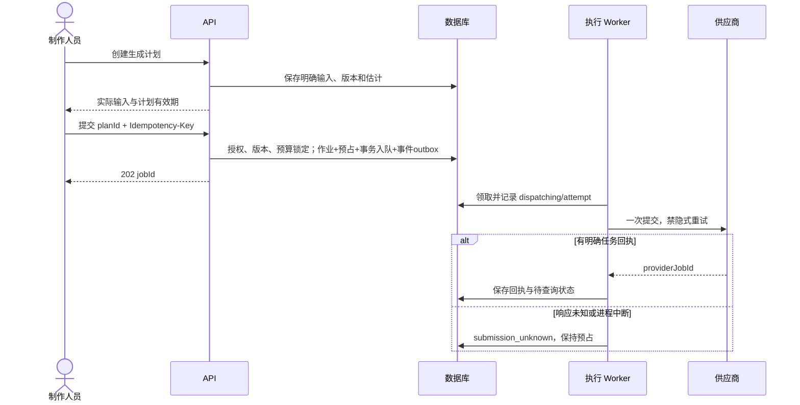

# 04 状态、异步执行、幂等与预算

## 1. 状态分开表达

| 记录 | 状态集合 | 说明 |
|---|---|---|
| 生成计划 | ready / blocked / consumed / expired | ready 仍须在提交时检查版本、权限、预算和能力 |
| 生成作业 | queued / dispatching / submission_unknown / provider_pending / provider_running / archiving / archive_failed / succeeded / failed / cancel_requested / cancelled / reconciliation_required | 媒体任务 succeeded 表示原媒体已验收归档，文本辅助表示对应 Proposal 或 AssistanceArtifact 已校验并持久保存；未知不是失败 |
| 媒体 | processing / ready / rejected / archived | ready 内容不可被旧上传凭证替换 |
| 费用预占 | held / settled / released | held 可有部分已确认消费；剩余敞口独立记录 |
| 费用完整性 | pending / partial / final / unavailable | final 必须有完整结清依据，执行终态不能替代 |
| 剪辑版本 | frozen / rendering / ready / render_failed | 冻结内容不变，渲染可以恢复 |
| 审阅 | open / approved / changes_requested | 决定后关闭本轮；新一轮新记录 |
| 交付 | preparing / ready / failed | final 绑定已批准版本；工作包单独标记 |

UI 可把 provider_pending／running 简写排队／生成中，但不能将 submission_unknown 或 archive_failed 隐藏成普通“失败，重试”。

## 2. 从计划到一次付费请求

计划默认有效 10 分钟，是可配置产品默认值，不是供应商报价保证。计划固定 capability revision、connectionVersionId、requested input、resolved input、精确来源依赖及分项估计；提交时实际参与的 current 来源内容或能力变化返回冲突；fixed 源不跟随资产最新根，无关重排、改名或其他场次变化不触发失效。不能静默取最新值。

API 成功事务同时写入幂等记录、job、reservation、预算投影、内部队列命令和事件outbox。响应丢失用同一键重试可返回原 job；超过幂等缓存期仍由 plan_id 唯一性阻止重复消费。新创作尝试必须创建新计划。

Worker 在提交 dispatching／唯一 attempt 的事务中重查成员、项目是否 active、连接身份版本和预占；以该事务提交作为执行已开始的界点。在该界点前撤权的 queued 作业可以 cancelled 并释放；界点后请求可能已经开始，不能据撤权释放。已提交或疑似提交的作业继续归档和核账，不依据操作者离职丢弃记录。

## 3. 提交结果未知的处理

| 已知证据 | 下一步 | 禁止动作 |
|---|---|---|
| 明确 providerJobId | 用固定连接身份版本及经验证同账号凭据查状态；保存可核查回执 | 换连接查询后认为不存在，重新购买 |
| 服务正式支持幂等键和查询恢复，已在指定账号测试 | 按该 Adapter 的恢复契约执行 | 将其他服务的幂等能力套用到当前服务 |
| 仅有客户端关联 ID，无找回契约 | submission_unknown，运营核对供应商任务／用量 | 把关联 ID 当幂等键，或把 404 当必然未提交 |
| 明确请求未离开本机且 attempt 未进入 dispatch | 可恢复内部排队 | 根据普通网络错误臆测“没有收到” |
| 供应商明确拒绝并有不计费依据 | failed，按证据释放或核对预占 | 所有非 2xx 一律当无消费 |
| 任务过期不可查询或回执长期无法恢复 | reconciliation_required，记录证据与待核对金额 | 自动标记免费失败或静默丢弃 |

Crash window 无法彻底消除：供应商接受后进程可能在保存 ID 前崩溃。租约或 outbox 不提供跨供应商 exactly-once。创建端关闭 SDK、HTTP 客户端、网关隐式重试；供应商算子内部重试须可关闭或明确列入费用与完整性验证；仅显式验证可安全重试的读取／归档步骤使用退避。模型证据见 [专项](../research/2026-09-07-implementation-model-evidence.md)。

运营核对入口只允许指定管理身份记录供应商回执、费用依据和关联证据，不接收普通用户任意指定成功状态。无可靠对应关系时保留未决，不把同时间相似 prompt 当唯一身份依据。若用户另开尝试，原作业预占继续计入并明确提示。

## 4. 查询、回调、取消与恢复

- 查询使用原连接，配置退避、抖动、供应商限流及截止时间。已知 provider ID 的 GET 超时可重试；任务不存在与已过保存期分别处理。
- 回调先限流并按可核验方式鉴别来源。无法验证签名的回调只用来唤醒查询，不直接确认媒体、终态和费用；不接受回调提供的任意 URL 作为可信下载位置。
- 一个任务可出现多个状态通知；不能仅按 task_id 去重一次就忽略后续成功。保存 last_provider_state、事件摘要及最终查询证据，终态不被晚到的 running 回滚。
- queued 取消可以在 CAS 事务中撤销未执行任务；dispatching 取消存在竞态，记录 cancel_requested，不提前释放。供应商明确取消后仍核对费用。取消接口返回不代表退款。
- provider succeeded 进入 archiving，下载、校验和原始文件归档成功后 job succeeded；派生预览可单独恢复，原始媒体已验收时允许下载，具体生成参考要求按 capability 检查。
- archive_failed 只重试归档。输出过期时先查询是否可取得新地址；无法恢复时显示素材不可用并保留已发生费用，任何重生成是新计划。

队列库负责领取、延期和回收，实际参数通过候选验证确定，不再自研60秒租约／20秒心跳。业务回写校验step revision、epoch和attempt身份，不跨网络持锁；过期Worker仍可追加真实回执，不能覆盖当前状态或自动再次POST。三种并发限制及原子入队见[21 §2](21-technical-baseline-closure.md#2-队列与业务执行)。

## 5. 预算与实际消费

计划费用由基础估计、明确计量项、pricingRevision 与预占余量组成；界面显示 totalReservation，而不是隐藏余量或声称估计就是最终账单。没有可解释估计的模式不启用。费用分别记录为 confirmedCost、reservationRemaining、costStatus；finalCost 只在完整性为 final 时出现。

预算可用额 = 上限 − 已确认费用 − 剩余预占。project 作业同时锁定工作室与项目账户；shared 作业只锁工作室账户、project_budget_id 必为空。两者共同约束工作室余额，不能借用虚假项目。一个作业固定提交时的周期，后续周期切换不转移旧消费。

令 H 为原计划预占上限，C 为当前已确认累计，R 为尚未确认预占：pending／partial 时 R=max(H−C,0)；账本只增加新的已确认金额，预算不会重复计算 C 与原 H。收到明确追加收费敞口时，管理者可依据证据追加单列控制预留 K 并保留审计，不重写 H；对外 reservationRemaining=max(H−C,0)+K。H 不是供应商绝不会超支的保证。

| 情况 | 费用事实和准入结果 |
|---|---|
| 预占 8，先确认 3，仍可能继续收费 | confirmedCost=3，R=5，costStatus=partial，reservation=held；总占用仍为 8 |
| 同一 3 元账单再次到达 | 原条目去重，C 和 R 不变 |
| 最终完整账单累计 8 | 只新增尚未记录的 5；C=8，R=0，costStatus=final，reservation=settled |
| 最终完整账单累计 6 | C=6，释放剩余 2，R=0，final／settled |
| 首次确认已为 10，尚非完整账单 | C=10，R=0，记录超额事实；该连接新提交暂停核对未知敞口，不能让余额为 0 意味没有后续风险 |
| 剩余预占用尽但费用仍未终局 | 按连接阻断新提交，直到有完整结清证据，或管理者根据依据追加有限控制预留并通过预算检查 |
| 最终完整账单 10，大于原预占 | 记录 10，允许可用额为负并阻断超预算新执行；不修改真实账单迎合预算 |
| 明确未提交或确证无费用 | C=0、R=0、final／released，保存未发生收费的证据 |
| 取消／失败／归档失败，但费用不完整 | 保留 pending／partial／unavailable 和相应 R；不自动结清 |
| 退款／更正 | 追加调整，校验新的账单修订与累计；不覆盖原条目和原证据 |

费用证据区分明细条目和累计账单。Adapter 为一个模式固定归一口径；累计快照按 statement ID／revision 计算差额，不能把累计 8 当另一笔 8 再叠加明细 3＋5。完整账单先于明细到达时，后续明细仅补充关联或形成有依据的更正。无法判断先后或重复身份时进入核对，不能依据到达时间猜测。

只有可信完整账单、已验证不会有后续收费的任务终局凭据，或附证据的受控人工结清，才允许 costStatus=final；普通超时不构成完整性证据。供应商返回部分费用但没有最终字段时，readCostEvidence 的 partial 不能转换成 settled。所有状态变更、补敞口与更正同事务更新账本和预算投影。

供应商成本、客户售价、充值和退款产品分开。首版实现成本预算及核账，不依据本账本自动向用户收款。存储、转码、带宽和外部后期单列成本，试点记录见 13。恢复时找不到原 job 的外部消费进入 unallocated_provider_costs 和工作室核对敞口，不能制造免费空白期。

## 6. 剪辑及审阅状态一致性

采用事务只保存 selection。替换预览按目标片段和明确时间政策产生 NormalizationResult；用户确认变化后，以 normalizationId、acknowledgedChangeIds 及 Cut 的 If-Match 保存。normalization与工作稿revision/hash、请求摘要、baseCutRevision绑定；服务器不在保存时接受另一份未经归一的时间线。不存在“选用后自动广播替换全部剪辑”。

freeze 在同事务固定已保存的 effectiveTimeline、normalizedItems、lengthFrames、durationUs、profile、renderer/normalization 版本、声音绑定和显式媒体依赖，创建render_task、事务内队列命令及事件outbox。重复 freeze 请求通过幂等返回同一 revision。渲染完成 CAS 填充 rendered_media_id，审阅只接受 ready 的 cut revision 或 ready 的 take。

createReview、review decision 与 final createDelivery 取得同一 take/cut revision subject 锁；取锁后重新检查最新轮次、角色和 readiness，同事务写决定／交付与审计。只锁旧 review 行不足以防新轮次插入。final delivery 必须再次检查该 review 为目标版本最新一轮且 approved、目标是匹配的整集／外部 cut revision、媒体可读；期间有新草稿不影响旧批准，但 UI 提醒正在导出哪一版。

## 7. 事件流与界面恢复

SSE 只传资源失效通知和 revision，权威状态仍来自 GET。投递器读取已提交 outbox，按项目流序列事务写 project_events 后发送；重投可以产生重复通知，客户端以资源版本和 GET 结果收敛。

默认保留 24 小时通知，Last-Event-ID 落在保留范围内可重放；过期返回 reset 事件，客户端重新获取当前项目快照。自增 outbox ID 不能直接当提交顺序。断网重连后总要刷新当前作业与编辑对象；不能仅依赖通知恢复业务状态。

同源 HttpOnly 会话鉴权，SSE 建立时和周期心跳重查成员状态；撤权关闭流。事件不包含剧本、签名媒体 URL 或密钥。后端持久状态、浏览器视图与供应商状态各自负责自己的事实。

## 8. 转移规则补充

| 当前状态 | 允许的后续与条件 |
|---|---|
| queued | 领取后 dispatching；确认尚未提交时 cancelled；内部校验明确不通过时 failed |
| dispatching | 有回执后 provider_pending/running；文本同步结果校验后 succeeded/failed；响应不明或 Worker 丢失后 submission_unknown；并发取消记 cancel_requested |
| submission_unknown | 核对出 ID 后 provider_pending/running/archiving；有明确不受理证据后 failed；证据无法恢复后 reconciliation_required |
| provider_pending / provider_running | 经原连接查询进入 archiving/failed/cancelled；接受取消意图后 cancel_requested；超过可核查期限后 reconciliation_required |
| cancel_requested | 明确取消进入 cancelled；取消未成功且完成媒体任务进入 archiving；未决继续查询，不能清除原提交是否未知的证据 |
| archiving / archive_failed | 归档失败后 archive_failed，恢复后 archiving/succeeded；无法再取得内容保持不可恢复原因，费用独立核对 |
| succeeded / failed / cancelled | 内容执行终态；费用更正、补回执和审计可追加，不能重新执行同一计划；迟到冲突证据转 reconciliation_required 后人工核对 |
| reconciliation_required | 仅按有记录的恢复证据转入对应已知状态；无证据继续未决 |

纯内部任务失败可以重领；已记录 dispatching 的生成任务不通过普通队列重领规则再次提交。每次状态变更校验原状态和版本，非法转移记录并拒绝。新的审阅轮次锁定 subject 后分配 number；最新一轮未批准时不得借用更早批准新建 final delivery，既有交付记录仍保留当时的决定。

## 9. 归一结果的执行状态

normalizeCutDraft／previewCutReplacement从已保存的明确工作稿创建processing归一记录，必要时准备受控媒体副本与源 PTS 映射；完成后 ready 并固定结果，失败为 failed。它们都不写草稿、不启动模型生成。saveCutDraft在Cut和工作稿来源版本均匹配时采用结果，并原子更新工作稿基线；freeze 只复验依赖和明确版本，不重新吸附帧边界。精确时间算法与未修改片段复用规则见 11；音频、字幕超出主视频总长度必须显式修正，不能在渲染时自动截去或延长全片。

## 2026-09-09 场次主场景补充

[14 收口基线](14-scene-mvp-closure.md) 规定当前场次提案、持久提示与返工建议、正式创作依据和场次主责的字段及事务。它们已进入同版 OpenAPI，属于本期范围。新结果仍不自动采用／更新剪辑，确认创作依据与审片通过分别记录；历史费用、版本及来源规则不变。

## 编辑恢复与有限历史（v1.3）

工作稿的服务器保存状态与可渲染资格分开。saveCutWorkDraft允许待处理问题，返回issues／baseChanged／hasUnappliedChanges；normalize固定已保存版本。应用归一同时检查Cut及workDraftSource，冻结另检查expectedWorkDraftRevision及显式排除未应用工作的决定，见[21 §3](21-technical-baseline-closure.md#3-编辑工作稿与可渲染编排)。保存工作稿、presence和历史恢复不执行模型。

自动保存修订不永久保留；当前、恢复点和业务依赖遵循[21 §4](21-technical-baseline-closure.md#4-画布协作与恢复历史)，过期历史返回410，恢复不倒改任务、采用或批准。
