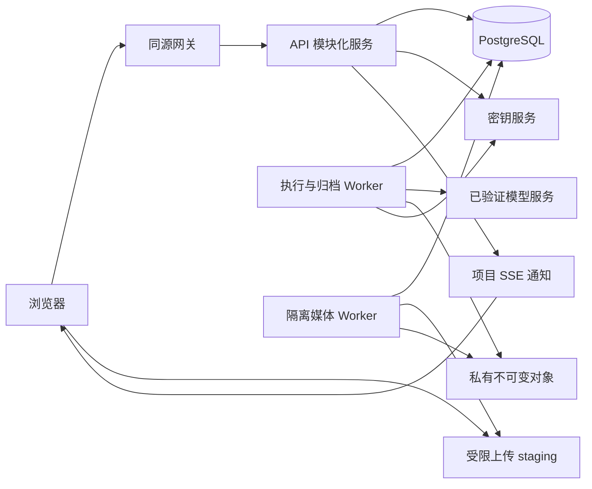

# 05 技术架构、媒体处理与运行维护

状态：实施默认设计，尚未部署或压测。先交付一个可维护的模块化服务和独立 Worker，按实际负载拆分。数据库约束见 [03](03-domain-data-model.md)，执行事实与费用规则见 [04](04-state-execution-and-budget.md)。

2026-09-10 更新：[技术方向已确认](../design/technical-direction-confirmation-2026-09-10.md)。协议已与03／04／06／11／18同步，具体规则见[21](21-technical-baseline-closure.md)；候选队列仍待集成验证。

## 1. 技术选型与部署单元

| 部分 | 首版默认选择 | 选择理由与边界 |
|---|---|---|
| 浏览器 | TypeScript、React、Vite；Mantine 为唯一通用 UI，表单优先 Form、多面板优先 Splitter；服务端状态与本地草稿分离 | Mantine 已确认并接入本地场次/组件样板；真实业务继续逐步实现，核心创作界面自主设计。专业组件最终选择与具体版本见 [17](17-frontend-component-selection.md)；画布复用已有素材与执行服务，新增保存、业务绑定及模式互通接口见18，仍待业务实现 |
| API | TypeScript、Node.js、Fastify；OpenAPI 与请求校验共用契约 | 同一团队维护端到端类型；模块服务负责规则，路由不直接更新跨模块表 |
| 数据库 | PostgreSQL，迁移文件纳入版本管理 | 事务、唯一约束、预算锁、RLS 和 JSON 快照由一个事实源承载 |
| 异步执行 | 优先复用成熟队列，pg-boss 为首个集成验证候选；独立 Node Worker | 平台保留业务 job／attempt、费用与未知提交保护；验证同事务入队和最小权限后锁定组件。原自研worker_tasks实现安排已取消；事件 outbox 保留，内部任务投递机制避免重复建设 |
| 媒体存储 | 私有对象存储，按具体供应商核验接口 | 业务只依赖上传意图、不可变对象、短时读取和删除受控接口；不假设所有 S3 兼容实现等价 |
| 媒体处理 | 隔离容器中的 FFprobe／FFmpeg | 支持验收、代理、拼接渲染、音频与字幕；不自研编解码 |
| 身份 | 一个选定 OIDC 提供方、服务端会话、邀请加入工作室 | 登录身份与工作室权限分离；首发身份供应商在 S0 确定 |
| 观测 | 结构化日志、指标、链路 ID 与异常告警 | 首版不依赖特定商业观测厂商；业务审计独立保留 |

具体运行时、库和镜像版本在 S0 锁定为受维护版本，生成 lockfile 和镜像摘要并做兼容验证；本表不是“最新版本”断言。若实施团队已有成熟等价技术栈，可以在保持契约与事务语义的前提下替换，并记录决策。首版不建设 Kubernetes 平台、通用工作流引擎、微服务网格或自托管 GPU 模型集群。

生产可以先用容器服务／虚拟机部署 API 和两类 Worker；数据库、对象存储采用托管服务为默认建议。API 无状态扩容；会话与任务状态持久化。媒体 Worker 可按资源需要横向扩容，供应商并发上限来自连接配置，不能因增加 Worker 无限增加生成请求。

## 2. 模块责任与接口

| 模块 | 对外承担的业务操作 | 隐藏的复杂性／拥有的数据 |
|---|---|---|
| IdentityAccess | 建立会话、授权范围、变更成员、交接负责人 | OIDC、邀请、权限撤销；用户、成员、项目访问关系 |
| DramaPlanning | 保存剧本、修改集场镜、确认差异、解析场次制作依据 | 稳定身份、内容 CAS、造型与状态语义；短剧业务表 |
| CanvasWorkspace（新增设计，待实现） | 保存与读取画布、编辑节点／连接／分组／草稿、恢复工作内容 | 画布持久化与冲突保护；引用统一媒体和任务。场次／镜头关联由短剧接入层校验，画布不拥有采用、剪辑和批准事实 |
| AssetMedia | 固定资产版本、共享发布、验收媒体、维护检索与来源信息、检查引用、签发访问 | 上传存储、不可变内容、共享授权、制作副本与派生文件 |
| Generation | 准备计划、执行计划、取消／查询／核对作业 | 模型映射、输入快照、供应商不确定性；plan/job/attempt |
| Budget | 预占、登记部分费用、按完整性证据结清、追加更正、查询用量 | 账户锁顺序、共享／项目预算分支、未知敞口和账单去重；reservation/ledger |
| Editing | 规范化草稿、保存已确认边界、固定版本、请求渲染、登记外部成片 | 时间映射、归一结果与 CAS 绑定、引用检查、渲染规格和结果一致性 |
| ReviewDelivery | 发起审阅、记录时间码意见、形成决定、制作交付包 | 审阅粒度、版本批准、固定交付清单 |
| TaskTracking | 创建、分配、更新人工任务 | 不将任务角色当作权限，也不复制生成状态机 |
| Runtime | 领取内部任务、发出资源变更、健康检查 | 租约、退避、幂等投递、运行配置；不决定业务是否批准 |

业务事务可在同一个数据库事务中调用相关模块，事务上下文由应用层注入；Generation.execute 调用 Budget.reserve 后统一提交，不在模块间发送 RPC 模拟分布式事务。模块只能通过明确操作改变另一模块拥有的数据。跨模块读模型可集中查询，但写入规则只有一份。

当前已创建 apps/web、apps/api、apps/worker、packages/contracts、packages/domain、packages/provider、packages/database 和 tests，实际范围见[工程记录](15-engineering-readiness.md)与[仓库说明](../../README.md)。packages/provider 当前仅有无网络模拟；media／infra 等是未来模块组织建议，尚未作为完整生产模块创建。通用包不得反向依赖 drama；长期广告通过独立业务模块调用 CanvasWorkspace、Generation、AssetMedia、Editing 和 ReviewDelivery。首版按场次双模式的实际需求实现通用画布与短剧接入，广告业务实体和通用可编程流程按后续需求建设。

### 已确认的画布复用边界

用户已确认当前短剧场次双模式、长期广告优先评估“画布＋助手”主空间。画布的身份与保存模型保持通用；“每场一张画布”以及镜头／候选关联由短剧模块提供，不成为画布模块的硬依赖。未来广告画布可绑定广告制作任务，营销人员可以从目标和材料进入，制作团队可以直接组织节点与分支。详细产品边界见[场次画布设计第 9 节](../design/scene-canvas-interaction-v0.1.md#9-已确认通用画布与广告演进方向)。

通用性不放松授权：画布资源归属于可信租户／项目，业务关联必须解析真实对象并验证所属项目，不能仅凭客户端传来的类型和 ID 访问上下文。画布保存、短剧绑定、跨模式定位及冲突保护已纳入[18](18-canvas-workspace-contract.md)及OpenAPI 1.3.0，真实服务端行为待实现；当前通用生成计划可无镜头，不代表现有 Take／Selection 或全部剪辑、审阅接口已经适用于广告。后续广告模块先定义制作目标与审核语义，再扩展相应接口。

## 3. 访问与数据隔离

每个业务请求完成会话验证后，从服务端成员关系解析可信 tenant/project 上下文；路径中的 ID 只用于定位，不能直接授权。所有项目子资源查找同时限定 tenant_id、project_id 与对象 ID。共享素材按共享范围授权，不向读者返回私有项目的来源字段。

数据库运行角色不是表 owner、superuser 或 BYPASSRLS。迁移角色独立；适用表启用 RLS／FORCE RLS，并验证连接池事务上下文不会串租户。事务内 SET LOCAL 的上下文必须与查询在同一连接中；事务结束后清除。RLS 是额外隔离防线，应用层仍检查项目成员、角色和动作。后台调度只领取最少任务标识，执行时恢复任务所属可信上下文。[PostgreSQL 官方 RLS 说明](https://www.postgresql.org/docs/current/ddl-rowsecurity.html)

连接密钥存入密钥服务，业务表只保存秘密引用和明确版本。plan／job／attempt 固定 `connectionVersionId`；连接版本固定 service、region、providerAccountIdentity，不能读取连接当前可变值来重新解释旧任务。同账号轮换保存已验证的秘密版本后继关系，旧任务只能使用原版本或经验证的同账号后继；跨账号必须新建连接并重新验证能力。失效旧密钥可以由同账号有效后继替代，不要求继续使用已撤销秘密。历史身份、秘密版本关联及核验证据保留到任务核清，日志、错误和 API 均不返回秘密正文。停用连接禁止新提交，原版本的受控查询、归档和核账继续；具体接入规则见 [07](07-provider-adapter.md)。

会话 cookie 使用 HttpOnly、Secure、SameSite=Lax；修改接口验证 CSRF token 和可信 Origin。OIDC 使用 state、nonce、PKCE，回跳路径只允许同站白名单。邀请只接受匹配的已验证邮箱，令牌只存哈希；产品可以生成邀请链接由管理员分享，首版不依赖邮件系统。停用唯一 Owner 或仍负责项目的成员时，要求在同一管理流程先完成交接。

签名媒体 URL 是有时限的持有者凭证。默认有效 5 分钟，已签发 URL 不因数据库撤权立刻失效；撤权后不能再签新 URL。若试点要求即时切断播放，应改为每次鉴权的媒体代理并评估带宽，不能用界面提示承诺即时撤回。[S3 预签名 URL 官方说明](https://docs.aws.amazon.com/AmazonS3/latest/userguide/using-presigned-url.html)

## 4. 媒体验收与渲染

1. 创建上传意图时检查范围、文件上限、声明大小和允许类型；浏览器只取得随机 staging key 的有限写权限。
2. 用户声明完成后，后端核对实际大小、文件签名、SHA-256、可解码性、时长与轨道，不以扩展名、客户端 MIME 或 ETag 单独验收。
3. 验收读取固定版本或先取得服务端快照；复制到客户端不可写的最终 key，确认复制内容与已验收字节一致，再建立 ready 媒体。旧上传 URL 继续写 staging 不得改变 ready 内容。
4. 上传、模型输出、外部回传走同一验收边界；供应商文件优先在有效期内归档。下载仅允许受控供应商地址，检查 DNS、IP、跳转、最大字节与截止时间，禁止访问本机、内网和云元数据地址。
5. FFprobe／FFmpeg 在无网络、非 root、受限 CPU／内存／磁盘／时长的容器运行，命令参数用参数数组传入，不能拼接用户 shell。素材无法解码时拒绝引用，提供具体原因。
6. 原始媒体、内部制作副本与预览派生分开。原文件保留原字节和 SHA-256；制作副本用于有明确源映射的帧／采样处理；proxy 可以降分辨率，不能作为最终渲染原料。制作副本和源映射的身份与校验值进入冻结依赖，不把浏览器播放缓存当最终成片。

上述上传与下载边界依据 [OWASP 文件上传建议](https://cheatsheetseries.owasp.org/cheatsheets/File_Upload_Cheat_Sheet.html) 和 [SSRF 防护建议](https://cheatsheetseries.owasp.org/cheatsheets/Server_Side_Request_Forgery_Prevention_Cheat_Sheet.html)。

Media 返回 `displayName`、安全原名 `originalFileName`、tags、provenance 以及 derivatives 列表。生成结果使用确定默认名称，用户可改检索元数据而不改变原字节；共享复制只携带允许共享的来源说明，内部私有血缘继续隔离。派生列表表达 poster／proxy 的身份、profileRevision 与 queued／processing／ready／failed 状态；波形后置。访问请求明确 `variant=original|proxy|poster`，不在 proxy 未就绪时静默返回 original。原片 ready 而代理失败时仍可下载原片，派生恢复只重做所选派生。所有变体重新检查原媒体访问范围；接口细节见 [06](06-api-contract.md)。

首版可创建空剪辑草稿；保存可渲染内容时必须恰有一个非空顺序主视频轨，另有显式音频层和字幕轨，速度固定 1。主视频决定成片 `lengthFrames`，无重叠或隐式空洞。音频允许叠加，字幕同轨不重叠；音频／字幕超过主视频长度一律拒绝，用户明确裁切后再规范化，渲染器不替用户截断、补画面或循环片段。画面尺寸不同必须选 contain／cover。视频片段与视频轨的 muted 只控制其原生音频，静音不移除画面；音频轨的 muted 控制该音轨，字幕轨的 muted 控制该轨字幕是否显示和导出。首版不从混合对白与配乐中自动拆分声轨。

输出默认采用 MP4（H.264、yuv420p、AAC 如有音频）。首版 render profile 固定有理帧率、48 kHz 双声道、SDR BT.709／有限范围输出、contain 背景色、缩放／色彩转换规则、编码参数及字体文件摘要；实际支持的输入色彩与编码组合须由样片验证。无法解释的色彩或时间戳输入先拒绝／要求外部转换，不默默按任意默认值解释。29.97 显示标签对应 `30000/1001`，不以浮点 29.97 累计时间。每次裁切先经 `normalization-v1` 形成明确的有效帧和采样边界，再经用户确认保存；算法、VFR／非零 PTS 来源映射及音轨尾部规则见 [11 第 6 节](11-transaction-and-implementation-blueprint.md#6-tx-04-采用规范化草稿与冻结)。字幕按已确认的有效边界导出 UTF-8 SRT，可选烧录；毫秒转换也使用该算法。FFmpeg 执行固定时间戳及编码处理，不自行补业务边界。[FFmpeg concat 官方约束](https://ffmpeg.org/ffmpeg-filters.html#concat)

`normalizeCutDraft`／明确替换片段返回异步 NormalizationResult；其结果固定 `effectiveTimeline`、normalizedItems、`lengthFrames`、renderProfile、rendererVersion 与 normalizationVersion。`saveCutDraft` 只接受已 ready 的 normalizationId、已确认变化 ID 和 If-Match，不接受客户端再拼一份不同时间线。freeze 固定当前已保存结果、素材／制作副本／源映射依赖及全部版本，不在渲染时重新取整。渲染幂等键由 cut_revision_id、renderProfile revision、rendererVersion 和 normalizationVersion 组成；结果先写临时 key，经完整解码和时间验收后发布，并记录实际帧数、有效音频采样数、容器报告时长、呈现时长及校验值。

恢复渲染使用被冻结的构建和 profile；旧构建不可执行时返回明确阻断，采用新构建须重新规范化、保存并形成新 cut revision。升级不覆盖既有 ready 结果，也不以旧 revision 挂载另一套有效时间线。失败恢复不发起模型生成。外部成片保留其实际验收参数和自身时间码，不伪造平台 normalizedItems；SRT 仅在实际有字幕数据时导出。

## 5. 容量与非功能验收目标

以下是首轮压测与运维预算的建议目标，尚未实测，也不是套餐或租户人数限制。

| 维度 | 初始验证目标 | 测量方式 |
|---|---|---|
| 普通 API | 合理索引下单次 CRUD P95 < 500 ms；不含上传、模型、渲染 | 固定数据集、并发和硬件，保存结果；内容整树接口单独测量 |
| 工作数据量 | 单工作室 50 位活跃成员、单项目 500 镜头、10,000 媒体元数据 | 测检索、分页、授权、草稿加载；超过目标分页／局部加载，不封禁用户 |
| 同时提交 | 20 个并发生成提交保持预算与幂等正确 | 模拟供应商；实际付费并发按已确认额度测试 |
| 更新可见性 | 正常连接下服务端状态提交到界面刷新 P95 < 3 s | 不计供应商完成时间；断网走 GET 恢复 |
| 渲染正确性 | 有效帧数等于 lengthFrames；音画与字幕相对已确认边界的误差不超过一输出帧；输出可完整解码 | 已知信号样片、29.97／VFR／非零 PTS、非整帧裁切、长音轨拒绝、人工回放；归一改变须事前确认 |
| 恢复 | 建议数据库 RPO ≤ 15 分钟、RTO ≤ 4 小时 | 先核定成本和基础设施；恢复演练通过后才承诺 |

模型等待时间、通过率和实际费用单独报告中位数及尾部值；不能用内部 API 延迟代替端到端交付时间。最早的容量优化依据样片和试点指标，不预建分库分表。

## 6. 环境、发布与恢复

开发使用模拟 Adapter 和本地对象存储；集成环境使用独立数据库、存储前缀、密钥和受控真实连接；生产资源独立。默认关闭真实付费执行，只有完成对应账号验证的能力配置才可启用。环境切换不能把测试 webhook、输出地址或任务 ID 混入生产。

部署顺序：兼容新增迁移 → API 与 Worker → 小流量核验 → 移除旧字段另批执行。Worker 退出先停止领取，保留在途 attempt；超时退出后按未知提交规则恢复。回滚代码不能回滚已发生的供应商消费；不可逆数据迁移需单独备份与迁移验证。

数据库采用定期备份和增量恢复；对象存储采用与承诺相符的版本／保留策略。恢复按以下 runbook 执行，每一步由受限命令生成幂等审计回执；这里是待实现、待演练要求，尚未证明 RPO／RTO。

1. 在恢复库启动 Worker 前关闭全部供应商创建出口并停止旧 Worker，保留查询／归档通道；确认没有仍可发起 POST 的旧进程／部署。单改数据库开关不能回收已经发出的请求。登记新的 `recovery_epoch`、备份恢复点 `cutoff`、外部创建真正停止时间及受影响连接版本。
2. 恢复数据库与对象清单，建立固定 quarantine 清单：包括恢复库中所有可能在恢复窗口分派的非终态作业，尤其是 created_at 早于 cutoff 的 queued。缺少 attempt 不构成未提交证据；执行已终态但费用未 final 的作业仍列入财务核对。清单在调查中追加发现项，不靠查询当前状态反复缩小原审计范围。
3. 按原 connectionVersionId 对账：已知 ID 查询恢复；可靠证据证明未提交的，可由受限命令重新取得执行资格；无法排除已提交的，保持 reconciliation_required，保留 reservationRemaining。旧任务默认不进入新 epoch 的提交队列。对象存在而数据库缺失时先隔离核对，不能自动清理。
4. 对恢复点后数据库完全缺失的任务，用供应商可取得的任务／账单及独立保存的恢复证据材料核查。无法归入 job／项目的已确认消费登记为 `unallocated costs`，按供应商账号身份＋charge key 去重，占用工作室已确认费用；不杜撰 job 或随意归入项目。金额也未知的敞口另行保留，相关连接继续禁止新提交。
5. 先恢复历史读取、导入及不访问供应商的内部媒体任务。逐连接放行新 epoch 的新作业之前，必须满足：隔离集合已分类并持久化、账本投影已核平、未知金额已有明确控制（完整核清或有审计的有限敞口预留）、未分配已确认消费计入工作室、凭据身份与所有新 Worker epoch 检查正确。不可界定的敞口不放行。放行新任务不自动释放或重发旧隔离任务。
6. 记录仍未决事项、媒体损失、缺失作业、未分配消费与各层恢复时间。复核数据库和物理对象引用后再恢复清理。详细事务与转移见 [11 第 8 节](11-transaction-and-implementation-blueprint.md#8-tx-06-归档与灾难恢复)。首版复用经验证的PostgreSQL队列与受控证据文件；业务作业独立，恢复不会把队列记录当外部消费事实。

## 7. 指标、告警与处置

| 信号 | 首次处置 | 恢复完成条件 |
|---|---|---|
| submission_unknown 增加 | 暂停该连接新提交，保存 request／attempt 关联，查供应商记录 | 每项有明确回执或保留未决；不能通过重 POST 消除告警 |
| archive_failed／输出即将过期 | 提升归档优先级，检查原账号查询和存储权限 | 原文件验收归档或明确标记不可恢复；费用未丢失 |
| 预占长期未结／账本不平／非 final 已超估计 | 暂停受影响连接新提交，核对部分费用、剩余预占及未知敞口 | 每次调整有证据；partial 不误报结清；final 有完整性依据，投影与账本一致 |
| 租约失效／队列积压 | 区分生成提交与纯内部工作；迟到回执走追加证据入口 | 内部任务可恢复，真实回执未因旧 lease 丢弃，外部提交未重复 |
| SSE 断线／事件过期 | 返回 reset，客户端 GET 当前对象 | UI 与权威状态收敛，不用事件补算预算 |
| 越权或签名凭据暴露 | 撤销会话／凭据，停止签发，定位审计事件 | 确认影响范围与访问恢复；已签 URL 按有效期事实处理 |
| 渲染失败／不同步 | 保留冻结版本，查素材与 profile，修复后重渲染 | 输出校验和完整播放通过，新旧结果无混淆 |

日志保留 requestId、tenantId、jobId、attemptId、provider request ID、cut revision 与阶段时长；不记录私有剧本全文、token 或签名 URL。审计记录成员变更、共享发布、采用、剪辑冻结、正式决定和费用更正。删除、保留期、数据地区和供应商内容使用条款在首发合同阶段按选定服务确定，不能仅凭模型品牌推断。
