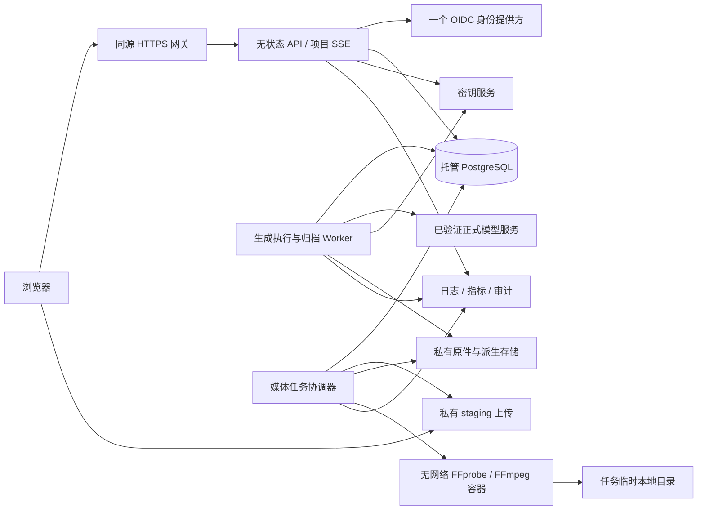

# 20 模型接入、部署、试点与后续业务执行准备

当前状态（2026-09-10）：本文是后续执行准备与关口清单；设计已按[确认记录](../design/approved-baseline-2026-09-10.md)收口，正式业务工程仍暂停。模型服务信息仅是下文标注日期的调查证据，不能代替指定账号实测或当前价格核验。

更新日期：2026-09-09。状态：**执行设计已给出；账号实测、资源开通、实际人员排期、客户试点和商业合同尚未完成。** 本次仅查阅公开官方资料，没有读取密钥、创建供应商任务、购买服务或联系客户。本文件把外部事实转为可执行的证据项与最晚关口，不将空表或模拟结果记为通过。

适用范围：写实短剧优先，完整 MVP 包含场次分镜／自由画布双模式、共享制作事实、轻量剪辑、固定版本审阅、整集与内部后期交接。广告的研究计划不增加当前 MVP 页面和业务实体。本文继承 [07 模型适配](07-provider-adapter.md)、[05 架构运维](05-architecture-and-operations.md)、[12 工作流与试点](12-mvp-workflows-and-pilot.md)、[13 制作质量与交接](13-production-quality-and-handoff.md) 和 [08 实施验收](08-verification-and-delivery-plan.md)。

## 1. 本轮落实的默认设计

| 事项 | 用于推进实施的默认决定 | 仍不能据此宣称的结论 |
|---|---|---|
| 模型主路径 | Seedance 系列优先；选定一个正式服务、账号和模式深入接入；第二供应商按实际缺口启动 | 任意 Seedance 服务／账号支持相同能力；已经验证写实质量 |
| 试点采购方式 | 工作室提供已授权供应商账号，按工作室隔离连接；先做软件能力与成本记录 | 已获得账号授权或测试金额；平台已有转售／统一采购资格 |
| 部署方式 | 一个选定地区，容器化 API 与独立执行／媒体 Worker，托管 PostgreSQL、私有对象存储、密钥服务、一个 OIDC | 已开通云资源，或者恢复、容量和可用性已经通过 |
| 工程顺序 | 按可交付切片和依赖推进，真实账号核查与早期工程并行 | 已落实研发人手、固定上线日期和生产费用 |
| 工作室验证 | 先一场、再连续两集及返工和接手；目标 3 家，尽量覆盖超过 10 人的团队 | 已招募客户或证明效率收益 |
| 画布验证 | 双模式已纳入本期；验证如何定位、比较、关联与交接，改善默认交互 | 再次把“是否做画布”作为当前产品结构前置问题 |
| 广告演进 | 后续独立里程碑；优先验证画布＋助手，分别验证营销人员与制作团队 | 两类人应使用同一个默认界面，或已需要完整广告执行引擎 |

## 2. Seedance 正式接入证据与适用范围

核查时间为 2026-09-09。产品官网说明、官方文档、指定账号实测、真实工作室成片是四层证据，不能互相代替。

### 2.1 本次可确认的公开事实

| 正式服务 | 本次取得的证据 | 当前采用方式 |
|---|---|---|
| 国内火山方舟 | 官方固定版本 SDK 的默认地址是 `https://ark.cn-beijing.volces.com/api/v3`，默认请求重试为 2；官方任务资源包含创建、读取、列表与删除方法 | 作为北京服务接入调查入口及重试风险证据；不证明当前账号的模型版本、资格或报价。[SDK 常量](https://github.com/volcengine/volcengine-python-sdk/blob/bd7d94433803d213a85f918ff2eb049067655eff/volcenginesdkarkruntime/_constants.py)、[任务资源](https://github.com/volcengine/volcengine-python-sdk/blob/bd7d94433803d213a85f918ff2eb049067655eff/volcenginesdkarkruntime/resources/content_generation/tasks.py) |
| 海外 BytePlus LAS | 已取得正式视频算子正文，列明 `dreamina-seedance-2-5-260628`；异步创建返回 ID，再查询结果；任务保留 7 天、结果链接 24 小时；真人参考有素材库准入条件；计费按服务规则，最终依账单 | 可确认公开 API 入口存在；不转移为方舟或 ModelArk 的能力、价格、素材条件。[LAS 视频算子](https://docs.byteplus.com/en/docs/byteplus_las/video_gen_enhanced) |
| LAS 地区与身份 | Base URL 文档列明柔佛 `ap-southeast-1`，地址为 `https://operator.las.ap-southeast-1.bytepluses.com`；LAS 控制台单独管理 API Key | 在连接中显式固定服务／地区／账号；同模型品牌不代表同一凭据和账单。[地区入口](https://docs.byteplus.com/en/docs/Byteplus_LAS/Obtain_the_Base_URL)、[API Key 管理](https://docs.byteplus.com/en/docs/Byteplus_LAS/Obtain_and_configure_the_API_Key) |
| 海外 BytePlus ModelArk | 本次打开 2.5 教程及总览只取得页面框架／标题，未取得足够正文；搜索缓存不作为启用配置 | 保留正式入口，需取得正文与账号证据后再启用。[2.5 教程](https://docs.byteplus.com/en/docs/ModelArk/2607688)、[总览](https://docs.byteplus.com/en/docs/ModelArk/1099455) |

国内[创建任务](https://www.volcengine.com/docs/82379/1520757)、[查询任务](https://www.volcengine.com/docs/82379/1521309)及[视频教程](https://www.volcengine.com/docs/82379/1366799)本次正文读取失败或仅返回 JavaScript 页面，**结论是本次未核实，不是该服务不存在或未开放**。旧研究只作背景：[2026-09-07 接入调查](../research/2026-09-07-seedance-priority.md)。

LAS 文档存在少量字段描述／示例不一致，不能据此自动生成完整参数表。实现时由适配器负责人核定所选模式，保存文档时点和差异处理。这里不复制一个会迅速过期的全模型规格或价格清单，也不把文档示例的输出域名解释为数据驻留承诺。

### 2.2 账号能力卡：一个启用连接版本一张

以下字段是需实际填写的发布材料；本轮没有填入任何虚构账号。能力卡与 `Capability Profile` 同源，不能在本文件形成另一套配置事实。

| 字段组 | 必填证据 |
|---|---|
| 服务身份 | 供应商合同主体／正式服务名、地区、账号身份的脱敏标识、资源项目／接入点、连接版本；控制台证据的采集人和日期 |
| 模型与模式 | 准确模型 ID／版本、已开通模式、能力文档时点；不能仅填写“Seedance” |
| 凭据 | 秘密引用与版本、作用范围、同账号轮换方案；文档不保存密钥正文 |
| 输入条件 | 图／音／视频用途与组合、数目和大小、真人参考通路、素材所需授权；样例的真实校验值和来源 |
| 输出与质量 | 实际尺寸、时长、帧率、编码、声音形式；双人对白、人物／道具连续性与返工结果 |
| 生命周期 | 创建／查询／取消地址、状态映射、限流、保留期、输出期限、找回能力、SDK 与网关实际重试配置 |
| 费用 | 计量单位、币种、输入和输出是否都计费、预处理算子、价格版本／折扣有效期、失败／取消规则、账单定位与完整性证据 |
| 运行与采购 | 授权承担者、单次实验金额上限、项目预算、数据处理地区与供应商保存约定、账号停用和历史核对办法 |
| 实测结论 | MV-01–10 对应证据路径、通过／未通过／未执行、限制、负责人、复核日期 |

能力未知则保持未启用；账号变更、服务迁移、模式改变、价格失效或输入条件改变时重验受影响项。已执行计划永久保留原连接版本与实际输入，不随当前配置重解释。

### 2.3 执行顺序与费用证据

1. **只读核查**：取得所选账号控制台、正式文档和报价／账单示例；确认秘密作用域和采购身份。不能以“能创建密钥”推导“已开通该视频模式”。
2. **无付费联调**：固定请求构造、引用解析、预算预占、关闭创建端隐式重试、故障模拟、结果导入归档。无供应商任务 ID 的模拟数据明确标为夹具。
3. **最小真实任务**：账号和金额落实后，按实验计划提交一项必要任务；保存输入摘要、实际请求摘要、响应 ID、查询观察、原件及媒体验收、费用证据。完成后再增加模式与素材复杂度，不为凑次数生成。
4. **主场景实测**：执行 [07 的 MV-01–10](07-provider-adapter.md#5-连接验证清单)，以及 [13 的质量依据](13-production-quality-and-handoff.md#2-旧钥匙的具体质量依据)。模拟故障证明内部控制，实际回执与账单证明指定服务行为，分别出结论。
5. **有限放行**：只启用通过的模式，连接并发与费用上限独立配置。未通过的能力隐藏或明确不可用；无法核清费用保持未决并按现有规则阻断新提交。

费用取证从计划估计、供应商执行回执、用量记录到最终账单逐步补齐。查询的 `usage` 不是天然等于最终应付金额；成功或失败状态也不是账单完整性凭证。测试结果保留 `pending / partial / final / unavailable` 的真实状态，已确认条目按供应商账号和收费键去重，人工核账附受控证据。客户自己在供应商控制台消费的其他任务不随意分配给某个项目。

用户浏览器短时媒体访问和供应商执行输入使用不同的凭据期限策略：供应商输入引用必须覆盖其实际取件窗口，或使用已经验证的素材上传通路；不复用即将过期的浏览器播放地址，不把素材桶改为公开。过期与归档故障先恢复原任务，不重新购买。

## 3. 默认部署拓扑与容量落实

下列是工程默认拓扑，沿用现有模块化单体。**资源规格、供应商、地区和价格以实际接入卡决定，本文件不创建资源或承诺 SLA。**

媒体协调器负责授权下载和上传，隔离转码容器只读取任务临时文件；不能为了访问对象存储而取消 FFmpeg 无网络约束。任务事实继续放在 PostgreSQL 与 outbox，不增加第二套在线队列。

| 运行单元 | 集成／受控试点起点 | 扩容或升级条件 |
|---|---|---|
| API | 单独容器部署，至少一个实例；会话与草稿状态不依赖进程内存 | API 测得瓶颈或需要无中断维护时增加实例；SSE 断开可恢复，不承诺连接永不断 |
| 生成执行／归档 | 与 API 分开；外部提交、查询、下载各有并发限制 | 按供应商实际配额与归档积压扩容；不随进程数放大采购上限 |
| 媒体处理 | 独立 CPU／内存／磁盘配额；小并发起步 | 用代表片长、分辨率和音轨测渲染峰值，再定机器和并发 |
| PostgreSQL | 托管数据库、独立迁移与运行角色、备份和增量恢复 | 在试点上线前完成真实恢复；高可用规格按维护窗口和预算明确选择 |
| 对象存储 | staging、不可变原件、制作副本、poster／proxy、渲染结果按职责隔离 | 容量计量和告警先行；被引用原件不由空间清理任务删除 |
| 身份与秘密 | 一个 OIDC，生产／测试独立客户端与秘密；邀请由管理员分享链接 | 不提前建设多身份供应商管理平台；账号撤销和秘密轮换必须可演练 |
| 观测与备份 | 结构化日志、任务阶段指标、业务审计、错误告警、数据库及对象清单备份 | 能定位提交未知、归档积压和未决消费后才进入外部试点 |

开发、集成、生产分别使用独立数据库、对象范围、凭据和外部回调地址；真实创建默认关闭。应用和存储地区应与所选供应商实际数据处理安排及客户约定相容，不能因为模型品牌相同就自动跨地区搬运媒体。

容量预算至少实际填写：活跃用户／并发会话、画布节点与引用规模、每日新增原始媒体 GB、派生倍率、引用保留期、月读取流量、渲染 CPU 分钟、并发生成数和账单延迟。初始容量目标沿用 [05 §5](05-architecture-and-operations.md#5-容量与非功能验收目标)，画布另按其专项验收。报价估算为“固定基础资源＋实际存储与流量＋媒体计算＋模型费用”，分别列出已确认价格和待报价项，不虚构月总价。

数据库 RPO ≤ 15 分钟、RTO ≤ 4 小时继续作为待实测目标。恢复演练必须包含禁止旧任务重复提交、已知任务找回、未知费用隔离以及私有对象清单核对；仅成功恢复数据库不算整个平台恢复成功。具体程序以 [05 §6](05-architecture-and-operations.md#6-环境发布与恢复) 为准。

## 4. 外部条件清单与最晚关口

| ID | 必须落实的事实 | 单一责任岗位 | 最晚关口 | 当前缺失时继续做什么 |
|---|---|---|---|---|
| EV-01 | 服务／地区／账号／模型／参考资格的能力卡 | 模型接入负责人，工作室管理员提供账号事实 | 任何真实生成前 | 模拟适配器、输入映射、导入媒体闭环 |
| EV-02 | 实验费用承担者、金额上限、币种和账单通路 | 经营／财务负责人 | 任何付费任务前 | 预算与费用故障测试；保持真实创建关闭 |
| EV-03 | 实际云资源、地区、域名、OIDC、秘密与备份权限 | 运维负责人 | 集成环境启用前；本地工程不等待采购 | 本地容器化与配置模板、存储兼容检查 |
| EV-04 | 真正可用且有来源依据的人物、对白和场景素材 | 试点主创 | 真实样片前 | 自有导入素材／工程信号片验证系统行为 |
| EV-05 | 研发负责人、参与人、每周可投入时间和工作包估计 | 交付负责人 | 对外承诺日期前 | 分解依赖和验收，不发布虚构固定日期 |
| EV-06 | 目标工作室、制作人、主创、接手后期的参与安排 | 产品／研究负责人 | 外部试点开始前 | 内部走查，结果标记内部问题发现 |
| EV-07 | 运行容量、恢复演练结果、告警接收与值守安排 | 技术负责人 | 外部受控试点上线前 | 修复与重复相关失败检查，不承诺恢复指标 |
| EV-08 | 试点软件费用、服务范围、支持窗口和数据约定 | 经营负责人 | 收费试点或合同承诺前 | 保存草拟商业方案，不自动扣客户款 |
| EV-09 | 广告真实材料、审批人和受访者样本 | 广告产品负责人（后续指定） | 广告研究执行前 | 保留研究脚本，不增加当前广告实体 |

每项记录 `status`（未落实／已取得／不适用）、实际责任人、证据链接、取得日期、失效条件和复核人。本文岗位不是已经任命的人员。只有影响当前动作的关口才阻断该动作；账号缺失不阻断通用 UI 或事务开发。

## 5. 人员责任与按依赖排期

### 5.1 最小责任分工

| 岗位 | 对结果负责 | 必须由另一视角检查的事项 |
|---|---|---|
| 产品／交付负责人 | 范围、工作包排序、真实人员排期、试点与问题取舍 | 实际用户完成定义由主创／制作人核对 |
| 技术负责人 | 模块边界、数据／接口、迁移、权限、发布门槛 | 预算、重提与恢复风险由测试／运维交叉验证 |
| 前端负责人 | 分镜／画布／剪辑／审阅的一致体验，业务组件与状态恢复 | 用真实用户任务走查，不只检查组件展示 |
| 后端／模型负责人 | 保存契约、媒体／任务／费用事实、正式适配器 | 账号身份与账单由提供账号的一方核对 |
| 媒体／测试负责人 | 规范化、渲染、媒体质量、双模式回归和异常场景 | 内容质量由主创负责，工程可播放不代替合格 |
| 运维负责人 | 环境、秘密、备份、告警、恢复执行 | 恢复结果由技术和费用负责人共同核对 |
| 试点主创／制作人／内部后期 | 资料与目标、创作执行、质量决定、实际接手 | 未参与原制作的成员完成一次交接检验 |
| 经营／财务负责人 | 账号授权、测试预算、供应商及软件合同 | 费用记录与执行证据对照，不以内部估计充当实际支出 |

同一个人可以兼任多个岗位，不预设研发人数或客户必须配齐岗位。关键质量、金额和发布决定应留下实际复核人，避免由演示作者自己声明全流程通过。

### 5.2 工作包依赖与可并行内容

阶段名称与总计划 S0–S4 对齐；下表补充外部依赖，不替代 [08 的完整验收清单](08-verification-and-delivery-plan.md)。

| 阶段 | 必须交付的可检查结果 | 依赖与并行安排 |
|---|---|---|
| S0 准备 | 最新双模式契约／迁移、工程骨架、固定媒体夹具、模拟任务与费用、环境配置、适配器调查卡 | 模型账号与招募在此开始；组件验证可与数据层工作并行；先核实现有代码，不把已完成骨架重新排成新工作 |
| S1 导入素材闭环 | 场次多镜头分镜／画布制作、保存恢复／冲突、候选与采用、轻剪、固定审阅和素材包 | 保存／授权契约确定后前后端并行；使用导入素材，不等待模型采购；双模式均须覆盖真实任务 |
| S2 正式生成 | 选定账号准备／提交／查询／归档、能力映射、费用与未知处理、实际输入追溯 | EV-01/02/04 阻断真实调用；早期接入探针可以前移，正式启用仍需 MV 证据 |
| S3 完整 MVP | 连续两集、跨集复用、F2 指定返工、F3 内部后期交接／回传、整集正式决定 | 建立在可用场次与实际媒体上；源码／版本／声音关系均可追溯 |
| S4 受控试点 | 真实工作室工作流证据、容量和恢复实测、缺陷处置、有限发布材料 | 先一家公司场次任务，再扩大；不以真实客户代替基础隔离和恢复测试 |

排期时按每个工作包填入：`负责人 / 前置结果 / 验收人 / 乐观-通常-悲观主动工作量 / 本周可用投入 / 外部等待 / 开始条件 / 退出证据`。预计开始取前置完成与该负责人可用时间的较晚者；同一人兼任的工作包串行计算。模型等待、审批和招募作为日历依赖单列，不能简单用总人日除以人数得到交付日期。

先承诺“下一可演示结果及其退出标准”，完成后依据实际吞吐重估后续范围；外部条件变化记录影响哪个关口。没有真实人员与投入时，本文件提供明确的实施顺序，不写固定几周上线或假定已分配人名。

## 6. 短剧试点：可直接执行的任务脚本

### 6.1 参加者与准备

目标招募 3 家符合当前定位的工作室，尽量包含超过 10 人、已有后期工具、具有真实返工协作的团队。先从一家的一场戏开始；招募不足可以报告发现的问题，不能声称代表全部工作室。研究者不替参与者操作；研发介入和外部绕行都记录。

按 [实验计划模板](templates/experiment-plan-and-result.md) 固定任务、质量要求、素材、已有准备、模型模式、费用上限和停止规则。工程使用 F0–F3；真实工作室连续两集默认每集 60–120 秒，任务难度由主创提前确认。现有准备不重新计为本轮新产出，准备工时与执行工时分开。

### 6.2 第一轮场次任务

| 顺序 | 给参与者的任务 | 观察及通过依据 |
|---|---|---|
| P-01 | 找到指定场次，说明此场有几个镜头、当前制作和审阅状态 | 能区分整场工作区和当前镜头；不误认为每镜一张画布 |
| P-02 | 从已有戏文与参考补全镜头要求，定位人物、造型、道具与当前台词 | 指出实际使用的版本与覆盖；不需要研发改库补上下文 |
| P-03 | 在一张场次画布放置共用参考，为至少两个不同镜头组织草稿或候选分支 | 能自由摆放且辨认归属；未归镜头内容不被误当已交付镜头 |
| P-04 | 在输入未完成、任务进行中及已有候选时切换分镜／画布，再回到原编辑对象 | 草稿与排布保存；任务继续；内容／参考不丢；分镜顺序不随摆放改变 |
| P-05 | 对一个镜头准备并执行已授权计划，比较结果并采用 | 能解释实际输入与费用；生成完成、候选和采用不混淆 |
| P-06 | 将采用加入剪辑，完成声音字幕，固定场次审阅稿 | 剪辑实际使用明确；新候选不偷偷替换；可连续播放整场 |
| P-07 | 主创指定一处对白或道具返工；制作人修改后形成新稿 | 保留必要内容；按目标及相邻接点复查；旧意见／批准仍属于旧稿 |
| P-08 | 第二名成员接手，找到正确候选、源区间、采用和待办 | 不靠口头传递隐藏版本；能解释尚未完成项并继续 |

实际生成需先满足接入关口。也可以使用导入媒体执行 P-01–04、P-06–08 的系统走查；报告明确这些不是模型质量证据。

### 6.3 连续两集及后期交接

首场可用后执行 F1 跨集复用、F2 改词／改时长／长段区间／拆合、F3 实际后期接手。至少检查一次仅有采用的原素材包和一次有已知剪辑版本的工作包；后期实际修改接点或字幕，回传 MP4 与对应 SRT。最后完整播放实际整集文件，形成该整集的独立决定。场次批准不能自动转成整集批准。

### 6.4 记录与退出

使用既有人工、质量、费用和交接模板，记录每项任务：完成／未完成、关键错误、主动分钟、系统等待、口头帮助、外部绕行、已确认费用、未决金额和版本证据。按每家分别报告，不用总体平均隐藏错版本、错误台词或交接失败。

两种模式的研究重点是定位、比较、草稿恢复、跨镜共享和接手。可用等价任务交替先后顺序，保持素材和模型能力一致；不能把用户喜欢画布的视觉表达视为任务收益。**双模式已是产品决定，研究结果用于优化默认视图、导航和展开规则。**

通过必须同时满足工作流可完成、质量可判断、版本交接正确、费用可信；效率改善比例不设为首期门槛。停止与换路径沿用 [13 §7](13-production-quality-and-handoff.md#7-实验停止与改路径默认规则)，不因为切换模式、人员或提示词重置尝试次数。因资源、质量或平台问题未交付时保留全部结果与投入。

## 7. 广告后续里程碑：两类用户分别验证

### 7.1 当前可定与暂不实现的边界

长期复用 CanvasWorkspace、媒体／生成／费用等核心能力；广告模块定义广告任务、目标材料、创意版本和确认规则。它不需要虚构一个剧集／场次，也不直接照搬短剧 Take、采用或批准资格。画布＋助手是优先评估方向；节点默认显示多少由不同人群的任务证据决定。

当前只准备研究与数据边界，不建设广告任务 API、投放连接器、客户外部审批、自动投放或复杂批量流程。广告研究可以在短剧公共闭环趋于稳定后开始，不要求先完成短剧所有长期迭代。

### 7.2 可执行研究设计

| 人群 | 第一轮建议样本（待招募） | 任务材料与操作 | 要判定的设计问题 |
|---|---|---|---|
| 商家／教育机构营销人员 | 4–6 位，覆盖两类机构；记录实际视频制作经验 | 给定真实商品／课程资料、受众、目标、品牌素材和已确认可用说法；准备一个短片方案、修改开头或卖点、形成两个创意变体及目标画幅 | 从需求输入开始，助手产出可编辑内容是否易懂；节点是否可按需展开；能否找出错误产品事实并正确反馈 |
| 内容工厂／广告制作团队 | 3–4 位实际制作与审阅人员，尽量包含一次跨人接手 | 同一任务比较多个创意分支、复用商品参考、改变局部素材、形成版本并交接另一人 | 直接节点操作是否提高可控性；分支来源／批量变化／最终版本能否保持清楚 |

这是用于发现问题的初始样本计划，不是统计有效性声明，也不是已经取得的参与者名单。

先比较两套原型：A 为任务简报＋助手生成可编辑方案，画布详情按需展开；B 为素材／节点画布直接创作，助手辅助。两者使用相同资料与预制结果，交替任务顺序；第一轮不用真实模型等待掩盖交互问题。需要检验生成质量时另开有账号、预算与质量标准的实验。

每位参与者完成：理解任务 → 找到并修正一处预设错误 → 修改一个局部而保留另一个 → 比较两版并说明选择 → 定位交接对象与输出。记录无帮助完成率、误改／遗漏、解释耗时、版本辨认、主动人工与选择理由。未连接实际投放且没有对照数据时，不评价转化率或投放回报。

### 7.3 结果如何改变后续设计

- 营销人员在 A 中可独立完成、在 B 中反复依赖研究者解释节点时，默认使用任务与助手入口，保留可展开画布。
- 制作团队需要稳定复用和分支控制，且能正确接手 B 时，默认直接画布，并提供简报和约束固定区。
- 两组都在同一处误改／找不到版本时，先修复公共对象与状态呈现；不通过分成两个品牌产品掩盖公共问题。
- 多轮修改后仍依靠外部工具完成关键动作，按实际损耗排序后续能力；无法证明是界面问题时单独检查模型质量或任务定义。

最终记录为广告入口、默认视图、必要业务对象和下阶段切片的决策稿；不会自动推翻当前短剧场次双模式。产品软件价格、模型采购和投放策略分别决策。

## 8. 商业化准备：成本账与客户收费分离

已选定的受控试点默认是工作室授权模型账号。可提前设计租户预算、项目预算、实际模型消费、存储与渲染计量和软件套餐权限；不能从这些内部数据直接向客户发起支付或自动充值。

| 事项 | 现在可以完成的设计 | 生效前必须取得的事实 |
|---|---|---|
| 软件收费 | 优先验证工作室订阅＋明确资源范围；可配置套餐和人工报价单，暂不设未经验证的固定售价 | 目标客户意愿、实际支持成本、服务范围、双方价格和条款 |
| 模型费用 | 展示供应商确认消费、预占和未决；标注付款主体，避免用户以为平台已经代付 | 账号归属、支付责任、账单来源和币种 |
| 统一采购 | 预留连接隔离、供应商成本和客户销售账分离；研究租户额度与费用展示 | 正式采购／服务使用范围、客户计价与退费约定、风险承担和实际毛利数据 |
| 计费单位 | 在内部成本层保留来源明细，必要时再映射客户可理解的商品 | 试点实际任务、损耗和计量验证；不能把原始 token 直接当客户价值单位 |
| 免费额度／退款 | 配置可以表达额度和调整记录 | 明确谁承担支出、何时消耗／返还及客服处理；生成失败不能自动承诺无费 |
| 支持与可用性 | 写明受控试点支持窗口、缺陷分级和数据导出方式 | 实际值守人、运行实测、合同范围；不先售卖未通过的 SLA |

软件订阅只是待验证的商业假设；当前不确定金额、座席上限、积分汇率或预充值额。报价应基于软件与支持成本、真实模型与基础设施消费、失败／未决风险和实际使用价值。供应商账单、内部预算、客户订单／收款分别拥有记录；未来引入统一采购时也保持这一边界。

## 9. 本文件的关闭条件与交付状态

| 层次 | 关闭条件 | 本次状态 |
|---|---|---|
| 设计准备 | 默认拓扑、账号能力卡、外部条件及责任、依赖排期、试点脚本、广告研究与商业边界可执行 | 已完成文档设计 |
| 指定模型路径 | 所选连接版本完成必要 MV 实测，输出质量与费用证据齐备 | 未执行 |
| 工程闭环 | 最新范围下双模式、编辑审阅交付及异常路径实际验收 | 由实施阶段逐项提交证据，本文不声明通过 |
| 外部工作流 | 真实团队完成场次、连续两集和内部后期接手，记录未完成与绕行 | 未执行 |
| 生产发布 | 实际基础设施、恢复／容量、值守和发布材料完成 | 未执行 |
| 广告与商业 | 目标用户研究、实际采购／收费范围分别形成新决定 | 后续里程碑，未执行 |

明确开工后可以按 S0／S1 的依赖开始；实际账号和预算只约束真实采购动作，外部试点和上线分别在其最晚关口取得证据。负责人填写的是事实与资源，不需要重新决定已经确认的平台结构。
