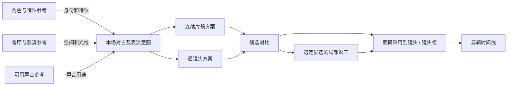

# AI 短剧工作台画布：场景、价值与阶段建议

日期：2026-09-07。状态：画布专项评估，补充产品设计 v1.0，尚未确认新增 MVP 范围。本轮核查官方帮助和产品文档，没有登录生成、团队共编或生产效率实测。以下将公开能力证据与本产品建议分开。

后续讨论补充：画布应作为交互假设，先明确参考、候选、局部编辑和方法复用等业务能力，再与其他界面比较。LibTV 与即梦的产品差异及利弊见 [从交互形态回到业务问题](2026-09-07-libtv-jimeng-canvas-review.md)。

## 1. 判断

画布值得在短剧工作台中认真验证，其核心价值是让团队在同一上下文中组织视觉参考、尝试多个方案、检查输入与产出的关系，并将认可结果用于正式制作。

价值大小取决于所支持的创作操作。只有自由摆放文件的画布主要提供沟通与整理价值；能够选择参考、发起生成、比较候选、继续修改并关联镜头的画布，可以进一步减少制作中的素材搬运和上下文重建。

建议将「能直接制作的场次画布」作为首版原型验证候选，将任意节点工作流编辑器作为长期复用能力评估。此判断细化此前轻量参考板与通用节点编辑器的区分，没有直接修改已讨论的 MVP 交付承诺。

## 2. 先区分画布的用途

同一产品可能同时具备多种用途，下表是分析维度，不是互斥的产品分类。

| 用途 | 用户组织什么 | 主要价值 | 局限 |
|---|---|---|---|
| 视觉参考与探索 | 人物、服装、空间、影调、构图和创意备选 | 并置比较，减少抽象描述和来回找资料 | 仅摆放素材不能让模型自动理解用途 |
| 生成与候选探索 | 参考、生成意图、多个候选及修改分支 | 在上下文中尝试、比较和继续制作 | 分支过多时查找和选用可能变慢 |
| 叙事与分镜组织 | 剧本片段、场次、镜头、人物/空间引用 | 把故事内容与具体拍法连接起来 | 排布不等于实际剪辑时间线或自动空间一致性 |
| 可执行流程编排 | 不同生成/处理步骤、依赖、锁定结果及模板 | 自动复用成熟步骤，将方法交给其他成员 | 需要学习节点规则、调试依赖和管理费用 |

所谓「空间画布」还可能指摄影机、人物位置或 3D 场景预演，属于另一套控制能力，不能由存在二维无限画布推导出来。本轮主要讨论视觉制作与节点画布。

## 3. 官方产品证据

### Higgsfield Canvas：生成输入、并行比较与模板

2026-08-01 官方帮助说明支持提示、生成和参考节点连线；节点可单独或顺序运行，支持并行比较、模板和同画布协作。其价值主张直接指向减少跨工具复制输出，以及保留可复用生成步骤。[Canvas 指南](https://higgsfield.ai/creator-hub/help-center/tools/how-do-i-use-canvas)

同一指南说明，Seedance 节点的参考用途仍需在提示中明确；其可灵节点直接连入图片时被当作首帧，角色引用采用元素机制。该差异属于 Higgsfield 当前入口，不外推为所有供应商接口规则。[参考输入说明](https://higgsfield.ai/creator-hub/help-center/tools/how-do-i-use-canvas)

设计推论：连接线必须表达实际制作含义并验证兼容性；画布上连好线不等于模型已得到正确的角色、首帧或声线约束。

### Runway Workflows：分支、单步执行和锁定中间结果

官方帮助覆盖多步生成、分支尝试、可复用模板、类型兼容的连线、单节点或全流程执行；锁定节点可在再次运行时复用该输出。[Workflows](https://help.runwayml.com/hc/en-us/articles/45763528999699-Introduction-to-Workflows)

工作流还能发布为简化 App，选择显示或隐藏输入输出，保留关键设置。使用者可以运行方法而不直接编辑整张节点图。[发布为 App](https://help.runwayml.com/hc/en-us/articles/47865876793747-Publishing-Workflows-as-Apps)

设计推论：长期价值包括主创搭建、其他成员使用。模板复用不要求所有制作人员每天拖连线，也不能将节点锁定等同最终成片质量保证。

### Katalist Story Canvas：剧本和参考进入制作

官方教程描述从剧本拆出场次和镜头，将场次加入画布，先建立角色和地点卡片，再生成分镜/视频；生成片段进入独立 Timeline 编排与导出。[Story Canvas 指南](https://help.katalist.ai/en/articles/16298583-how-to-build-your-storyboard-and-videos-in-story-canvas)

设计推论：画布可以带有明确的叙事结构，不必从完全空白开始；时间线仍承担最终顺序与时长编排。教程的逐帧路径不应强制套用到我们优先验证的镜头组音画生成路径。

### Morphic：共享画布和定位明确的反馈

Projects 帮助说明项目包含多个 File，各自具有 Canvas；Live Collab 帮助说明同画布生成、编辑、光标和视角跟随。Comments 文档支持在素材整体、画面位置/区域和视频时间点留下可回复、解决与重开的反馈。[项目](https://morphic.com/docs/getting-started/dashboard/projects.md)、[共编](https://morphic.com/docs/collaboration/live-collab.md)、[评论](https://morphic.com/docs/collaboration/comments.md)

本轮 Web 抓取无法读取这些 Markdown 页，改用普通 HTTP GET 取得官方正文；没有实际进行双账号协作。

设计推论：协作价值在于团队明确讨论同一素材、位置或时刻，不能只用「有多人光标」衡量。画布批注与镜头正式审片应引用同一版本，避免两处形成互相冲突的批准状态。

### FLORA 与 Figma Weave

补充的官方工作流、模板和协作证据见 [专项记录](2026-09-07-canvas-flora-weavy.md)。不同产品的分享、复制和实时共同编辑需要分别核查，不因名为 Canvas 就视为具备同一种协作能力。

LibTV 在此前同日研究中已确认画布与脚本共存，但本轮未重新取得飞书指南正文，因此不新增其当前细节断言。历史证据见 [LibTV 调研](2026-09-07-libtv-and-review.md)。

## 4. 对 AI 写实短剧的高价值场景

| 场景 | 具体操作 | 预期收益（待实测） |
|---|---|---|
| 剧目视觉定调 | 并置人物造型、空间、色调和镜头参考，比较多个方向 | 主创、美术、视频制作对目标形成共同理解 |
| 某场戏的多参考准备 | 将角色、场景、声音和表演参考关联到当前生成意图，明确各自用途 | 少重复上传和复制，减少误用造型或声音 |
| 拍法与表演探索 | 从同一参考分别尝试近景、反打、反应节奏或不同表演强度 | 在同一条件下比较方案，保留未采用但有价值的备选 |
| 局部返工 | 从某一候选分出修改版本，保留来源与原版，对照前后镜头检查 | 容易理解改了什么、从哪里继续，不混淆采用版本 |
| 内部创作评审 | 对照角色参考、候选和上下文定位反馈 | 减少截图传递和口头描述造成的歧义 |
| 成熟制作方法复用 | 将成功的参考准备、生成、检查/选用和后处理步骤整理为模板 | 跨成员、跨项目复用方法，需另验收其适用范围 |

对于已确定方案后的大量镜头状态、负责人、截止时间和待办，表格/列表通常更直接；对于对白时间和片段切点，时间线更直接。画布在「探索、关系和视觉比较」中最值得验证，生产进度与整集剪辑保留相应视图。

对 Seedance 优先路线的推论：多参考联合生成使画布可能成为整理导演输入的有效方式；单次生成完成更多步骤后，手工搭建长串转换节点的必要性可能降低，但参考准备、候选比较和选择性返工仍存在。必须区分参考整理便利与模型一致性效果。

## 5. 用一场戏说明

沿用讨论示例：女主放信，问「这封信，你看过了？」；男主避开目光回答「没有」。下面是建议的制作关系，不是已实现界面。

用户可在一个工作空间看清参考、拍法、候选与修改关系。拖动卡片只改变排布；明确选择或连接兼容参考才改变待生成输入；采用操作才更新镜头选用；时间线操作才改变成片编排。

## 6. 建议验证的产品形态

优先把「画布」作为分镜工作台内与故事板/表格并列的可选视图，默认定位当前场次。另可从剧目设定打开视觉参考板；需要跨场比较时明确加入相应对象，不把全剧所有候选自动铺在同一张大图上。

首版原型验证范围建议：

1. 按当前场次和资产引用自动摆出初始内容，支持拖放、缩放、分组和整理。
2. 展示参考、镜头/镜头组和候选卡片，素材直接引用已有库。
3. 选择参考并说明用途，从上下文发起现有生成能力。
4. 并排预览候选，从某一结果继续修改，保留原始来源。
5. 将结果明确采用到已有镜头，与其他视图同步；尚无镜头归属的探索结果可随后关联或建镜头。
6. 展示当前输入、预计费用、运行状态与版本反馈，移动或排列不触发付费生成。

此范围包括可操作的制作能力，不只是一张静态情绪板；同时不需要任意循环、脚本、条件分支、插件节点或全图自动重跑。首版不承诺完整实时共编；先沿用现有对象版本、评论与冲突处理，共编需求单独验证。

后续在发现重复出现的制作方法后增加模板和参数化输入。更自由的工作流画布由高级创作者使用，其输出可封装为普通成员能使用的制作工具。

## 7. 必须保留的数据边界

- 画布保存布局和对象引用；资产、镜头、生成与剪辑仍由各自模块管理。同一素材可以出现在不同视图而不重复生成或复制所有权。
- 视觉位置、参考依赖、镜头顺序和剪辑时间是不同关系，不根据卡片位置猜测执行或故事顺序。
- 参考的语义必须明确；布局邻近不自动进入模型输入，连线也必须通过模式兼容检查。
- 移出画布仅移除该处展示，不等于删除原素材、取消采用或移除历史交付引用。
- 参考修改、候选采用和付费执行是明确操作；历史输入固定，新版本只提示影响，不自动重跑全部下游。
- 画布沿用项目权限，不引入外包或另设分享权限体系。只读查看、外部链接和更细授权仍按长期范围处理。

## 8. 如何判断值得上线

用同一场戏比较「现有分镜卡/表格＋资产侧栏」和「场次画布」两种方式，完成参考准备、两种拍法尝试、候选选用及一次指定返工。功能应尽量一致，以免把新增功能的收益全部归因于布局。

记录寻找正确参考、准备生成输入、对照候选及交接返工的时间；误用资产版本、重复上传/生成、采用错误的次数；另一名成员能否快速理解当前方案。制作费用和产物质量一起记录，不只看生成数量或画布停留时长。

若画布主要增加排版整理、迷路和解释连线的时间，应缩小为参考/候选视图。若它稳定减少参考准备和返工成本，可进入 MVP；若收益主要来自成熟流程重复运行，则优先模板封装，未必先开放完整节点编辑器。

这一轮建议是进入原型验证，不是宣称画布已被证明能提升我们的写实短剧制作效率。
