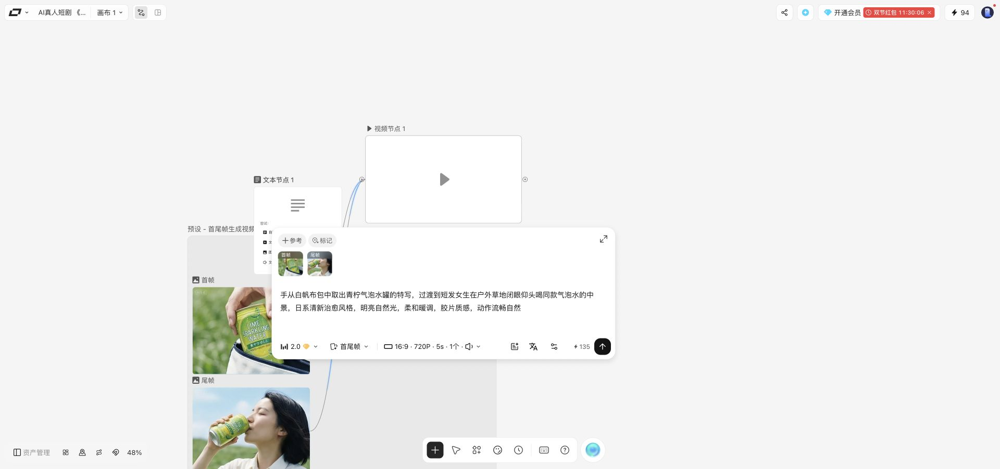
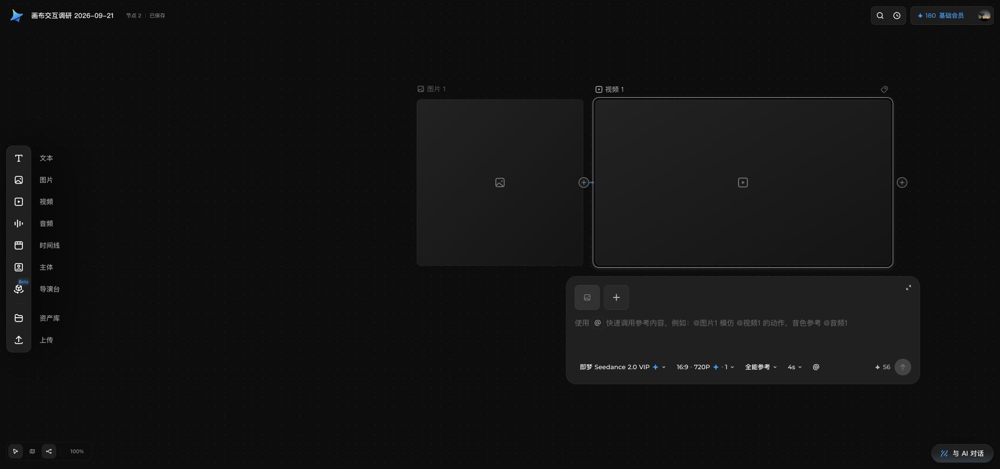
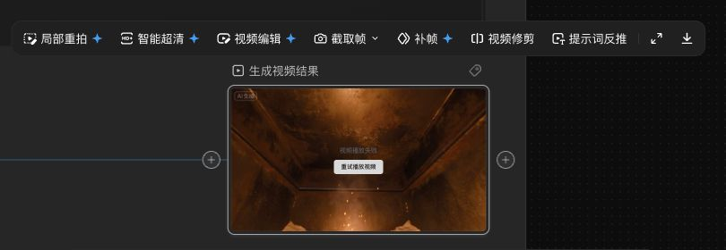
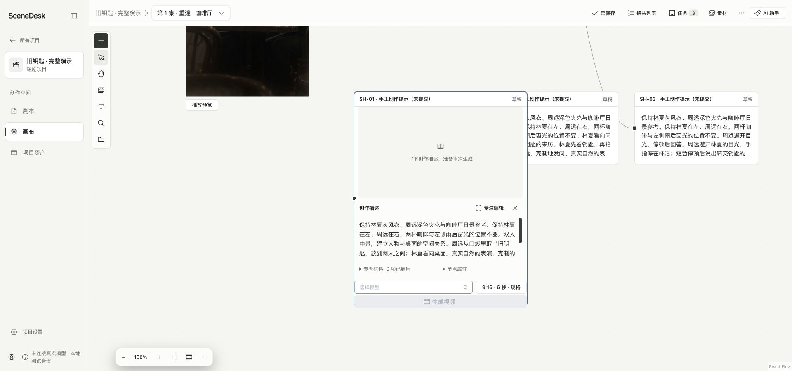

# LibTV、即梦与 SceneDesk：画布整体设计、卡片与交互调研

> 本文引用的部分源文件与 e2e 规格属于旧创作界面，已在 2026-09-21 阶段 3 删除（见 [85-studio-rebuild.md §1i](../implementation/85-studio-rebuild.md)）；这些引用改为纯文本，内容按当时原样保留。

日期：2026-09-21。状态：设计研究，供画布重设计使用；不是已批准方案，也不改变现行业务范围。

本轮先复查仓库研究、读取远端 `origin/main`，再用用户已登录的 Chrome 实际打开两款产品的画布。SceneDesk 同时做生产源码审计和本机页面走查。**核心结论：值得学习的是围绕作品本体展开输入、引用、工具和结果的连续交互，而不只是节点外观或工具数量。SceneDesk 已有相当多底层能力，主要差距集中在卡片状态设计和操作路径。**

## 1. 范围、版本与证据

### 1.1 本次实际做了什么

- 读取 9 月 7、14、18 日的 LibTV / 即梦研究和当前产品方向，核对旧判断；拉取 `origin/main`，其研究目录与当前工作树没有内容差异。研究基线 HEAD 为 `892a4c85122450030eeed4db151c3f3af216cab3`，远端 main 为 `e190fda`。
- 在 LibTV 和即梦节点画布分别新建名为「画布交互调研 2026-09-21」的独立研究项目，只建空节点和手工示例文字；验证创建、选中、输入面板、参考派生、文本编辑及专用卡片。研究项目保留以供复核。
- 浏览已有样例中的图片、视频、连线和分组，只操作选择、视口、预览及菜单。未上传项目文件，未发送 Agent 对话，未点击生成、付费处理或发布。
- 分别打开即梦 `/ai-tool/ai-canvas` 与 `/ai-tool/canvas`，确认当前账号下确有两套不同工作界面。没有将海外 Dreamina 的宣传当成国内当前界面。
- 打开本机 4311 的「旧钥匙 · 完整演示」，观察草稿就地编辑与专注编辑。页面明示「未连接真实模型 · 本地测试身份」。服务所在 checkout 与本次 HEAD 相同，14 个相关生产文件逐字节一致；[源码审计](2026-09-21-scenedesk-canvas-card-audit.md)给出详细依据。

### 1.2 证据标记

| 标记 | 含义 | 能证明什么 |
|---|---|---|
| 现场 | 本轮亲见截图、可访问文本、操作前后状态 | 当前账号、当前对象、当前版本的可见行为 |
| 代码 | SceneDesk 当前生产实现 | 实现路径与约束；不是本轮完整业务验收 |
| 历史 | 仓库已有研究 | 定位线索与当时的观察，须保留原有范围 |
| 判断 | 基于以上材料提出的设计评价 | 待设计验证的建议，不冒充竞品事实 |
| 未验证 | 本轮无法完成或未执行 | 不能据此声称功能不存在 |

截图保留实际产品界面，没有重绘竞品。主截图宽 1920 屏幕像素，高度随当时窗口变化；画布 zoom 各不相同。正文提及的控件宽度是截图近似屏幕尺度，不是统一设计 token。没有把缩放后的 DOM 尺寸直接当作节点世界尺寸。

公开入口：[LibTV](https://www.liblib.tv/)、[LibTV 项目列表](https://www.liblib.tv/project)、[即梦节点画布](https://jimeng.jianying.com/ai-tool/ai-canvas)、[即梦另一画布入口](https://jimeng.jianying.com/ai-tool/canvas)。登录内项目地址包含账号项目标识，因此正文引用入口和本地截图，不复制私有项目地址。

## 2. 整体画布组织

| 维度 | LibTV，现场 | 即梦节点画布，现场 | SceneDesk，代码 + 现场 |
|---|---|---|---|
| 主工作面 | 几乎全屏的浅色无限画布；项目名、画布切换、工作流／故事板在顶栏 | 深色点阵画布；项目名、节点数、保存状态在顶栏 | 项目导航 + 画布；顶栏可切项目／场次创作空间，进入镜头列表、任务、素材、助手 |
| 创建入口 | 空态直接图片／视频／音频／剧本／智能剪辑；底部添加菜单；空白双击菜单；节点 `+` | 左侧文本、图片、视频、音频、时间线、主体、导演台，以及资产库和上传；空白右键新建；节点 `+` | 左侧新建菜单、文字、素材等；已有内容可「继续创作」；空白双击添加文字 |
| 内容组织 | 连线、分组背景、多个画布、故事板；脚本有专用工作区 | 连线、可见组框；主体、时间线和外部导演台都是不同形态对象 | 项目／场次归属、镜头关联、逻辑分组；分组目前没有可见背景框 |
| 视口控制 | 左下缩放、小地图、连线显隐、网格吸附、整理；底部移动工具 | 左下工具模式、小地图、连线显隐、缩放；缩放菜单有适配画布／选中项 | 缩放、适应内容、定位、查找、镜头与探索；当前画布无小地图／吸附／自动排列／连线显隐 |
| AI 入口 | 本次显示 TV Director；可浮窗，也可停靠右侧，二者均实际切换 | 右下「与 AI 对话」打开右侧可调宽面板，当前对象可出现在输入上下文 | 右侧助手，与手工编辑共用草稿，显式收录材料与应用建议 |
| 结构化制作 | 脚本卡可打开确认镜头、准备资产、合成提示词的专用表格 | 时间线卡承载轨道；主体卡承载主媒体、辅助媒体、声音；导演台卡进入 3D 空间 | 剧本阅读、固定资产、候选与镜头选用、原片交付；当前首发不含剪辑成片 |

来源：本轮 [LibTV 生成器](assets/2026-09-21-canvas-cards/libtv-video-composer.png)、[LibTV 脚本工作区](assets/2026-09-21-canvas-cards/libtv-script-workspace.png)、[即梦基础节点](assets/2026-09-21-canvas-cards/jimeng-image-to-video.png)、[即梦专用节点](assets/2026-09-21-canvas-cards/jimeng-node-types.png)、[SceneDesk 就地编辑](assets/2026-09-21-canvas-cards/scenedesk-inline-editor.png)，以及[生产代码审计第 1、5 节](2026-09-21-scenedesk-canvas-card-audit.md)。菜单存在与控件可点击不代表其全部业务流程已验证。

**判断：** 两家都让用户先处理画布上的对象，复杂工具随后围绕该对象出现。SceneDesk 的项目与场次导航是短剧制作需要，但卡片自身仍应让用户直接辨认当前画面、用途和下一步。无需把每项管理状态放进每张卡片。

### 即梦必须分开看的两套画布

本轮 `/ai-tool/canvas` 的空态是「从已有素材开始」和与 Agent 对话，底部常驻大输入框，有 Agent 模式、自动、灵感搜索、创意设计；左侧工具轨比节点画布简单。`/ai-tool/ai-canvas` 则显式创建媒体节点，生成器跟随选中对象，并提供双向节点端口。[另一入口截图](assets/2026-09-21-canvas-cards/jimeng-other-canvas.png)

官网还介绍局部重绘、扩图、消除、抠图与多图层编辑。这些是官方披露；本轮没有逐项在另一入口里执行，不能把它们全部算作当前节点画布已验证的工具。[即梦官网](https://jimeng.jianying.com/)

旧报告从另一构建中枚举的 49 个工具、画板 frame 和协作类名，只能作为该入口的历史取证。也不能仅凭 `Room connected` 推出多人光标、冲突处理或生产协作效果。

## 3. 卡片解剖：共同结构与关键差异

### 3.1 LibTV：媒体本体 + 卡片旁的制作工具

**现场：** 图片和视频卡的类型图标、名称位于主体上方；主体直接显示图片、视频或空媒体占位。选中后出现边框和两侧圆形端口。空图片卡还提供图生图、图片高清等起步建议。

选中的生成对象下方另出现宽约 660 屏幕像素的输入面板，包含：参考／标记等入口、参考缩略图、提示词、模型、模式、合并规格入口、费用和提交。48% 画布下仍可正常阅读和编辑该面板；它与被缩小的卡片不等宽。[视频生成器现场](assets/2026-09-21-canvas-cards/libtv-video-composer.png)

本次样例中，两张上游图片被标为首帧、尾帧，既有连线也有面板缩略图。点击合并规格可展开比例、清晰度、时长、生成音频、数量。面板主层负责写内容和发起任务，参数没有全部摊成纵向表单。

选中已有图片，图像处理条浮在卡片附近：人像质感、全景、多角度、打光、九宫格、高清、元素编辑、图层分离、宫格切分等。这里只验证了入口，未触发处理。样例的图片接近视口左侧／底部时，工具条出现左端出界的现象；因此不能把它当成边界避让已经完美的范本。[选中图片截图](assets/2026-09-21-canvas-cards/libtv-image-selected.png)

### 3.2 即梦节点画布：同一对象上的内容操作与生成输入

**现场：** 未选中媒体以名称和预览为主；选中视频后，本体内出现播放器，上方出现后续编辑工具，下方保留参考、提示词与生成参数。生成输入区约 680 屏幕像素宽，在 50% 与 100% 视图下都保持可读的控件尺度。[图片派生视频截图](assets/2026-09-21-canvas-cards/jimeng-image-to-video.png)

参考以缩略图呈现，提示词支持 `@` 引用。模型、画幅／分辨率／数量、参考模式、时长在面板底行，右侧显示当前费用与提交。空提示时生成按钮禁用，给出缺少提示的原因。通过空图片创建下游视频后，会明确显示参考节点尚无内容，而不是悄悄当作有效图片。

已有视频的上方工具条包括局部重拍、智能超清、视频编辑、截取帧、补帧、视频修剪、提示词反推、全屏、下载。**观察到的是能力入口，并未验证每项输出。** 下图保留了本轮随后实际出现的播放失败态：资源仍标为 ready，但播放器显示重试播放。素材状态和本地播放状态是不同层次。

长提示会让输入面板增高，本次已有视频的长提示几乎占到屏幕底部。右侧对话展开时也遮住了部分靠右节点和输入面板。这些是需要避免照抄的空间问题，而非成熟产品自然就能解决的细节。

### 3.3 SceneDesk：现有能力足够多，但草稿与作品在视觉上分离

**代码 + 现场：** 非编辑草稿默认是标题、草稿标记、最多五行提示摘要和最近尝试状态；进入编辑后节点至少扩到 420 世界像素，顶部出现最近结果或占位，下方挂载就地编辑器。编辑器跟世界坐标一起缩放。[节点渲染与样式审计](2026-09-21-scenedesk-canvas-card-audit.md)

本轮在 21% 视图下点击编辑，先出现「正在编辑／位于视图外」的定位条；定位后回到 100% 显示完整编辑卡。专注编辑可在屏幕尺度输入，但覆盖了画布主体。[专注编辑截图](assets/2026-09-21-canvas-cards/scenedesk-focus-editor.png)

媒体节点本身已采用标题在上、媒体为主的设计。真正的差距主要在**生成草稿**：默认态看不到已有结果，打开编辑又改变卡片尺寸；有媒体、写提示、看历史和放置结果是几种不同界面状态。不能笼统地说 SceneDesk 所有卡片都只是表单。

### 3.4 按状态比较

| 状态 | LibTV / 即梦本轮可见做法 | SceneDesk 当前 | 重设计判断 |
|---|---|---|---|
| 未选中 | 媒体本体或清晰的媒体占位，名称在上 | 媒体已有；草稿以提示摘要为主 | 草稿完成后应能持续认出作品，不必先编辑 |
| 选中 | 边框、端口、当前媒体相关的工具／输入 | 选中工具条已有；编辑需再点或双击 | 可减少从“选中”到“写内容”的额外跳转 |
| 输入 | 卡片旁独立面板，紧凑模型／规格行 | 就地编辑随 zoom；专注模式另开大工作面 | 默认输入应在浏览全局时也保持可读 |
| 文本编辑 | 富文本工具独立浮出，正文是主体 | 普通文字与固定摘录；现有编辑是文本输入 | 普通文字可提升写作体验；固定剧本原文必须只读 |
| 已有结果 | 即梦选中既有结果，同时可看原参数并继续；LibTV 图片就地出现编辑工具 | 最近成功结果仅当前编辑草稿可预览，独立媒体另行呈现 | 同一创作对象中连续查看结果、输入和历史 |
| 失败 | 即梦本轮亲见播放失败与播放重试；生成失败未执行 | 保存、未知执行、归档失败、媒体读取分别有恢复路径 | 保留原因差异，避免统一成一个不明含义的重试图标 |

## 4. 文本、剧本、主体、时间线不是同一种卡片

### 4.1 文本卡

LibTV 空文本卡同时给出手工编写和 AI 创作入口。选择手工编写后，出现背景色、标题层级、正文、粗体、斜体、列表、分割线、复制和展开编辑；输入示例文字后点击空白，文本留在卡片上。双击正文重新编辑，标题和正文分别可操作。[文本现场](assets/2026-09-21-canvas-cards/libtv-text-edit.png)

即梦文本卡双击进入正文编辑，出现文字样式、列表、粗体、删除线、斜体、下划线及全屏；选中时有多个缩放手柄、名称和背景色入口。手工示例在失焦后保留，页面显示已保存。未验证跨刷新恢复、多人同时编辑与粘贴复杂文档的保真度。

**判断：** 文本卡应承载能直接阅读与修改的创作内容，文本样式工具按编辑状态出现。SceneDesk 的普通文字、生成提示和固定剧本摘录应有清楚身份，不能为统一外形允许修改固定原文。

### 4.2 LibTV 脚本卡

当前添加菜单的「脚本」有新版和旧版入口。本轮选新版，再选择自己编写，成功打开结构化工作区：

1. 确认镜头：镜号、时长、画面描述、景别、光影、对白／旁白、音效、运镜、最终提示与行操作；有添加镜头。
2. 准备资产。
3. 合成提示词。

空白一行时显示三个阶段的完成情况，批量生图／视频仍禁用。画布上的脚本卡承担流程摘要及返回该工作区的入口。[脚本截图](assets/2026-09-21-canvas-cards/libtv-script-workspace.png)

这补齐了旧研究未进入脚本节点的缺口。它也表明复杂卡片不必把整张制作表压进自由画布：概览在节点，重度编辑在专用工作面。

### 4.3 即梦专用节点

| 对象 | 本次亲见内容 | 没有验证的部分 |
|---|---|---|
| 音频 | 与图片／视频一致的生成面板骨架；创作类型、模型、配音方式、音色、参考与费用 | 真正音频生成、波形和多音色输出 |
| 主体 | 名称、描述、主媒体、导入主体；空态区分主媒体、辅助媒体、声音 | 已有完整主体的版本、共享和声音绑定行为 |
| 时间线 | 宽幅轨道卡，时间码、素材添加、全屏编辑、静音、导出；空态显示一条视觉轨、零音轨 | 实际裁剪、转场、导出格式和同步播放 |
| 导演台 | 外部类型卡，说明在 3D 空间设计角色、机位、镜头，提供进入按钮 | 3D 编辑器与回传机制 |

以上通过研究画布逐个创建并读取，节点数从 3 依次增加至 7；[现场总览](assets/2026-09-21-canvas-cards/jimeng-node-types.png)记录创建后的对象。连续从工具轨新建专用对象时出现位置重叠，截图不代表经过整理的推荐布局。

**判断：** 这是类型感和专用编辑深度的参考，不是要求 SceneDesk 本轮加入时间线或 3D。我们当前的镜头排序／原片包与剪辑时间线是不同工作。

## 5. 引用、派生与连线

### 5.1 本轮完成的两条实际路径

| 产品 | 操作 | 确认后的结果 | 证据边界 |
|---|---|---|---|
| LibTV | 新建图片 → 选中 → 右侧 `+` →「引用该节点生成」→ 视频 | 出现新视频节点、图片到视频的边、视频输入面板内参考项 | 创建草稿，没有提交模型 |
| 即梦 | 新建图片 → 右侧 `+` → 视频 | 状态从 1 节点／0 边变为 2 节点／1 边；选中新视频；参考区显示原图片及空内容提示 | 创建草稿，没有提交模型 |

**现场：** 即梦的派生菜单不是永远全开。空图片可以派生部分媒体类型，文本／导演台等不支持项禁用，时间线／主体会显示资源未就绪原因。已有视频右侧菜单可见视频、时间线、主体可选，文本／图片／音频／导演台禁用。这里记录本次对象与状态，不外推成所有模型永久规则。

LibTV 的两侧 `+`、已有边、输入面板缩略图构成同一关系的不同入口。即梦的前后端口可访问名称明确区别在当前节点之前或之后创建，右侧路径已实际完成；左侧完整创建路径未执行。两家从端口拖到既有节点的手势本轮仍未可靠完成。

### 5.2 SceneDesk 的差异是入口与语义范围

SceneDesk 已有「继续创作」：选定已有文字或媒体，打开来源确认面板，选择图片／视频／声音草稿，系统在来源右侧建立新草稿和有序引用。多项素材可共同作为参考。它并不缺少这条业务路径。继续创作实现、[派生逻辑](../../apps/web/src/business/canvas-creation.ts)

但当前端口是草稿左入、已有内容右出，12px 小圆点；没有端口 `+` 菜单，草稿不能直接连接草稿。已有用途标签（身份、场景、构图等）、启用状态和固定来源，是 SceneDesk 应保留的优势。[端口与引用审计](2026-09-21-scenedesk-canvas-card-audit.md)

**判断：** 优先让“用这个继续做什么”成为卡片旁的明显入口，并让连线、缩略图、用途标签讲同一件事。不要为了复制竞品外形放开所有草稿互连；那会涉及执行和契约语义，需要另行确定。

## 6. 选择、分组、快捷键与操作分层

### 已确认

- 两家都有空白上下文创建入口。LibTV 本轮成功双击空白打开添加节点菜单，修正旧文“尚未确认”；即梦空白右键可见新建、粘贴、撤销／重做。
- 即梦节点右键实际可见复制、复制副本、粘贴、下载、撤销／重做、删除；是否能下载取决于对象类型。本轮没有执行复制或删除来验证依赖保留语义。
- 已有样例中，两家都有淡色／深色的大背景容器包住多个节点；即梦组状态显示三个成员。SceneDesk 当前分组有名称、成员、联动移动，但没有容器框。[分组实现审计](2026-09-21-scenedesk-canvas-card-audit.md)
- LibTV 的快捷键面板本轮用截图逐项读取。**macOS 的成组是 ⌘G，连线是 ⌘L，复制节点和连线是 ⌘D，生成是 ⌘Enter，撤销是 ⌘Z。** 新建节点为 Tab；移动 V、抓手 H；整理是 Option+Shift+F。[快捷键原图](assets/2026-09-21-canvas-cards/libtv-shortcuts.png)

### 本轮仍不应声称已完成

尝试 Shift 点击和全选没有得到稳定的多选状态；部分拖动成为平移，工具控制也出现超时。因此没有把本轮结果写成“竞品不支持多选”，也未声称验证了新建组、解组、整组生成、对齐／分布或撤销的完整效果。后续要验证这些，应从实际修饰键、焦点和指针模式开始，而不是照抄旧表中的单键。

SceneDesk 本身有撤销／重做、框选、手形、空格平移和查找列表多选。复制当前只复制节点、不复制连线；因此“复制草稿继续试一版”可能与用户期望的继承参考不一致。这是比单纯补一个快捷键更重要的产品语义问题。[选择、复制与分组审计](2026-09-21-scenedesk-canvas-card-audit.md)

**判断：** 三层动作宜区分：卡片高频动作（查看、编辑、继续）；类型专用工具（图像／视频处理）；低频整理（复制、重命名、分组、移除）。重命名尽量贴近标题。危险或会消费资源的动作不能仅因快捷键更快就隐藏其后果。

## 7. 生成、结果和助手

### 7.1 生成输入与费用

两家本轮都把模型、主要规格、费用与提交放在同一个输入面板。费用是当前账号和参数的 UI 样本，不是本报告的价格推荐。不同模型、资源与订阅可能改变它。

SceneDesk 已有模型／规格 Popover、执行前固定输入、阻断检查、批量计划确认。真正要改的是这些信息怎样在卡片上被发现、在缩小视图中被核对；不能继续写成“没有生成参数／前置校验／批量生成”。[生成流程审计](2026-09-21-scenedesk-canvas-card-audit.md)

### 7.2 结果的持续可见性

即梦已有结果卡可直接预览并同时回看生成输入，LibTV 已有图片可在原处继续后编辑。这是本轮可确认的空间连续性。**本轮没有实际生成，因此不能确认所有模式是替换原卡、添加子卡、展开多结果，或怎样切换同节点的历史。** 这些细节不使用旧入口结果规律代填。

SceneDesk 当前最近成功结果只在编辑中的草稿显示；更多尝试和 A/B 比较在记录面板，加入画布还要查看位置并明确添加为媒体节点。这保证了可追溯与恢复，也增加了从生成到看到作品的步骤。[结果路径审计](2026-09-21-scenedesk-canvas-card-audit.md)

**判断：** 可以研究“生成完成就能在创作对象旁看到结果”，同时仍由用户明确决定是否加入镜头候选、选用、固定批准或交付。**自动呈现结果与自动采用是两件事。** 现有业务不变量没有要求必须把结果藏起来。

### 7.3 Agent 与手工画布

LibTV 本次 TV Director 初始以浮窗出现，有停靠右侧按钮；实际切换后出现可调宽的侧栏。空态提供感知画布、剧本原创、改编、批量优化提示词等入口；输入支持引用工作流／节点／资源，当前显示手动生成。没有发送消息，不能用入口推断其真实执行质量或默认花费策略。[浮窗](assets/2026-09-21-canvas-cards/libtv-agent-floating.png)、[停靠](assets/2026-09-21-canvas-cards/libtv-agent-docked.png)

即梦节点画布右侧对话面板本次约 400px，有调整宽度控件；空态提供专业创作模式。选中视频时，对话输入可见该视频对象标签。[现场](assets/2026-09-21-canvas-cards/jimeng-agent.png)

SceneDesk 已有显式助手上下文和同稿应用。重设计时应保证手工输入、当前参考、助手建议及已运行输入的关系可辨认，而不是再增加一套独立配置表。是否常驻、停靠或浮动，是需要通过视口和遮挡验证的界面选择。[当前方向](../design/creative-workspace-approved-2026-09-16.md)

## 8. 与 SceneDesk 当前差异及优先级

下表是设计判断，按本次“卡片与交互重设计”的价值排序，不是新增已承诺功能。

| 优先级 | 实质差异 | 当前已有基础 | 建议重设计焦点 |
|---|---|---|---|
| P0 | 草稿默认靠文字摘要识别，作品需打开后看 | 媒体预览、最近成功结果、独立媒体 | 定义无结果／有结果／进行中／失败的稳定卡片主体；避免编辑前后大幅变形 |
| P0 | 编辑器随世界缩放，小缩放需定位或专注 | 同稿就地与专注编辑已实现 | 单选后就在对象旁输入；输入区保持屏幕可读尺度，卡片仍可缩放 |
| P0 | “继续创作”与端口是两套可发现性 | 派生、来源快照、有序引用、用途标签 | 显著的继续入口；菜单说明使用什么、创建什么；保留用途与固定版本 |
| P0 | 生成后预览、历史、放置、比较分散 | 持久任务、A/B、结果定位和恢复 | 结果在原处持续可见；多结果与多次尝试分开；采用仍明确 |
| P1 | 类型专用动作薄，媒体后编辑多需外部能力 | 图片／视频／声音预览与继续生成 | 先整理实际可用动作；后编辑能力要连同真实服务单独建设，不能做空按钮 |
| P1 | 名称与尺寸藏在属性，复制不继承边 | 节点属性与复制已有 | 标题直接改名；定义复制内容、复制尝试、复制来源关系的差异 |
| P1 | 逻辑分组不可一眼识别边界 | 分组与联动移动已有 | 组框、组标题、选择范围与批次范围明确，组内布局不等于镜头顺序 |
| P2 | 大画布定位与整理工具较少 | 搜索、定位、适应内容已有 | 小地图、吸附、排列、连线显隐；在核心卡片流程之后优化 |
| 独立议题 | 脚本生成表、主体专用卡、时间线、3D、多人共编 | 剧本、固定资产、镜头列表、恢复与权限 | 各自确认范围与验收，不夹进视觉重构 |

建议下一步的设计稿至少并排覆盖：默认卡片、选中输入、长提示、多个参考、结果列表、任务未决、可恢复失败、50% 全览、靠视口四边，以及助手展开。只画一张漂亮的成功态卡片不足以决定交互。

保留要求来自[领域约定](../../CONTEXT.md)与[现有实现](2026-09-21-scenedesk-canvas-card-audit.md)：草稿不丢失；固定来源不静默升级；未知提交不自动重花钱；归档重试不重新调用模型；结果与采用区分；权限在重试和恢复时仍核对。

## 9. 对旧研究的必要勘误

| 旧研究中的说法 | 本次修正 |
|---|---|
| 即梦的 49 个工具、图层容器和节点生成属于一套界面 | 两个入口分别记录；本轮已亲自打开两套 |
| 即梦有九类节点，包含资产库和上传 | 九个工具入口不等于九类持久节点；本轮实际建成七类对象 |
| LibTV 双击空白、脚本卡、参数区位置不明 | 本轮成功双击打开菜单，进入脚本专用表，并观察卡片下方生成器 |
| LibTV G 成组、L 连线、Enter 生成、Z 撤销 | macOS 界面含 ⌘ 图标；分别是 ⌘G、⌘L、⌘Enter、⌘Z |
| LibTV 助手必定是固定 400px 抽屉 | 当前可浮窗／停靠，宽度可调；账户状态和版本影响初始形态 |
| SceneDesk 每场一张画布，没有参数、校验、批量、重命名、撤销 | 当前生产代码均有相应路径，需比较体验质量而非重复补功能 |
| 两家都没有采用机制 | 全产品否定缺少证据；本轮只说未在已走查区域验证到等同 SceneDesk 的正式采用机制 |
| 结果自动放到画布意味着自动采用 | 空间呈现和领域事实独立，可以分别设计 |
| 看到协作类名／Room connected 就证明实时多人共编可靠 | 只证明存在相应界面或连接状态；多人、冲突与恢复须独立验证 |

更完整的旧结论核对见[SceneDesk 审计第 7 节](2026-09-21-scenedesk-canvas-card-audit.md)。历史文件保留原文，入口加本报告提示，不把后来的事实改写成早期已知。

## 10. 覆盖度与尚未验证项

| 项目 | 本轮覆盖 |
|---|---|
| 整体布局、入口、视口与助手 | 两家现场；SceneDesk 现场与代码 |
| 图片、视频空卡、选中生成器 | 两家现场；SceneDesk 草稿现场与代码 |
| 文本创建、编辑、失焦 | 两家手工示例现场；未刷新验证远端持久化 |
| 图片 → 视频派生和引用呈现 | 两家实际创建节点与边，未生成 |
| 已有媒体后续动作 | LibTV 图片、即梦视频现场；未执行付费处理 |
| 脚本／主体／时间线／导演台卡片 | LibTV 新脚本专用表；即梦四类专用对象空态与音频生成器 |
| 右键与快捷键 | 菜单与 LibTV 快捷键截图；完整快捷键效果未逐项执行 |
| 分组 | 已有组框与成员；新建组／多选手势未可靠完成 |
| 多结果、历史切换、结果落点 | SceneDesk 代码；竞品未跑生成，保持未知 |
| 失败 | 即梦媒体播放失败与重试入口亲见；生成失败、断网恢复和退款未试 |
| 多人协作、冲突、权限撤回 | 未进行跨账号测试 |
| 真实 AI 效果、批次费用与导出 | 未执行，不作验收结论 |

这些未验证项不会妨碍比较已亲见的卡片解剖与输入方式，但不能被省略成“全部功能已实测”。本报告是一份覆盖整体结构、深入核心卡片路径、明确证据边界的设计研究。

## 11. 证据索引

| 文件 | 观察内容 |
|---|---|
| [libtv-video-composer.png](assets/2026-09-21-canvas-cards/libtv-video-composer.png) | 48% 下的媒体卡、首尾帧参考与屏幕尺度输入框 |
| [libtv-image-selected.png](assets/2026-09-21-canvas-cards/libtv-image-selected.png) | 图片专用工具条及边界遮挡 |
| [libtv-text-edit.png](assets/2026-09-21-canvas-cards/libtv-text-edit.png) | 文本正文、富文本工具与端口 |
| [libtv-script-workspace.png](assets/2026-09-21-canvas-cards/libtv-script-workspace.png) | 脚本分步工作区与镜头字段 |
| [libtv-shortcuts.png](assets/2026-09-21-canvas-cards/libtv-shortcuts.png) | 修饰键图标，纠正文字提取遗漏 |
| [libtv-agent-floating.png](assets/2026-09-21-canvas-cards/libtv-agent-floating.png)、[libtv-agent-docked.png](assets/2026-09-21-canvas-cards/libtv-agent-docked.png) | 同一助手的浮窗与停靠形态 |
| [jimeng-image-to-video.png](assets/2026-09-21-canvas-cards/jimeng-image-to-video.png) | 实际新建的图片 → 视频与参考输入 |
| [jimeng-result-actions.png](assets/2026-09-21-canvas-cards/jimeng-result-actions.png) | 结果卡工具条；直接截取界面区域，未重绘 |
| [jimeng-agent.png](assets/2026-09-21-canvas-cards/jimeng-agent.png) | 右侧对话与对象上下文、遮挡关系 |
| [jimeng-node-types.png](assets/2026-09-21-canvas-cards/jimeng-node-types.png) | 专用节点形态及连续创建后的重叠 |
| [jimeng-other-canvas.png](assets/2026-09-21-canvas-cards/jimeng-other-canvas.png) | 另一入口的 Agent 中心空态 |
| [scenedesk-inline-editor.png](assets/2026-09-21-canvas-cards/scenedesk-inline-editor.png)、[scenedesk-focus-editor.png](assets/2026-09-21-canvas-cards/scenedesk-focus-editor.png) | 当前生产实现的就地／专注编辑 |

历史入口：[9/7 即梦专项](2026-09-07-canvas-jimeng-research-v2.md)、[9/14 LibTV 一手研究](../design/research/2026-09-14-libtv-canvas.md)、[9/18 全景清单](2026-09-18-canvas-capability-inventory.md)、[9/18 差异表](2026-09-18-scenedesk-canvas-gap-analysis.md)、[9/18 后续复核](2026-09-18-canvas-next-capabilities-review.md)。当前实现以[9/21 源码审计](2026-09-21-scenedesk-canvas-card-audit.md)为准。
