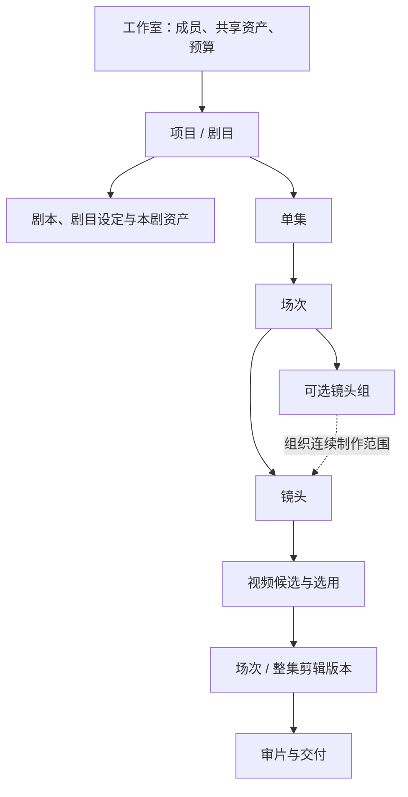

# AI 视频制作平台：完整产品方案 v1.0（短剧优先，最新整合稿）

日期：2026-09-07。状态：当前完整产品设计主入口。整合长期短剧与广告方向、当前短剧 MVP、制作与返工、资产、组织、权限、技术边界和最新画布讨论。已完成文档设计，尚无已运行产品、已验证样片或目标用户试用结果，未冻结研发排期。本稿中的产品方案版本 v1.0 不等于路线图中的产品迭代 V1。

已确认方向与建议采用的规则分别标明。具体规则未因写入本稿而被视为用户全部批准；尚待决定的事项集中在第 12 节。本文没有新增模型排名、价格或可用性结论，模型证据沿用已有研究，接入时核验指定版本、服务与账号。

阅读约定：用户明确提出的范围列为“已确认方向”；功能、规则、页面和架构采用“当前默认设计”，用于继续细化而不代表已获完整批准；效果、账号、首发样本和画布选择列为“待验证”。竞品研究提供候选依据，不自动扩大 MVP。历史推论见 [完整方案 review](ai-video-platform-review-2026-09-07.md) 与 [画布市场复核](research/2026-09-07-canvas-market-review-v2.md)。

下一阶段研发交接请进入 [实施设计文档包 v0.1](implementation/README.md)：已补齐详细 PRD、页面行为、领域数据、状态与费用、部署运维、机器可读 API、模型 Adapter、验收用例与工作包。本文负责产品总览，该包负责实施细节；样片、账号能力、用户试点与画布结论仍按待验证状态处理。

## 1. 产品定位与范围

**面向中小工作室内部团队、优先服务 AI 写实短剧的制作工作台，让团队围绕同一部剧管理故事设定、资产、分镜、视听生成、审片和交付。**

### 已确认的方向

| 事项 | 当前约束 |
|---|---|
| 客户 | 中小工作室团队，不设 10 人上限，支持内部多项目协作 |
| 首发内容形态 | 偏 AI 写实，关注接近真人影视的角色外观、空间、动作、对白及表演 |
| 模型取向 | 优先 Seedance 等第一梯队模型，Seedance 系列为首要评估与接入候选 |
| 协作范围 | 初版仅内部协作，外包参与长期按需增加 |
| 管理复杂度 | 初版权限保持简单，架构支持后续升级与扩展 |
| 交付策略 | 划分 MVP 和后续重要迭代，当前进行产品及架构设计讨论 |
| 长期范围与当下优先级 | 整体长期支持短剧与广告，当前优先短剧设计，尽可能复用底层核心制作能力 |

AI 写实是表现形态，具体剧情题材、画幅、语言、单集时长和发行渠道仍需选定首发样本。当前 MVP 主线是短剧；广告是已明确的长期支持方向，不并入短剧首版验收。动漫等其他表现形态继续按后续需求评估。

广告后续预期面向商家／教育机构营销人员，内容工厂制作团队为候选。短剧与营销视频各自维护业务流程和验收，公共制作模块负责媒体、生成、版本、剪辑与费用等能力。广告任务用于检查当前设计的可扩展性，完整广告原型、开发与试点不作为短剧 MVP 的前置条件。目标用户与业务差异见 [产品方向建议](ai-video-product-lines-v0.2.md)。

整体执行与复用设计入口：[整体产品与短剧优先 MVP 方案 v0.2](ai-video-platform-mvp-plan-v0.2.md)。本稿继续承载当前短剧业务细节和已有验收建议。

### 长期产品结构与广告扩展

采用两个业务工作台、共用制作核心的默认设计。短剧工作台组织故事、角色和连续叙事；广告工作台组织推广事实、创意与变体。可以先由同一品牌、账号体系、研发团队和部署承载，是否独立品牌或组织尚未决定。

| 层次 | 短剧：当前建设 | 广告：后续扩展 |
|---|---|---|
| 主要用户 | 工作室主创与 AI 制作人员，配合负责人和剪辑 | 商家／教育机构营销人员；内容工厂制作团队为候选 |
| 核心内容 | 剧本、剧目设定、单集、场次、镜头、连续性 | 商品／课程和品牌资料、营销需求、创意、变体、交付规格 |
| 业务流程 | 规划 → 制作 → 选择 → 组接 → 审片 → 交付与返工 | 资料与目标 → 确认事实／卖点 → 创意与脚本 → 制作修改 → 核对与交付 |
| 主要判断 | 故事、表演、人物与场景连续性、音画与节奏 | 事实与品牌表达准确、信息清楚、规格达标；投放效果需要独立数据验证 |
| 共用能力 | 项目、权限、媒体、资产引用、生成、候选、采用、声音与剪辑、审阅、费用和导出 | 按广告业务需要调用并扩展同一套公共能力，不强制创建剧目／单集／场次 |

广告后续先选一个真实且重复发生的电商或教育任务，以营销人员独立完成为设计目标，再按实际需求增加批量变体和方法复用。内容工厂是一种生产组织方式，不单独建立第三套产品或租户模型。教学课程视频不因目标组织是教育机构而自动纳入广告范围。

当前只用一条纸面广告任务检查公共模块是否被短剧层级限制，不开发完整广告入口、推广资料库、批量广告或投放集成。广告扩展是后续独立里程碑，不固定要求等待所有短剧高级能力完成。

### 产品价值与判断标准

价值重点是：团队能反复做出达到约定质量的成片，并且可以控制修改范围、制作费用和交付时间。版本、用量、制作记录尽量随创作自动形成，不要求成员为了管理额外重复录入。

以相同任务和约定质量为前提，分别记录总人工时间、日历交付周期、实际支出与返工／交接可靠性；每分钟合格成片成本作为同类样本的辅助归一指标，不用于直接比较不同难度作品。费用包含失败尝试和未采用候选，人工包含整理、学习、沟通与外部精剪，避免重复计数。未采用结果也可能具有探索价值；未知费用标为未知，不填 0。模型生成成功不等于有效成片产出。

初始使用职责假设：主创／AI 制作人员是日常主操作用户，项目负责人负责内容取舍与交付，经营者关注成本与持续使用价值；同一人可以兼任。这些职责不新增权限角色。试点分别验证制作人员是否愿意持续使用、负责人是否能接手返工、付款决策者是否愿意承担实际费用。

比较同一份剧本、参考和成片标准下的现有工具组合与本产品，保留人工帮助、外部精剪和失败尝试成本。不同难度作品不只按成片分钟直接比较。对画布、版本、共享等功能的价值判断以减少找素材、重复操作、错误采用和交接返工为依据，不将功能存在当作已验证差异化。

## 2. 工作室、项目与内容结构

建议当前一个工作室对应一个租户，承载独立的成员、数据、共享资产和制作费用；长期广告团队可采用同一组织模型及适合的界面名称。一个账号可以加入多个工作室，权限和费用不跨工作室继承。

一个短剧项目承载一部剧目：项目负责成员、预算、进度和交付，剧目负责故事与制作内容。前台只创建一次、展示一张卡片，当前导航使用「剧目」，无需用户重复建立两个对象。

场次是在特定时间、地点展开的一段连续戏剧行动。例如「第 1 集，夜晚，客厅，两人围绕一封信争执」是一个场次，可包含放信特写、女主质问、男主反应等镜头。客厅的视觉设定属于可复用场景资产，具体这场戏属于场次。

镜头是叙事与画面规划单位；镜头组是为一段连续行动选定的制作范围。镜头组不是每个场次必须填写的组织层。一次模型调用可以制作一个镜头，也可以产出供多个镜头采用的连续片段。

## 3. 端到端制作流程

建议以剧本或已有分镜为主要起点，保留图片、视频、音频导入。主流程允许反复修改，不要求所有内容逐级审批后才能试作。

首次使用默认从「新建剧目 → 粘贴剧本／录入已有分镜 → 选择第一场戏」开始。最小内容可逐步建立，角色、场景和声音参考在当前制作区补充；不要求先填完全部设定页、资产分类和人工任务。已有成员进入有权访问的项目继续制作，管理者按既定角色创建项目。正式生成前仍须检查所选模式的必要输入、模型连接及费用范围。

| 环节 | 团队要完成的事 | 主要产物 |
|---|---|---|
| 建立剧目 | 确定参与者、制作目标、交付规格和预算 | 项目及剧目记录 |
| 剧本与设定 | 导入或编辑剧本，确认 AI 拆解及角色、空间、视觉和声音方向 | 剧本、场次、剧目设定、初始资产 |
| 分镜规划 | 确定拍法、表演、对白、镜头顺序和参考，按需预演 | 镜头规格、可选故事板及动态预览 |
| 视听生成 | 按镜头或镜头组生成，比较候选、编辑、续写或补镜头 | 素材、候选、实际输入与费用记录 |
| 剪辑与声音 | 选片、排列、裁切，组织对白、声音和字幕 | 场次或整集剪辑版本 |
| 审片与交付 | 检查叙事、表演及连续性，确认版本并导出 | 审片决定、MP4、素材包与版本清单 |

### 剧本与剧目设定

剧本描述发生什么、谁做什么、说什么。「剧目设定」作为页面名称，替代较抽象的「创作基准」，集中表达故事背景、人物关系、视觉风格、角色造型、场景、声音和交付方向。设定页引用资产条目，不复制一套图片或角色数据。

AI 可以提出场次划分、角色提取、设定补充和分镜草稿；用户查看差异后采纳。重拆、重排和重命名都保留稳定身份与历史产物，不能清空已完成的制作。

首版先支持文本输入和明确格式的分镜录入，AI 按选定范围提出拆解或修改建议。新增、修改和不能可靠匹配的条目分别展示；无法确定对应关系时保留待确认的新草稿，不覆盖已有镜头及产物。不将任意文档格式导入、全剧自动合并冲突和完整 AI 编剧同时列为首版要求。

角色固定身份与当前剧情状态分开。例如同一角色的脸和声线可复用，晚宴服、手部伤痕、持信状态和此刻情绪在场次或镜头中表达。首版记录这些信息及采用关系，自动推理全剧连续性后续增加。

### 分镜工作台

建议模块名称为「分镜工作台」，导航简写「分镜」；故事板是其中按顺序展示分镜画面和说明的视图。镜头卡逐步承载文字规格、参考、分镜图、视频候选和选用结果。

主要操作：增加/拆分/重排镜头，编辑景别、构图、机位与运动、动作、表演、对白、声音意图和时长；为镜头或镜头组选参考；生成、比较和采用候选。提示词可由结构化信息构造，也允许查看与编辑。

这些项目是可用的控制项，不是逐镜必填表。默认只展开本段动作／表达意图、参与角色与实际参考、对白（如有）及模式所需时长等信息；风格和设定从上级默认项继承并可覆盖，景别与运镜等精细选项按需展开。收费提交前显示最终采用的输入。

当前低保真稿暂用左侧单集／场次导航、中间镜头卡、选中对象后就地展开参考与候选的方式检查流程。卡片、表格或画布均引用同一内容对象；不要求首版同时实现全部视图，也未由此确定最终主界面。生成进度保留在当前制作上下文中，画布决策状态见第 5 节。

故事板帮助检查构图和镜头衔接；动态预览将已有画面、计划时长和临时声音组合起来检查节奏。两者按需使用，不强制每镜先生成静帧，也不将分镜图自动当作视频生成首帧。

### 视听生成与模型策略

Seedance 优先体现为首先验证并接通一条适用的正式 API 制作路径。文字处理、设定图、视频和必要的声音工具按任务选择，不要求同一个模型包办全部环节。

工作台保留统一的制作对象，并按实际接入能力展开以下操作。首版先打通一条经过样片验收的主生成路径及重做替换路径，其他操作按必要性和可用性增加：

| 操作 | 适用情况 | 使用规则 |
|---|---|---|
| 按镜头生成 | 明确构图、反复挑选表演、需要单独替换 | 可用文字、参考或首帧等兼容输入 |
| 按镜头组生成 | 连续行动、对白与反应，希望联合规划音画 | 保留镜头计划，也记录输出的实际切点和采用区间 |
| 从候选继续制作 | 修改、续写、补镜头 | 原片保留，修改结果形成新候选；入口由实际已接入能力决定 |

输入准备区展示参考的用途，例如人物身份、造型、空间、动作、声音与起止画面。模型切换时说明不兼容项，不能静默丢弃角色绑定、声音参考或首尾帧。提交前列出实际输入、范围及预计费用。

生成与返工不被固定在单个品牌流程中。具体模式按「服务入口、模型版本、账号能力、输入组合」核验；原生声音输出、音频参考输入、声线绑定、独立音轨是不同能力。

首版必须通过样片验证一条可用的对白与口型路径。优先评估原生音画联合；若不满足目标，评估独立声音、补拍或其他同级模型的必要补充。局部编辑等能力可以按接口提供，但基础返工必须能通过重做目标范围和替换候选完成。

表演驱动、自动模型选择和大量供应商接入不作为首版前提。模型优先级和宣传能力不能替代实际生成质量、账号可用性及总成本验收。

在冻结接入范围前，形成一张实际接入记录：地区、正式服务、账号可用版本、写实角色参考通路、允许的媒体组合、音画方式、输出规格、费用依据和失败恢复方式。将「文档列明」「账号已开通」「样片已通过」分别记录。主路径可以优先使用领先模型的多参考或连续片段能力，不把所有模式齐备作为首版条件。

### 声音与粗剪

声音可能在生成前准备、生成时产生，也可能在剪辑时替换或补充。角色声音身份与具体台词表演分开保存。原生混合音轨按实际状态标识，不能假设可无损分离人声、音乐和音效。

建议 MVP 网页内提供轻量时间线：片段排列、入出点裁切、基础声音放置与音量、字幕及整集预览。让团队能检查故事与节奏，并输出审片版或符合既定要求的简单成片。

精细调色、复杂合成、专业混音等沿用工作室现有软件。首版导出媒体、镜头/采用版本清单和 SRT，允许外部精剪后回传成片。具体软件工程格式互通在选定目标软件并验证后安排，不提前承诺全面兼容。

平台粗剪保存编排、素材版本和区间，可以再次导出；外部回传成片保存文件及来源，不能仅凭 MP4 重建外部剪辑工程。修改台词长度或替换画面时提示重新检查口型、时序和衔接。

建议首发交付默认采用「平台形成可审片版和精剪素材包 → 按需要在现有软件精剪 → 回传最终成片 → 内部确认具体成片文件」的完整路径。满足样本标准的简单成片也可直接在平台导出。样板任务需事先明确采用哪条路径；涉及外部精剪的人工与时间进入交付成本。

外部回传登记为独立成片版本，关联本次交接清单，评论使用该成片自身的时间码。平台只保证已登记的来源与文件可追溯；未取得外部工程时，不声称知道其每个镜头的最终剪辑区间或能重新渲染该外部工程。交付包可以由平台剪辑渲染，也可以采用经确认的外部成片。

### 审片对象与粒度

| 对象 | 主要审什么 | 首版触发方式 |
|---|---|---|
| 镜头候选 | 人物身份、构图、动作、表演、对白、口型和局部瑕疵 | 关键镜头或有争议时送审 |
| 场次片段 | 正反打、视线、人物位置、道具状态、声音和情绪衔接 | 连续性需要确认时送审 |
| 整集剪辑版本 | 叙事是否清楚、整体节奏、声音字幕、规格和可交付性 | 最终交付前确认 |

角色参考和故事板进行设定/分镜确认，与视频审片区分。镜头都通过不会自动使整集通过。协作者可以选片、评论和提出修改意见；项目负责人及 Owner/Admin 作出正式审片和最终交付确认。

审片意见绑定具体版本与时间点或范围。新候选不继承旧批准；改变设定会提示采用影响，保留旧版决定和交付历史，不自动触发付费重做。首版不要求每镜、每场、每集都走完整审批链。

### 当前状态与返工同步

生成进度、当前选用、剪辑使用和审片决定分别表达，不用一个「已完成」状态替代全部关系。默认行为建议如下：

| 操作或变化 | 当前工作内容怎样变化 | 历史与后续怎样处理 |
|---|---|---|
| 供应商返回生成成功 | 继续完成下载、校验及必要预览处理，成功入库后可选用 | 入库失败可恢复，供应商成功不自动等于平台素材可用 |
| 出现新候选 | 在当前镜头／镜头组中供比较 | 不自动替换已选候选、剪辑片段或已审版本 |
| 更改当前选用 | 更新制作意图的选用记录，显示哪些剪辑草稿仍用旧候选 | 用户选择同步到哪些草稿；检查区间、时长及声音后形成新剪辑版本 |
| 修改已送审或已通过剪辑 | 从原版本派生可编辑草稿，保留旧版 | 新版重新确认；原批准仍只属于原版本 |
| 更换设定／台词或重拆镜头 | 显示直接受影响的内容，由用户选择更新范围 | 原产物和交付保留；间接全剧影响推理后续扩展 |
| 生成过程中修改了镜头 | 返回结果显示实际使用的旧输入，并提示与当前要求存在差异 | 结果仍可保留和选择，不自动采用，不自动追加付费重做 |

同一连续素材被多个镜头采用时，各自保存明确区间。重做一个镜头不自动改写其他镜头的区间；需要改动整段素材时先显示直接使用位置。草稿允许持续保存，提交审片及交付时固定所审版本与对应成片，避免播放文件和评论对象发生漂移。

### 一个场次完整制作与一次返工

当前详细设计围绕同一条样例流程推进：选定场次 → 准备实际参考与制作要求 → 提交一次生成 → 归档并比较候选 → 采用完整片段或区间 → 组接与声音 → 提交固定版本审片 → 根据意见产生新候选 → 选择更新范围并形成新稿 → 确认交付。

返工例子：负责人要求某句台词的表演更克制，制作人员从具体审片时间点找到来源，保留人物与对白要求，按实际模型能力重做目标范围；新候选比较后才采用。旧审片稿不变，需更新的剪辑形成新版本，接手者可以查看反馈、输入和当前选用。逐步输入、产物与例外定义见 [行为规格](ai-drama-workspace-decision-and-validation-v0.1.md#10-当前具体产物一个场次的制作与返工行为规格-v01)。

## 4. 资产库：两个范围、三个入口

| 入口 | 范围与用途 |
|---|---|
| 工作室「资产库」 | 已明确发布的共享资产，可跨剧目复用 |
| 剧目内「资产」 | 本剧角色、造型、场景、道具、声音、风格和制作素材，跨单集使用 |
| 分镜/剪辑中的资产选择侧栏 | 就地查找和引用本剧或有权访问的共享内容 |

区分「设定资产」与「实际媒体」。角色设定可以关联多个造型、图片和声音；模型生成或上传的图片、视频、音频是媒体。生成结果自动登记为本剧素材，但不会自动成为确认角色版本或发布到共享库。

采用固定版本引用：一个角色更新造型后，历史生成和交付仍使用原来的明确版本。跨项目复用通过发布和引入进行，共享更新不会同步改写所有项目。资产详情显示直接使用位置、来源、版本和采用范围；初版用关键词和标签检索。

共享库由 Owner/Admin 维护，内部成员读取与引入；项目负责人和协作者维护本项目资产。普通成员不能借共享引用查看未加入项目的剧本或其他候选。被采用、被引用的内容优先归档，清理前检查依赖。

## 5. 页面与日常协作

工作室导航：**首页 / 剧目 / 资产库 / 制作任务 / 用量与设置**。

剧目导航：**概览 / 剧本 / 剧目设定 / 资产 / 分镜 / 剪辑与声音 / 审片与交付**。

工作室首页呈现可访问项目、我的待办、待审内容和进行中的生成；项目概览集中成员、制作进度、预算和交付版本。制片可以用表格管理，创作者主要停留在分镜和剪辑上下文。

导航表示可访问的功能区域，日常主操作入口聚焦「继续制作当前场次」。剧本、设定、资产、参考、候选与生成进度尽量在当前场次就地查看或修改；整集编排时进入剪辑，确认时进入审片。无需在七个页面间重复录入同一内容。

### 画布的当前决策状态

画布交互的目标用户验证列为后续 **TODO UX-01**。主要创作画布、结构化卡片工作区、按需展开的局部关系视图均保留为候选；目前不确定默认入口、画布粒度或进入哪个版本。竞品存在某项能力不能直接决定本产品的范围。

| 当前推进 | 后续验证 | 当前不预建 |
|---|---|---|
| 参考复用、候选比较、选定范围返工、采用和交接的行为规格；用简单低保真稿检查流程 | 哪些真实任务因空间与关系操作受益，适用职责及范围，净收益能否覆盖学习和整理成本 | 任意节点编排、复杂控制流、多个完整主界面、大规模自由布局与实时共编系统 |

业务对象、素材版本、输入依赖、采用和剪辑关系独立于界面位置。空间排布不隐式改变镜头顺序、权限、采用或审片状态；局部图像编辑的选区／图层操作按具体制作能力另行评估。公共能力可服务不同呈现方式，但未来复杂画布仍需额外研发。

UX-01 在流程稿可走通且具备用户条件时开展，并在对复杂画布或流程编排投入较大研发前复核；不阻塞现阶段详细产品设计和模型技术验证准备。详见 [决策与验证框架](ai-drama-workspace-decision-and-validation-v0.1.md)。

### 内部协作与 AI 辅助

制作任务只记录对象、工序、负责人、状态和截止时间，允许多人兼任与交接；首版不建设复杂组织树、工序模板引擎或任意审批链。任务指派不改变访问权限。

首版按对象显示负责人、当前采用版本和待处理原因；生成状态、待选择、待确认和已知返工提示由现有记录形成，人工任务按交接需要添加。交接者能直接打开相同参考、实际输入、候选与审片意见；不要求每个镜头同时维护一张独立的任务表。

AI 助手围绕当前剧本、资产和镜头提供拆解、设定提取、分镜建议、输入构造和选定范围生成。修改及收费计划可查看，执行使用同一权限、预算和版本规则；不自动批准创作结果或无上限扩展生成范围。

## 6. 初版权限与预算

具体角色规则沿用最近一次简化建议，作为本稿默认方案。

| 层级 | 角色 | 权限范围 |
|---|---|---|
| 工作室 | Owner | 具有管理员能力；另负责所有权交接、管理员任免、解散及结算资料管理 |
| 工作室 | Admin | 管理内部成员、全部项目、共享库、连接与预算；不能任免管理员或升级自己 |
| 工作室 | Member | 使用共享资产，参与被加入的项目 |
| 项目 | 负责人 | 管理协作者、分工、制作、审片确认、交付与归档；不能提高预算 |
| 项目 | 协作者 | 编辑、在预算内生成、下载、评论和提交审阅 |

Owner/Admin 具有全部项目的负责人能力，无需逐项目加入；普通成员按项目参与。Owner/Admin 创建项目并任免负责人，负责人从已有内部成员中添加协作者。审看人员属于分工，初版不单设审阅权限角色。

生成和下载按角色开放，不提供逐人开关、个人额度或镜头级授权。生成受工作室总预算、项目预算和单批次上限约束；共享资产制作由管理者在明确公共范围发起并记账。

费用呈现预计、在途预占、已确认和待核对。一次消费受多个额度约束但只入账一次。部分失败显示各项进度，结果未知时先查询核对，不能直接重复购买。生成成功而素材入库失败可单独恢复下载。

退出成员失去后续访问，作品和费用历史保留。尚未提交供应商的作业执行前重查权限；已提交作业按实际可取消性处理，继续归档及核对原工作室费用。项目归档不丢弃在途结果。

长期通过新增角色、工作组授权和外部成员类型扩展；统一检查成员、范围和动作，固定规则先实现，不提前建设通用权限引擎。外部身份新增时默认无权限，不继承内部共享库权限。

## 7. MVP 交付边界

MVP 的目标是让内部团队完成约定样本范围的 AI 写实短剧制作、修改、内部确认与交付。建议用连续两集验证资产复用和返工；这是试点验收样本，不是每个项目必须创建两集的产品限制。具体集长、复杂度、平台与外部精剪分工及质量标准由首发样本确定。

| 能力包 | 首版必须具备 | 完成依据 |
|---|---|---|
| 工作室与项目 | 内部成员、固定角色、项目预算和基础任务 | 工作室隔离、普通成员按项目访问、管理者全项目能力和撤权均正确 |
| 剧本与设定 | 文本／约定格式输入、编辑、选定范围 AI 拆解与建议采纳、设定与场次状态 | 无法匹配时保留待确认草稿，重拆不丢人工修改、素材和制作历史 |
| 资产 | 本剧资产、基础共享库、上传/生成登记、版本、检索和就地引用 | 同角色跨集复用，共享更新不改旧引用，来源可追溯 |
| 分镜 | 场次和镜头编辑、参考准备、候选比较与区间采用；分镜图按需制作 | 能进入已验证的主生成路径，连续素材可供多个镜头使用；不强制每镜先做静帧 |
| 视听生成 | 优先 Seedance 的正式通道、一条已验证音画主路径、选定范围执行、重做与替换 | 对白、人物和表演达到样片标准；输入固定、结果入库、失败可恢复；编辑与续写按实际能力纳入 |
| 剪辑与声音 | 轻量编排、裁切、声音与字幕、整集预览 | 可形成完整审片版；精剪素材导出和成片回传可用 |
| 审片与交付 | 镜头/场次按需审阅、整集确认、MP4/素材包/版本清单/SRT、外部成片回传确认 | 评论绑定实际观看版本，历史保留；外部工程未取得的采用细节明确未知 |
| 费用和可靠性 | 预估、预占、用量记录、未知结果处理、并发及版本冲突提示 | 不因内部重复执行额外购买，成功结果可恢复，历史交付不漂移 |

局部编辑、续写的具体模式按已核验 API 纳入；自动质量检测、高级表演控制不必完整建设，但写实对白、表演和口型达到样片要求是首版验收项。

当前不进入 MVP：外包/Guest/客户链接、复杂权限与审批、完整专业剪辑器、多软件工程往返、通用无限节点编辑器、任意自主 Agent、开放模型市场、模型训练、自动发行投流、多语言批量本地化。基础资产版本、内部审片和预算仍在首版。

内部低保真稿先以镜头卡、就地参考和候选对比检查当前场次流程；这不是最终主界面的范围承诺。独立动态分镜编辑、复杂资产变体编辑器、全剧自动影响分析和完整自然语言制作代理后置；出现实际样片必需项时再针对性前移。素材分类、角色造型记录和简单整集预览继续保留。

## 8. 版本、执行和技术架构

建议采用模块化单体业务应用、独立生成/媒体后台进程、PostgreSQL 与私有对象存储。先按模块划清接口和数据归属，部署按实际吞吐演进；不因团队人数扩大就预设微服务或每租户独享数据库。

长期复用约束：剧本、角色状态、单集、场次和分镜属于短剧业务模块；公共项目、素材、生成作业、剪辑与交付不要求绑定剧集或场次才能存在。短剧模块整理制作输入并采用结果，公共模块负责执行、版本、权限与费用。未来广告通过自己的推广资料与创意流程调用同一套公共模块，当前不提前实现广告业务或通用流程引擎。

| 模块 | 主要边界 |
|---|---|
| 工作室与项目 | 身份、成员、项目、统一权限检查 |
| 短剧内容规划 | 剧本、设定、场次、镜头及差异采纳；不进入公共执行模块 |
| 资产与媒体 | 版本、引用、文件、预览和生成参考准备 |
| 制作协作 | 对象负责人、交接、待办及基础人工任务；不复制生成和审片状态 |
| 生成执行 | 已解析制作输入、快照、调度、供应商适配、结果入库与恢复 |
| 剪辑与审片 | 音轨、剪辑版本、特定版本的审阅、渲染与交付；台词归属与短剧验收标准由短剧模块维护 |
| 预算与用量 | 估算、预占、真实消费及费用归因 |

必须分开保存：镜头规格、制作任务、生成作业、媒体、候选、选用决定、审片决定和剪辑版本。一项人工任务可能对应多次生成；一次生成结果可以跨多个镜头使用。采用的区间和版本固定，费用不随引用次数重复累计。

公共资产与媒体模块维护文件、通用版本、用途引用、供应商参考准备及范围检查；角色身份、造型含义、场次状态和匹配规则由短剧模块维护，未来商品事实由广告模块维护。业务关联保持明确且可校验，不用任意类型与无约束字段取代领域关系。

租户归属覆盖数据库、媒体读取、导出、缓存和后台任务，项目对象还需检查项目范围。采用应用权限、数据库约束及 RLS 等防护时，应以实际运行角色验证，详见租户设计；本稿没有声明已实现隔离保证。

作业提交与预算预占一致记录；供应商提交结果不明时进入待核对，不能把普通重试等同安全重买。已提交输入不可变，作业归属不随用户切换工作室改变。模型参数和能力差异由适配模块处理。

多人修改先用对象版本检查和冲突提示；备份覆盖元数据及媒体，恢复不重放付费请求。技术栈版本、容量参数、部署地域与恢复指标在实施设计中确定。

试点需落实基本素材容量、结果归档时限、保留与恢复范围，以及生成外的转码、渲染、存储和下载成本。高级生命周期自动化可后置，但要监测结果入库失败和容量不足，避免过期后只剩供应商链接。预算预估与最终账单分别呈现；估算差异须核对并影响后续可提交额度，不将预估数额宣传成供应商费用的绝对保证。

## 9. 重要迭代计划

| 阶段 | 要解决的问题 | 重点能力 | 进入条件或验证依据 |
|---|---|---|---|
| MVP：完成作品 | 核心视听制作能否在团队内跑通 | 剧本、资产、分镜、生成、声音、轻量剪辑、内部审片、交付与简单管理 | 连续两集和一次局部返工完成，质量达标，费用与版本可追溯 |
| V1：稳定连续生产 | 多集、多项目交接与返工是否可控 | 连续性辅助检查、变更影响、精细局部修改、排期与批量操作；按需内部审阅/只读角色、工作组、资产维护分工及一个剪辑软件工程导出 | 真实生产中找到反复发生的损耗，新增能力降低返工与人工时间 |
| V2：复用制作方法 | 熟练主创的方法能否在团队中复用 | 版本化制作模板、选择性批量重做、供应商质量/成本对照、优先级与吞吐管理；专业流程编辑按重复工艺需求评估 | 同一方法可被另一成员及另一项目复用，产能和成本改善可解释 |
| 广告首版：后续独立里程碑 | 营销人员能否完成一个真实推广任务 | 一个优先行业任务的资料、事实确认、创意、制作修改、核对与交付；复用公共能力 | 有明确首批用户与重复任务，独立验收；不与当前短剧 MVP 同步承诺，也不强制等到短剧 V2 后 |
| 长期：扩大协作与商业范围 | 外部参与和企业治理需求出现 | 外包/Guest、受限客户审片、多语言交付、统一结算、开放接口；按需企业身份管理和独享部署 | 有持续业务需求，不作为内部制作 MVP 的前置能力 |

更细的声音或视频修改能力可因首发质量需要前移；满足主要制作路径所必需的第二模型也可前移。扩展不按固定人数触发，外包能力没有强制上线版本。

画布采用何种形态及进入阶段由 UX-01 单独判断，不因表中“专业流程编辑”而把所有画布一律安排在 V2，也不因竞品主界面使用画布就提前全部纳入 MVP。

## 10. 验收与验证顺序

建议先验证一段双人对白场景，再完成连续两集，再邀请少量真实工作室验证日常协作。现代场景、少量角色是降低首轮验证变量的建议，尚未确定为业务题材。

质量验收覆盖人物跨镜头外观与声音、正确对白与说话人、口型、视线与反应、简单道具交互、场次连续性和整集节奏。使用团队认可的参考样片校准，不虚构自动分数或首轮通过率目标。

产品验收还需覆盖：重拆不丢制作成果；一段素材对应多个镜头；共享版本更新；单句对白返工；并发生成与预算不足；提交超时结果待核对；媒体下载失败；成员撤权；历史交付及恢复。具体检查在实施后执行，目前没有代码或测试结果。

新增操作验收：新候选出现不改当前剪辑；更改选用后能确认同步范围；已审版修改产生新待确认版本；过时输入的生成结果可辨识；外部精剪回传后评论使用新文件时间码；接手者无需原操作者口头补充即可找到当前参考、采用和返工意见。

建议试点 2–3 个工作室，包含超过 10 人的团队，以验证人数不构成设计硬限制。对比同样剧本、参考和验收标准下的现有工具组合，记录达到交付所需的实际费用、等待、人工和返工。

当前设计顺序：单场次制作与返工行为规格 → MVP 深度与关键状态 → 对象和核心操作 → 内部低保真走查 → 可验收研发任务。实际模型通道核查与样片准备配合推进；可先完成示例设计，不要求用户研究或所有模型问题先关闭。

实施验证顺序建议：样片与正式通道验证 → 一个场次的完整制作与返工 → 连续两集及资产复用 → 多团队试用与可靠性验收。内部实现切片不等于对外可交付的 MVP。画布用户研究后置不表示对白、角色和声音的真实技术可行性可以跳过。

## 11. 已收敛的设计建议

以下可作为原型与详细 PRD 的默认基线，无需为命名或抽象层次继续阻塞设计：

- 分镜工作台覆盖规划、生成和候选；故事板作为视图。
- 剧目设定表达共同方向；资产库管理实际设定、参考与素材版本。
- 场次承载戏剧上下文；镜头与镜头组支持不同生成粒度。
- 声音贯穿生成前、中、后；轻量剪辑承接整体编排与审片。
- 工作室即当前租户，一个项目承载一部剧目，前台一次创建。
- 初版内部固定角色；Owner/Admin 全项目管理，普通成员按项目参与。
- AI 提出和执行有明确范围的计划，人的选用及正式审片决定独立保存。

## 12. 仍需讨论与验证的关键决策

### 优先讨论的三个产品决策

| 决策 | 需要具体化什么 | 当前建议 | 为什么影响 MVP |
|---|---|---|---|
| 首发成片标准 | 一个优先题材与参考样片，横/竖屏、单集时长、语言和目标质量 | 从少量角色、对白驱动的样片验证，再覆盖同类连续两集；不先限定业务为都市 | 决定角色/动作/声音要求、剪辑工作量和可接受生成成本 |
| 制作起点与交付边界 | 团队从已有剧本、故事梗概还是分镜进入；目前使用什么生成与精剪工具；网页内做到哪一步 | 默认已有剧本/分镜可导入、AI 辅助改写；网页轻量粗剪，现有软件完成精剪 | 决定是否需要大规模故事创作能力、复杂时间线或工程格式互通 |
| 首发市场与模型采购 | 首批客户使用地域，正式模型账号由平台还是工作室提供，费用由谁承担 | 首版仅跑通一种符合首发市场的正式接入及结算方式；供应商连接与数据归属分离 | 决定 API 可用性、采购、费用呈现与上线方式 |

前两项用于冻结产品范围，第三项与样片验证并行推进。无需用户先回答全部问题才能开展原型；没有明确答案时使用上述建议制作评审方案，但不将其当作已确认需求。

完整 review 后的判断：方向与模块结构可用于推进详细设计；首发样本及交付标准、实际模型通路和生产总成本仍待验证，尚不足以冻结研发日程或对外承诺稳定量产效果。

### 编制实施计划时再补充

需要研发团队人数与技术经验、可投入预算、首发时间约束，以及试点团队的并行项目、活跃成员、素材规模和生成频率。这些用于排期与容量规划，不重新引入固定团队人数上限。

正式 API 的账号资格、输入组合、可用版本、错误与计费语义，以及达到样片标准所需的费用和返工次数，需要技术核验和实际试作，不能仅由产品讨论拍板。任何收费试作另行确定执行范围与预算。

精确套餐价格、外包授权粒度、复杂组织体系和专属部署可后续讨论，不阻塞当前产品结构。

### 后续验证与关闭条件

| 验证项 | 当前状态 | 形成什么证据后可以作决定 |
|---|---|---|
| UX-01：工作区与画布 | 已列后续 TODO，尚未开展 | 回看真实任务，再做有区分力的交互对照；明确适用职责、范围及采用方式 |
| 模型和样片 | 尚未实际接入或付费试作 | 指定地区／服务／账号的主生成及返工路径实际可用，写实音画达到约定标准 |
| 首发任务与交付要求 | 使用已有剧本／分镜、平台轻剪加可选外部精剪的默认设计 | 确定参考样片、语言、画幅、时长和分工，能判断成片是否达标 |
| 试点价值与运营成本 | 尚未开展真实生产试点 | 相同任务下记录完整费用、人工、等待、质量和交接，了解持续使用与付款决策 |
| 采购、资源与排期 | 尚未确定 | 明确一种首发结算方式、账号可用性、研发资源和约束，再形成可执行排期 |

无需一次性回答全部事项才能继续设计；示例、工作假设与待验证状态应在产物中保留，不能将内部走查写成真实用户验证。

## 13. 配套资料

- [领域术语](../CONTEXT.md)
- [资产库设计](ai-drama-workbench-assets-v0.1.md)
- [租户、工作室与项目设计](ai-drama-workbench-tenancy-v0.1.md)
- [此前核心设计 v0.2 与修订依据](ai-drama-workbench-core-design-v0.2.md)
- [市场复核](research/2026-09-07-workbench-market-review.md)
- [Seedance 接入研究](research/2026-09-07-seedance-priority.md)
- [模型制作流程比较](research/2026-09-07-model-production-workflows.md)
- [画布核心场景与价值评估](research/2026-09-07-canvas-value-review.md)
- [最新画布市场复核](research/2026-09-07-canvas-market-review-v2.md)
- [工作区决策、UX-01 与制作返工行为规格](ai-drama-workspace-decision-and-validation-v0.1.md)
- [长期广告方向与目标用户](ai-video-product-lines-v0.2.md)

以上研究记录支持设计背景，不代表本项目已经完成模型接入、质量验收或生产试用。涉及 MVP 范围和优先级时以本整合稿为主；资产与租户文档继续提供细节。
