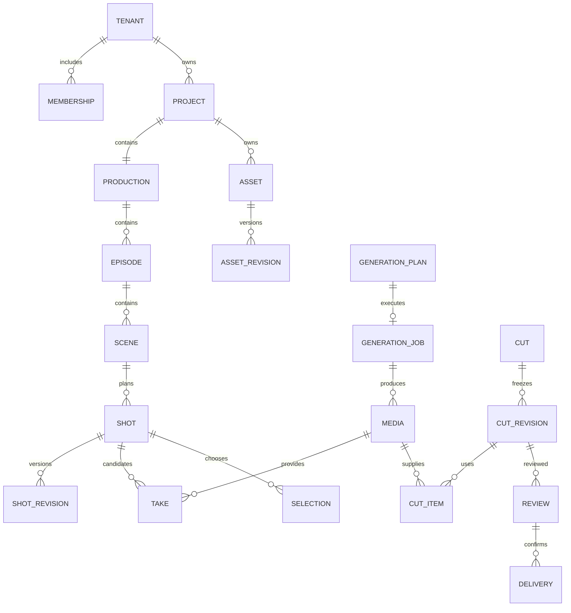

# 03 领域对象、数据关系与一致性

这是逻辑数据设计，实施阶段据此编写数据库迁移，不代表迁移已运行。术语见根目录 CONTEXT.md，公开字段契约见 openapi.json；数据库可用内部列支持检索，但不得改变下列关系和不变量。

## 1. 核心关系

图展示主关系；共享资产可无 project_id，但必须明确 scope=shared，且由管理者维护。镜头候选审阅使用 take 外键，外部成片属于独立 cut_revision。公共生成计划不依赖 production／scene／shot 才能存在。

## 2. 通用列、时间、金额与版本

- 稳定主键使用 UUID，API 字符串传递；租户资源具有 tenant_id。项目范围记录同时具有 project_id，父子关联包含租户和项目范围约束。
- 可变根对象使用 revision 整数，从 1 递增；写入使用 If-Match。各不可变修订引用父身份及版本号，生成、采用、审阅使用明确修订 ID。
- created_at／updated_at 使用带时区 UTC 时间；业务展示转换到用户时区。稳定记录另存 created_by，不能把创建人当成数据归属。
- 媒体时间以整数微秒记录，区间统一为 [inUs,outUs)，要求 0 <= inUs < outUs <= 已验收时长。API 的时间数值限制在 JavaScript 安全整数内。帧率保留分子／分母，不能仅存四舍五入小数。
- 金额存带 currency 的整数微货币单位（1 单位 = 10^-6 货币单位），API amountMicros 使用十进制字符串，避免浮点误差。一个工作室预算周期只用一种结算货币；不直接相加不同货币。实际跨币种采购必须另有汇率来源、时点与舍入记录。
- JSONB 只用于有版本的结构快照、时间线和供应商受控参数；结构由 JSON Schema 校验。授权、主要父子关联、媒体依赖和费用唯一性有显式列／关系，不能依赖任意 JSON 搜索实现。

## 3. 身份、组织与权限记录

| 表 | 必需业务列（另含适用通用列） | 约束与索引 |
|---|---|---|
| users | auth_subject、verified_email、display_name、status | auth_subject 唯一；邮箱不自动产生租户身份 |
| tenants | name、owner_user_id、status、currency | owner 必须是有效 owner 成员；所有权转移在单事务完成 |
| memberships | tenant_id、user_id、role、status | unique(tenant_id,user_id)；role=owner/admin/member；每租户仅一名 owner |
| invitations | tenant_id、email、role、token_hash、expires_at、accepted_by、status | 只存邀请令牌哈希；pending/accepted/revoked/expired；接受检查已验证邮箱 |
| projects | tenant_id、name、kind、status、lead_membership_id、spec | kind 首版仅 drama；status active/archived；规格为可校验 ProjectSpec；负责人来自同租户有效成员 |
| project_memberships | tenant_id、project_id、membership_id、role | unique(project_id,membership_id)；lead/collaborator；隐式 Admin 权限不复制为每项目成员行 |
| production_tasks | tenant_id、project_id、title、assignee_membership_id、stage、status、due_at、shot_id、note | shot_id 可空但非空须同项目；status open/in_progress/blocked/done；手工任务不承载作业状态 |
| provider_connections | tenant_id、name、provider、region、credential_secret_ref、status、currency、capability_revision | 密钥正文不在业务表或 API 返回；首版按工作室授权连接；status draft/enabled/disabled |

平台运营身份使用独立管理通道，不能伪装成普通工作室 Admin 跨租户访问。Owner／Admin 可读全部项目，Member 通过 project_memberships；共享读取不授予来源项目权限。

## 4. 剧本、结构与设定

| 表 | 必需业务列 | 约束与索引 |
|---|---|---|
| productions | tenant_id、project_id、title、brief、default_asset_revision_ids | unique(project_id)；默认引用另存关系用于授权及使用位置 |
| script_revisions | tenant_id、project_id、number、text、parent_revision_id、source_format | unique(project_id,number)；内容不可变；当前指针由 project 内容版本控制 |
| episodes | tenant_id、project_id、title、position、status | 项目内 position 排序；归档不删除剪辑及素材 |
| scenes | tenant_id、project_id、episode_id、title、position、time_label、location_label、summary、state | state 为人物造型／道具／情绪的有类型记录；场景资产通过 reference 关联 |
| shots | tenant_id、project_id、scene_id、label、position、current_revision_id、status | 镜头身份与编号分开，重排不改身份；status active/archived |
| shot_revisions | tenant_id、project_id、shot_id、number、spec、source_script_revision_id | spec 包含 intent/action/dialogue/duration/camera/referenceOverrides；不可变；unique(shot_id,number) |
| analysis_proposals | tenant_id、project_id、source_script_revision_id、base_content_revision、generation_job_id、status、operations | operation 有稳定 op_id 和 create/update/archive 类型；proposed/applied/rejected；保存 AI 原提案与人工选择 |
| project_content_versions | tenant_id、project_id、revision、current_script_revision_id | unique(project_id)；结构变更和提案采纳共用此 CAS 版本，防止重拆覆盖并发修改 |

首版提案只处理受支持的 episode／scene／shot 草案及资产建议，不接受 AI 输出 SQL、权限变更或任意对象删除。apply 只按服务端保存的操作 ID 选择；基线变化返回 409，重新生成或人工调整提案。归档镜头只隐藏在当前计划，历史修订、采用和剪辑引用保留。

## 5. 资产、媒体与引用

| 表 | 必需业务列 | 约束与索引 |
|---|---|---|
| assets | tenant_id、project_id、scope、kind、name、description、tags、status、current_revision_id | scope=project 时 project 必填，scope=shared 时为空；kind character/location/prop/voice/style；status active/archived |
| asset_revisions | tenant_id、asset_id、number、definition、status、parent_revision_id | definition 结构包含说明、造型和参考媒体用途；draft/confirmed；内容不可变，确认状态独立更新 |
| asset_revision_media | tenant_id、asset_revision_id、media_id、role、position | unique(revision,media,role)；角色身份／服装／空间／声音等用途；正式发布逐个检查媒体范围 |
| asset_revision_dependencies | tenant_id、asset_revision_id、referenced_asset_revision_id、purpose | 显式记录造型的声音等依赖；同范围或已授权共享；禁止循环依赖，发布时检查并复制／映射完整依赖闭包 |
| shared_imports | tenant_id、project_id、shared_asset_revision_id、imported_by | unique(project_id,shared_asset_revision_id)；固定版本，升级显式新增引入关系 |
| creative_references | tenant_id、project_id、production_id、scene_id、shot_revision_id、asset_revision_id、media_id、purpose | 三种使用者恰有一个非空；asset_revision_id/media_id 至少一个非空，两者同时存在须验证媒体属于该版本；用 CHECK＋复合 FK 避免任意 target_type/id；引用项目内版本或已引入共享版本 |
| upload_intents | tenant_id、project_id、scope、staging_key、expected_bytes、mime_hint、expires_at、status | pending/uploaded/verifying/accepted/rejected/expired；随机 staging key 仅供一次意图使用 |
| media | tenant_id、project_id、scope、kind、status、immutable_key、storage_version_id、sha256、bytes、mime、duration_us、width、height、fps_num、fps_den、audio_metadata、source_job_id、source_upload_id、source_render_task_id、source_shared_media_id | kind image/video/audio/document；status processing/ready/rejected/archived；源 upload/job/render/shared-copy 恰一个；共享来源内部可追溯但不得泄露私有项目字段；ready 必须指向不可变内容和校验值 |
| media_derivatives | tenant_id、media_id、kind、profile_revision、immutable_key、sha256、status | poster/proxy/waveform；unique(media_id,kind,profile_revision)；派生失败不等同原媒体丢失 |
| provider_media_refs | tenant_id、connection_id、media_id、purpose、provider_ref、expires_at、status | 按连接和用途缓存；不能把 provider_ref 当成本平台资产 ID |

共享发布创建一个共享资产与固定修订，引用经验证的共享媒体记录；若媒体原属私有项目，则复制或建立独立共享媒体记录指向可控不可变内容，授权通过共享记录计算，不能给外部引用原项目媒体 ID 来绕过权限。源项目和共享记录可做内部血缘，普通共享读者不获得源项目详情。

角色造型是并存的创作选项，版本是同一选项的修改历史。首版 character 资产的固定 definition 内嵌 looks：每个造型有稳定 UUID、label、revision 和明确参考。新增“晚礼服”不能覆盖“日常服”；改晚礼服颜色产生新的父资产修订，只递增被改造型的 revision，未改造型保持 ID 和 revision。场次同时记录 characterAssetId、lookId、lookAssetRevisionId；后两者成对出现，所选固定资产修订必须属于该角色并包含该 lookId。生成计划展平为确切媒体与用途，旧计划不读取最新造型。造型中媒体和声音版本同样进入显式依赖关系，不仅留在 JSON 中。

对项目素材的归档是停止新引用；已有剪辑、审阅和作业输入继续可读。物理清理检查所有范围的显式依赖，首版不开放任意强制删除。staging 到期清理、失败临时文件清理与被引用原素材保留分开。

## 6. 生成、执行与费用

| 表 | 必需业务列 | 约束与索引 |
|---|---|---|
| generation_plans | tenant_id、project_id、scope、purpose、connection_id、capability_revision、input_snapshot、input_hash、source_content_revision、estimate、expires_at、status | ready/blocked/consumed/expired；模型输入与估计同一快照；purpose video/image/audio/script_analysis |
| plan_shot_sources | tenant_id、project_id、plan_id、shot_id、shot_revision_id | unique(plan_id,shot_id)；视频计划可无镜头，但涉及短剧时全部来源明确 |
| plan_media_inputs | tenant_id、plan_id、media_id、asset_revision_id、purpose、position | 显式可查授权及来源；输入版本提交前重新检查 |
| generation_jobs | tenant_id、project_id、scope、plan_id、status、connection_id、provider_job_id、last_provider_state、cancel_requested_at、next_poll_at、deadline_at、error_code | unique(plan_id)；unique(connection_id,provider_job_id) 非空时；状态见 04，不把归档失败认定为无消费 |
| submission_attempts | tenant_id、job_id、number、request_hash、started_at、finished_at、outcome、correlation_id、lease_token、provider_receipt | 首版每 job 只允许一次自动提交尝试；outcome prepared/accepted/rejected/unknown；凭证与完整请求不写日志 |
| job_outputs | tenant_id、job_id、index、media_id、provider_locator_encrypted、expires_at、archive_status | unique(job_id,index)；归档恢复只更新输出，不创建新 provider task |
| budget_accounts | tenant_id、project_id、period_start、period_end、currency、limit_micros、reserved_micros、spent_micros | 工作室和项目各有明确账户；同一工作室／项目层级周期不可重叠，可用时间范围排他约束；一个作业锁定提交时预算周期，周期切换不移动旧消费 |
| reservations | tenant_id、job_id、workspace_budget_id、project_budget_id、amount_micros、currency、status | unique(job_id)；held/settled/released；项目和工作室计数受同一次预占约束 |
| cost_entries | tenant_id、job_id、connection_id、provider_charge_key、amount_micros、currency、kind、supersedes_entry_id、evidence_ref | append-only；unique(connection,provider_charge_key) 由实际可用账单标识形成；无标识时平台 reconciliation key 唯一；修正用调整行 |

文本分析使用同一执行与计费外壳，成功产物是服务端校验通过的 analysis_proposal，proposal.generation_job_id 唯一。只有媒体任务才创建 job_outputs。模型返回了文本但不能通过类型、父子映射或范围校验时作业 failed，保留脱敏错误与受限原响应以供排查，不能自动应用；已有供应商消费仍须记账。

预算账户的 spent 是账本投影，不是第二份独立消费。对工作室和项目汇总不得再相加当成总费用。预占和费用状态不依赖作业 UI 终态；取消、失败也可能有费用。

## 7. 候选、采用、剪辑与审阅

| 表 | 必需业务列 | 约束与索引 |
|---|---|---|
| takes | tenant_id、project_id、shot_id、shot_revision_id、media_id、in_us、out_us、source_take_id、note | unique(shot_revision_id,media_id,in_us,out_us)，避免重复归档生成重复候选；媒体区间合法且已 ready；shot revision 与 shot 相符；候选内容不可变，另建候选表达变动 |
| selections | tenant_id、project_id、shot_id、take_id、selected_by、reason、supersedes_selection_id | 追加历史；shot 当前采用指针事务更新并 CAS；一镜头当前最多一个，清除采用也记录事件 |
| cuts | tenant_id、project_id、episode_id、scene_id、name、draft_revision、draft_timeline、status | 场次／单集范围至多一个；公共 cut 可以无两者；active/archived；timeline 按 schema 校验 |
| cut_draft_media | tenant_id、cut_id、media_id | 根据草稿解析事务更新，用于依赖与清理；不是顺序的唯一来源 |
| cut_revisions | tenant_id、project_id、cut_id、number、origin、timeline_snapshot、render_profile、render_job_id、rendered_media_id、status、handoff_delivery_id | origin platform/external；platform 有时间线，external 有验收媒体和可空交接清单；frozen/rendering/ready/render_failed |
| cut_items | tenant_id、cut_revision_id、item_id、kind、media_id、take_id、selection_id、track_id、timeline_start_us、in_us、out_us、subtitle_text、duration_us、gain_db、fit、muted | 从冻结时间线事务生成；版本内 item_id 唯一；kind=subtitle 时 media_id 为空且 text/duration 必填，video/audio 时 media_id 和范围必填；媒体为同项目或已授权共享；不跟随当前 selection 指针 |
| reviews | tenant_id、project_id、take_id、cut_revision_id、number、status、opened_by、decision、decided_by、decided_at | take/cut 恰一个；每 subject 的 number 单调增加，最多一个 open；open/approved/changes_requested；正式决定仅负责人及管理者，关闭后不可改写 |
| review_comments | tenant_id、review_id、author_id、body、start_us、end_us、parent_comment_id、resolved_at、resolved_by | 时间基于被审文件／候选局部时间；合法范围；文本修改留审计，不能改目标版本 |
| deliveries | tenant_id、project_id、review_id、cut_revision_id、kind、status、manifest、package_key、created_by | kind working/final；final 必须匹配 approved 整集／外部 cut review；preparing/ready/failed；内容清单固定 |

剪辑采用完整 Timeline schema，支持一个主视频轨、若干音轨和字幕轨；首版播放速度为 1。原生视频音轨可以保留／静音，独立音频层显式放置，避免默认双重对白。删除草稿片段不会删除源媒体。外部成片没有已知时间线时 cut_items 为空，不捏造映射。

## 8. 可靠执行与审计支持表

| 表 | 主要列 | 规则 |
|---|---|---|
| idempotency_records | tenant_id、actor_id、operation、normalized_path、key、request_hash、response_status、response_body、resource_id、expires_at | unique(tenant,actor,operation,normalized_path,key)；同键不同请求 409；关键业务还靠 plan/job 等唯一约束，不能只靠缓存 |
| outbox | event_id、tenant_id、project_id、event_type、aggregate_id、aggregate_revision、payload、available_at、lease_until、lease_token、attempts、delivered_at | 与业务事务写入；重复投递可接受；payload 只含必要标识和状态 |
| worker_tasks | id、tenant_id、project_id、kind、dedupe_key、status、available_at、lease_until、lease_token、attempts、last_error | unique(kind,dedupe_key)；短事务领取并释放锁，网络不占数据库事务；租约仅保护内部提交 |
| project_events | tenant_id、project_id、stream_seq、outbox_event_id、type、resource_id、resource_revision、created_at | 每项目序列由投递器事务串行分配，unique(project,seq)；只做变更通知，客户端再取权威快照 |
| audit_events | tenant_id、project_id、actor_type、actor_id、action、object_type、object_id、before_revision、after_revision、request_id、reason | append-only；记录权限、版本、费用和确认动作，不记录密钥和完整私有内容 |
| render_tasks | tenant_id、project_id、cut_revision_id、profile_revision、state、lease_token、output_media_id、error_code | 相同 cut revision/profile 复用结果；retry 不创建视频生成任务 |

后台跨租户扫描任务 ID 使用受限调度入口；具体处理恢复可信 tenant/project 上下文再读取内容。不能把客户端或回调传入 tenant_id 当授权依据。

## 9. 不变量与事务单元

| 编号 | 不变量 | 实现事务 |
|---|---|---|
| INV-01 | 任何项目子对象与父对象属于同租户、同项目 | 复合唯一键／外键，加应用授权和 RLS |
| INV-02 | 当前版本改变不改变旧执行、审阅或交付内容 | 不可变 revision，当前指针 CAS |
| INV-03 | 一项计划最多产生一个作业和一份预占 | job(plan_id)、reservation(job_id) 唯一，与幂等记录、outbox 同事务 |
| INV-04 | 更新采用不自动修改剪辑 | selection 事务独立；更新剪辑是另一次明确 CAS 写入 |
| INV-05 | 固定审片版本对应固定媒体内容 | freeze 时间线和引用同事务；render 基于 snapshot；media immutable key |
| INV-06 | 一次供应商消费只记一次，修正有证据 | charge key 唯一、追加调整、锁定预算账户投影 |
| INV-07 | 上传确认的内容不会被旧上传 URL 替换 | 验收后复制到服务端独占 key 或固定 VersionId，再创建 ready 媒体 |

预算锁顺序固定为工作室账户、项目账户，再作业／预占；涉及多个对象按稳定 ID 排序。项目内容排序与提案应用锁 content version，结构改动和 outbox 同事务。数据库冲突可重试纯内部事务，不能把外部付费调用放进自动重试闭包。

索引至少覆盖：项目成员、active 集场镜排序、资产范围及类别、媒体 project/status/created_at、job status/next_poll_at、lease/available_at、评论 review/time、账本 job/created_at、直接媒体引用。首版中文名称／标签采用规范化包含查询或适当索引实测，不承诺未经验证的语义搜索。
