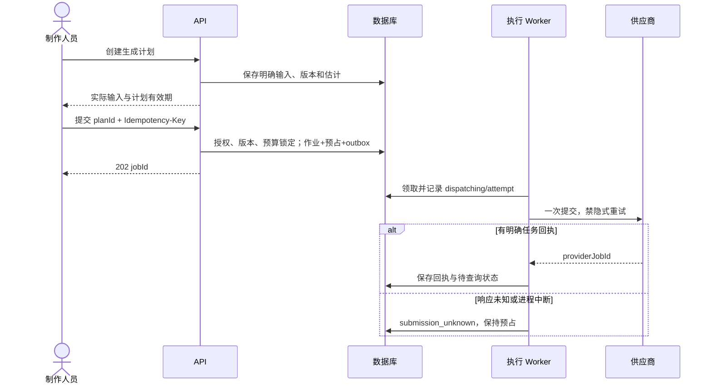

# 04 状态、异步执行、幂等与预算

## 1. 状态分开表达

| 记录 | 状态集合 | 说明 |
|---|---|---|
| 生成计划 | ready / blocked / consumed / expired | ready 仍须在提交时检查版本、权限、预算和能力 |
| 生成作业 | queued / dispatching / submission_unknown / provider_pending / provider_running / archiving / archive_failed / succeeded / failed / cancel_requested / cancelled / reconciliation_required | 媒体任务 succeeded 表示原媒体已验收归档，文本分析表示提案已校验保存；未知不是失败 |
| 媒体 | processing / ready / rejected / archived | ready 内容不可被旧上传凭证替换 |
| 费用预占 | held / settled / released | cancelled、failed 不直接推出 released |
| 剪辑版本 | frozen / rendering / ready / render_failed | 冻结内容不变，渲染可以恢复 |
| 审阅 | open / approved / changes_requested | 决定后关闭本轮；新一轮新记录 |
| 交付 | preparing / ready / failed | final 绑定已批准版本；工作包单独标记 |

UI 可把 provider_pending／running 简写排队／生成中，但不能将 submission_unknown 或 archive_failed 隐藏成普通“失败，重试”。

## 2. 从计划到一次付费请求

计划默认有效 10 分钟，是可配置产品默认值，不是供应商报价保证。计划固定 capability revision、connection、实际输入及费用估计；提交时输入源或能力变化返回冲突并要求重新计划，不静默取最新值。

API 成功事务同时写入幂等记录、job、reservation、预算投影和 outbox。响应丢失用同一键重试可返回原 job；超过幂等缓存期仍由 plan_id 唯一性阻止重复消费。新创作尝试必须创建新计划。

Worker 发请求前重查成员、项目是否 active、连接是否可用以及预占是否存在。因撤权而未提交的作业可以 cancelled 并释放预占。已提交或疑似提交的作业继续归档和核账，不依据操作者离职丢弃记录。

## 3. 提交结果未知的处理

| 已知证据 | 下一步 | 禁止动作 |
|---|---|---|
| 明确 providerJobId | 用原连接查状态；保存可核查回执 | 换连接查询后认为不存在，重新购买 |
| 服务正式支持幂等键和查询恢复，已在指定账号测试 | 按该 Adapter 的恢复契约执行 | 将其他服务的幂等能力套用到当前服务 |
| 仅有客户端关联 ID，无找回契约 | submission_unknown，运营核对供应商任务／用量 | 把关联 ID 当幂等键，或把 404 当必然未提交 |
| 明确请求未离开本机且 attempt 未进入 dispatch | 可恢复内部排队 | 根据普通网络错误臆测“没有收到” |
| 供应商明确拒绝并有不计费依据 | failed，按证据释放或核对预占 | 所有非 2xx 一律当无消费 |
| 任务过期不可查询或回执长期无法恢复 | reconciliation_required，记录证据与待核对金额 | 自动标记免费失败或静默丢弃 |

Crash window 无法彻底消除：供应商接受后进程可能在保存 ID 前崩溃。租约或 outbox 不提供跨供应商 exactly-once。创建端关闭 SDK、HTTP 客户端、网关和算子内部的隐式重试；仅显式验证可安全重试的读取／归档步骤使用退避。模型证据见 [专项](../research/2026-09-07-implementation-model-evidence.md)。

运营核对入口只允许指定管理身份记录供应商回执、费用依据和关联证据，不接收普通用户任意指定成功状态。无可靠对应关系时保留未决，不把同时间相似 prompt 当唯一身份依据。若用户另开尝试，原作业预占继续计入并明确提示。

## 4. 查询、回调、取消与恢复

- 查询使用原连接，配置退避、抖动、供应商限流及截止时间。已知 provider ID 的 GET 超时可重试；任务不存在与已过保存期分别处理。
- 回调先限流并按可核验方式鉴别来源。无法验证签名的回调只用来唤醒查询，不直接确认媒体、终态和费用；不接受回调提供的任意 URL 作为可信下载位置。
- 一个任务可出现多个状态通知；不能仅按 task_id 去重一次就忽略后续成功。保存 last_provider_state、事件摘要及最终查询证据，终态不被晚到的 running 回滚。
- queued 取消可以在 CAS 事务中撤销未执行任务；dispatching 取消存在竞态，记录 cancel_requested，不提前释放。供应商明确取消后仍核对费用。取消接口返回不代表退款。
- provider succeeded 进入 archiving，下载、校验和原始文件归档成功后 job succeeded；派生预览可单独恢复，原始媒体已验收时允许下载，具体生成参考要求按 capability 检查。
- archive_failed 只重试归档。输出过期时先查询是否可取得新地址；无法恢复时显示素材不可用并保留已发生费用，任何重生成是新计划。

Worker 租约建议 60 秒、20 秒心跳，仅作为初始可调参数。数据库领取任务后立即提交，不跨外部网络持锁。回写检查 lease_token，过期 Worker 不得覆盖新持有者结果；外部提交已发生则通过 attempt 和 provider ID 核对，不能因租约过期自动再 POST。

## 5. 预算与实际消费

预算账户带明确周期；首版由管理者选择周期或使用项目生命周期预算，后台保留周期 ID。计划的估计可含配置的余量，余量与供应商报价分开显示。无法形成可解释估计的模式首版不启用，不用 0 元放行。

可用额度 = 上限 - 已确认费用 - 在途预占。工作室账户和项目账户同时检查，固定顺序加锁；同一笔钱在各层作为约束投影，账本只有一份实际消费。

| 情形 | 账本与预占 |
|---|---|
| 估计 8 元，实际 6 元 | 从 reservation 结清 6 元，释放剩余 2 元；实际费用只记 6 元 |
| 估计 8 元，实际 10 元 | 实际记 10 元并解除 8 元预占；允许可用额度变负，告警并阻止新执行，不能篡改账单保持预算不超 |
| 失败或取消但账单未知 | held 继续计入；不能因页面失败释放 |
| 明确未提交或明确无费用 | released，保留证据 |
| 供应商分次／内部重试收费 | 保存每笔可识别费用与关联；汇总 top-level job 成本，不能只算一次请求 |
| 同账单重复同步 | 唯一键返回原记录，不重复累计 |
| 账单更正或退款 | 追加有依据的调整行，保留原消费及关联 |

不混淆供应商成本、客户售价和账户充值。首版设计实现预算和成本记录，公开定价／充值／退款产品由首发商业方式决策后补齐，不能据本账本自动向用户收费。

## 6. 剪辑及审阅状态一致性

采用事务只保存 selection。剪辑更新请求携带目标 cut 的 If-Match 和确切媒体／区间；服务器校验完整时间线，返回新草稿版本。不存在“选用后自动广播替换全部剪辑”。

freeze 在同事务固定 timeline、profile 和显式媒体依赖，创建 render_task/outbox。重复 freeze 请求通过幂等返回同一 revision。渲染完成 CAS 填充 rendered_media_id，审阅只接受 ready 的 cut revision 或 ready 的 take。

review decision 检查角色、当前 open 状态及 subject readiness，同事务写正式决定和审计。final delivery 必须再次检查该 review 为目标版本最新一轮且 approved、目标是匹配的整集／外部 cut revision、媒体可读；期间有新草稿不影响旧批准，但 UI 提醒正在导出哪一版。

## 7. 事件流与界面恢复

SSE 只传资源失效通知和 revision，权威状态仍来自 GET。投递器读取已提交 outbox，按项目流序列事务写 project_events 后发送；重投可以产生重复通知，客户端以资源版本和 GET 结果收敛。

默认保留 24 小时通知，Last-Event-ID 落在保留范围内可重放；过期返回 reset 事件，客户端重新获取当前项目快照。自增 outbox ID 不能直接当提交顺序。断网重连后总要刷新当前作业与编辑对象；不能仅依赖通知恢复业务状态。

同源 HttpOnly 会话鉴权，SSE 建立时和周期心跳重查成员状态；撤权关闭流。事件不包含剧本、签名媒体 URL 或密钥。后端持久状态、浏览器视图与供应商状态各自负责自己的事实。

## 8. 转移规则补充

| 当前状态 | 允许的后续与条件 |
|---|---|
| queued | 领取后 dispatching；确认尚未提交时 cancelled；内部校验明确不通过时 failed |
| dispatching | 有回执后 provider_pending/running；文本同步结果校验后 succeeded/failed；响应不明或 Worker 丢失后 submission_unknown；并发取消记 cancel_requested |
| submission_unknown | 核对出 ID 后 provider_pending/running/archiving；有明确不受理证据后 failed；证据无法恢复后 reconciliation_required |
| provider_pending / provider_running | 经原连接查询进入 archiving/failed/cancelled；接受取消意图后 cancel_requested；超过可核查期限后 reconciliation_required |
| cancel_requested | 明确取消进入 cancelled；取消未成功且完成媒体任务进入 archiving；未决继续查询，不能清除原提交是否未知的证据 |
| archiving / archive_failed | 归档失败后 archive_failed，恢复后 archiving/succeeded；无法再取得内容保持不可恢复原因，费用独立核对 |
| succeeded / failed / cancelled | 内容执行终态；费用更正、补回执和审计可追加，不能重新执行同一计划；迟到冲突证据转 reconciliation_required 后人工核对 |
| reconciliation_required | 仅按有记录的恢复证据转入对应已知状态；无证据继续未决 |

纯内部任务失败可以重领；已记录 dispatching 的生成任务不通过普通队列重领规则再次提交。每次状态变更校验原状态和版本，非法转移记录并拒绝。新的审阅轮次锁定 subject 后分配 number；最新一轮未批准时不得借用更早批准新建 final delivery，既有交付记录仍保留当时的决定。
