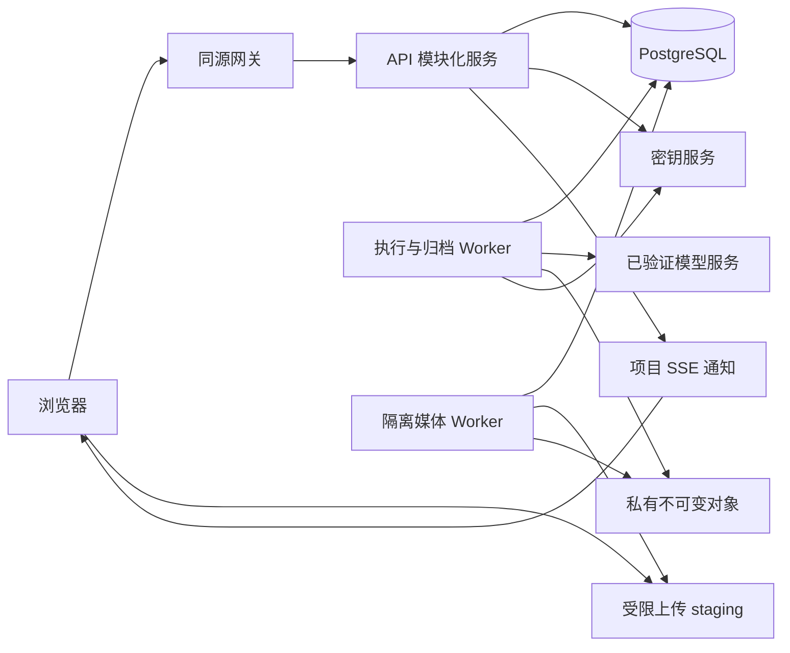

# 05 技术架构、媒体处理与运行维护

状态：实施默认设计，尚未部署或压测。先交付一个可维护的模块化服务和独立 Worker，按实际负载拆分。数据库约束见 [03](03-domain-data-model.md)，执行事实与费用规则见 [04](04-state-execution-and-budget.md)。

## 1. 技术选型与部署单元

| 部分 | 首版默认选择 | 选择理由与边界 |
|---|---|---|
| 浏览器 | TypeScript、React、Vite；服务端状态缓存与表单本地草稿分离 | 生产工具以交互为主；不依赖 SSR；画布结论不改变业务 API |
| API | TypeScript、Node.js、Fastify；OpenAPI 与请求校验共用契约 | 同一团队维护端到端类型；模块服务负责规则，路由不直接更新跨模块表 |
| 数据库 | PostgreSQL，迁移文件纳入版本管理 | 事务、唯一约束、预算锁、RLS 和 JSON 快照由一个事实源承载 |
| 异步执行 | PostgreSQL worker_tasks + outbox，独立 Node Worker | 当前不引入第二套队列事实；模型查询、归档、渲染分别限并发 |
| 媒体存储 | 私有对象存储，按具体供应商核验接口 | 业务只依赖上传意图、不可变对象、短时读取和删除受控接口；不假设所有 S3 兼容实现等价 |
| 媒体处理 | 隔离容器中的 FFprobe／FFmpeg | 支持验收、代理、拼接渲染、音频与字幕；不自研编解码 |
| 身份 | 一个选定 OIDC 提供方、服务端会话、邀请加入工作室 | 登录身份与工作室权限分离；首发身份供应商在 S0 确定 |
| 观测 | 结构化日志、指标、链路 ID 与异常告警 | 首版不依赖特定商业观测厂商；业务审计独立保留 |

具体运行时、库和镜像版本在 S0 锁定为受维护版本，生成 lockfile 和镜像摘要并做兼容验证；本表不是“最新版本”断言。若实施团队已有成熟等价技术栈，可以在保持契约与事务语义的前提下替换，并记录决策。首版不建设 Kubernetes 平台、通用工作流引擎、微服务网格或自托管 GPU 模型集群。

生产可以先用容器服务／虚拟机部署 API 和两类 Worker；数据库、对象存储采用托管服务为默认建议。API 无状态扩容；会话与任务状态持久化。媒体 Worker 可按资源需要横向扩容，供应商并发上限来自连接配置，不能因增加 Worker 无限增加生成请求。

## 2. 模块责任与接口

| 模块 | 对外承担的业务操作 | 隐藏的复杂性／拥有的数据 |
|---|---|---|
| IdentityAccess | 建立会话、授权范围、变更成员、交接负责人 | OIDC、邀请、权限撤销；用户、成员、项目访问关系 |
| DramaPlanning | 保存剧本、修改集场镜、确认差异、解析场次制作依据 | 稳定身份、内容 CAS、造型与状态语义；短剧业务表 |
| AssetMedia | 固定资产版本、共享发布、验收媒体、检查引用、签发访问 | 上传存储、校验、不可变内容、共享授权和派生文件 |
| Generation | 准备计划、执行计划、取消／查询／核对作业 | 模型映射、输入快照、供应商不确定性；plan/job/attempt |
| Budget | 预占、结清、释放、追加更正、查询用量 | 账户锁顺序、币种和周期、账单去重；reservation/ledger |
| Editing | 保存草稿、固定版本、请求渲染、登记外部成片 | 时间约束、引用检查、渲染规格和结果一致性 |
| ReviewDelivery | 发起审阅、记录时间码意见、形成决定、制作交付包 | 审阅粒度、版本批准、固定交付清单 |
| TaskTracking | 创建、分配、更新人工任务 | 不将任务角色当作权限，也不复制生成状态机 |
| Runtime | 领取内部任务、发出资源变更、健康检查 | 租约、退避、幂等投递、运行配置；不决定业务是否批准 |

业务事务可在同一个数据库事务中调用相关模块，事务上下文由应用层注入；Generation.execute 调用 Budget.reserve 后统一提交，不在模块间发送 RPC 模拟分布式事务。模块只能通过明确操作改变另一模块拥有的数据。跨模块读模型可集中查询，但写入规则只有一份。

建议工程目录为 apps/web、apps/api、apps/worker、packages/contracts、packages/domain、packages/provider-adapters、packages/media、infra 和 tests。它是初始化建议，不是已创建代码。通用包不得反向依赖 drama；长期广告通过独立业务模块调用 Generation、AssetMedia、Editing 和 ReviewDelivery。首版不创建空广告实体或通用节点图来“提前复用”。

## 3. 访问与数据隔离

每个业务请求完成会话验证后，从服务端成员关系解析可信 tenant/project 上下文；路径中的 ID 只用于定位，不能直接授权。所有项目子资源查找同时限定 tenant_id、project_id 与对象 ID。共享素材按共享范围授权，不向读者返回私有项目的来源字段。

数据库运行角色不是表 owner、superuser 或 BYPASSRLS。迁移角色独立；适用表启用 RLS／FORCE RLS，并验证连接池事务上下文不会串租户。事务内 SET LOCAL 的上下文必须与查询在同一连接中；事务结束后清除。RLS 是额外隔离防线，应用层仍检查项目成员、角色和动作。后台调度只领取最少任务标识，执行时恢复任务所属可信上下文。[PostgreSQL 官方 RLS 说明](https://www.postgresql.org/docs/current/ddl-rowsecurity.html)

连接密钥存入密钥服务，业务表仅保存 secret reference 和版本。日志、错误、OpenAPI 响应、前端均不返回密钥。轮换后的新任务使用新凭据；旧任务按原供应商账号身份查询，仍有效且必要的旧 secret 版本保留到在途任务核清。停用连接禁止新提交，允许受控恢复原任务。

会话 cookie 使用 HttpOnly、Secure、SameSite=Lax；修改接口验证 CSRF token 和可信 Origin。OIDC 使用 state、nonce、PKCE，回跳路径只允许同站白名单。邀请只接受匹配的已验证邮箱，令牌只存哈希；产品可以生成邀请链接由管理员分享，首版不依赖邮件系统。停用唯一 Owner 或仍负责项目的成员时，要求在同一管理流程先完成交接。

签名媒体 URL 是有时限的持有者凭证。默认有效 5 分钟，已签发 URL 不因数据库撤权立刻失效；撤权后不能再签新 URL。若试点要求即时切断播放，应改为每次鉴权的媒体代理并评估带宽，不能用界面提示承诺即时撤回。[S3 预签名 URL 官方说明](https://docs.aws.amazon.com/AmazonS3/latest/userguide/using-presigned-url.html)

## 4. 媒体验收与渲染

1. 创建上传意图时检查范围、文件上限、声明大小和允许类型；浏览器只取得随机 staging key 的有限写权限。
2. 用户声明完成后，后端核对实际大小、文件签名、SHA-256、可解码性、时长与轨道，不以扩展名、客户端 MIME 或 ETag 单独验收。
3. 验收读取固定版本或先取得服务端快照；复制到客户端不可写的最终 key，确认复制内容与已验收字节一致，再建立 ready 媒体。旧上传 URL 继续写 staging 不得改变 ready 内容。
4. 上传、模型输出、外部回传走同一验收边界；供应商文件优先在有效期内归档。下载仅允许受控供应商地址，检查 DNS、IP、跳转、最大字节与截止时间，禁止访问本机、内网和云元数据地址。
5. FFprobe／FFmpeg 在无网络、非 root、受限 CPU／内存／磁盘／时长的容器运行，命令参数用参数数组传入，不能拼接用户 shell。素材无法解码时拒绝引用，提供具体原因。
6. 预览代理与原始媒体分开。代理可以降分辨率；冻结渲染按固定 profile 使用已验收源文件，不把浏览器播放缓存当最终成片。

上述上传与下载边界依据 [OWASP 文件上传建议](https://cheatsheetseries.owasp.org/cheatsheets/File_Upload_Cheat_Sheet.html) 和 [SSRF 防护建议](https://cheatsheetseries.owasp.org/cheatsheets/Server_Side_Request_Forgery_Prevention_Cheat_Sheet.html)。

首版 Timeline 只有一个顺序主视频轨、多个显式音频层和字幕轨，速度固定 1。主视频片段不重叠、不留隐式空洞；需要停留画面可先导入合法视频。音频允许叠加，字幕同轨不重叠。画面尺寸不同必须选 contain／cover，固定版本保存选择。音频原轨与外加对白分别控制静音和增益；首版不自动从混合对白与配乐中拆分声轨。

输出默认采用 MP4（H.264、yuv420p、AAC 如有音频）、固定项目帧率、统一采样率和声道，具体编码 profile 在样片测试后锁定。任意裁切按帧边界归一并向用户显示实际区间，FFmpeg 重置时间戳、统一规格并重编码；不承诺任意不同来源都能无损 stream copy。浏览器显示源区间和时间线区间，字幕按时间线导出 UTF-8 SRT，可选烧录；字体及授权随镜像固定。[FFmpeg concat 官方约束](https://ffmpeg.org/ffmpeg-filters.html#concat)

渲染幂等键由 cut_revision_id、profile revision 和渲染器版本组成；结果先写临时 key，验收后发布。失败重试不得修改冻结时间线或发起模型生成。升级渲染器不会覆盖既有 ready 结果；需要改变画质／字幕样式时产生新版本。外部成片可无可还原时间线，SRT 仅在实际有字幕数据时导出。

## 5. 容量与非功能验收目标

以下是首轮压测与运维预算的建议目标，尚未实测，也不是套餐或租户人数限制。

| 维度 | 初始验证目标 | 测量方式 |
|---|---|---|
| 普通 API | 合理索引下单次 CRUD P95 < 500 ms；不含上传、模型、渲染 | 固定数据集、并发和硬件，保存结果；内容整树接口单独测量 |
| 工作数据量 | 单工作室 50 位活跃成员、单项目 500 镜头、10,000 媒体元数据 | 测检索、分页、授权、草稿加载；超过目标分页／局部加载，不封禁用户 |
| 同时提交 | 20 个并发生成提交保持预算与幂等正确 | 模拟供应商；实际付费并发按已确认额度测试 |
| 更新可见性 | 正常连接下服务端状态提交到界面刷新 P95 < 3 s | 不计供应商完成时间；断网走 GET 恢复 |
| 渲染正确性 | 音画与字幕位置误差不超过约定一帧；输出可完整解码 | 已知信号样片、混合帧率／采样率、人工回放 |
| 恢复 | 建议数据库 RPO ≤ 15 分钟、RTO ≤ 4 小时 | 先核定成本和基础设施；恢复演练通过后才承诺 |

模型等待时间、通过率和实际费用单独报告中位数及尾部值；不能用内部 API 延迟代替端到端交付时间。最早的容量优化依据样片和试点指标，不预建分库分表。

## 6. 环境、发布与恢复

开发使用模拟 Adapter 和本地对象存储；集成环境使用独立数据库、存储前缀、密钥和受控真实连接；生产资源独立。默认关闭真实付费执行，只有完成对应账号验证的能力配置才可启用。环境切换不能把测试 webhook、输出地址或任务 ID 混入生产。

部署顺序：兼容新增迁移 → API 与 Worker → 小流量核验 → 移除旧字段另批执行。Worker 退出先停止领取，保留在途 attempt；超时退出后按未知提交规则恢复。回滚代码不能回滚已发生的供应商消费；不可逆数据迁移需单独备份与迁移验证。

数据库采用定期备份和增量恢复；对象存储采用与承诺相符的版本／保留策略。恢复时先关闭所有外部创建权限，恢复数据库与媒体清单并检查引用，识别备份时间之后可能已提交的任务，通过供应商查询和账单核对，再恢复调度。不能把恢复后的 queued 记录全部重放。对象已存在而数据库缺失时先隔离核对，不立即清理。

## 7. 指标、告警与处置

| 信号 | 首次处置 | 恢复完成条件 |
|---|---|---|
| submission_unknown 增加 | 暂停该连接新提交，保存 request／attempt 关联，查供应商记录 | 每项有明确回执或保留未决；不能通过重 POST 消除告警 |
| archive_failed／输出即将过期 | 提升归档优先级，检查原账号查询和存储权限 | 原文件验收归档或明确标记不可恢复；费用未丢失 |
| 预占长期未结／账本不平 | 锁定新执行并核对供应商账单与关联 | 每次调整有证据，投影与账本一致 |
| 租约失效／队列积压 | 区分生成提交与纯内部工作，检查资源和限流 | 内部任务可恢复，外部提交未重复 |
| SSE 断线／事件过期 | 返回 reset，客户端 GET 当前对象 | UI 与权威状态收敛，不用事件补算预算 |
| 越权或签名凭据暴露 | 撤销会话／凭据，停止签发，定位审计事件 | 确认影响范围与访问恢复；已签 URL 按有效期事实处理 |
| 渲染失败／不同步 | 保留冻结版本，查素材与 profile，修复后重渲染 | 输出校验和完整播放通过，新旧结果无混淆 |

日志保留 requestId、tenantId、jobId、attemptId、provider request ID、cut revision 与阶段时长；不记录私有剧本全文、token 或签名 URL。审计记录成员变更、共享发布、采用、剪辑冻结、正式决定和费用更正。删除、保留期、数据地区和供应商内容使用条款在首发合同阶段按选定服务确定，不能仅凭模型品牌推断。
