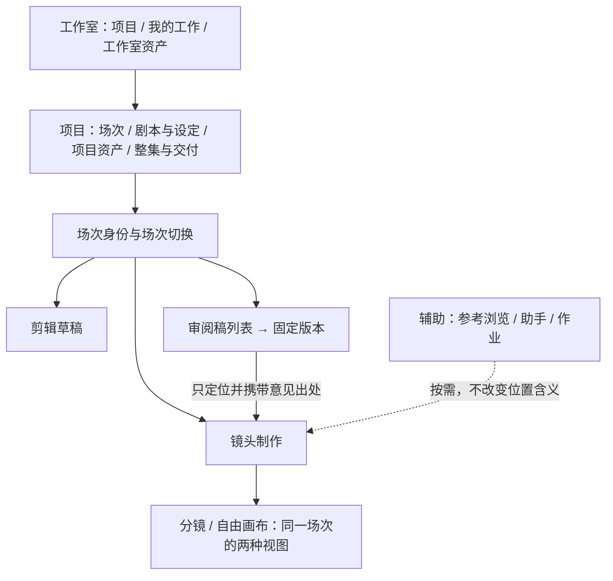

# 信息架构与上下文边界独立评审

日期：2026-09-10。视角：模拟资深信息架构／人机交互设计师的独立分析。范围：导航原型与规定截图；本轮只评审，未修改 UI。

本稿先阅读共同视觉语言、导航提案、模型与页面代码及四张指定截图，形成独立推荐后，再阅读主代理的《导航与核心创作页面：独立设计复核》。未读取其他评审代理的输出，未开展真实用户测试，不代表真人专家访谈结论。

## 结论

保留“工作室 → 项目 → 场次”，以及场次内“镜头制作／剪辑”和制作内“分镜／画布”的语义层级。最需要先修订的是**操作上下文的生命周期**：位置、当前选择、资产预览、生成输入、助手会话、助手引用与实际作用目标不能共用一个“当前镜头”。布局应服从这些边界。

建议下一版先做单主工作区、稳定的当前对象输入、可收起的非模态辅助区。宽屏允许持续并看助手和素材；1366 宽度下不把左素材、中央制作、右助手同时展开当作默认或验收前提。窄屏“制作详情／助手”互切可以是长期布局，只要正在修改的输入和动作目标仍可见、草稿可恢复。

优先级最高的三件事：返工入口停止直接覆盖提示词；审阅及生成草稿按对象保存；浏览旧稿、素材和助手建议不再隐式改写制作焦点或动作落点。

补充核对的既有范围：第 18 文档已经规定分镜默认大预览＋底部分镜条，全场总览按需展开；画布允许无选择和未绑定镜头的节点。第 14 文档只批准“生成分镜建议／准备本次提示／按意见准备修改”三类有限 AI。本稿所说助手会话、消息与历史，是这些辅助操作的上下文呈现规则及未来对话的兼容设计，不是建议 MVP 新增通用自由聊天、任意工具调用或自主执行。[分镜、无选择与助手基线](../../implementation/18-canvas-workspace-contract.md#L15)、[有限 AI 基线](../../implementation/14-scene-mvp-closure.md#L27)。

## 1. 最关键的五项问题

### 1.1 返工导航与修改内容混为一步，破坏当前草稿

**已观察事实。** `beginRework` 在导航回制作前，把目标镜头的 `prompt` 整段替换为审阅意见加固定文案，而不是只定位镜头；`rework` 又是整场单一字段。后续选择其他镜头仍会显示同一返工栏。[入口与覆盖逻辑](../../../apps/web/src/pages/NavigationJourneyPrototype.tsx#L63)、[场次级返工栏](../../../apps/web/src/pages/NavigationJourneyPrototype.tsx#L142)。

**影响判断。** 用户从 v1 进入返工，可能已在当前镜头做过第二轮改写。现在按钮“按此意见继续制作”既像导航，又承担替换内容，且没有给出替换差异。这是确定的原型行为；用户是否会因而丢失工作或误解，需要后续验证。

**推荐。** “前往 SH-04 制作”只定位当前版本的镜头，并附上 `审阅稿 v1 / 意见 / 时间点` 来源卡。意见属于待处理依据，不自动成为提示词。需要改写时另给“将建议加入输入”或“查看改写”，明确显示原文与建议；应用只针对原定镜头。返工记录按意见和目标对象关联，不用整场单一返工标签暗示所有镜头正在处理这条意见。

### 1.2 单一 `route.shot` 承担多种焦点，未发送文字也未按目标隔离

**已观察事实。** `route.shot` 决定 `shot`，随后同时驱动制作输入、候选、剪辑分镜条、审阅镜头、参考添加和助手标题。所有 `scene` 页面上的镜头点击都会把 `route.shot` 写入 `scene.focus`，包括审阅页。[派生与焦点保存](../../../apps/web/src/pages/NavigationJourneyPrototype.tsx#L30)。

`reviewText`、`reviewTime`、`versionNote` 是页面根部状态，没有场次／审阅版本键。切审阅版本仅更新 `rev`；添加意见时使用当前 `review` 和当前 `clip`。[草稿声明](../../../apps/web/src/pages/NavigationJourneyPrototype.tsx#L26)、[提交意见](../../../apps/web/src/pages/NavigationJourneyPrototype.tsx#L69)、[切版本](../../../apps/web/src/pages/NavigationJourneyPrototype.tsx#L95)。

**可由代码推导的场景。** 在 v1 输入未发意见，切到 v2 后继续提交，同一段文字会落到 v2 的当前片段；浏览旧稿中的 SH-01 后回制作，制作焦点也成为 SH-01。未实际运行这两个序列，不将推导记为浏览器实测。

**推荐。** 制作焦点只在分镜与画布间共享；剪辑片段焦点、每份审阅稿的播放位置与意见草稿分别保存。创建“动作意图”时确定场次、镜头／片段、版本和输入基线，不在点击执行时重新解释“当前对象”。切换浏览位置不清空旧草稿，也不把旧草稿显示成新对象的输入。

### 1.3 辅助入口有标题，却没有独立的引用与动作目标

**已观察事实。** 场次切换、资产、作业和助手共用一个 `drawer` 单选状态。资产动作写“引用到当前镜头”，从当前 `shot` 写入引用；助手写明读取当前镜头提示词和参考，应用建议也直接修改当前 `shot.prompt`。[容器和各项操作](../../../apps/web/src/pages/NavigationJourneyPrototype.tsx#L148)、[资产添加](../../../apps/web/src/pages/NavigationJourneyPrototype.tsx#L74)。助手仅是固定建议，没有持续会话、消息输入、异步返回或会话切换模型，不能据此声称会话隔离已验证。

主代理材料另报告了真实浏览器中的模态遮罩和命中结果；本评审没有重复该实测。单就代码与规定截图，能确认辅助功能共用单一容器、完整制作输入固定在右侧。[分镜截图](../../../output/playwright/2026-09-10-navigation-journey/03-storyboard.png)。

**影响判断。** 去掉遮罩后允许用户继续选择镜头，原来借模态阻断暂时避开的目标漂移就会显现。面板标题显示“当前镜头”不足以保护已经形成的建议、输入和待执行动作。

**推荐。** 非模态化必须与目标固定同时做。新增资产预览只改变预览对象；“引用到咖啡厅 / SH-04”固定接收者。聊天消息显示明确引用，助手建议保留自己的作用目标；选 SH-05 不会让 SH-04 的建议变成“应用到 SH-05”。引用某对象来讨论，也不意味着授权助手修改它。

### 1.4 画布的对象身份与视觉选择仍纠缠，跨模式缺少稳定的判断对象

**已观察事实。** 画布由每个镜头一个 `shot-N` 节点构成；当前选中节点显示正在看的候选，其他节点显示已采用候选。当前参考节点又从选中镜头的前两项引用重新派生。选择另一个镜头会改变场上呈现的参考集合，而不是只改变选中状态。[画布节点和参考](../../../apps/web/src/pages/NavigationJourneyPrototype.tsx#L179)。

此外，找不到 `route.shot` 时直接使用第一镜头，画布空白处只处理平移，没有清空选择的分支。原型始终存在当前镜头，无法表达既有契约中的无选择或独立自由节点上下文。[当前镜头回落](../../../apps/web/src/pages/NavigationJourneyPrototype.tsx#L31)、[画布空白处行为](../../../apps/web/src/pages/NavigationJourneyPrototype.tsx#L195)。

分镜主区只标记“采用”，候选主要在侧栏小缩略图中；所有候选使用同一图片是已声明的演示限制。[分镜渲染](../../../apps/web/src/pages/NavigationJourneyPrototype.tsx#L143)、[画布截图](../../../output/playwright/2026-09-10-navigation-journey/05-canvas.png)。因此不能将它评为真实候选比较已可用，也不能把占位图片本身列为生产缺陷。

**影响判断。** 用户可能把“看 B”理解为整个场次媒体已经换成 B；选择变化同时带来参考集合和主节点尺寸变化，还会削弱对空间位置的记忆。当前合同已要求节点媒体身份固定、切模式不重建画布，后续应回到该约束。[画布契约](../../implementation/18-canvas-workspace-contract.md#L51)。

**推荐。** 镜头是业务对象，候选媒体是可预览对象，画布节点是特定内容的呈现，三者不互相替代。主预览明确标 `SH-04 / 候选 B · 正在查看`，并在确有差异时提示采用 A、剪辑用 A。画布上的媒体节点保持身份；选中只出现工具和边界，不改掉另一节点代表的内容。全场参考保持为场次内容；当前镜头关联可突出，其余引用不因换选择消失。

选择至少区分无选择、镜头、自由节点、多选；无选择时隐藏节点输入，保留添加与画布工具，助手仅标明所在场次，不猜测最后镜头。自由节点没有合法有限 AI 动作时只提供直接编辑。

### 1.5 层级基本正确，但位置导航、历史入口与辅助工具的节奏不一致

**已观察事实。** 项目页有完整项目目录，进入场次后目录收起，顶部保留项目、集、场次。制作／剪辑和分镜／画布各占一层，语义有区别。全局资产入口名为“共享资产”，对应页面及导航总览叫“工作室资产”。审阅入口只显示最新版本；进入审阅后制作／剪辑页签消失。[场次壳与入口](../../../apps/web/src/pages/NavigationJourneyPrototype.tsx#L120)、[场次列表截图](../../../output/playwright/2026-09-10-navigation-journey/02-project-scenes.png)、[导航总览截图](../../../output/playwright/2026-09-10-navigation-journey/09-navigation-map.png)。

**影响判断。** 收起项目目录是合理减负，无需用常驻目录修复所有问题。更应解决名称一致、历史版本可达和返回预期：已确认 v1 仍被整集使用、最新 v2 尚待审时，只突出最新审阅可能掩盖这两个事实。当前没有真实多项目入口与大量场次，不能推断规模化可发现性已成立。

**推荐。** 保留场次身份栏，制作／剪辑为主工作切换，分镜／画布放在制作工具行作为视图切换，可压缩物理行数但不合并语义。统一“工作室资产”。“审阅稿”入口可展开版本列表，每项同时显示版本和状态；当前整集使用版本在相关位置明确显示，不用“最新”替代“已确认”或“正在使用”。旧稿页面保留相同场次身份和返回位置，但用醒目的 `固定审阅稿 vN` 标识只读内容。

## 2. 推荐信息结构与工作区

工作室、项目、场次是位置；分镜／画布是表达方式；助手和素材浏览是辅助工具；固定审阅稿是特定版本的对象。它们不应呈现为一排同级页签。

- **默认制作状态：** 场次内容与当前对象输入为主，必要候选预览可放大；要求、连续性和较少改的参数收进详情。全局导航保持紧凑，项目目录默认收起。助手关闭时不留空位。
- **助手展开：** 非模态停靠，当前画面、当前正在编辑的输入与目标摘要仍可用。可把完整详情与助手互切，不要求全部参数和聊天永久同时显示。
- **参考任务：** 快速找已知资产使用搜索／最近使用；长期并看的是钉住的参考预览，未必是完整素材目录。反复跨素材搜索时再展开浏览区。
- **镜头总览与精修：** 恢复第 18 文档已规定的当前镜头大预览＋底部分镜条默认结构，全场网格按需展开以排查镜头缺口，不把大图判断长期挤在六宫格旁。这是恢复已定交互基线，不是另增一种顶层模式。

不建议 MVP 默认增加多个场次文档页签。明确的场次切换器、返回路径和“返回刚才的位置”足以承接首期；否则每个页签还要解释助手归属、草稿归属、作业回跳与两个场次相同镜头编号的问题。

## 3. 必须拆开的上下文状态

下表是交互契约建议，不要求本轮另建一套后台领域模型。

| 状态 | 归属与生命周期 | 点击其他对象时 |
|---|---|---|
| 当前位置 | 项目、场次、工作内容；固定稿带版本 ID | 仅导航动作改变 |
| 制作选择 | 每场一份选择；分镜与画布共享，明确区分无选择、镜头、自由节点和多选 | 明确选择或取消选择才改变；素材预览不改变 |
| 剪辑焦点 | 剪辑草稿内的片段实例和播放位置 | 不覆盖制作选择；长期允许同镜头多段使用 |
| 审阅焦点 | 固定稿版本内的片段、时间点 | 不覆盖当前剪辑或制作的恢复位置 |
| 资产／候选预览 | 明确媒体和版本 ID，可临时或钉住 | 浏览只换预览；不自动引用、采用或替换用片 |
| 生成输入草稿 | 场次 + 镜头，或场次 + 未归镜头草稿节点 | 随目标保存；切走只是收起。自由草稿不继承上次镜头 |
| 生成计划／作业 | 已解析的输入、引用版本、输出归属与基线快照 | 不跟随选择；相关输入改动使未执行计划需重新核对 |
| 助手会话 | 默认场次所有；消息各有固定引用；输入框另有未发送引用 | 查看其他镜头可继续同场会话，但不静默带入新对象 |
| 助手建议动作 | 场次、目标对象、待改字段、生成建议时的内容基线 | 始终写原目标；目标已改变时显示差异，不能盲目覆盖 |
| 审阅意见／送审说明草稿 | 场次 + 固定稿版本 + 评论锚点；送审说明归当前场次的创建稿流程 | 原草稿保留，新位置显示自己的草稿或空状态 |
| 采用／剪辑使用／审阅确认 | 独立业务事实 | 选择、预览、会话及布局不修改这些事实 |

发起有限辅助操作或未来发送助手消息前，引用区用简短标签显示 `SH-04 / 候选 B`、`旧铜钥匙 v2`、`v1 / 00:24 意见` 等。没有明确来源时，不把所在场次的所有资料当默认上下文；若该动作缺必要输入，先让用户指定来源。场次标题只是范围提示。对“当前镜头”快捷引用，加入时解析为具体对象，发送后不再保留活动指针。

助手可以讨论 SH-04、引用 SH-05 做连续性比较，但执行按钮仍写“应用到 SH-04 的画面与动作”。输出只是建议时无需假装已经有执行权限；真正修改、生成、采用、用片、确认分别遵循现有授权和操作边界。简单内部权限不意味着可省略目标身份。

结果异步回来时，以原场次／镜头身份落回候选集合并在作业中可找回；用户正在看另一镜头时，不抢焦点、不自动打开大图、不自动采用。用户主动“定位结果”才导航到其来源。

## 4. 模态、非模态、页签与停靠的条件

| 形式 | 合适条件 | 本产品的具体使用 |
|---|---|---|
| 模态对话框 | 是边界清楚的短事务；判断信息能完整放入；背景不需要继续参与 | 固定审阅稿、确认生成计划、重置；一次完整资产挑选仅在窗口包含必要预览时可用 |
| 非模态弹出层 | 短小工具，需就近使用，不承担长文或长期任务 | 最近参考、搜索结果、节点短动作、单次润色建议；Esc 关闭并回到触发点 |
| 非模态停靠区 | 需要持续看内容、选择对象、输入和比较；能保存宽度与收起状态 | 助手、素材浏览、镜头详情；打开不能保留隐藏的焦点锁，不能挡住作用对象和主要输入 |
| 功能页签 | 同一上下文中的同级工作，需要保留各自状态 | 镜头制作／剪辑；窄屏的详情／助手也可用功能页签，切换不重建草稿 |
| 视图切换控件 | 同一业务集合的表现方式变化 | 分镜／自由画布，保持选择和输入；不是复制场次或进入另一个数据空间 |
| 文档页签 | 真实存在持续往返的多个独立文档，并已解决每个文档的上下文隔离 | 多场次并行以后再验证；首期无需默认开放 |
| 大图预览／比较 | 画面判断本身是当前任务，能包含明确候选身份和采用动作 | 可暂时占据中心主区或专门预览层；要从多个地方取参考时保持非模态 |

“非模态”只说明仍可操作背景，并不保证布局可用；“停靠”只说明占位方式，也不说明助手能读取什么。它们与引用、目标、执行范围必须分别设计。

## 5. 三类切换的具体操作规则

### 切场次

1. 收起当前场的临时选择器；按目标保存输入草稿、各模式视野及个人面板状态。未提交生成计划保留在原目标，不携带到新场。
2. 正常进入目标场默认打开镜头制作并恢复其最后制作模式和选择；明确的作业、评论或审阅链接遵从链接目标。不要因为上个场在审阅，就把下个场也打开到相同版本号。
3. 场次切换后，助手显示目标场已有辅助记录或新的操作入口。原场记录和未发送内容仍保留，但不把旧输入挪到新标题下。未来若增加跨场讨论，需显式引用来源并把会话范围显示为项目，不借本轮布局修订把该能力纳入 MVP。
4. 已执行的生成继续在原场运行。导航无需例行确认；仅当保存失败、发生冲突或本地草稿无法可靠保留时，给出具体问题和可恢复动作。

### 切分镜／画布

1. 共享当前场、制作选择、生成草稿、明确引用、采用和用片事实；不触发新任务、不新建场次画布。
2. 分别恢复分镜滚动位置、画布平移缩放；切换本身不“适应全场”。从明确的“定位到画布”动作进入时，才将目标带入视野。
3. 当前选择为未归镜头的自由草稿时，分镜模式用“本场探索”保留其身份和入口；不要自动把输入绑到上次镜头。
4. 助手会话不变，发送过的引用也不变。模式切换不意味着助手获得另一模式所有可见对象。

### 点击旧审阅稿及其意见

1. 以 `场次 / 固定审阅稿 vN` 打开只读快照，恢复该版播放与评论位置；版本 ID 无效时显示找不到该版，不能悄悄回落到最新版本。
2. 仅查看意见时，停留旧稿并定位时间点。`返回刚才制作` 恢复先前的制作位置；`返回当前剪辑` 恢复当前剪辑自己的焦点。
3. `前往 SH-04 制作` 明确跨到当前制作对象，并携带意见出处；如果来源镜头已移除或无法匹配，先展示来源与可用目标，不自动选择第一镜头。
4. 旧稿确认只作用于该版，当前制作和整集引用不跟随变化。旧稿已确认而后来新稿待审时，两种状态可以同时成立。

## 6. 对主代理新建议的挑战

同意主建议淘汰持续助手的模态遮罩默认方式，也同意把画面和实际输入留在核心制作区；它对空间预算的担忧有证据基础。

**分歧一：不能把右侧“制作／助手”互切仅定义为过渡方案。** 主稿认为它无法同时对照完整制作输入。完整详情不等于正在修改的输入：若中心保留当前提示词、明确目标与候选预览，右侧的连续性详情和助手可以长期互切。1366 宽度下，这可能比三列同时展开更稳健。应评估用户是否需要同时读全部详情，而不是先要求完整详情与聊天同时出现。

**分歧二：左素材／中央制作／右助手可以是宽屏验证方案，不能先成为唯一结构。** 主稿已承认约 690px 中心宽度尚未验证。用户可能需要一直看钥匙参考，却不需要一直看素材搜索结果。应把“素材浏览器”和“钉住的参考预览”拆开：先选好并在中心保留一个可缩放参考，通常比常驻完整资产目录更省认知与空间。是否同时开两侧，以真实工作片段中的持续依赖决定。

**补充缺口：面板非模态化之前必须解决未发送草稿和待应用建议的目标固定。** 主稿已提出已发请求不能改绑，但原型的全局审阅文字、返工覆盖、生产与审阅共用焦点仍未被同等收口。这里的风险不是只有聊天异步返回，普通导航也会发生。

另一个合理备选是“工作室只有一个长期助手会话，自动读取当前页面”。它确实减少切会话动作，但让对话历史、可见选择与作用目标不断变更，尤其每场都存在 SH-04 时难以追溯。本轮不采纳它作为默认。先做场次会话和显式跨场引用，长期有真实项目统筹需求再增加项目会话。

## 7. MVP 最小实现与长期兼容性

**本轮设计修订最小集：**

1. 保留既有三层导航；统一资产名称，提供带版本／状态的审阅列表，压缩导航物理行数。
2. 去掉返工自动覆盖，展示可追溯意见卡；审阅、送审说明、生成输入草稿按对象保存。
3. 拆开制作选择、资产预览、审阅焦点和动作目标。非模态助手可收起；暂时只有固定建议也应演示“切镜头后应用原建议”的正确身份。
4. 给候选大预览／比较入口，分别标识正在看、采用、剪辑用；画布节点与引用显示遵循既有身份契约。
5. 先验两个窗口尺寸、两个镜头和两个场次，不引入复杂权限、任意浮窗管理、多场次页签或完整自主 Agent 执行。

**后续兼容：** 状态按稳定 ID 和版本隔离，支持后续多会话、多目标建议与同镜头多片段剪辑；项目层“集／场次／镜头”是短剧接入的组织关系，长期广告复用画布、媒体、计划／作业与版本底层，按自身业务接入，不给广告伪造集场镜，也不要求通用画布依赖短剧层级。个人面板宽度、视野与最近位置归布局偏好，不能写成团队制作事实。采用、剪辑使用和固定稿确认继续使用现有业务边界，UI 不新造一套状态机。

下一版的设计验证应包含：写一段 v1 意见后切 v2；编辑 SH-04 输入后查看旧稿并返回；给 SH-04 开助手、选 SH-05 后应用旧建议；从资产预览引用到原目标；两个场次各留未发送内容并来回切；任务返回结果时用户正在另一个场次。验收先看内容落点和可恢复性，再比较面板开关次数与判断面积。

## 8. 证据边界

可以确认的事实是：当前代码的数据依赖、草稿保存位置、返工覆盖行为、四张截图的布局、原型明确声明的能力缺口。主稿的浏览器测量仅作为主稿记录引用，本评审没有独立复测。

本稿对认知负担、错误概率、双区与三区效率的判断均为专业视角推断；目标用户是否会迷路、能否识别版本差异、哪种布局更快，尚无真实用户验证。推荐方向可供下一轮原型比较，不能据此宣告最终导航或布局定稿。
