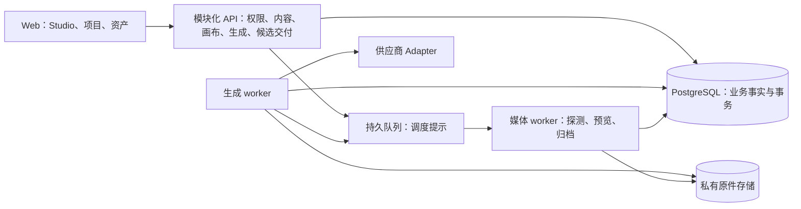

# SceneDesk 架构与产品精简审查

审查及决策复核日期：2026-09-24。基线：`4812ccc6d2bdcfd791f27e4dae7b22c7f5e74b87`。这是基于当前主线的独立审查与清理建议，不是新的产品规范，也不代表下列改动已经实施。本文已按“架构合理、克制，删除过早和多余设计”的原则重排决策与优先级。

**结论：保留现有模块化单体及必要的执行隔离；先消除规则冲突和无效依赖，冻结后置范围，按证据逐步删除遗留。** 第一轮不新增架构层、服务、状态机、数据表、依赖或配置开关。Studio 已经完成一轮入口收敛，应沿它继续整理。

目前有充分证据的负担是：现行入口含过期结论；能力规格的定义和校验冲突；生产入口经过已无调用的剪辑 hook 取得通用功能；旧全局样式影响 Studio。接口数量、文件长度、本地和部署的差异只是调查线索，不能单独证明过度设计。

落地状态（2026-09-24）：A1 规格规则、A2 当前文档入口和 A5 无调用依赖已实现；A6 只处理实际复现的全局 SVG 尺寸覆盖。验证、交付状态与边界见[实施进度](../implementation/22-implementation-progress.md)。下文问题、复现计数和代码证据保留审查基线，链接固定到该提交；其余建议仍按各项条件决定，不视为全部完成。

## 核心决策与理由

每项清理必须说清楚：当前谁需要它；删后复杂度是否真正消失；会失去哪条行为保障。能直接合并规则或删除无调用代码，就不增加中间层。仅为未来变化设计的扩展点停止建设；已有历史数据和未决任务所需的兼容能力按实际依赖保留。

| 决策 | 证据、取舍与成立条件 | 结论强度 |
|---|---|---|
| 保留单仓、共享数据库、模块化 API，以及独立生成/媒体执行进程 | API 的事务与队列写入已共用数据库；生成持有供应商凭据，媒体负责隔离解码。合进同一进程会扩大故障和凭据影响面，拆成独立数据服务会增加协调成本。当前无吞吐或组织证据要求改变拓扑 | 高；保留当前结构，不据此承诺无限扩展 |
| 固定能力的合法配对决定请求规格，真实像素决定归档验收 | A1 已执行复现。名义画幅不能用像素精确除法推导；前端、API 和供应商转换必须解释同一固定事实 | 高；先修正确性，再消除重复 |
| 当前范围与历史设计分开，停止为后置功能追加实现 | [38 范围决定](https://github.com/exo-gravity/scenedesk/blob/4812ccc6d2bdcfd791f27e4dae7b22c7f5e74b87/docs/implementation/38-first-release-scope-review.md#L3) 已明确后置后期和商业运营；[85 切换记录](https://github.com/exo-gravity/scenedesk/blob/4812ccc6d2bdcfd791f27e4dae7b22c7f5e74b87/docs/implementation/85-studio-rebuild.md#L153) 明确保留部分旧接口与历史。现行文档应准确，历史不必持续扩写 | 高；不能由此直接推导删库或删接口 |
| 删除无调用转发层，解除通用恢复对剪辑 hook 的依赖 | 仓内调用检索及入口追踪支持 A5；通用生命周期自己负责本机清理，画布注册独立存在。这里可以减少真实依赖，不需要新抽象 | 高；保留历史本机副本的识别和授权读取 |
| 旧接口/后期运行链路可以收缩，删除范围逐项确定 | 已证明部分 UI 退役，但没有业务库存量、外部消费者及部署队列清单；评审历史仍参与返工输入 | 条件成立；先确认依赖，再实际删除，避免永久叠加开关 |
| 大组件拆分、worker 搬家、schema 子集和数据库索引不是默认任务 | 已有共享 controller、session、processor 和显式原型开关。再抽一层、再建一条生成流水线未证明收益 | 暂缓；仅处理明确重复规则或实际维护阻断 |

架构中的“单一事实来源”不等于只做一次校验。职责应保持以下区分：

| 事实/规则 | 应由谁负责 | 不能混同的内容 |
|---|---|---|
| 可选择的生成规格 | 固定能力中的合法配对；共享纯规则解释它 | UI 展示、API 准入各自校验，但不各自定义规格 |
| 本次生成的含义 | 已持久化计划及其固定快照 | 当前模型档案、当前画布不能重解释旧任务 |
| 是否允许当前操作 | 服务端当前权限、能力启用状态、执行限额 | 固定快照不冻结访问权或授予新的执行权 |
| 执行/取消/未知提交 | 持久 job、attempt、回执与受限事务 | 队列回执和 UI 状态不建立业务成功 |
| 结果是否可用 | 私有原件、真实探测与归档状态 | 厂商完成不等于文件已安全可取回 |
| 本机未保存意图 | 编辑/助手现有持久恢复机制 | 服务端旧版本不能覆盖离线或失败草稿 |

这些区别对应真实的丢回执、重复付费、撤权和草稿丢失风险。可以集中其实现，但不能因为追求少几个状态而合并事实。相反，商业账本、通用工作流、插件化规则引擎、统一万能任务状态机均不进入此次清理。

复核撤回的默认建议：整段归档 23–86、因原型文件多就搬迁、预先生成数据库索引、直接建立 schema 子集流水线、统一两套启动器为新框架、按无 UI 清单退役 API。它们分别降为逐文件处理、按实际影响处理或条件任务。

## 审查方法与覆盖

本轮对全仓做文件和依赖盘点，再深读关键业务链路及疑似冗余处。**这是全仓架构审查，不是对全部代码逐行进行安全审计，也不是线上业务验收。**

| 范围 | 本轮覆盖 |
|---|---|
| 仓库结构 | 2,363 个已跟踪文件；目录职责、入口、构建与运行脚本 |
| 文档 | `docs/` 的 242 个 Markdown，28,259 行；全目录结构与章节盘点，深读现行入口、产品范围、领域、架构、状态、契约、Studio、供应商、部署和验收，抽查历史及大型执行计划 |
| TypeScript | `apps/packages/deploy/scripts/tests` 中 483 个 `.ts/.tsx`，不含生成类型；用 TypeScript AST 扫描静态导入、字面量动态导入和路由操作声明，结合实际入口追踪依赖 |
| 数据库 | 79 个追加迁移，编号到 `0120`；盘点定义与替换关系，核对授权、固定引用、生成状态及剪辑遗留；没有连接实际业务库统计存量数据 |
| 契约 | 180 个操作、262 个 schema；核对生成源、注册方式、后置操作、浏览器校验与文档门禁 |
| 关键链路 | 入口/权限 → 剧本与资产 → 画布及本机恢复 → 固定计划 → 生成 worker → 归档 → 候选/选用/原片；另查人工任务、旧剪辑、评审、部署/恢复 |
| 实际执行 | AST 依赖盘点、当前模型档案 → 规格选择 → 请求校验复现；第二轮遍历全部模式，并做固定快照与当前档案映射分歧的控制实验。未执行完整测试套件、浏览器场景、部署或付费调用 |

纯函数复现直接转译并调用本基线源码，使用现有 TypeScript 5.9.3，不替换被测函数，不产生网络、数据库或供应商请求。源码统计用于定位维护面，不以行数证明过度设计；静态未发现调用也不等于线上没有外部消费者。

## 优先清理清单

这里的优先级表示清理顺序。只有 A1 是本轮直接执行复现的功能缺陷；其他项分别是结构事实、维护风险或待决定的产品取舍。

| 编号 | 优先级 | 发现 | 建议与预期收益 | 改动风险 |
|---|---|---|---|---|
| A1 | 立即 | 模型规格存在互相冲突的规则 | 用固定能力的合法规格配对统一界面、请求及 API；先恢复正常生成路径 | 中，涉及前后端行为 |
| A2 | 高 | 多份文档同时自称现行，旧发布范围仍进入门禁 | 先纠正入口与过期正文；逐份归档失效计划，不新增文档体系 | 低至中，需提取仍有效规则 |
| A3 | 条件任务 | 后置契约、兼容接口与当前功能混在一起 | 先准确说明可运行范围；消费和存量核查后才能退役 | 中高，涉及契约及存量消费者 |
| A4 | 条件任务 | 本地媒体 worker 默认启用后期，部署版禁用 | 普通创作启动不应强制后期配置；保持必要的开发测试差异 | 中，涉及运行配置与恢复 |
| A5 | 高 | 剪辑遗留通过通用恢复依赖留在前端入口 | 改直接导入、删除无调用转发；后续再处理专用代码 | 小改低风险；旧副本处理须单独验证 |
| A6 | 定点清理 | 旧全局样式影响 Studio；原型本身已有开关 | 优先缩小全局样式作用域；不为文件数另建实验工程 | 中，需生产视觉回归 |
| A7 | 按需 | 生成和助手界面知道多步业务顺序 | 遇到同一行为的多处修改时，将那一段收回现有 Module | 中高；不按文件行数立项 |
| A8 | 按需 | worker 跨应用导入；浏览器加载完整契约 | 解开确定的 HTTP 依赖；目录调整与校验生成优化均暂缓 | 中，跨运行入口或浏览器恢复 |
| A9 | 暂缓 | 当前数据库行为需要顺着迁移历史寻找 | 必要时临时导出当前定义，不新增长期索引流水线 | 无需立即改动 |
| A10 | 定点清理 | 本地 preflight 未覆盖 CI 的 generation 镜像 | 先补准确验证范围；不把流程统一作为全面改造 | 中，CI/门禁变更需单独确认 |

## A1：模型能力需要一个明确的规则拥有者

当前 [模型档案](https://github.com/exo-gravity/scenedesk/blob/4812ccc6d2bdcfd791f27e4dae7b22c7f5e74b87/packages/provider/src/verified/profiles.ts#L41) 把厂商档位、名义画幅与实际像素配对；[规格面板逻辑](https://github.com/exo-gravity/scenedesk/blob/4812ccc6d2bdcfd791f27e4dae7b22c7f5e74b87/apps/web/src/business/generation-specification.ts#L68) 正确按配对提供选项。但 [imageOutput](https://github.com/exo-gravity/scenedesk/blob/4812ccc6d2bdcfd791f27e4dae7b22c7f5e74b87/apps/web/src/business/image-generation.ts#L63) 仍要求 `width × ratioHeight === height × ratioWidth`，视频也复用此校验；[API](https://github.com/exo-gravity/scenedesk/blob/4812ccc6d2bdcfd791f27e4dae7b22c7f5e74b87/apps/api/src/modules/generation/media-input.ts#L120) 再做一次同样的精确比例判断。

本轮调用 `PROFILES → capabilityDefinition → aspectRatioOptions/qualityOptions → imageOutput/videoOutput`，对每个模型的一个模式检查面板提供的全部规格。结果如下，**这些是源码定义的组合，不表示七个模型均已在线开通或实测**：

| 模型 | 面板组合 | 被现有校验拒绝 |
|---|---:|---:|
| MiniMax H3 | 2 | 2 |
| Seedance 2.0 | 9 | 2 |
| Seedance 2.0 Fast | 6 | 2 |
| Seedance 2.0 Mini | 6 | 2 |
| Seedream 5.0 Pro | 9 | 2 |
| Seedream 5.0 Flash | 9 | 2 |
| Seedream 5.0 | 3 | 2 |
| 合计 | 44 | 14 |

例如，H3 的 `16:9 / 768P / 1344x768`、Seedance 的 `16:9 / 480p / 864x496`、Seedream Pro/Flash 的 `16:9 / 1K / 1424x800` 都来自档案和面板，却报“画幅与所选图片尺寸不匹配”。这比既有记录中的 480p 问题更广。

**决策：** 让固定能力的 `outputs` 配对成为此规则的依据，前端选择和服务端验证共同使用一个小型纯函数，优先置于已有且前后端均使用的 [domain 包](https://github.com/exo-gravity/scenedesk/blob/4812ccc6d2bdcfd791f27e4dae7b22c7f5e74b87/packages/domain/src/index.ts)。输入是能力定义与请求规格，输出是合法规格或明确问题；不建规则注册表、策略类或新包。不要从 provider 根入口向浏览器引入 Node I/O。

具体语义必须保持：有配对表时按配对验证；可选画幅未填写时不随意丢弃旧尺寸，需按现有兼容语义处理；旧能力没有配对表时保留其已定义行为，不能从最新档案悄悄补写固定快照。名义 `16:9` 与实际 `1344x768` 可同时成立；[归档校验](https://github.com/exo-gravity/scenedesk/blob/4812ccc6d2bdcfd791f27e4dae7b22c7f5e74b87/packages/media/src/generated-output.ts#L16) 仍要求实际宽高严格匹配固定尺寸。权限、尺寸/资源上限、时长和音轨约束仍独立强制。不要修改实测尺寸迎合公式，也不用宽松误差替代配对验证。

补一组真实档案到请求校验的公共行为测试，再补服务端计划准入的配对测试。第二轮遍历全部模式得到 **67 个面板组合，22 个被拒绝**；与首轮差额来自同一视频规格在两个模式中计数，不是新增 8 种规格。现有 profile、规格面板和生成函数分开测试，无法阻止这类组合失配。

**执行前还需保护旧计划语义：** [prepareSubmission](https://github.com/exo-gravity/scenedesk/blob/4812ccc6d2bdcfd791f27e4dae7b22c7f5e74b87/packages/provider/src/verified/prepare.ts#L14) 用固定快照中的 `modelVersion` 查当前档案，再从当前 `profile.outputs` 取供应商画幅和档位。本轮仅在独立进程内模拟档案变更，保持快照不变，转换结果由 `768P/16:9` 变为模拟的 `2K/9:16`，外部 I/O 为零；这是映射分歧的控制实验，不证明线上曾发生该事故。实施时必须使用与固定能力一致的转换，或在付费提交前明确拒绝不兼容映射；不能用“最新档案为准”覆盖旧计划。第一轮不重写版本体系，不改变档案映射；兼容已持久任务所需的版本化另据实际数据确定。

相邻取舍：[开通脚本](https://github.com/exo-gravity/scenedesk/blob/4812ccc6d2bdcfd791f27e4dae7b22c7f5e74b87/scripts/provision-verified-capabilities.ts#L69) 比较整个 `definition`，其中包含 `displayName`，所以改名也可能发布新能力并关闭旧行。这是保守的不可变策略，有部署成本但尚未证明值得新增展示元数据结构；本轮保留，不为避免一次改名发布而增加表、版本或自动开通逻辑。

## A2：现行文档应解释现在，而不是要求读者推演历史

文档结构已形成实际维护负担：

- [01 产品需求](https://github.com/exo-gravity/scenedesk/blob/4812ccc6d2bdcfd791f27e4dae7b22c7f5e74b87/docs/implementation/01-product-requirements.md#L9) 仍保留完整制作平台的首发描述；[38 首版范围](https://github.com/exo-gravity/scenedesk/blob/4812ccc6d2bdcfd791f27e4dae7b22c7f5e74b87/docs/implementation/38-first-release-scope-review.md#L15) 已后置剪辑、商业运营、完整团队与整集流程；38 自身的双模式和先建场次流程又被 Studio 部分取代。
- [实施索引](https://github.com/exo-gravity/scenedesk/blob/4812ccc6d2bdcfd791f27e4dae7b22c7f5e74b87/docs/implementation/README.md#L9) 同时把旧 70/77/78 工作包称为“最新/当前”，也指向现行 Studio。读者必须自行判断每一段的有效时间。
- [README](https://github.com/exo-gravity/scenedesk/blob/4812ccc6d2bdcfd791f27e4dae7b22c7f5e74b87/README.md#L72)、[05 架构](https://github.com/exo-gravity/scenedesk/blob/4812ccc6d2bdcfd791f27e4dae7b22c7f5e74b87/docs/implementation/05-architecture-and-operations.md#L14)、[22 进度](https://github.com/exo-gravity/scenedesk/blob/4812ccc6d2bdcfd791f27e4dae7b22c7f5e74b87/docs/implementation/22-implementation-progress.md#L7) 留有模块未实现、真实模型未接入等旧结论；[86](https://github.com/exo-gravity/scenedesk/blob/4812ccc6d2bdcfd791f27e4dae7b22c7f5e74b87/docs/implementation/86-verified-provider-runtime.md#L111) 已记录真实付费冒烟。[85](https://github.com/exo-gravity/scenedesk/blob/4812ccc6d2bdcfd791f27e4dae7b22c7f5e74b87/docs/implementation/85-studio-rebuild.md#L321) 仍写重建分支“均未推送”。
- 最新 [86 开通流程](https://github.com/exo-gravity/scenedesk/blob/4812ccc6d2bdcfd791f27e4dae7b22c7f5e74b87/docs/implementation/86-verified-provider-runtime.md#L76) 也把 `enabled/verifiedAt` 称为唯一开关，与 [executePlanOnce 的 generationExecutor 门禁](https://github.com/exo-gravity/scenedesk/blob/4812ccc6d2bdcfd791f27e4dae7b22c7f5e74b87/apps/api/src/modules/generation/model.ts#L169) 不一致。
- `docs/superpowers/` 的三个文件共 3,781 行，包含复制的实现代码、已结束任务的 agent 执行指令和工作顺序。[86](https://github.com/exo-gravity/scenedesk/blob/4812ccc6d2bdcfd791f27e4dae7b22c7f5e74b87/docs/implementation/86-verified-provider-runtime.md#L87) 还再次复制设计中的状态映射。

**保留现有职责，修正入口，不按文件数量合并文档：**

| 入口 | 唯一职责 |
|---|---|
| README / docs 索引 | 产品一句话、启动方式、阅读入口 |
| 当前产品范围 + Studio 说明 | 当前主路径、交互、明确非目标 |
| 架构与领域规则 | 谁拥有事实、哪些不变量不能破坏、模块如何连接 |
| 契约与运行手册 | 字段/接口、开通/部署/恢复的实际操作 |
| 22 当前状态 | 能力的实现、受控验证、真实验证、阻断和证据链接 |

不能把 23–86 整段视为日志归档：例如 58 仍承载恢复语义，86 同时包含现行开通步骤和证据。逐文件移除重复的现状陈述，保留仍有效的运行手册与规则；完成的计划、旧 approved 设计标明适用基线，退出日常必读路径。冻结评审和历史证据保留原内容；不继续通过文末追加“以本段为准”修补现行正文，不建设新的文档治理平台。

验收应是“同一个当前行为只有一个定义位置”，而不是删除了多少 Markdown。

## A3：收缩运行表面，区分没有实现与已经退役

本轮逐组核对静态注册方式后，以下 **24 个 OpenAPI 操作在当前 API 源码中未找到路由实现**。已排除动态注册、循环生成操作名以及 OIDC 直接注册 URL 的情况。这是源码核对，不是线上流量观测。

| 范围 | 操作 |
|---|---|
| 共享发布 | `publishSharedAsset` |
| 自管模型连接 | `listConnections/createConnection/changeConnection/listConnectionVersions` |
| 后期剪辑 | `saveCutDraft/freezeCut/listCutRevisions/getCutRevision/retryRender/importExternalCut/normalizeCutDraft/getCutNormalization/previewCutReplacement` |
| 审阅决策 | `decideReview` |
| 后期交付 | `listDeliveries/createDelivery/getDelivery/recoverDelivery/getDeliveryAccess` |
| 商业预算与用量 | `listBudgets/createBudget/changeBudget/listUsage` |

它们来自 [契约生成源](https://github.com/exo-gravity/scenedesk/blob/4812ccc6d2bdcfd791f27e4dae7b22c7f5e74b87/docs/implementation/build_contract.py) 及 [编辑契约](https://github.com/exo-gravity/scenedesk/blob/4812ccc6d2bdcfd791f27e4dae7b22c7f5e74b87/docs/implementation/editing_contract.py)。[38](https://github.com/exo-gravity/scenedesk/blob/4812ccc6d2bdcfd791f27e4dae7b22c7f5e74b87/docs/implementation/38-first-release-scope-review.md#L61) 明确要求保留完整契约作为后续路线，因此这些缺失实现不自动构成漏做或应删的功能。[API fallback](https://github.com/exo-gravity/scenedesk/blob/4812ccc6d2bdcfd791f27e4dae7b22c7f5e74b87/apps/api/src/app.ts#L185) 对未注册 `/v1/` 统一返回 `501`；确定需要修正的是“设计目录”与“已实现操作”容易混淆。

另一类是**确实实现并注册、但已退出当前 UI**的功能：[app.ts](https://github.com/exo-gravity/scenedesk/blob/4812ccc6d2bdcfd791f27e4dae7b22c7f5e74b87/apps/api/src/app.ts#L101) 仍注册 7 个剪辑操作、2 个编辑在场操作、6 个评审/评论操作；[Studio 切换记录](https://github.com/exo-gravity/scenedesk/blob/4812ccc6d2bdcfd791f27e4dae7b22c7f5e74b87/docs/implementation/85-studio-rebuild.md#L153) 明确说明部分对应前端已退役。

**有条件的减法，不将 24 个操作直接列为删除任务：**

1. 先修当前说明，停止为后置操作扩展设计或实现。保留一个契约源，不新增第二份手工 OpenAPI、运行时功能注册框架或大版本 API。
2. 收缩契约前检查 schema 被当前请求、响应、固定快照和本机恢复引用的闭包。没有路由实现的操作可单独评估删除，不代表关联 schema 都能删。已有注册操作还须核查运行消费者、存量数据、固定引用和未决任务；无访问日志时结论是“尚不清楚”，不能写成“无人使用”。
3. 证据确认可退役后，明确一次切换范围，保留必要的历史读取，删除新写入入口和专用代码；同步生成物、权限清单、示例和测试。不要堆叠无限期的兼容开关；有未解决依赖的部分暂留。物理删表通常不在第一批。

两处不能误删：

- [prompt-input](https://github.com/exo-gravity/scenedesk/blob/4812ccc6d2bdcfd791f27e4dae7b22c7f5e74b87/apps/api/src/modules/generation/prompt-input.ts#L7) 仍依赖 [reviews/model 的 resolveTakeFeedback](https://github.com/exo-gravity/scenedesk/blob/4812ccc6d2bdcfd791f27e4dae7b22c7f5e74b87/apps/api/src/modules/reviews/model.ts#L64)，用于 `prepare_rework` 的固定意见、评论修订和执行前核对。无评审 UI 不意味着意见来源与历史无用。
- 旧后期 `deliveries` 与当前 [selected-delivery](https://github.com/exo-gravity/scenedesk/blob/4812ccc6d2bdcfd791f27e4dae7b22c7f5e74b87/apps/api/src/modules/candidates/selected-delivery.ts) 的“本场选用原片 ZIP”不同。后者属于当前核心闭环，应保留。

## A4：本地默认运行范围必须与当前产品一致

[本地 media worker](https://github.com/exo-gravity/scenedesk/blob/4812ccc6d2bdcfd791f27e4dae7b22c7f5e74b87/apps/worker/src/main.ts#L35) 要求制作副本存储和工作目录，创建 `createProductionProcessor`，扫描 `includeProduction: true`，并报告 `productionEnabled: true`。[setup-local-media](https://github.com/exo-gravity/scenedesk/blob/4812ccc6d2bdcfd791f27e4dae7b22c7f5e74b87/scripts/setup-local-media.ts#L124) 也创建 production bucket 并写入相应配置。

[部署版 media worker](https://github.com/exo-gravity/scenedesk/blob/4812ccc6d2bdcfd791f27e4dae7b22c7f5e74b87/deploy/runtime/media-worker.ts#L108) 使用 `includeProduction: false`，[queue-boundary](https://github.com/exo-gravity/scenedesk/blob/4812ccc6d2bdcfd791f27e4dae7b22c7f5e74b87/deploy/runtime/queue-boundary.ts#L23) 发现待处理后期任务会拒绝启动。当前产品已后置后期，普通创作启动仍强制配置后期桶，是可以收缩的默认依赖。开发环境覆盖后期测试本身合理；差异不证明业务实现分叉，两者已经复用 `createMediaProcessor`、`repairMediaWork`。

**建议：** 确认本地存量任务和开发使用者后，让普通创作启动只需要导入探测、预览衍生物和生成结果归档；后期测试继续通过现有测试夹具运行，有真实维护需求时才保留专用启动入口。不要默认新增一套通用启动框架或 production 开关。健康检查、并发数、凭据配置和受限环境检查可因环境不同而不同；当前任务处理及故障语义应相同。

不要为了少一个命令而把生成密钥、身份密钥和媒体解码权限放进同一进程；也不要让默认消费者吞掉它不支持的旧队列任务。切换前先处理实际存量任务与兼容队列，原恢复审计仍须工作。

## A5：先修依赖方向，再删剪辑专用前端

当前 [BusinessApp](https://github.com/exo-gravity/scenedesk/blob/4812ccc6d2bdcfd791f27e4dae7b22c7f5e74b87/apps/web/src/business/BusinessApp.tsx#L66) 为取得通用退出/撤权清理函数而导入 `use-cut-work`；该文件除了再导出通用函数，还会 [创建并注册 CutWorkSessionRegistry](https://github.com/exo-gravity/scenedesk/blob/4812ccc6d2bdcfd791f27e4dae7b22c7f5e74b87/apps/web/src/business/use-cut-work.ts#L16)。`useCutWork()` 本身在当前 UI 中没有调用者。

这是可以较早处理的错误依赖，但不能按 `cut-*` 文件名批量删除：

- [CanvasRecovery](https://github.com/exo-gravity/scenedesk/blob/4812ccc6d2bdcfd791f27e4dae7b22c7f5e74b87/apps/web/src/business/CanvasRecovery.tsx#L132) 正在使用 `CutLocalRecoveryPanel`。
- 该面板实质上管理通用本机副本，只是 [借用了 CutWorkController 的类型](https://github.com/exo-gravity/scenedesk/blob/4812ccc6d2bdcfd791f27e4dae7b22c7f5e74b87/apps/web/src/business/CutLocalRecoveryPanel.tsx#L13)，还读取旧剪辑副本的对象信息。
- [CanvasController](https://github.com/exo-gravity/scenedesk/blob/4812ccc6d2bdcfd791f27e4dae7b22c7f5e74b87/apps/web/src/business/canvas-controller.ts#L33) 继承 `EditingDocumentController`；权限撤销、IndexedDB 恢复、未知保存回执都由共享机制承担。

第一步只让 BusinessApp 直接依赖 `editing-lifecycle`；该模块的 [clearUserEditing](https://github.com/exo-gravity/scenedesk/blob/4812ccc6d2bdcfd791f27e4dae7b22c7f5e74b87/apps/web/src/business/editing-lifecycle.ts#L23) 自己执行本机清理，不能把这一步随空 registry 一起删掉。然后去除通用恢复面板对剪辑类型的依赖，按现有两个所需成员使用小型结构类型即可，不必新建 RecoveryOwner 类或 Adapter。确认生产无调用后删除剪辑专用 hook/registry；controller 和旧副本兼容读取单独核查。历史本机草稿必须仍可识别、经授权导出或明确操作清理，不能因页面退役静默丢弃。

另有小型无效适配层：[image-input](https://github.com/exo-gravity/scenedesk/blob/4812ccc6d2bdcfd791f27e4dae7b22c7f5e74b87/apps/api/src/modules/generation/image-input.ts) → [visual-input](https://github.com/exo-gravity/scenedesk/blob/4812ccc6d2bdcfd791f27e4dae7b22c7f5e74b87/apps/api/src/modules/generation/visual-input.ts) → `media-input`，前两者只有再导出、未发现生产调用链。可随邻近清理删除；它们不是当前复杂度的主要来源。

## A6：优先移除旧样式的全局影响，原型不单独立项

以生产 Web 入口为根，排除 [Root 中显式开关保护的 DesignApp](https://github.com/exo-gravity/scenedesk/blob/4812ccc6d2bdcfd791f27e4dae7b22c7f5e74b87/apps/web/src/Root.tsx#L6) 后，有 **22 个 TS/TSX 文件、6,718 行**仅属于原型依赖子图，包括 `App.tsx`、`model.ts`、15 个 `pages` 文件和原型专用的 `WorkspaceShell/cards/PromptComposer/components/ui` 等。

正常路由不会进入这些原型，不能说它们是第二套正在运行的生产页面。负担在其他地方：

- [Web tsconfig](https://github.com/exo-gravity/scenedesk/blob/4812ccc6d2bdcfd791f27e4dae7b22c7f5e74b87/apps/web/tsconfig.json#L16) 仍类型检查全部 `src`。
- [UI 门禁](https://github.com/exo-gravity/scenedesk/blob/4812ccc6d2bdcfd791f27e4dae7b22c7f5e74b87/scripts/check-ui.ts#L7) 同时检查生产代码和若干指定历史原型。
- [main.tsx](https://github.com/exo-gravity/scenedesk/blob/4812ccc6d2bdcfd791f27e4dae7b22c7f5e74b87/apps/web/src/main.tsx#L5) 始终导入 4,721 行的 `style.css`；其中包含大量旧原型样式和全局规则。
- [设计预览检查](https://github.com/exo-gravity/scenedesk/blob/4812ccc6d2bdcfd791f27e4dae7b22c7f5e74b87/scripts/check-script-preview.ts#L1) 还维护旧剧本效果稿的多状态规则，且被本地完整 preflight 执行。

这里更实在的证据是 [style.css](https://github.com/exo-gravity/scenedesk/blob/4812ccc6d2bdcfd791f27e4dae7b22c7f5e74b87/apps/web/src/style.css#L82) 全局设置 `svg` 为 18px，Studio 又在 [自己的样式](https://github.com/exo-gravity/scenedesk/blob/4812ccc6d2bdcfd791f27e4dae7b22c7f5e74b87/apps/web/src/studio/studio.module.css#L246) 覆盖它；[85 的 P1-2 记录](https://github.com/exo-gravity/scenedesk/blob/4812ccc6d2bdcfd791f27e4dae7b22c7f5e74b87/docs/implementation/85-studio-rebuild.md#L172) 说明它确实曾影响图标。优先把这类原型规则限于设计预览作用域，核对其他业务页后删除不再需要的补偿规则；不要整份删除样式。

原型已有显式构建开关。没有构建耗时、误依赖或交付体积证据时，不因 22 个文件和 6,718 行另建实验工程，也不单独重组其测试。停止继续扩展已结束原型；只在它实际阻碍生产修改时移出相关维护路径。

特别注意，[tokens](https://github.com/exo-gravity/scenedesk/blob/4812ccc6d2bdcfd791f27e4dae7b22c7f5e74b87/apps/web/src/theme/tokens.ts#L1) 仍从 `shared-language-study` 取值；带有 study/prototype 名字不自动等于无生产依赖。清理要以依赖和生产绘制为准。

## A7：把执行顺序收回业务 Module，而不是继续拆小组件

`CanvasAssistant.tsx` 为 2,710 行，`Board.tsx` 为 1,443 行，`Composer.tsx` 为 687 行。尺寸本身不是问题，**调用者需要掌握的执行步骤**才是问题：

- [Composer](https://github.com/exo-gravity/scenedesk/blob/4812ccc6d2bdcfd791f27e4dae7b22c7f5e74b87/apps/web/src/studio/composer/Composer.tsx#L209) 直接编排固定镜头来源、保存画布、比较保存前后正文、构造请求、结果放置、未知回执与两步归档恢复。
- [CanvasAssistant](https://github.com/exo-gravity/scenedesk/blob/4812ccc6d2bdcfd791f27e4dae7b22c7f5e74b87/apps/web/src/business/CanvasAssistant.tsx#L148) 同时管理话题、模型、附件差异、固定建议、应用意图、请求恢复、历史读取和 JSX 展示。
- [通用编辑 controller](https://github.com/exo-gravity/scenedesk/blob/4812ccc6d2bdcfd791f27e4dae7b22c7f5e74b87/apps/web/src/business/editing-document-controller.ts#L99) 和 [AssistantSession](https://github.com/exo-gravity/scenedesk/blob/4812ccc6d2bdcfd791f27e4dae7b22c7f5e74b87/apps/web/src/business/assistant-session.ts) 已经有可靠的状态/持久化职责；在它们外面再包一个透传“服务层”不会减少复杂度。

现有 [AssistantSession](https://github.com/exo-gravity/scenedesk/blob/4812ccc6d2bdcfd791f27e4dae7b22c7f5e74b87/apps/web/src/business/assistant-session.ts#L480) 已经有 `generateFrom`，提交去重和持久化没有全部散在 JSX。优先保留它。若后续同一个生成行为要求同时修改 Composer 和其他调用者，才将那一段保存、固定、提交或恢复编排收入现有业务 Module，并替换旧调用步骤。不能只增加 `submitCurrentDraft` 等名字，仍让调用者传入所有执行步骤；也不能让新外壳与旧入口长期并存。文件变短本身不算收益。

编辑保存、一次付费提交、建议应用的恢复语义不同，不要为了“通用”合成一个万能状态机。`Board` 的缩放/选择/面板放置属于界面行为，可独立整理，但不应拥有生成任务或候选选用事实。

相邻的低风险整理：`ImageDraft/ImageRequest/ImageCapability` 实际被视频、音频共用，应在整理生成模块时按真实用途命名；当前三种 `shot*Request` 构造器只找到测试调用，生产只有画布 Composer，可在确认旧镜头入口兼容策略后减少这条分支。

## A8：执行器归属与契约加载应更直接

[verified-runtime](https://github.com/exo-gravity/scenedesk/blob/4812ccc6d2bdcfd791f27e4dae7b22c7f5e74b87/apps/worker/src/verified-runtime.ts#L6) 和本地 fixture worker 跨应用导入 `apps/api/src/modules/generation/worker.ts`；后者又为纯结果解码导入同时负责 HTTP 路由的 [artifacts.ts](https://github.com/exo-gravity/scenedesk/blob/4812ccc6d2bdcfd791f27e4dae7b22c7f5e74b87/apps/api/src/modules/generation/artifacts.ts#L1)。维护者要穿过 API、worker 和 provider 三个目录才能理解一个执行步骤。

这首先是代码归属问题，不是新增运行故障证据。若在邻近修改中处理，先把纯解码与 HTTP 路由分开；执行器搬到 worker 只有在减少真实依赖时才做，不因目录名字单独组织重构。API 与 worker 共用规则使用已有包，不叠加 repository/service/interface 三层。两家真实 provider Adapter 处理不同提交与查询协议，继续保留。

另一处不必要的运行耦合：[编辑 controller 初始化](https://github.com/exo-gravity/scenedesk/blob/4812ccc6d2bdcfd791f27e4dae7b22c7f5e74b87/apps/web/src/business/editing-document-controller.ts#L245) 除了授权读取对象，还必须通过 [browserContractCompiler](https://github.com/exo-gravity/scenedesk/blob/4812ccc6d2bdcfd791f27e4dae7b22c7f5e74b87/apps/web/src/business/contract-validation.ts#L8) 下载整份 `/design/openapi.json`（本基线 750,205 字节、262 个 schema）。生产画布加载因此依赖“设计文档”端点。

本轮没有测量传输压缩、加载延迟或编译耗时，750 KB 原文不能直接证明性能瓶颈。暂不新增 schema 子集生成流水线。若证实该请求阻断恢复或启动，再比较随包携带现有 schema、提取引用闭包、预编译 validator 的净维护成本；只选一种，替换现有路径。新旧前端共存时的 schema 版本和历史本机草稿必须兼容，不另写手工 schema，不绕过授权读取。

## A9：保留追加迁移，不预先建设数据库索引体系

迁移中的状态保护具有实际业务价值。问题是当前实现的位置不直观：`claim_generation_job` 在迁移序列中定义/替换 8 次，`finish_generation_job` 7 次，`guard_generation_plan_source` 6 次。只读早期迁移或 03 设计无法知道现在执行哪段逻辑。

定义替换多次是追加迁移的正常结果，不能据此判定数据库设计冗余。本轮撤回“默认新增当前结构索引”的建议。需要定位时，可从隔离迁移库临时导出当前函数和授权；只有这种查找持续阻碍实际修改时，才考虑一个小型重复生成命令。SQL 继续保障事务、授权、并发和不可变性，TypeScript 提供可理解的输入错误；二者职责不同，不能机械去重。

不要根据表多、触发器多就把它们全部搬到 Node，也不要压平已应用迁移。退役模块可以先停止新写入并退出默认运行，待真实存量、引用、未决任务和备份恢复核查后，才通过追加迁移清理数据结构。

## A10：减少重复维护检查流程，而不是减少必要验证

[check_design.py](https://github.com/exo-gravity/scenedesk/blob/4812ccc6d2bdcfd791f27e4dae7b22c7f5e74b87/docs/implementation/check_design.py#L81) 固定要求旧 PR-01–17、AT-01–76 清单，并强制保留后期归一/冻结的结构；同一脚本还 [校验历史冻结与 29 条旧裁决](https://github.com/exo-gravity/scenedesk/blob/4812ccc6d2bdcfd791f27e4dae7b22c7f5e74b87/docs/implementation/check_design.py#L164)。它同时承担当前契约安全和历史证据保存，导致删减旧路线容易被解释为破坏现行规范。

建议分清两项责任：当前契约需要结构、引用、权限头、幂等、CAS 与运行路由一致性；历史材料需要不可篡改的哈希和来源。历史清单不应继续决定当前发布范围，但保护历史真实性的检查不能靠删除断言解除。

运行命令也已出现分叉：[preflight](https://github.com/exo-gravity/scenedesk/blob/4812ccc6d2bdcfd791f27e4dae7b22c7f5e74b87/scenedesk-preflight.sh#L89) 构建三个目标，而 [deployment CI](https://github.com/exo-gravity/scenedesk/blob/4812ccc6d2bdcfd791f27e4dae7b22c7f5e74b87/.github/workflows/deployment.yml#L84) 已增加 generation-worker；所谓便宜层仍运行数据库和完整媒体检查；本地 `--e2e` 还追加历史设计预览检查。[pre-push hook](https://github.com/exo-gravity/scenedesk/blob/4812ccc6d2bdcfd791f27e4dae7b22c7f5e74b87/.githooks/pre-push#L24) 按提交标题单词拦截记录提交，这不能可靠判断变更是否需要验证。

先补 preflight 的 generation-worker 镜像覆盖和相关说明，让声称等价的检查确实一致；不为此重做 CI 平台。遇到重复命令实际分叉时再收进已有脚本。纯说明文字、契约生成源、产品代码和部署配置应有准确范围判定，不能把整个 `docs/` 都视为廉价文本。重型媒体/恢复测试仍覆盖触及相应行为的改动。CI、hooks 与部署配置调整单独实施和确认；历史门禁的职责拆分不作为第一轮文档纠错的前置工程。

仓库另有 1,358 个已跟踪 `output/` 文件，约 106 MB；这是维护/检出体积问题，不是运行时复杂度。本轮不建议清空它。以后区分必要的脱敏证据与可重复生成产物，明确新产物的归档期限和索引；已有证据不能覆盖或悄悄删除。

## 产品层面的收敛建议

现行产品主路径保持：**项目 → 导入剧本或直接进入画布 → 固定参考与草稿 → AI 生成 → 比较结果 → 按需登记镜头候选并明确选用 → 原片下载。** 场次/集是组织方式，不应成为开始创作的强制前置步骤。

| 处理 | 建议 |
|---|---|
| 保留核心 | Studio 三视图、剧本导入与阅读、项目/场次画布、AI 辅助与媒体生成、资产参考、结果比较、候选和明确选用、原片/选用包、基本身份与租户/项目权限 |
| 按需展开 | 创作依据确认、角色连续性/声音覆盖、复杂固定版本明细、共享资产引入、人工待办；放在用户需要解决相应问题时，不串成每次生成前的审批流程 |
| 继续后置 | NLE 时间线、归一/冻结/渲染、整集审阅与外部成片回传、商业账本、组织运营、营销业务、Guest 和任意 Agent 工作流 |
| 暂不裁撤 | 人工待办、连续性字段及已有创作确认。需要实际任务和试用反馈证明它们多余，不能因界面复杂就直接删除；本轮不重新设计导航 |

[MyWork](https://github.com/exo-gravity/scenedesk/blob/4812ccc6d2bdcfd791f27e4dae7b22c7f5e74b87/apps/web/src/business/MyWork.tsx#L35) 的人工分派与 [SceneTaskPanel](https://github.com/exo-gravity/scenedesk/blob/4812ccc6d2bdcfd791f27e4dae7b22c7f5e74b87/apps/web/src/business/SceneTaskPanel.tsx#L75) 的生成/导入记录是不同事实。不能把 Task、GenerationJob、Upload 合成一个状态，不能由生成成功自动完成人工任务。完整组织运营后置也不意味着撤掉基本团队访问隔离。

同理，固定内容、候选、明确选用、成片使用与批准不同。界面可以少展示几个技术词，底层不能因此共用一张“万能对象表”或一个 `status`。

## 建议保留的目标结构



生成 worker 读取持久业务任务，图中的队列不代表另建一套生成业务状态。保留现有进程及凭据职责；公共契约、少量纯领域规则和 provider Adapter 是共享模块。部署入口负责装配和运行，不再分别实现另一套业务流程。

## 收缩后的实施顺序与停止条件

第一轮只有三个独立切片，不建立全面重构项目：

| 顺序 | 范围 | 完成标准与停止条件 |
|---|---|---|
| 1：正确性 | A1 规格配对规则 | 67 个当前面板组合均按固定能力验证；错误画幅/尺寸配对仍拒绝；省略可选画幅、旧无配对能力、时长/音轨/像素限额不回归。API 集成验证准入；供应商转换与固定快照一致，真实归档尺寸检查不变。若需要改公开契约或迁移才能继续，独立说明原因，不顺带改版本体系 |
| 2：直接减法 | A5 两个无调用转发文件、BusinessApp 间接依赖；适度去除剪辑专用无调用代码 | 生产入口不再加载空剪辑 registry；画布恢复、撤权和退出清理仍有效；旧本机副本读取不被误删。不以重命名全仓和新建恢复抽象扩大范围 |
| 3：文档纠错 | A2 当前入口、范围、状态中的实质矛盾 | 一条当前事实有一个权威位置；旧实测与冻结记录完整。保留现行运行手册和规则，只归档已失效计划；不变更发布范围、契约生成器和历史门禁 |

之后按实际收益选取：A6 的全局样式冲突、A10 的镜像覆盖缺口可以各自小改；A3 接口退役与 A4 后期默认依赖须有消费者/存量/任务检查。A7–A9 暂不立项。达到当前切片目标就结束，不因为“还可以更漂亮”继续抽象。

实施前记录相关行为基线，修改后使用同一组行为验证，尤其覆盖丢回执、并发版本变化、撤权与本机草稿恢复。第一轮不写迁移，代码和说明文档分别审查；已创建的任务与历史副本格式不变，使回退保持可行。任何改变这些前提的方案必须重新评估，不能把“保留测试”当作已经证明兼容。

上述建议区分已落实切片与条件任务，落地状态以[实施进度](../implementation/22-implementation-progress.md)为准。契约、迁移、CI/部署及已确认导航的变更依仓库约定分别确认；报告不扩大已有授权。

应保留的关键复杂性：当前权限与 RLS、重试/幂等响应的重新授权、不可变素材和固定引用、提交前持久化 attempt、未知提交不自动重购、同事务业务写入与调度、归档失败不重新生成、本机草稿和冲突恢复、隔离媒体处理、成对备份恢复。这些已经保护真实制作成果，清理应减少调用者负担并集中实现，而不删除保障。

## A1 的最小复核方式

在审查基线 `4812ccc` 的隔离检出中安装仓库既有依赖后，在根目录执行下列只读脚本即可复核原来的前端配对冲突；它不执行计划、不提交模型。首轮只取各模型第一个模式，44 个组合中 14 个被拒绝；第二轮使用现有 tsx 遍历全部模式，结果为 67 个组合中 22 个被拒绝。修复后的实现预期为 67 个组合全部接受。

```sh
node --import tsx --input-type=module <<'JS'
import { PROFILES, capabilityDefinition } from './packages/provider/src/verified/profiles.ts';
import { aspectRatioOptions, qualityOptions } from './apps/web/src/business/generation-specification.ts';
import { imageOutput } from './apps/web/src/business/image-generation.ts';
import { videoOutput } from './apps/web/src/business/video-generation.ts';
let offered = 0, rejected = 0;
for (const profile of PROFILES) for (const mode of profile.modes) {
  const capability = capabilityDefinition(profile, mode, {});
  for (const ratio of aspectRatioOptions(capability)) {
    for (const { quality, resolution } of qualityOptions(capability, ratio)) {
      offered++;
      const output = { aspectRatio: ratio, resolution,
        ...(profile.duration ? { durationSeconds: profile.duration.min } : {}) };
      try {
        (profile.purpose === 'image' ? imageOutput : videoOutput)(capability, output);
      } catch (error) {
        rejected++;
        console.log(profile.displayName, mode, ratio, quality, resolution, error.message);
      }
    }
  }
}
console.log({ offered, rejected }); // 审查基线：67 / 22；修复后：67 / 0
JS
```
