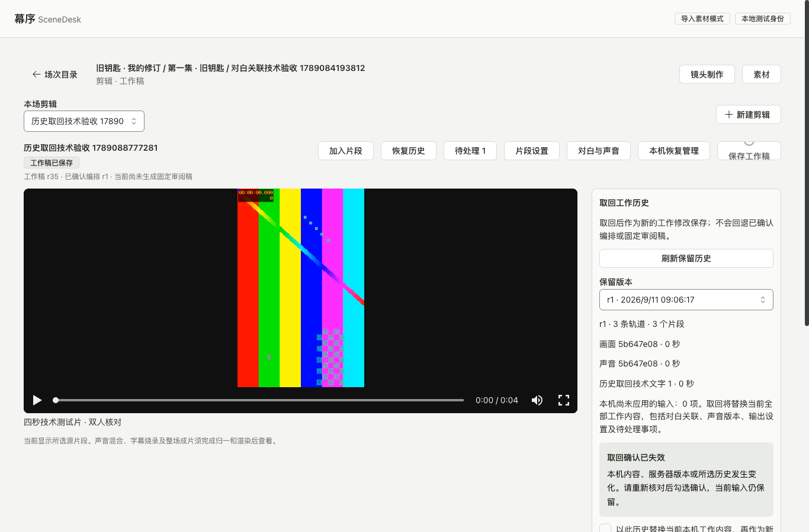

# 剪辑工作稿验证记录

2026-09-11，功能仍在实施中。本目录记录本机存储、保存控制器及已接通页面的实际验证；完整 E05A 仍有待完成事项，见[实施记录](../../../docs/implementation/36-cut-work-drafts.md)。

`verify-local-recovery.js` 在独立开发页面的真实 Chromium／IndexedDB 中运行，通过：

- 浏览器与 API 复用同一个 Ajv 编译器及 OpenAPI；合法工作稿通过，额外字段被拒绝且输入未被删改。
- 用户与标签页标识分区，本机 CAS 仅允许一个竞争写入。
- 迟到清理拒绝删除新输入；删除并重新建立同对象副本后，旧回执仍不能清理新一代副本。
- 注入 IDB 写事务、删除事务中断后，正文与元数据保持一致，可重试。
- 达到 20 份上限不静默淘汰未同步输入；7 天过期释放容量，总字节数可读取。
- 页面刷新后恢复确切文本；按项目清除一个用户的副本，不清除另一用户的数据。

结果：`refreshRestored=true`、`scopedClear=true`、`pageErrors=0`。使用随机测试用户／对象标识，结束后清除对应测试分区。此测试验证存储组件，未连接真实身份、编辑页保存请求或权限撤销通知；这些需要在页面接通后另行验证。

首次动态加载 Ajv 触发 Vite 依赖预编译与整页刷新，导致当次浏览器执行上下文消失；预编译完成后重跑通过。此开发工具重载没有被当成业务保存成功。

运行时先启动前端开发服务到 `http://127.0.0.1:4314/`，再通过 Playwright CLI 的 `run-code` 执行脚本。该脚本不产生 UI 截图，因为没有进行视觉验收。

## 保存控制器

`verify-work-session.js` 在真实浏览器、同一 OpenAPI 编译器和 IndexedDB 中使用可控传输，9 组通过、`pageErrors=0`：

- 授权读取成功后才展示恢复内容；本机读取结束前不开放编辑。无效数字原文可以恢复，不能提交。
- 保存请求固定后继续输入，迟到回包只更新基线；离开页面仍保留新输入，再进入可继续保存。
- 丢失成功回包后通过当前正文／指纹／修订核对，无重复 PUT；尚未读到结果时保持同一请求及其后的输入。
- 412 与第二次比较变化保留本机及手动合并稿。
- 请求前本机事务中断不向服务器发送；提交成功后删除中断不重复写入，重新打开能辨认已保存请求。
- 撤权清除内存及本机副本后，迟到回包不能重新填回敏感内容。
- 输入法组字暂停；结束后恢复 800ms 节流，连续输入在 5 秒上限内提交。

这些是控制器证据，传输替身不提供真实权限或数据库验收。实际 API 另由下列生产页面流程验证。

## 生产构建页面

`verify-cut-page.js` 使用已有本地测试身份、真实工作稿 API 和已验收的四秒技术视频。最终夹具 Cut `7b617990-8e45-4525-94d2-020f63722f1b`：只读工作稿 r0；通过 3 次真实 PUT 保存视频、精确区间／静音、字幕，最终工作稿 r3、Cut r1。源字段填写 `0.250001` 与 `2.000001` 秒；字幕时长 `1.000001` 秒。输入 `1.` 暂停自动保存，刷新并明确恢复后仍为原文。历史 r1 可单独读取，代理视频在浏览器中实际解码。1366×900 和 320×740 检查，无横向溢出、无页面异常。

`verify-cut-conflict.js` 使用独立技术 Cut `1c801df8-d048-4749-994b-7fbc60f2242e`，暂挂浏览器保存后由另一真实 API 写入更新服务器稿，再放行旧版本提交以取得实际 412。界面明确重放本机字幕，保留同伴独立新增字幕及 -3 dB 增益。首次为同伴 r4、合并 r5；脚本以新文字和新字幕标识允许继续复跑，不回退已有历史。

[窄屏布局](02-cut-workspace-320.png)／[逐项冲突比较](03-work-conflict.png)。截图已经人工查看：媒体及内容保持原色，工具占布局空间。窄屏截图仅记录首屏，行为脚本另检查文档总宽度；不把截图当作完整可访问性或剪辑质量验收。

首次页面脚本在 Playwright CLI 宿主使用不可用的 `setTimeout`，改为浏览器等待后通过；首次冲突脚本在恢复区域完成挂载前检查恢复按钮，等待编辑区后再判断，复跑通过。这两次是测试驱动时序问题，未被当作业务成功。测试创建的技术剪辑及历史保留在本机，未调用模型、未生成固定审阅稿。

## 固定对白、声音与字幕关联

`verify-cut-dialogue.js` 在生产构建、实际 API 与 IndexedDB 上通过。最终场次 `56d6d043-dce7-4151-8718-be664965b7ba`、Cut `0f0c05b3-d322-45a8-b6f0-843cd81abfc3`，工作稿 r8：

- 通过页面加入视频、内嵌声音及字幕，建立三类对白关联。
- 尚未应用的关联表单保留 `1.` 和备注，切换所选片段不自动改目标；刷新并明确恢复后继续原表单。
- 明确引入共享声音 v1；资产已有 v2，引用仍为 v1。镜头改为 v2 后继续读取、显示并使用固定 v1 原台词。
- 两路已关联到同句台词的声音触发实际服务端重复声源诊断。待决定原声可先保存事项，随后明确整轨静音才消除重复声源；独立事项仍保留。
- 从固定台词复制字幕草稿保留回放核对事项。字幕时长 5 秒触发越界，人工完成另一事项不清除该自动诊断；改为 `1.000001` 秒后实际保存并解除越界。
- 声音资产的使用位置实际跳到对应场次、Cut 和对白工具；源视频解码通过。1366×900 与 320×740 无横向溢出，页面异常为 0。

[窄屏对白工具](05-dialogue-320.png)已人工查看。截图保留真实技术测试片原色，不代表已生成或核验剧情对白。字幕文本来自测试镜头要求，声音素材为已有技术视频的混合音轨，没有宣称转写、口型或人物表演准确。

脚本初次连续点击切换工具时关闭了已打开的来源面板；另一轮未展开资产使用位置即查找链接。按界面实际开合状态修正测试后通过，没有修改产品来适配测试。首轮截图落在媒体加载中，最终截图等待实际解码后重新采集。

分页读取函数与资产列表复用后，同一对白脚本再次通过，最新技术场次 `9bfcef19-fc32-45db-85ec-bdf630b6880b`、Cut `e57089ed-558c-4b73-9521-d6b0741dbc53`、工作稿 r8。上方宽／窄屏截图更新为该次实际结果，固定历史声音选择及资产使用位置均通过回归。

## 历史取回与并发

`verify-cut-history.js` 在新建技术 Cut `bfeb5d52-82f5-463c-b621-430d2bb7b0ad` 上先用实际 API 保存 34 个不同正文，再通过生产页面验证：

- 加载第二页后可选 r1。内容相同的授权刷新保留确认；勾选后改变本机轨道设置使旧确认失效，并保留新输入。
- 重新核对后，取回 r1 追加为 r36；此前 r35 正文和 Cut r1 保持原状。
- 下一次取回 r34，服务器实际提交后丢弃浏览器成功回包；客户端通过读取识别 r37，未再发送第二次 PUT。
- 再次取回与同伴修改竞争取得真实 412。明确选择重放历史字幕后生成 r39，同伴独立的 -6 dB 增益保留。
- 刷新仍为 r39，保留 r1 正文未改写，页面异常为 0。

截图已人工查看。Playwright CLI 宿主没有 `structuredClone`，首次准备夹具失败；改用该 JSON 夹具的序列化复制后通过。产品确认从对象引用比较改为确切正文／输入／版本比较，避免相同内容的轮询重新分配对象后误判为内容变化；最终脚本已覆盖此情况。数据库完整套件仍为 91 项、媒体为 25 项既有通过结果；本次历史调整只有前端及共享分页读取，另通过 `npm run check` 的 31 项单元、类型、UI 规则和生产构建。

## 本机容量、损坏副本与控制器内存

`verify-local-management.js` 使用真实 IndexedDB 和生产控制器、可控传输，9 组故障行为通过：不兼容或不完整恢复内容不展示；旧异常副本清理不能删除新版本；缺失正文的删除事务中断可重试；较早返回的清理读取保留较新授权版本；孤立正文和损坏目录不能静默覆盖；放弃确认绑定原始输入；控制器硬上限及安全内存回收；在途回执保留后续输入；存储失败禁止回收；退出使排队申请失效且不跨用户清除。`verify-local-recovery.js`、`verify-work-session.js` 同轮回归通过，页面异常均为 0。

`verify-local-management-page.js` 在生产构建与真实 API 上通过。技术 Cut `8e1a0332-d060-4ed6-ab2b-6293d2e01cf9` 工作稿 r2，损坏恢复夹具 Cut `0026ef09-03fe-40d6-b532-0d1720b9c9f9` 保持工作稿 r0：

- 填满当前用户 20 份目录后，未完成 `1.` 输入保留，未落本机的工作不提交；明确清理后继续精确保存源起点 `0.125001` 秒。
- 清理确认打开后改变目录 token，旧操作被拒绝；刷新后重新核对才删除。
- 真实第二页面持有标签页锁时不能清理其副本，关闭后可重新核对清理；其他用户的技术副本保留。
- 当前标签页格式损坏的正文不展示；旧清理确认拒绝、重新核对后成功，不产生服务器 PUT。正常未完成输入在放弃确认后变化，也使旧确认失效。
- 320×740 编辑区无横向溢出；另实际打开本机管理工具检查相同窄屏宽度通过。无页面异常。

[本机恢复管理](07-local-recovery-management.png)、[损坏副本核对](08-damaged-recovery.png)及[窄屏本机管理](09-local-recovery-320.png)记录技术夹具，截图经过查看。列表只读取元数据，20 份含先前技术测试副本，脚本清理时仅删除本次明确建立的目录，不清除既有输入。

故障验证曾发现元数据校验错误地把额外计量字段作为分区字段比较，导致过期副本回归失败，已改为六个明确身份字段并回归。页面验证发现旧场次列表会误报直接打开的新剪辑不存在，已改为独立读取指定对象并校验场次，同一脚本通过。另两次测试时序修正为等待确认实际挂载，以及字段失焦完成本机缓冲清理后再填下一份容量，未绕过容量保护。

本次未改服务与数据库，工程检查通过 31 项单元及类型／UI／生产构建。完整规格基线与长度处理、后台维护及精确归一仍需实施；当前入口不提供接管已关闭标签页的恢复正文。跨标签页核验随后补齐，记录如下。

## 跨标签页核验、退出与新登录隔离

`verify-editing-access.js` 在真实 IndexedDB 与生产控制器上通过 8 组受控传输验证：通知只保留有界标识；暂停时不能编辑或发送；误通知、断网和重试保留输入；较早的成功／拒绝回复不覆盖后一次核验；在途回执不解除隐藏；CSRF 拒绝不删除工作；会话／对象范围隔离、旧会话排队申请失效；同一分区由新会话写入后，旧会话的迟到清理不能删除它。原存储、9 组容量／内存及 9 组保存会话故障套件同轮回归通过。

`verify-editing-access-page.js` 新建隔离浏览器上下文，实际经过本地 OIDC 登录；同一上下文中的两个页面共享该测试会话，原浏览器会话保持独立。最终技术 Cut `de6dbf4e-cd44-4d2a-b7a9-1df1ec67ca0c`、退出夹具 Cut `7617a095-0d11-4608-ad90-cf766c97a9b4`：

- 第二页面预置复制来的标签页 ID，实际浏览器锁使其获得新 ID；两份未完成输入独立保留。
- 真实后端拒绝一次无效 CSRF。输入和原请求保留，核验并明确保存后只有第二次 PUT，工作稿 r2。没有自动重送或清空恢复内容。
- 另一页面发出对象核验提示，暂挂 GET 时编辑内容隐藏；实际读取通过后恢复原始 `2.`。网络中断仍保留并隐藏，手动核验后继续。
- 页面 A 收到受控注入的对象 403 后发出通知，页面 B 自己读取到同类拒绝后清理。此处验证通知与客户端恢复；真实项目权限由数据库集成测试验证。
- 一次实际退出使另一页面返回登录。两个页面的本机删除事务同时注入中断，原目录保留；分别点击“重试清理本机恢复”后完成，退出 POST 总数仍为 1，未完成工作没有写到服务器。
- 重新登录并输入 `4.` 后，迟到旧会话通知不清理新输入。原浏览器会话始终有效；测试结束关闭隔离上下文。页面异常为 0。

[核验期间的编辑区](10-cross-tab-access-check.png)与[另一页退出后](11-peer-logout.png)已查看。本机容量页面在这轮会话更改后也回归通过，最新工作稿 Cut `8fa59b2c-ba3d-45e2-9895-741c4493260a` r2、异常副本 Cut `edf05ea7-c8d5-463a-aad3-f491534f0ff6` r0。

组件脚本应在停止源码编辑后、重新启动开发 Vite 服务的稳定模块图上运行。一次验证发现动态导入无时间戳的 ApiError 与控制器热更新引用的带时间戳模块不是同一类型；重新启动开发服务并完整重跑后通过，生产页面不依赖该测试导入路径。页面脚本另修正了挂起路由尚未结束就移除处理器，以及退出后被另一页通知切到全局清理入口的测试假设；没有把这些首次失败算作验收。

这不是正式 OIDC 部署或真人多人试点。通知仅是重新核验的提示，禁用 BroadcastChannel 时依靠原有可见页轮询／焦点检查；完整跨模块退出、归档和权限组合仍列在实施记录中。

会话改动后的最后一轮回归：历史夹具 Cut `25b43a48-2c30-4f7e-98f2-7fc73d0f870a` 到工作稿 r39、Cut r1，分页、确认绑定、丢包核对及实际 412 保留同伴增益全部通过；对白场次 `c31f8ac4-a0f4-4b43-983a-6e3b09c05d1d`、Cut `ee24d790-4c16-445c-a642-a2a5b6ccb222` 到工作稿 r8。声音使用位置随技术夹具增多进入第二页，首次脚本只检查第一页而失败；确认实际记录在第二页后，补齐 API 游标与页面“加载更多使用位置”操作，完整对白脚本通过，两页读取后正确跳回剪辑。对应 04–06 截图已更新并查看。
