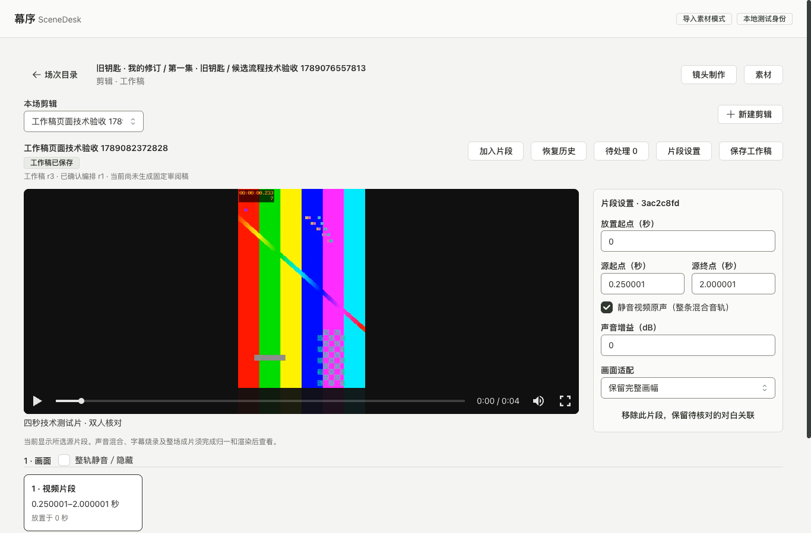

# 剪辑工作稿验证记录

2026-09-11，功能仍在实施中。本目录记录本机存储、保存控制器及已接通页面的实际验证；完整 E05A 仍有待完成事项，见[实施记录](../../../docs/implementation/36-cut-work-drafts.md)。

`verify-local-recovery.js` 在独立开发页面的真实 Chromium／IndexedDB 中运行，通过：

- 浏览器与 API 复用同一个 Ajv 编译器及 OpenAPI；合法工作稿通过，额外字段被拒绝且输入未被删改。
- 用户与标签页标识分区，本机 CAS 仅允许一个竞争写入。
- 迟到清理拒绝删除新输入；删除并重新建立同对象副本后，旧回执仍不能清理新一代副本。
- 注入 IDB 写事务、删除事务中断后，正文与元数据保持一致，可重试。
- 达到 20 份上限不静默淘汰未同步输入；7 天过期释放容量，总字节数可读取。
- 页面刷新后恢复确切文本；按项目清除一个用户的副本，不清除另一用户的数据。

结果：`refreshRestored=true`、`scopedClear=true`、`pageErrors=0`。使用随机测试用户／对象标识，结束后清除对应测试分区。此测试验证存储组件，未连接真实身份、编辑页保存请求或权限撤销通知；这些需要在页面接通后另行验证。

首次动态加载 Ajv 触发 Vite 依赖预编译与整页刷新，导致当次浏览器执行上下文消失；预编译完成后重跑通过。此开发工具重载没有被当成业务保存成功。

运行时先启动前端开发服务到 `http://127.0.0.1:4314/`，再通过 Playwright CLI 的 `run-code` 执行脚本。该脚本不产生 UI 截图，因为没有进行视觉验收。

## 保存控制器

`verify-work-session.js` 在真实浏览器、同一 OpenAPI 编译器和 IndexedDB 中使用可控传输，9 组通过、`pageErrors=0`：

- 授权读取成功后才展示恢复内容；本机读取结束前不开放编辑。无效数字原文可以恢复，不能提交。
- 保存请求固定后继续输入，迟到回包只更新基线；离开页面仍保留新输入，再进入可继续保存。
- 丢失成功回包后通过当前正文／指纹／修订核对，无重复 PUT；尚未读到结果时保持同一请求及其后的输入。
- 412 与第二次比较变化保留本机及手动合并稿。
- 请求前本机事务中断不向服务器发送；提交成功后删除中断不重复写入，重新打开能辨认已保存请求。
- 撤权清除内存及本机副本后，迟到回包不能重新填回敏感内容。
- 输入法组字暂停；结束后恢复 800ms 节流，连续输入在 5 秒上限内提交。

这些是控制器证据，传输替身不提供真实权限或数据库验收。实际 API 另由下列生产页面流程验证。

## 生产构建页面

`verify-cut-page.js` 使用已有本地测试身份、真实工作稿 API 和已验收的四秒技术视频。最终夹具 Cut `7b617990-8e45-4525-94d2-020f63722f1b`：只读工作稿 r0；通过 3 次真实 PUT 保存视频、精确区间／静音、字幕，最终工作稿 r3、Cut r1。源字段填写 `0.250001` 与 `2.000001` 秒；字幕时长 `1.000001` 秒。输入 `1.` 暂停自动保存，刷新并明确恢复后仍为原文。历史 r1 可单独读取，代理视频在浏览器中实际解码。1366×900 和 320×740 检查，无横向溢出、无页面异常。

`verify-cut-conflict.js` 使用独立技术 Cut `1c801df8-d048-4749-994b-7fbc60f2242e`，暂挂浏览器保存后由另一真实 API 写入更新服务器稿，再放行旧版本提交以取得实际 412。界面明确重放本机字幕，保留同伴独立新增字幕及 -3 dB 增益。首次为同伴 r4、合并 r5；脚本以新文字和新字幕标识允许继续复跑，不回退已有历史。

[窄屏布局](02-cut-workspace-320.png)／[逐项冲突比较](03-work-conflict.png)。截图已经人工查看：媒体及内容保持原色，工具占布局空间。窄屏截图仅记录首屏，行为脚本另检查文档总宽度；不把截图当作完整可访问性或剪辑质量验收。

首次页面脚本在 Playwright CLI 宿主使用不可用的 `setTimeout`，改为浏览器等待后通过；首次冲突脚本在恢复区域完成挂载前检查恢复按钮，等待编辑区后再判断，复跑通过。这两次是测试驱动时序问题，未被当作业务成功。测试创建的技术剪辑及历史保留在本机，未调用模型、未生成固定审阅稿。

## 固定对白、声音与字幕关联

`verify-cut-dialogue.js` 在生产构建、实际 API 与 IndexedDB 上通过。最终场次 `56d6d043-dce7-4151-8718-be664965b7ba`、Cut `0f0c05b3-d322-45a8-b6f0-843cd81abfc3`，工作稿 r8：

- 通过页面加入视频、内嵌声音及字幕，建立三类对白关联。
- 尚未应用的关联表单保留 `1.` 和备注，切换所选片段不自动改目标；刷新并明确恢复后继续原表单。
- 明确引入共享声音 v1；资产已有 v2，引用仍为 v1。镜头改为 v2 后继续读取、显示并使用固定 v1 原台词。
- 两路已关联到同句台词的声音触发实际服务端重复声源诊断。待决定原声可先保存事项，随后明确整轨静音才消除重复声源；独立事项仍保留。
- 从固定台词复制字幕草稿保留回放核对事项。字幕时长 5 秒触发越界，人工完成另一事项不清除该自动诊断；改为 `1.000001` 秒后实际保存并解除越界。
- 声音资产的使用位置实际跳到对应场次、Cut 和对白工具；源视频解码通过。1366×900 与 320×740 无横向溢出，页面异常为 0。

[窄屏对白工具](05-dialogue-320.png)已人工查看。截图保留真实技术测试片原色，不代表已生成或核验剧情对白。字幕文本来自测试镜头要求，声音素材为已有技术视频的混合音轨，没有宣称转写、口型或人物表演准确。

脚本初次连续点击切换工具时关闭了已打开的来源面板；另一轮未展开资产使用位置即查找链接。按界面实际开合状态修正测试后通过，没有修改产品来适配测试。首轮截图落在媒体加载中，最终截图等待实际解码后重新采集。
